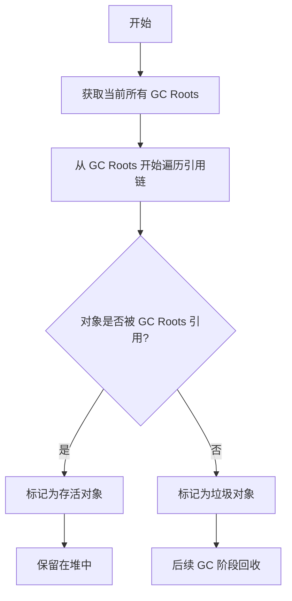

# JVM简介

JVM 是 Java 虚拟机（Java Virtual Machine）的缩写。

它的核心作用可以概括为三点：

1.  实现“一次编写，到处运行”

    *   不同的操作系统（Windows、Mac、Linux）需要不同版本的 JVM。
    *   但只要你安装了对应系统的 JVM，同一个 Java 程序就能直接运行，无需修改代码。JVM 屏蔽了底层操作系统的差异。
2.  管理程序内存

    *   Java 程序运行时，对象、变量等数据都存放在内存中。JVM 会自动分配内存，并且负责垃圾回收（GC, Garbage Collection）——自动清理不再使用的内存，程序员无需像 C/C++ 那样手动释放内存。
3.  执行程序

    *   Java 源码编译后得到的是 `.class` 字节码（不是机器码）。JVM 会解释或即时编译（JIT）这些字节码，最终转换成当前 CPU 能执行的机器指令。

注意:

*   JVM 是规范：它是一份技术文档标准，定义了虚拟机应该怎么实现。
*   常见的实现：Oracle JDK 自带的 HotSpot 是目前最主流的 JVM 实现。还有IBM OpenJ9 等其他实现

## HotSpot架构图


> HotSpot官方文档地址: <https://docs.oracle.com/javase/specs/jvms/se8/html/index.html>

## JDK/JRE/JVM

> JDK8 官方文档: <https://docs.oracle.com/javase/8/docs/index.html>

| 名称    | 全称                                      | 作用                 | 包含内容                                                     |
| :------ | :---------------------------------------- | :------------------- | :----------------------------------------------------------- |
| **JDK** | Java Development Kit （Java开发工具包）   | **开发** Java 程序   | **= JRE + 开发工具**（如编译器 `javac`、打包工具 `jar`、文档生成器 `javadoc`） |
| **JRE** | Java Runtime Environment （Java运行环境） | **运行** Java 程序   | **= JVM + 核心类库**（`rt.jar` 等，如 `System`、`String`、集合框架） |
| **JVM** | Java Virtual Machine （Java虚拟机）       | **执行** Java 字节码 | 负责内存管理、垃圾回收、将 `.class` 转为机器码               |

*   JVM：跑程序的核心引擎，但没有它无法独立运行（缺少基础类库）。
*   JRE：只用来运行已有程序（比如玩 Minecraft Java 版），不能编译代码。
*   JDK：用来开发 + 运行程序（需要 `javac` 等工具）。&#x20;

# 类加载机制 Class Loader

JVM的类加载机制，简单说就是：把硬盘上的 .class 字节码文件加载到内存中，经过一系列处理，最终变成JVM可以直接使用的 Class 对象的过程。

这个过程遵循一个核心原则：按需加载（需要哪个类，才加载哪个类，不是一次性全加载）。整个机制可以分成三个大的部分来讲：

1.  类加载的生命周期（七个阶段）
2.  负责加载的三个"加载器"（类加载器）
3.  两个核心原则（双亲委派 & 沙箱安全）

## 类加载的生命周期：一个 .class 文件要经历7个阶段

从文件被加载到内存，到最终被卸载，一个类需要经历以下阶段：

| 阶段          | 做什么                                                      | 关键点                                         |
| :------------ | :---------------------------------------------------------- | :--------------------------------------------- |
| **1. 加载**   | 找到 `.class` 文件，读取字节流，生成 `Class` 对象           | 可以来自jar包、网络、动态编译等                |
| **2. 验证**   | 校验字节码格式、语法、符号引用是否正确                      | 防止恶意代码破坏JVM（如不符合Java规范）        |
| **3. 准备**   | 为**类变量（static）分配内存，并设置**默认零值              | 例如 `static int a = 100;` 在此阶段 `a = 0`    |
| **4. 解析**   | 将**符号引用**转换成**直接内存地址**                        | 比如把 `main` 方法的符号变成真正的方法入口地址 |
| **5. 初始化** | 执行**类构造器 `<clinit>`**，为静态变量赋值，执行静态代码块 | 上例中的 `a` 在此阶段才会变成 `100`            |
| **6. 使用**   | 创建对象、调用方法、访问属性                                | 正常程序运行阶段                               |
| **7. 卸载**   | 该类的 `Class` 对象被GC回收                                 | 由类加载器实例回收触发                         |

> 其中 加载、验证、准备、解析、初始化 这5个阶段合称为 类加载过程。前4个阶段是JVM主导的固定流程，初始化阶段才真正执行你的Java代码。

## 类加载器（ClassLoader）：谁负责加载

JVM 中有三个内置的类加载器，分工明确：

| 加载器名称                          | 负责加载的路径                               | 示例                                                    |
| :---------------------------------- | :------------------------------------------- | :------------------------------------------------------ |
| **Bootstrap（启动类加载器）**       | `JAVA_HOME/jre/lib` 下的核心类               | `rt.jar` 中的 `java.lang.String`、`java.util.ArrayList` |
| **Extension（扩展类加载器）**       | `JAVA_HOME/jre/lib/ext` 或系统指定的扩展目录 | 一些安全、加密相关的扩展类                              |
| **Application（应用程序类加载器）** | `CLASSPATH` 或当前项目的 `classpath`         | 你自己写的 `com.example.MyClass`                        |

> 这三者并不是"平级"的，而是父子层级关系：Bootstrap ← Extension ← Application。

*   Bootstrap 只扫描 `rt.jar`，永远不会去加载你写的 `cn.lishunxing.HelloWorld`
*   Extension 只扫描 `lib/ext`
*   Application 才扫描 classpath

### 两个核心原则：双亲委派 & 沙箱安全

#### 双亲委派机制

> 避免重复加载 + 防止核心类被篡改

当一个类加载器收到加载请求时，它不会自己先去加载，而是先把这个请求委派给父加载器去处理。只有当父加载器反馈自己无法加载时（比如不在自己的扫描路径里），子加载器才会尝试自己加载。

    Application 加载器收到请求
        ↓ 向上委派
    Extension 加载器收到请求
        ↓ 向上委派
    Bootstrap 加载器尝试加载
        ↓ 如果成功 → 直接返回
        ↓ 如果失败（找不到该类）
    Extension 尝试加载
        ↓ 如果成功 → 返回
        ↓ 如果失败
    Application 尝试加载
        ↓ 如果还失败 → 抛出 ClassNotFoundException

优点：

*   避免重复加载：父加载器已经加载过的类，子加载器不会再加载一次。
*   核心类安全：如果有人恶意写了一个 `java.lang.String` 类，因为双亲委派的存在，最终还是由 Bootstrap 加载 JDK 原生的 `String`，恶意类永远不会被加载，从而保护了 JVM 安全。这就是沙箱安全的体现。

#### 沙箱安全 —— 对核心类库的保护

上面已经提到，通过双亲委派机制，任何自定义的、试图冒充核心类库（如 java.lang.XXX）的类都无法被加载，因为父加载器会优先加载真正的那份。

沙箱安全还包括：

*   字节码校验器  加载后验证字节码是否合法（如不会跳转到非法指令地址）
*   安全管理器 + 策略文件  控制代码能否访问文件、网络、系统属性等（Applet 时代典型场景）
*   AccessController（访问控制器）  精细化权限检查，例如 `doPrivileged` 临时提升权限

### 四种打破双亲委派的通用方法

#### 自定义类加载器 + 重写 loadClass

原理：双亲委派的核心逻辑在 ClassLoader.loadClass() 方法中，重写这个方法并改变委派顺序即可。

典型实现——"反向委派"：先自己尝试加载，失败再委托父加载器

```java
public class ReverseDelegationClassLoader extends ClassLoader {
    
    @Override
    public Class<?> loadClass(String name) throws ClassNotFoundException {
        // 1. 检查是否已加载
        Class<?> c = findLoadedClass(name);
        if (c == null) {
            try {
                // 2. 先自己加载（打破委派的核心）
                c = findClass(name);
            } catch (ClassNotFoundException e) {
                // 3. 自己加载失败，再委托父加载器
                if (getParent() != null) {
                    c = getParent().loadClass(name);
                }
            }
        }
        return c;
    }
    
    @Override
    protected Class<?> findClass(String name) throws ClassNotFoundException {
        // 从指定路径读取.class字节码，调用defineClass
        // ... 实现省略
    }
}
```

#### Tomcat是怎么实现的

Tomcat 打破双亲委派模型，主要是为了解决多个 Web 应用部署在同一个容器中时，相互隔离和共享依赖的需求。它的核心做法是重写了类加载的查找顺序，并设计了独立的、作用域分层的类加载器体系。

##### 标准的双亲委派模型虽然保证了安全，但在 Web 容器场景下会带来问题：

*   无法实现应用隔离：标准模型下，一个类加载器只能加载某个类（如 `UserServlet`）的一个版本。如果两个 Web 应用包含同名但逻辑不同的类，就会产生冲突。
*   无法实现热部署：JSP 文件修改后需要重新编译加载。标准模型下，已加载的同名类无法被替换，因此需要能随时被卸载的独立类加载器

##### Tomcat 是如何实现的

Tomcat 主要通过 自定义类加载器体系 和 调整类加载顺序 来实现。

*   设计了一套分层的类加载器体系

Tomcat 在标准类加载器之外，自定义了多个类加载器，各自负责不同的目录，以此实现类和资源的隔离与共享

| 类加载器                | 作用范围                 | 加载路径示例                            | 核心职责                                                     |
| :---------------------- | :----------------------- | :-------------------------------------- | :----------------------------------------------------------- |
| **CommonClassLoader**   | Tomcat内部 + 所有Web应用 | `$CATALINA_HOME/lib/`                   | 加载 Tomcat 和所有 Web 应用都能访问的通用类库                |
| **CatalinaClassLoader** | Tomcat内部               | `$CATALINA_HOME/server/lib/` (旧版)     | 专门加载 Tomcat 自身的实现类，对 Web 应用不可见，实现容器与应用的隔离 |
| **SharedClassLoader**   | 所有Web应用              | `$CATALINA_HOME/shared/lib/` (旧版)     | 加载所有 Web 应用可以共享的类库，但对 Tomcat 容器本身不可见  |
| **WebAppClassLoader**   | **单个** Web 应用        | `/WEB-INF/classes` `/WEB-INF/lib/*.jar` | **这是打破双亲委派的关键**。为每个 Web 应用创建一个独立实例，负责加载该应用私有的类，实现应用间的彻底隔离 |
| **JspLoader**           | **单个** JSP 文件        | JSP 编译后的 `.class` 文件              | 为每个 JSP 文件创建，用于实现 JSP 的热部署。当 JSP 文件修改后，其对应的 `JspLoader` 实例会被卸载并重新创建 |

*   关键步骤：颠覆了标准的加载顺序

`WebAppClassLoader` 通过重写 `loadClass` 方法，改变了类查找的优先级。

*   标准双亲委派的顺序：先找父类加载器（AppClassLoader → ExtClassLoader → BootstrapClassLoader），都找不到再自己找。
*   Tomcat `WebAppClassLoader` 的顺序：`WebAppClassLoader` 将“自己找”的步骤提到了“委托父类”之前，具体流程如下：

1.  检查缓存：首先检查该类是否已经被当前 `WebAppClassLoader` 加载过。
2.  防止JDK核心类被篡改：判断类是否属于 `java.`、`javax.` 等 JDK 核心包。如果是，则直接委托给 `BootstrapClassLoader` 加载，保证安全性。
3.  优先本地加载：关键步骤。调用 `findClass()` 方法，在自己的 `/WEB-INF/classes` 和 `/WEB-INF/lib` 目录下查找并加载类。
4.  委托给父类：如果本地没有找到，则委托给父类加载器（通常是 `SharedClassLoader` → `CommonClassLoader`）进行加载。
5.  抛出异常：如果所有加载器都找不到，则抛出 `ClassNotFoundException`。

> 基于 Tomcat 8/9 的 WebappClassLoaderBase 类（WebappClassLoader 的父类），核心逻辑在 loadClass 方法中

```java
// 摘自 org.apache.catalina.loader.WebappClassLoaderBase
public Class<?> loadClass(String name, boolean resolve) throws ClassNotFoundException {
    
    // 1. 【安全检查】禁止加载 JVM 核心类（防止恶意代码）
    if (name.startsWith("java.")) {
        try {
            return super.loadClass(name, resolve); // 直接交给系统父加载器
        } catch (ClassNotFoundException e) {
            // 抛出异常，不允许应用自己提供 java.* 类
        }
    }
    
    // 2. 【本地缓存检查】检查当前 WebappClassLoader 是否已经加载过该类
    Class<?> clazz = findLoadedClass(name);
    if (clazz != null) return clazz;
    
    // 3. 【系统类加载器检查】尝试用系统类加载器加载（防止JSP等覆盖JDK类）
    try {
        clazz = system. loadClass(name);
        if (clazz != null) return clazz;
    } catch (ClassNotFoundException e) {
        // 忽略
    }
    
    // 4. 【关键：打破双亲委派】先自己尝试从 WEB-INF 中加载
    //    这是与双亲委派模型最大的不同点（标准模型会先委托给父类）
    try {
        clazz = findClass(name); // 在 /WEB-INF/classes 和 /WEB-INF/lib 中查找
        if (clazz != null) {
            if (resolve) resolveClass(clazz);
            return clazz;
        }
    } catch (ClassNotFoundException e) {
        // 本地未找到，继续
    }
    
    // 5. 【委托父类】自己找不到，再委托给父类加载器（SharedClassLoader -> CommonClassLoader）
    try {
        clazz = super.loadClass(name, resolve); // 这里才调用父类的双亲委派链
        if (clazz != null) return clazz;
    } catch (ClassNotFoundException e) {
        // 父类也未找到
    }
    
    // 6. 全部失败，抛出异常
    throw new ClassNotFoundException(name);
}
```

Tomcat 打破双亲委派的本质就是：

*   重写 `loadClass` 方法，将“自己先找”的步骤提前到“委托父类”之前
*   同时保留对 `java.*` 包的安全检查，避免破坏 JDK 核心库

这种做法在实现 Web 应用隔离和热部署的同时，保证了 JVM 的基本安全性。

##### 如果2个项目都有 UserServlet 那tomcat中这2个UserServlet是什么样的 他们是怎么做到不调用出错的

这是一个很经典的问题。在 Tomcat 中，即使两个 Web 应用都有一个完全同名的 com.example.UserServlet，它们也能完美共存，互不干扰，更不会调用出错。

这背后的核心功臣，就是我们之前聊到的 WebappClassLoader。

##### 两个 UserServlet 在内存中的状态

当 Tomcat 同时部署了 AppA 和 AppB，它们都包含 `com.example.UserServlet` 时，在 JVM 内存中，会存在两个完全不同的类。可以这样理解：

*   AppA 的 UserServlet：由 AppA 的类加载器 `WebappClassLoader@A` 加载。它在 JVM 中的唯一标识是 `WebappClassLoader@A + com.example.UserServlet`。
*   AppB 的 UserServlet：由 AppB 的类加载器 `WebappClassLoader@B` 加载。它在 JVM 中的唯一标识是 `WebappClassLoader@B + com.example.UserServlet`。

关键点：在 JVM 内部，一个类的完整身份是由 `类加载器实例 + 包名.类名` 共同决定的。因为两个类加载器是不同的对象，所以这两个 `UserServlet` 类被认为是完全不同的、隔离的类，就像 `com.AppA.UserServlet 和 com.AppB.UserServle`t 一样。

##### 为什么不会调用出错

这得益于 Tomcat 打破了双亲委派模型，并设计了应用隔离机制。一个来自 AppA 的请求，其处理流程是严格隔离的，绝不会混淆。

1.  请求路由到正确的应用\
    当用户访问 \`\`[http://host/AppA/user\`](http://host/AppA/user%60) 时，Tomcat 会根据 URL 中的上下文路径 `/AppA`，将请求交给对应 AppA 的 `Context` 容器。这个 `Context` 容器持有 AppA 专属的 `WebappClassLoader@A`。
2.  在自己的“类加载仓库”中查找\
    当 Tomcat 需要处理请求，创建 `UserServlet` 实例时，它会通过 `Context` 关联的 `WebappClassLoader@A` 来查找 `com.example.UserServlet` 这个类。
3.  返回自己的类\
    `WebappClassLoader@A` 会优先在自己的 `WEB-INF/classes` 和 `WEB-INF/lib` 目录下查找。它找到了 AppA 项目里的 `UserServlet.class` 文件，并成功加载、实例化。整个过程完全不会去 AppB 的目录下寻找，也不会委托给能加载 AppB 的父类加载器。

同理，AppB 的请求也只会由 `WebappClassLoader@B` 加载自己的 `UserServlet`。

##### Spring Boot中的Tomcat是怎么实现的

从“解决多应用隔离”这个传统角度来看，Spring Boot 内嵌的 Tomcat 确实失去了打破双亲委派的最大必要性。但它依然打破了，目的是为了解决另一个完全不同的问题：启动速度和 Jar 包内资源的加载顺序。

传统 Tomcat 打破双亲委派，最核心的目的是隔离：

*   场景：一个 Tomcat 跑 N 个 Web 应用。
*   问题：AppA 用 `UserServlet v1.0`，AppB 用 `UserServlet v2.0`。类名完全一样。
*   解决方案：给每个 App 配一个独立的 `WebAppClassLoader`，并让它优先自己找。这样大家各找各妈，互不干扰。

而在 Spring Boot 中：

*   场景：一个 Spring Boot 应用就是一个独立的进程（典型的微服务模式）。一个 JVM 里只跑一个 Web 应用。
*   结论：没有其他应用跟你抢类名了。即使你用的是内嵌 Tomcat，整个 JVM 里也只有一份 `UserServlet`。

虽然不需要隔离，但 Spring Boot 遇到了一个更棘手的现实问题：如何从一个结构特殊的 Fat Jar 里加载类？

Spring Boot 打包成的 `Fat Jar（myapp.jar）`，目录结构是这样的：

    myapp.jar
    ├── META-INF/
    │   └── MANIFEST.MF          # 启动清单文件，定义了 Main-Class 和 Start-Class
    ├── org/springframework/boot/loader/  # Spring Boot 启动器类（JarLauncher 等）
    ├── BOOT-INF/
    │   ├── classes/             # ⭐ 你的 Controller、Service 等业务代码在这里
    │   └── lib/                 # 第三方依赖 Jar 包

*   问题：标准的 `URLClassLoader` 只能加载 Jar 包根目录下的类，或者显式指定的 Jar 文件。但它无法理解 `BOOT-INF/classes` 和 `BOOT-INF/lib/*.jar` 这种嵌套的、非标准的结构。
*   后果：如果完全遵循双亲委派，把加载任务交给系统类加载器（`AppClassLoader`），它会去 Fat Jar 的根目录下找 `com.example.UserServlet`，结果必然是 `ClassNotFoundException`，因为它根本不知道要去 `BOOT-INF` 里面翻。

当通过 java -jar myapp.jar 启动时，类加载的层次结构和职责分工如下：

| 类加载器                               | 负责加载的内容                             | 在 Fat Jar 中的作用                                          |
| :------------------------------------- | :----------------------------------------- | :----------------------------------------------------------- |
| **BootstrapClassLoader**               | JDK 核心类 (`rt.jar` 等)                   | 不变，始终负责 Java 核心库                                   |
| **ExtClassLoader**                     | JDK 扩展库                                 | 不变，负责 `lib/ext` 下的扩展                                |
| **AppClassLoader** (SystemClassLoader) | `classpath` 下的类                         | **仅加载 `myapp.jar` 根目录下的内容**，即 `org/springframework/boot/loader/JarLauncher` 等启动类 |
| **LaunchedURLClassLoader**             | `BOOT-INF/classes` 和 `BOOT-INF/lib/*.jar` | **加载你的 Controller 和所有业务代码、第三方依赖**           |

#### 线程上下文类加载器

原理：通过 Thread.currentThread().getContextClassLoader() 获取当前线程绑定的类加载器，绕过默认的委派链

典型场景：SPI机制（如JDBC驱动加载）。DriverManager由BootstrapClassLoader加载，但它需要加载应用classpath下的MySQL驱动实现类——父加载器无法"看见"子加载器的类，于是通过线程上下文类加载器"借"一个子加载器来用。

```java
public class DriverManager {
    // 1. 静态代码块：在DriverManager类初始化时执行
    static {
        loadInitialDrivers();  // 入口方法
        println("JDBC DriverManager initialized");
    }

    // 2. 核心方法：加载所有可用的JDBC驱动
    private static void loadInitialDrivers() {
        // ... (省略系统属性加载部分)

        // 3. 使用SPI机制加载驱动 (打破双亲委派的关键)
        AccessController.doPrivileged(new PrivilegedAction<Void>() {
            public Void run() {
                // 关键点：ServiceLoader.load() 会去获取线程上下文类加载器
                ServiceLoader<Driver> loadedDrivers = ServiceLoader.load(Driver.class);
                Iterator<Driver> driversIterator = loadedDrivers.iterator();
                try{
                    // 遍历并实例化驱动，这会触发驱动的静态代码块执行，完成注册
                    while(driversIterator.hasNext()) {
                        driversIterator.next();
                    }
                } catch(Throwable t) {
                    // Do nothing
                }
                return null;
            }
        });
        // ... (省略系统属性加载的后续部分)
    }
}

// JDBC中的经典用法
public final class ServiceLoader<S> {
    // ServiceLoader.load方法会调用下面的重载方法
    public static <S> ServiceLoader<S> load(Class<S> service) {
        // 核心：获取当前线程的上下文类加载器
        // 在普通Java应用中，这个加载器默认就是 AppClassLoader
        ClassLoader cl = Thread.currentThread().getContextClassLoader();
        return ServiceLoader.load(service, cl);
    }
    
    // ... 后续会用这个获取到的 cl (AppClassLoader) 去 META-INF/services/ 下加载并实例化驱动类
}

// 这是MySQL驱动中的Driver类
public class Driver extends NonRegisteringDriver implements java.sql.Driver {
    // 静态代码块：这个类一被加载和初始化，就会自动执行
    static {
        try {
            // 关键：创建自己的一个实例，并注册到DriverManager中
            java.sql.DriverManager.registerDriver(new Driver());
        } catch (SQLException E) {
            throw new RuntimeException("Can't register driver!");
        }
    }
    // ... 其他代码
}
```

#### OSGi模块化框架

OSGi为每个模块（Bundle）提供独立的类加载器，模块间可以相互委托，形成双向委派的网络结构，彻底打破了树状的单向委派模型

OSGi 的全称是 Open Service Gateway Initiative，它有两层含义：

1.  一个规范：由 OSGi 联盟定义的模块化和动态化的 Java 规范。
2.  一个运行时：基于这个规范实现的 Java 虚拟机（JVM）层面的服务运行时平台。

简单理解，OSGi 是一种让 Java 应用变得更“模块化”、更“动态”的技术。它允许你将一个大型应用拆分成多个独立的小模块（称为 Bundle），并让这些模块可以在不重启整个应用的情况下，被独立地安装、启动、更新和卸载。

#### JVM钩子与Unsafe（高级黑科技）

通过Unsafe类或JVM的-Xbootclasspath参数，绕过类加载器的常规检查，属于底层hack方式，生产环境极少使用

# 运行时数据区 Runtime Data Areas

    ┌─────────────────────────────────────────────────────────────────────┐
    │                          JVM 运行时数据区                              │
    ├─────────────────────────────────────────────────────────────────────┤
    │  线程共享区域                                                        │
    │  ┌─────────────────────────┬─────────────────────────────────────┐  │
    │  │       堆 (Heap)          │         方法区 (Method Area)         │  │
    │  │  存放所有对象实例和数组     │   存放类信息、常量、静态变量、即时编译器   │  │
    │  │  GC 的主要管理区域        │   编译后的代码（JDK 1.8 后为元空间）     │  │
    │  └─────────────────────────┴─────────────────────────────────────┘  │
    ├─────────────────────────────────────────────────────────────────────┤
    │  线程私有区域                                                        │
    │  ┌───────────────┬───────────────┬───────────────────────────────┐  │
    │  │ 程序计数器(PC) │  虚拟机栈(JVM Stack) │       本地方法栈(Native Stack)    │  │
    │  │ 当前线程执行到  │  每个方法调用对应一个  │  为本地方法（如 C 方法）服务      │  │
    │  │ 哪条字节码指令  │  栈帧（局部变量、操作数 │                               │  │
    │  │               │  栈、动态链接、方法出口）│                               │  │
    │  └───────────────┴───────────────┴───────────────────────────────┘  │
    └─────────────────────────────────────────────────────────────────────┘

## 程序计数器 (PC Register)

| 属性     | 说明                                                         |
| :------- | :----------------------------------------------------------- |
| **线程** | **私有**                                                     |
| **作用** | 记录当前线程正在执行的 JVM 字节码指令地址。如果执行的是 native 方法，PC 值为 undefined。 |
| **特点** | 唯一一个在 JVM 规范中**不会 OutOfMemoryError** 的区域。      |
| **类比** | 书签——记住你读到哪里了，线程切换回来还能接着执行。生命周期与线程相同，线程创建时创建，线程结束时销毁 |

## 本地方法栈 (Native Method Stack)

| 属性     | 说明                                                         |
| :------- | :----------------------------------------------------------- |
| **线程** | **私有**                                                     |
| **作用** | 为 **native 方法**（如用 C/C++ 编写，通过 JNI 调用的方法）提供服务。 |
| **特点** | JVM 规范对本地方法栈的实现没有强制规定，HotSpot 虚拟机**直接将本地方法栈和 Java 虚拟机栈合二为一**。 |
| **异常** | 同样支持 StackOverflowError 和 OutOfMemoryError。            |

## Java 虚拟机栈 (Java Virtual Machine Stack)

| 属性         | 说明                                                         |
| :----------- | :----------------------------------------------------------- |
| **线程**     | **私有**                                                     |
| **作用**     | 描述 Java 方法执行的**内存模型**。每个方法被调用时，会创建一个**栈帧**入栈；方法返回时，栈帧出栈。 |
| **栈帧包含** | - **局部变量表**：存放方法参数和方法内的局部变量。 - **操作数栈**：存放计算过程中的中间结果。 - **动态链接**：指向运行时常量池中该方法的符号引用。 - **方法出口**：方法返回后的下一条指令地址。 |
| **异常**     | - **StackOverflowError**：栈深度超过允许深度（如无限递归）。 - **OutOfMemoryError**：栈支持动态扩展但内存不足（很少见）。 |

### 栈帧（Stack Frame）

一个方法的“工作台”。每当一个方法被调用，JVM 就会为它在虚拟机栈上创建一个新的栈帧；当方法执行完毕，这个栈帧就会被销毁。

        虚拟机栈 (JVM Stack)
        ┌─────────────────────────────┐
        │  栈帧 3 (methodC())          │  ← 当前正在执行的方法
        │  - 局部变量表                │
        │  - 操作数栈                  │
        │  - 动态链接                  │
        │  - 方法出口                  │
        ├─────────────────────────────┤
        │  栈帧 2 (methodB())          │
        ├─────────────────────────────┤
        │  栈帧 1 (methodA())          │
        ├─────────────────────────────┤
        │  ...                         │
        └─────────────────────────────┘

> 一个栈帧内部，主要包含四个核心部分：局部变量表、操作数栈、动态链接 和 方法出口。

### 局部变量表 (Local Variables Table)

*   作用：用来存放方法参数和方法内部定义的局部变量。
*   存储内容：包括基本数据类型（boolean, byte, char, short, int, float, long, double）、对象引用（reference）和返回地址（returnAddress）。
*   注意：`long` 和 `double` 类型的数据会占用两个变量槽（Slot），其他类型只占用一个。
*   生命周期：随着栈帧的创建而创建，随着栈帧的销毁而销毁。

```java
public void exampleMethod(String name, int age) {
    double salary = 1000.0;
    // name, age, salary 都会存在局部变量表中
}
```

### 操作数栈 (Operand Stack)

*   作用：用于存放计算过程中的中间结果和临时变量，可以理解为方法执行时的一个“临时工作区”。
*   特点：它是一个后入先出的栈结构。
*   工作流程：在执行算术运算、比较、方法调用等字节码指令时，JVM 会从局部变量表或常量池中把数据压入操作数栈，经过计算后，再将结果从栈中弹出并写回局部变量表或返回给调用者

```java
public int add() {
    int a = 5;   // 将 5 压入操作数栈，然后存储到局部变量表
    int b = 3;   // 将 3 压入操作数栈，然后存储到局部变量表
    int c = a + b; // 将 a 和 b 的值压入操作数栈，执行加法，结果 8 压栈，最后存储到局部变量表
    return c;     // 将结果 8 从操作数栈返回
}
```

### 动态链接 (Dynamic Linking)

*   背景：一个类中的方法在编译时，并不知道它要调用的其他方法（例如 `System.out.println()`）最终在内存中的什么位置。因此，在 `.class` 文件的常量池中，调用指令最初指向的都是一个符号引用（比如 `#10` 代表 `java/io/PrintStream.println`）。
*   作用：在运行期间，动态链接负责将这些符号引用解析为直接引用（即真实的内存地址），确保方法能够正确找到并调用目标。
*   意义：这种机制支持了多态等面向对象特性，因为具体调用哪个实现版本（比如父类还是子类的方法）需要在运行时才能确定。

### 方法出口 (Return Address)

*   作用：当一个方法执行完毕后，JVM 需要知道应该回到调用它的那个方法的哪个位置继续执行。这个方法出口就记录了调用者的返回地址。
*   两种情况：

    *   正常返回：方法执行完 `return` 语句。程序计数器会被恢复为调用该方法后的下一条指令的地址。
    *   异常返回：方法执行中抛出未被捕获的异常。返回地址由异常处理器确定，通常不会返回到调用者正常的下一条指令。

### 一个完整的执行过程示例

```java
public class MethodDemo {
    public static void main(String[] args) {
        int result = add(3, 5);
        System.out.println(result);
    }

    public static int add(int a, int b) {
        int c = a + b;
        return c;
    }
}
```

执行步骤拆解：

1.  启动 `main` 方法：JVM 在虚拟机栈中为 `main` 方法创建一个新的栈帧。这个栈帧包含了 `main` 方法的局部变量表（存放 `args` 和 `result`）、操作数栈等。
2.  调用 `add` 方法：当执行到 `add(3, 5)` 时，`main` 方法的栈帧暂时停止。JVM 为 `add` 方法创建一个新栈帧，并将其压入栈顶。
3.  执行 `add` 方法：

    *   参数 `3` 和 `5` 被放入 `add` 栈帧的局部变量表中。
    *   执行 `int c = a + b;`：JVM 将 `a` 和 `b` 的值从局部变量表压入操作数栈，执行加法后，结果 `8` 再次压栈，最后这个结果被存储到局部变量表的 `c` 中。
    *   执行 `return c;`：JVM 将 `c` 的值 `8` 压回操作数栈，并作为返回值准备返回。
4.  结束 `add` 方法：`add` 方法的栈帧被弹出并销毁。返回值 `8` 被传递给 `main` 方法。
5.  继续执行 `main` 方法：JVM 根据 `add` 方法的方法出口，恢复 `main` 方法的执行。返回值 `8` 被赋值给 `main` 栈帧局部变量表中的 `result`。
6.  结束 `main` 方法：`main` 方法执行完毕，其栈帧也被销毁

## 方法区 (Method Area)

| 属性         | 说明                                                         |
| :----------- | :----------------------------------------------------------- |
| **线程**     | **共享**                                                     |
| **作用**     | 存储每个类的**结构信息**： - 类的元信息（类名、修饰符、父类、接口等） - 运行时常量池 - 静态变量 (static) - JIT 编译后的代码 |
| **实现变迁** | - **JDK 1.7 及以前**：HotSpot 用**永久代 (Permanent Generation)** 实现，有 `-XX:MaxPermSize` 限制。 - **JDK 1.8 开始**：移除永久代，改用**元空间 (Metaspace)**，使用本地内存，默认只受操作系统内存限制。 |
| **异常**     | **OutOfMemoryError**：元空间/永久代内存不足。                |
| **比喻**     | 类蓝图仓库——存放所有“类长什么样”的元数据，供所有线程查阅。   |

> 关于方法区不同的存在地方, 可以使用VisualVM 安装 Visual GC 插件查看不同JDK版本的JVM

### 类的元信息

这是类的基本骨架，JVM 通过它来认识这个类。

*   类型信息：类的全限定名（包名+类名）、父类的全限定名、直接实现的接口列表、类访问修饰符（`public`、`abstract`、`final` 等）、类的类型（是类还是接口）。
*   字段信息：字段名、字段类型（如 `int`、`String`）、字段修饰符（`private`、`static`、`final`）、字段在类中的顺序。
*   方法信息：方法名、返回类型（含泛型信息）、参数类型列表、方法修饰符、方法的字节码指令、异常表（方法声明抛出的异常）、操作数栈深度和局部变量表大小（JVM 执行时需要）。

### 运行时常量池 (Runtime Constant Pool)

这是 .class 文件中常量池表的"运行时镜像"，非常关键。

*   字面量：文本字符串（`String str = "abc"` 中的 `"abc"`）、`final` 常量值（`final int i = 100` 中的 `100`）。
*   符号引用：类和接口的全限定名（如 `java/lang/String`）、字段的名称和描述符（如 `name: Ljava/lang/String;`）、方法的名称和描述符（如 `sayHello: ()V`）。
*   JDK 6 及以前：运行时常量池和字符串常量池都在永久代中, JDK 7 及以后字符串常量池被移到了堆中
*   运行时常量池：一个类一个，存各种常量和符号引用，住在方法区, 字符串常量池：全局唯一一个，只存字符串实例，JDK 7 后住进了堆里

```java
public class Test {
    public static final int NUM = 10;          // 存放在运行时常量池
    public static final String STR = "hello";  // "hello" 本身在字符串常量池
    // 但 Test 类的运行时常量池中会有一个条目，指向字符串常量池中的 "hello"
}
```

> `String.intern()` 是一个 Native 方法，它的作用是：当调用一个字符串的 intern() 方法时，如果字符串常量池中已经包含了一个等于此字符串内容的字符串，则返回常量池中该字符串的引用；否则，将此字符串对象添加到常量池中，并返回常量池中该字符串的引用。

### 静态变量 (Static Variables)

*   存储内容：被 `static` 修饰的变量值。在 **JDK 8 及以后**，静态变量存储在**堆中**的类对象（`Class` 对象）末尾，但逻辑上仍属于方法区的一部分。
*   生命周期：随着类的加载而分配，随着类的卸载而回收。

### 即时编译器 (JIT) 编译后的代码

*   存储内容：热点代码（多次调用的方法或循环）被 JIT 编译器编译为本地机器码后，这部分代码会被存储在方法区中。
*   意义：避免下一次执行时的重复解释，提升性能。

## 堆 (Heap)

| 属性         | 说明                                                         |
| :----------- | :----------------------------------------------------------- |
| **线程**     | **共享**                                                     |
| **作用**     | 存放**几乎所有对象实例和数组**（JIT 优化后的栈上分配等例外）。 |
| **地位**     | **GC 管理的主要区域**，也称 **GC 堆**。                      |
| **分代结构** | 为了配合垃圾回收，通常划分为： - **新生代 (Young Gen)**：Eden + S0 + S1 - **老年代 (Old Gen / Tenured)** |
| **异常**     | **OutOfMemoryError**：堆内存不足，且 GC 无法回收更多空间。   |
| **比喻**     | 公共仓库——所有线程共享，需要定期清理（GC）过期物品。         |

### JAVA对象的内存布局

Java 对象在 JVM 中的内存布局（Memory Layout）主要由 对象头（Header）、实例数据（Instance Data） 和 对齐填充（Padding） 三部分组成


#### 对象头 (Object Header)

这是对象的"元信息"部分，分为官方称为 Mark Word 和 Class Pointer 两小块（如果是数组，还会有第三块记录长度）。

*   Mark Word (标记字段)：存储对象自身的运行时数据。这是多线程加锁、GC 标记的关键。

    *   哈希码 (HashCode)：`System.identityHashCode()` 的结果。
    *   GC 分代年龄 (Age)：对象在垃圾回收中存活的次数，达到阈值（默认15）会晋升到老年代。
    *   锁状态标志 (Lock Flags)：区分无锁、偏向锁、轻量级锁、重量级锁。
    *   持有锁的线程 ID：用于偏向锁。
*   Class Pointer (类型指针)：指向方法区中该对象的类元数据，JVM 通过它知道这个对象是哪个类的实例。
*   数组长度 (Array Length)：仅当对象是数组时才有，占 4 字节，存储数组的元素个数。

#### 实例数据 (Instance Data)

这里存储的是对象真正承载的业务数据，即类中定义的各种字段（包括父类继承的）。

*   存储内容：基本类型（`int`、`long`、`double` 等）和引用类型（`reference`，指向其他对象）。
*   存储顺序：JVM 会重排字段顺序以优化内存（通常：`long/double` -> `int/float` -> `short/char` -> `boolean/byte` -> `reference`）。父类字段在子类字段之前。

#### 对齐填充 (Padding)

*   原因：HotSpot 要求对象起始地址必须是 8 字节的整数倍（内存对齐）。
*   内容：如果对象头 + 实例数据的大小不是 8 的倍数，就补几个字节使之对齐。这部分纯粹是占位符，没有实际意义。

#### 假设有类 Person：

```java
class Person {
    int age;      // 4 字节
    String name;  // 引用，4 或 8 字节
}
```

在 **64 位 JVM（开启指针压缩，默认）** 下，一个 Person 对象的布局大致如下：

| 内存区域                   | 大小            | 存储内容                  |
| :------------------------- | :-------------- | :------------------------ |
| **对象头 (Mark Word)**     | 8 字节          | 哈希码、GC 年龄、锁信息等 |
| **对象头 (Class Pointer)** | 4 字节 (压缩后) | 指向 `Person` 类的元数据  |
| **实例数据 (int age)**     | 4 字节          | `age` 的值 (0)            |
| **实例数据 (String name)** | 4 字节 (压缩后) | 指向 `String` 对象的引用  |
| **对齐填充 (Padding)**     | 4 字节          | 凑齐到 24 字节 (8 的倍数) |
| **总大小**                 | **24 字节**     |                           |

*   查看布局：使用 OpenJDK 提供的 `JOL` (Java Object Layout) 工具，可以直接打印对象的内存布局。
*   指针压缩：JDK 1.6+ 默认开启 (`-XX:+UseCompressedOops`)，将 64 位地址压缩为 32 位存储，节省内存。
*   未开启指针压缩时，Class Pointer 和 name 引用各占 8 字节，总大小会变化。

### 堆内存管理

> 较早的垃圾回收器（serial, parallel, CMS）都将堆内存划分为三个部分：新生代、老年代和永久代，每个永久代的内存大小都是固定的(JDK8后为元空间)。

    ┌─────────────────────────────────────────────────────────────────────────────┐
    │                                    JVM 堆                                    │
    │  (线程共享，存放几乎所有对象实例，GC 主要管理区域)                              │
    ├─────────────────────────────┬─────────────────────────────────────────────┤
    │         新生代 (Young Gen)           │           老年代 (Old Gen)           │
    │      (生命周期短的对象)              │      (生命周期长的对象)              │
    │ ┌─────┬─────────┬─────────┐         │                                     │
    │ │Eden │ S0 (from)│ S1 (to) │         │                                     │
    │ │区   │         │         │         │                                     │
    │ └─────┴─────────┴─────────┘         │                                     │
    │   ↑      ↑            ↑              │                                     │
    │   │      └── 始终有一个为空 ──┘       │                                     │
    │   └─ 新对象优先分配的位置              │                                     │
    └─────────────────────────────┴─────────────────────────────────────────────┘
                                        ↑
                                        │
                                对象晋升方向 (年龄达到阈值后)


> G1收集器堆被划分成一组大小相等的堆区域，每个区域都是一段连续的虚拟内存。某些区域集被赋予与旧版垃圾回收器相同的角色（Eden、Survivor、Old），但它们的大小并不固定。这为内存使用提供了更大的灵活性。


为了方便管理和回收，JVM 的堆内存并不是一个单一的大块，而是采用了分代收集的思想，将内存按对象存活时间分成了几个区域。大多数新创建的对象都会经历从"新生代"到"老年代"的过程。

*   新生代 (Young Generation)：新创建的对象优先分配在这里。

    *   Eden 区：绝大多数对象出生在这里，生命周期很短。
    *   Survivor 区 (S0 和 S1)：用于存放经过一次 Minor GC 后仍然存活的对象。S0 和 S1 总有一个是空的，用于下次 GC 时存放存活对象。
*   老年代 (Old Generation)：存放生命周期长的对象。当对象在新生代中经历多次 GC 后仍然存活（达到一定年龄阈值，默认15），就会被晋升到老年代。
*   元空间 (Metaspace)：JDK 8 之后替代永久代，用于存放类的元数据，它使用的是本地内存。

#### 对象分配与流动的基本流程

1.  新对象 → 优先分配在 Eden 区。
2.  Minor GC 触发：当 Eden 区空间不足时，会触发一次 Minor GC（新生代垃圾回收）。
3.  存活对象迁移：

    *   Eden 区中存活的对象，以及当前非空的 Survivor 区（假设是 S0）中的存活对象，会被复制到另一个空的 Survivor 区（S1）。
    *   在这次复制过程中，对象的年龄会增加 1。
4.  角色互换：Minor GC 结束后，Eden 区和原来的 Survivor 区（S0）被清空。此时 S1 成为存放存活对象的 Survivor 区，而 S0 变为空。
5.  晋升：当一个对象在 Survivor 区中年龄达到阈值（默认15） 时，它会在下一次 Minor GC 中被晋升到老年代。
6.  大对象（可选）：如果设置了 `-XX:PretenureSizeThreshold`，大于该阈值的大对象会直接在老年代分配，以跳过在新生代的复制开销。

在JVM的分代回收机制中，大对象（通常指需要连续内存空间的对象，比如很长的字符串或大数组）会绕过Eden区，直接在老年代中分配. 各区域常见参数如下:

| 参数                         | 作用                               | 默认值                  | 说明                                                         |
| :--------------------------- | :--------------------------------- | :---------------------- | :----------------------------------------------------------- |
| `-Xms`                       | 初始堆大小                         | 物理内存的 1/64         | 例如 8GB 物理内存 → 默认约 128MB                             |
| `-Xmx`                       | 最大堆大小                         | 物理内存的 1/4          | 例如 8GB 物理内存 → 默认约 2GB                               |
| `-Xmn`                       | 新生代大小                         | 未设置时由 JVM 动态计算 | 通常为堆大小的 1/3 到 1/4                                    |
| `-XX:SurvivorRatio`          | Eden 区与单个 Survivor 区的比例    | 8                       | Eden : S0 = 8 : 1，即 Eden 占新生代的 8/10，每个 Survivor 占 1/10 |
| `-XX:NewRatio`               | 老年代与新生代的比例               | 2                       | 老年代 : 新生代 = 2 : 1，即新生代占堆的 1/3                  |
| `-XX:MaxTenuringThreshold`   | 对象晋升到老年代的最大年龄         | 15                      | 对象在 Survivor 区中每熬过一次 Minor GC 年龄 +1，达到此值后晋升 |
| `-XX:PretenureSizeThreshold` | 大对象直接进入老年代的阈值（字节） | 0                       | 0 表示关闭此特性，所有对象优先在 Eden 分配；**仅对 Serial 和 ParNew 回收器有效** |
| `-XX:+UseTLAB`               | 是否使用线程本地分配缓冲区         | true                    | 开启后，每个线程在 Eden 区有自己的私有分配区域，减少锁竞争   |

1.  不同回收器默认值不同：例如 G1 回收器没有 `SurvivorRatio` 的概念，它的 Eden 和 Survivor 大小是动态调整的。
2.  JDK 版本差异：JDK 8 不同小版本、JDK 11、JDK 17 的默认值可能有微调（尤其是元空间相关参数）。
3.  查看当前 JVM 默认值：可以使用 `java -XX:+PrintFlagsFinal -version` 命令查看当前环境所有参数的默认值。
4.  动态计算：很多参数（如新生代大小）如果未显式设置，JVM 会根据系统配置、其他参数、GC 算法等动态计算最优值。

# 执行引擎 Execution Engine

JVM 的执行引擎（Execution Engine）是核心组件之一，负责实际执行字节码。简单说：类加载器把 .class 文件搬进内存，运行时数据区放好数据，接下来就该执行引擎上场干活了。

GC 是执行引擎的一部分——它负责自动回收堆内存中不再使用的对象，是执行引擎中相对独立的一个子系统。

## 垃圾收集（Garbage Collector）

JVM 确定垃圾对象的核心算法是 可达性分析，而不是简单的引用计数。

> 官方文档地址: <https://www.oracle.com/technetwork/tutorials/tutorials-1876574.html>

### 核心算法：可达性分析

JVM 通过一组称为 **GC Roots** 的根对象作为起始点，向下搜索所有被引用的对象。搜索走过的路径称为 **引用链。没有被 GC Roots 连接到的对象（即从根节点出发无法到达的对象），就会被标记为垃圾。**

### 哪些对象可以作为 GC Roots

GC Roots 不是随意选取的，必须是当前活跃的引用。主要包括以下几类：

| GC Roots 类型          | 说明                                                     | 举例                                                      |
| :--------------------- | :------------------------------------------------------- | :-------------------------------------------------------- |
| **虚拟机栈中的引用**   | 每个线程当前正在执行的方法中的局部变量、参数等引用的对象 | `void method() { Object obj = new Object(); }` 中的 `obj` |
| **静态属性引用的对象** | 方法区中类的静态属性指向的对象                           | `private static User user = new User();` 中的 `user`      |
| **常量引用的对象**     | 方法区中常量池里的引用指向的对象                         | `private static final String NAME = "abc";` 中的 `"abc"`  |
| **JNI 引用**           | 本地方法栈中 Native 方法引用的对象                       | JNI Global References                                     |
| **活跃的监控器对象**   | 被 `synchronized` 锁持有的对象                           | `synchronized(lock) { ... }` 中的 `lock`                  |
| **JVM 内部引用**       | JVM 自己持有的系统类加载器、异常对象等                   | `ClassLoader.getSystemClassLoader()`                      |

### 可达性分析执行流程



以一段代码为例：

```java
public class Example {
    private static User staticUser = new User();  // 1. 静态引用 → GC Root
    
    public void method() {
        User localUser = new User();               // 2. 局部变量 → GC Root
        User anotherUser = new User();
        anotherUser = null;                       // 3. 断开引用，不再是 GC Root
    }
}
```

可达性分析结果：

*   `staticUser` 指向的对象：存活（被静态属性引用）
*   `localUser` 指向的对象：存活（被栈帧中的局部变量引用）
*   `anotherUser` 原本指向的对象：垃圾（引用被断开，不可达）

### 垃圾对象的后续处理

被标记为垃圾的对象，在后续的垃圾回收阶段会被回收。不同垃圾回收器处理方式不同：

| 回收器                | 处理方式                                 |
| :-------------------- | :--------------------------------------- |
| **Serial / Parallel** | 标记-复制（新生代）或标记-整理（老年代） |
| **CMS**               | 标记-清除（会产生碎片）                  |
| **G1**                | 标记-复制 + 标记-整理混合                |
| **ZGC**               | 并发标记 + 重定位                        |

被标记为垃圾的对象，在回收前会调用其 `finalize()` 方法（不保证执行），然后内存被释放。

### 为什么不用引用计数法

引用计数法：每个对象维护一个计数器，被引用 +1，引用失效 -1。计数器为 0 时回收。

| 对比项       | 引用计数法                 | 可达性分析       |
| :----------- | :------------------------- | :--------------- |
| **循环引用** | ❌ 无法解决                 | ✅ 可以解决       |
| **额外开销** | 每次引用变化都要更新计数器 | 仅在 GC 时遍历   |
| **GC 时机**  | 计数器为 0 时立即回收      | 统一在 GC 时回收 |
| **主流 JVM** | 不采用                     | 采用             |

## 垃圾收集算法

| 算法          | 核心原理                                                     | 优点                 | 缺点                                                   | 适用场景                                     |
| :------------ | :----------------------------------------------------------- | :------------------- | :----------------------------------------------------- | :------------------------------------------- |
| **标记-清除** | 标记垃圾，然后直接清除                                       | 简单，不需要移动对象 | 产生大量内存碎片；效率不高（标记和清除都需遍历）       | 老年代（与其它算法配合，如CMS）              |
| **标记-复制** | 将内存分为两块，只使用一块，将存活对象复制到另一块，一次性清理原区域 | 简单，高效，无碎片   | 内存利用率低（始终有一块空闲）；存活对象多时复制开销大 | **新生代**（存活对象少，复制成本低）         |
| **标记-整理** | 标记存活对象，然后向一端移动，清理掉边界以外的内存           | 无内存碎片           | 移动对象需要停顿（Stop-The-World），成本高             | **老年代**（存活对象多，移动成本高但可接受） |

### 标记-清除算法 (Mark-Sweep)

这是最基础的收集算法，分为两个阶段：

1.  标记 (Mark)：从 GC Roots 出发，标记所有可达的存活对象。
2.  清除 (Sweep)：遍历整个堆，回收所有未被标记的对象。

    初始状态:  \[存活A]\[垃圾]\[存活B]\[垃圾]\[存活C] ↓ 标记 标记后:    \[标记A]\[  ]\[标记B]\[  ]\[标记C] ↓ 清除 清除后:    \[存活A]\[  ]\[存活B]\[  ]\[存活C]  ← 产生内存碎片

#### 主要缺点

*   内存碎片：清除后会产生大量不连续的内存碎片。当需要分配一个大对象时，可能因找不到连续空间而提前触发另一次 GC。
*   效率波动：标记和清除两个阶段的效率都不高，且随着堆中对象增多而降低。

#### 应用场景

*   被 CMS 收集器 用作老年代回收的主要算法。
*   由于碎片问题，CMS 需要配合 `-XX:+UseCMSCompactAtFullCollection` 参数进行碎片整理。

### 标记-复制算法 (Mark-Copy)

它将可用内存按容量划分为大小相等的两块，每次只使用其中一块。当这一块内存用完了，就将还存活着的对象复制到另外一块上面，然后把已使用过的内存空间一次性清理掉。

    使用前:    [块A: 活跃对象]    [块B: 空闲]
       ↓ 发生GC
    GC后:      [块A: 清空]        [块B: 复制了A的存活对象]

#### 优点

*   实现简单，运行高效：只需移动堆顶指针，按顺序分配内存。
*   无内存碎片：复制后，所有存活对象连续排列。

#### 主要缺点

*   内存利用率低：始终有一半的内存处于空闲状态，这是为了换取效率付出的代价。

#### 针对缺点的优化

现代商用 JVM 的新生代都采用此算法，但做了重大改进：

*   `Eden : Survivor = 8 : 1 : 1`：将新生代分为一块较大的 Eden 区和两块较小的 Survivor 区。每次只使用 Eden 和其中一块 Survivor。回收时，将存活对象复制到另一块 Survivor 中。这样，只有 10% 的内存（一块 Survivor）会被浪费。
*   担保机制 (Allocation Guarantee)：如果存活对象超过了 Survivor 的容量（10% 不够用），需要依赖老年代进行分配担保，将放不下的对象直接晋升到老年代。

#### 应用场景

新生代垃圾收集：所有商用 JVM 的新生代 GC（Minor GC）都采用这种优化的标记-复制算法。

### 标记-整理算法 (Mark-Compact)

为了解决标记-清除的碎片问题和标记-复制的内存浪费问题，提出了标记-整理算法。其标记阶段与标记-清除一样，但后续步骤不是直接清理，而是让所有存活对象都向一端移动，然后直接清理掉端边界以外的内存。

    初始状态:  [存活A][垃圾][存活B][垃圾][存活C]
       ↓ 标记
    标记后:    [标记A][  ][标记B][  ][标记C]
       ↓ 整理（移动）
    整理后:    [存活A][存活B][存活C][  ][  ]  ← 无碎片，连续排列
       ↓ 清除边界外内存
    最终:      [存活A][存活B][存活C] (空闲空间连续)

#### 优点

*   无内存碎片：经过整理后，内存连续，分配大对象时不易触发 GC。
*   内存利用率高：不需要像复制算法那样预留空闲区域。

#### 缺点

*   效率较低：整理阶段需要移动大量存活对象，并更新所有引用，这会导致较长的 Stop-The-World 停顿。

#### 应用场景

*   老年代垃圾收集：Serial Old 和 Parallel Old 收集器采用此算法。因为老年代对象存活率高，移动成本高，但为了避免碎片导致的内存分配失败，整理是必要的。

## 垃圾收集器

### 算法与收集器的对应关系

| 垃圾收集器            | 针对区域      | 核心算法              | 特点                         |
| :-------------------- | :------------ | :-------------------- | :--------------------------- |
| **Serial**            | 新生代        | 标记-复制             | 单线程，简单高效             |
| **ParNew**            | 新生代        | 标记-复制             | Serial 的多线程版本          |
| **Parallel Scavenge** | 新生代        | 标记-复制             | 关注吞吐量，可自适应调节     |
| **Serial Old**        | 老年代        | 标记-整理             | 单线程，用于 JDK 8 默认组合  |
| **Parallel Old**      | 老年代        | 标记-整理             | 多线程，关注吞吐量           |
| **CMS**               | 老年代        | 标记-清除             | 并发收集，低停顿，有碎片问题 |
| **G1**                | 整堆 (Region) | 标记-复制 + 标记-整理 | 可预测停顿，面向服务端       |
| **ZGC**               | 整堆 (Region) | 标记-复制 (染色指针)  | 低延迟 (亚毫秒级)，超大堆    |

### Serial 收集器

Serial 收集器是 HotSpot 虚拟机中最基础、历史最悠久的垃圾收集器，它是一个单线程的收集器。

Serial 收集器分为两种：

*   Serial	新生代	标记-复制	-XX:+UseSerialGC
*   Serial Old	老年代	标记-整理	-XX:+UseSerialGC（自动启用）

#### 核心特点

*   单线程	收集时只使用一个 CPU 核心或一个线程去完成垃圾回收
*   **Stop-The-World (STW)**	垃圾回收时，必须暂停所有用户线程，直到回收结束&#x20;
*   分代收集	新生代使用 标记-复制 算法，老年代使用 标记-整理 算法 简单高效&#x9;
*   没有线程交互的开销，单线程下回收效率很高

#### 使用建议

*   推荐使用场景：

    *   堆内存 < 512MB
    *   CPU 核心数为 1 或 2
    *   对停顿时间不敏感的应用（如批处理任务）
    *   开发、测试环境
*   不推荐使用场景：

    *   堆内存 > 1GB
    *   多核 CPU 服务器
    *   对响应时间敏感的 Web 服务、微服务
    *   高并发场景
*   调优建议：

    *   使用 `-XX:+PrintGCDetails` 观察 GC 频率和耗时
    *   如果 Minor GC 频繁，适当增大新生代（`-Xmn`）
    *   如果 Full GC 频繁，检查是否存在内存泄漏或大对象分配过多

### ParNew 收集器与 CMS 收集器

ParNew 本质上就是 Serial 收集器的多线程并行版本，它采用标记-复制算法，专门负责清理新生代内存，它的核心价值在于：历史上，它是唯一一个能与 CMS 收集器配合工作的新生代收集器。为了给注重**低延迟**的 CMS 提供高效的新生代回收服务，ParNew 应运而生。

CMS 采用标记-清除算法，不进行内存整理, 只能用于老年代的回收。在 JDK 8 及以前，如果启用了 CMS，新生代会默认搭配 ParNew 收集器, 在G1垃圾收集器出来之前, WEB服务主流采用ParNew + CMS 来进行垃圾回收。

#### CMS核心特点

*   并发收集	GC 线程与用户线程可以同时工作（大部分阶段），不再全程 STW&#x20;
*   追求低延迟	目标是最小化应用停顿时间，适合对**响应速度敏感的服务端应用**&#x20;
*   算法	采用标记-清除算法，不进行内存整理&#x20;
*   仅针对老年代	需要搭配 `ParNew`（新生代）一起使用

#### JDK 8 及以后的变革

随着 JDK 的演进，ParNew 的地位发生了根本性的动摇，主要原因是：

1.  JDK 8 或更早版本, **如果选择了 CMS，ParNew 仍然是不二之选。** 当你通过 `-XX:+UseConcMarkSweepGC` 开启 CMS 后，JVM 会默认启用 ParNew 作为新生代收集器。不过需要提醒的是，“ParNew + CMS”组合在 **JDK 8 中已被声明为废弃**，虽然能用，但不推荐在新项目中使用。
2.  官方宣布弃用：从 JDK 9 开始，官方明确移除了 `-XX:+UseParNewGC` 这个独立参数。这意味着你无法再像以前那样显式地指定使用 ParNew。
3.  被 G1 全面取代：G1 收集器不再需要“新生代+老年代”的收集器组合，它自己就能处理整个堆。从 JDK 9 开始，G1 成为了服务端模式的默认收集器，官方更推荐使用 G1 来替代“ParNew + CMS”这对组合。
4.  CMS 本身的衰落：CMS 收集器在 JDK 9 中被标记为弃用，并在后续的 JDK 14 中被正式移除。作为其“御用”的新生代搭档，ParNew 也随之失去了存在的基础。

> 在 JDK 9 及以后：无论从哪个角度看，拥抱 G1 或 ZGC 都是更现代、更明智的选择

### Parallel 收集器

Parallel GC（并行垃圾收集器）是 HotSpot 虚拟机中一款吞吐量优先的垃圾收集器。它的核心设计目标是：最大化应用程序的吞吐量，即尽可能多的时间花在用户业务代码上，而不是垃圾回收上。

在 JDK 8 及更早版本中，Parallel GC 是服务器级机器的**默认垃圾收集**器。

#### 核心特点

*   多线程并行	GC 时使用多个线程同时工作，充分利用多核 CPU&#x20;
*   吞吐量优先	设计目标是最大化 CPU 用于用户代码的时间比例&#x20;
*   分代收集	新生代使用**标记-复制**算法，老年代使用**标记-整理**算法&#x20;
*   STW	GC 执行期间会暂停所有用户线程（但停顿时间比 Serial 短）&#x20;
*   自动调优	支持自适应调节，可自动调整堆分区比例

#### Parallel GC 的组成

| 名称                  | 针对区域 | 算法      | 特点                   |
| :-------------------- | :------- | :-------- | :--------------------- |
| **Parallel Scavenge** | 新生代   | 标记-复制 | 多线程并行，吞吐量优先 |
| **Parallel Old**      | 老年代   | 标记-整理 | 多线程并行，无内存碎片 |

```bash
# JDK 8 中默认就是 Parallel GC，也可以显式指定
-XX:+UseParallelGC              # 启用 Parallel Scavenge + Parallel Old

# 或者显式指定 Parallel Old
-XX:+UseParallelOldGC           # JDK 8 中与 UseParallelGC 等价
```

#### 工作流程示意图

    ┌─────────────────────────────────────────────────────────────────────┐
    │                         用户线程运行中                               │
    └─────────────────────────────────────────────────────────────────────┘
                                        │
                                        ▼
    ┌─────────────────────────────────────────────────────────────────────┐
    │               Eden 区空间不足 或 老年代空间不足                       │
    └─────────────────────────────────────────────────────────────────────┘
                                        │
                                        ▼
    ┌─────────────────────────────────────────────────────────────────────┐
    │                   所有用户线程暂停 (STW)                             │
    └─────────────────────────────────────────────────────────────────────┘
                                        │
                                        ▼
    ┌─────────────────────────────────────────────────────────────────────┐
    │           多线程并行执行 GC（多个 GC 线程同时工作）                   │
    │   新生代：标记-复制 → 存活对象复制到 Survivor 或晋升到老年代          │
    │   老年代：标记-整理 → 存活对象向一端移动，清理边界外内存              │
    └─────────────────────────────────────────────────────────────────────┘
                                        │
                                        ▼
    ┌─────────────────────────────────────────────────────────────────────┐
    │                        GC 完成，恢复用户线程                         │
    └─────────────────────────────────────────────────────────────────────┘

#### Parallel Scavenge（新生代）详解

| 参数                         | 作用                               | 默认值                  |
| :--------------------------- | :--------------------------------- | :---------------------- |
| `-XX:MaxGCPauseMillis`       | 设置期望的最大 GC 停顿时间（毫秒） | 无默认值                |
| `-XX:GCTimeRatio`            | 设置吞吐量目标，公式：1/(1+ratio)  | 99（即 1% 时间用于 GC） |
| `-XX:+UseAdaptiveSizePolicy` | 开启自适应调优                     | **默认开启**            |

##### **自适应调优**（Adaptive Size Policy）

这是 Parallel Scavenge 最显著的特点。当开启自适应调优后，JVM 会动态调整：

*   新生代大小（`-Xmn` 失效）
*   Eden 与 Survivor 的比例（`-XX:SurvivorRatio` 失效）
*   晋升老年代的对象年龄（`-XX:MaxTenuringThreshold` 失效）

JVM 会根据目标停顿时间和吞吐量目标，自动寻找最优配置。

```bash
# 设置目标停顿时间 200ms，JVM 会努力让每次 GC 停顿 ≤ 200ms
-XX:MaxGCPauseMillis=200

# 设置吞吐量目标：GC 时间 ≤ 1%（即 99% 时间用于业务代码）
-XX:GCTimeRatio=99
```

注意：停顿时间目标设置得太小（比如 10ms）会导致 JVM 过度缩小新生代，反而增加 GC 频率，降低吞吐量。

#### Parallel Old（老年代）详解

    回收前:
    ┌─────────────────────────────────────────────────────────────┐
    │  老年代 (存活对象 + 垃圾对象 + 内存碎片)                       │
    └─────────────────────────────────────────────────────────────┘
                        │
                        ▼  多线程并行执行
    ┌─────────────────────────────────────────────────────────────┐
    │  1. 标记：从 GC Roots 标记所有存活对象（并行）                 │
    │  2. 整理：将存活对象向一端移动（并行）                         │
    │  3. 清理：清除边界外的内存                                    │
    └─────────────────────────────────────────────────────────────┘
                        │
                        ▼
    回收后:
    ┌─────────────────────────────────────────────────────────────┐
    │  老年代 (所有存活对象连续排列，空闲空间连续)                   │
    └─────────────────────────────────────────────────────────────┘

#### Parallel GC 的优缺点

优点:&#x20;

*   **吞吐量高**	多线程并行回收，GC 总时间短，CPU 利用率高&#x20;
*   **无内存碎片**	老年代使用标记-整理，避免碎片问题&#x20;
*   **自动调优**	自适应调节降低了手动调优的难度&#x20;
*   **适合大堆**	多核环境下，对 4GB-32GB 的堆表现良好

缺点:

*   **STW 停顿**	GC 时所有用户线程暂停，对延迟敏感的应用不友好&#x20;
*   **停顿时间不可控**	无法像 G1 那样指定最大停顿时间目标&#x20;
*   **不适合超大堆**	堆 > 32GB 时，GC 停顿时间会显著增加

### G1 垃圾收集器

G1（Garbage First）是 HotSpot 虚拟机中一款面向服务端应用的垃圾收集器。它的核心设计目标是：在可控的停顿时间内，实现高吞吐量，同时避免 Full GC。

G1 从 JDK 7 开始引入，JDK 9 开始成为服务端模式的默认垃圾收集器。

#### 核心特点

*   Region 化内存布局	将堆划分为多个大小相等的独立区域（Region），不再有物理上的分代边界&#x20;
*   可预测的停顿	用户可以指定期望的 GC 停顿时间（默认 200ms），G1 会尽量满足&#x20;
*   并发收集	大部分 GC 阶段与用户线程并发执行 优先回收垃圾最多区域	"Garbage First" 得名于此，优先回收垃圾最多的 Region&#x20;
*   整体上采用标记-复制	无内存碎片问题

#### G1 的内存布局：Region

G1 最大的创新是不再使用物理上的新生代、老年代分代，而是将整个堆划分为多个大小相等的 Region（区域）。

    ┌─────────────────────────────────────────────────────────────────────────────┐
    │                              G1 堆（多个 Region）                            │
    ├───┬───┬───┬───┬───┬───┬───┬───┬───┬───┬───┬───┬───┬───┬───┬───┬───┬───┬───┤
    │ E │ S │ E │ O │ H │ E │ S │ O │ O │ E │ F │ O │ H │ S │ E │ O │ O │ E │...│
    ├───┴───┴───┴───┴───┴───┴───┴───┴───┴───┴───┴───┴───┴───┴───┴───┴───┴───┴───┤
    │ E = Eden  │ S = Survivor │ O = Old │ H = Humongous (巨型对象) │ F = Free  │
    └─────────────────────────────────────────────────────────────────────────────┘

| Region 类型          | 说明                                 | 占比     |
| :------------------- | :----------------------------------- | :------- |
| **Eden Region**      | 新对象优先分配到这里                 | 动态变化 |
| **Survivor Region**  | 存放 Minor GC 后存活的对象           | 动态变化 |
| **Old Region**       | 存放长期存活的对象                   | 动态变化 |
| **Humongous Region** | 存放巨型对象（超过 Region 大小 50%） | 按需分配 |
| **Free Region**      | 空闲区域，等待分配                   | -        |

#### Region 大小

*   由 JVM 自动决定，取值范围 1MB \~ 32MB
*   目标是将堆划分为 2048 个左右的 Region
*   可通过 `-XX:G1HeapRegionSize` 手动指定

#### G1 的垃圾回收周期

G1 的 GC 不是简单的"Minor GC + Major GC"，而是包含多种不同类型的回收：

| GC 类型                | 触发条件                          | 是否 STW          | 说明                                    |
| :--------------------- | :-------------------------------- | :---------------- | :-------------------------------------- |
| **Young GC**           | Eden 区满                         | ✅ STW             | 回收所有 Eden Region 和 Survivor Region |
| **Mixed GC**           | 老年代占比达到阈值                | ✅ STW（部分并发） | 回收所有年轻代 + 部分老年代 Region      |
| **Full GC**            | 并发收集失败或 Humongous 分配失败 | ✅ STW（单线程）   | 回退到 Serial Old，应尽量避免           |
| **Concurrent Marking** | 堆占用达到阈值                    | 并发为主          | 为 Mixed GC 做准备，标记老年代存活对象  |

#### G1 详细工作流程

G1 的完整 GC 周期可以分为四个主要阶段：

    ┌─────────────────────────────────────────────────────────────────────────────┐
    │                         G1 完整 GC 周期                                      │
    ├─────────────────────────────────────────────────────────────────────────────┤
    │                                                                             │
    │  ┌──────────────┐    ┌──────────────┐    ┌──────────────┐    ┌───────────┐ │
    │  │   Young GC   │───▶│   并发标记    │───▶│   Mixed GC   │───▶│   Full    │ │
    │  │  (STW,多次)  │    │ (并发为主)    │    │ (STW,多次)   │    │   GC      │ │
    │  └──────────────┘    └──────────────┘    └──────────────┘    │ (罕见)    │ │
    │         ▲                  │                  │             └───────────┘ │
    │         │                  ▼                  │                    │      │
    │         │           ┌──────────────┐           │                    ▼      │
    │         └───────────│   重新标记    │◀──────────┘              ┌───────────┐ │
    │                     │   (STW)      │                          │  退化为   │ │
    │                     └──────────────┘                          │ Serial Old│ │
    │                                                              └───────────┘ │
    └─────────────────────────────────────────────────────────────────────────────┘

##### 第一阶段：Young GC（年轻代收集）- STW

当 Eden Region 被占满时，触发 Young GC。

**执行过程：**

1.  暂停所有用户线程（STW）
2.  扫描 GC Roots，标记 Eden 和 Survivor Region 中的存活对象
3.  将存活对象复制到新的 Survivor Region 或晋升到 Old Region
4.  清空原来的 Eden 和 Survivor Region，变为 Free Region
5.  恢复用户线程

**特点：**

*   所有 Eden Region 都会被回收
*   存活对象会被复制，无内存碎片
*   停顿时间与年轻代大小成正比，与堆总大小无关

##### 第二阶段：并发标记（Concurrent Marking）- 并发为主

当**老年代占用达到堆的 45%**（默认）时，触发并发标记，为 Mixed GC 做准备。

| 子阶段       | 是否 STW      | 说明                                                         |
| :----------- | :------------ | :----------------------------------------------------------- |
| **初始标记** | ✅ STW         | 标记 GC Roots 直接引用的对象。这个阶段**依附于 Young GC** 执行，几乎无额外停顿 |
| **并发标记** | ❌ 并发        | 从 GC Roots 遍历整个对象图，标记所有存活对象。耗时最长       |
| **最终标记** | ✅ STW         | 处理并发标记期间引用关系的变化（SATB 算法）                  |
| **筛选回收** | ✅ STW（部分） | 排序各 Region 的回收价值，决定哪些 Region 在 Mixed GC 中回收 |

##### 第三阶段：Mixed GC（混合收集）- STW

并发标记完成后，G1 会执行多次 Mixed GC，每次回收：

*   所有年轻代 Region（Eden + Survivor）
*   部分垃圾最多的老年代 Region（Garbage First 得名于此）

执行过程：

1.  暂停用户线程（STW）
2.  选定一组 Region（年轻代全部 + 若干老年代 Region）
3.  标记存活对象
4.  将存活对象复制到新的 Region
5.  清空原 Region
6.  恢复用户线程

停顿时间控制：

*   G1 会根据 `-XX:MaxGCPauseMillis` 目标，控制每次 Mixed GC 回收的 Region 数量
*   确保每次 STW 时间不超过目标值

##### 第四阶段：Full GC（全局收集）- STW

当以下情况发生时，G1 会退化为单线程的 Serial Old 进行 Full GC：

*   并发标记失败：老年代在并发标记期间被填满
*   晋升失败：Survivor 或老年代没有足够空间存放晋升对象
*   巨型对象分配失败：找不到连续的 Humongous Region

> 后果：Full GC 会长时间 STW，应极力避免。

#### G1 的核心技术

##### Remembered Set（已记忆集合）

问题：G1 回收某个 Region 时，如何知道有哪些外部 Region 引用了它？

解决方案：每个 Region 都有一个 Remembered Set，记录哪些 Region 中的对象引用了本 Region 中的对象。

    Region A                          Region B
    ┌─────────────┐                   ┌─────────────┐
    │  对象 X     │ ──────引用──────▶ │  对象 Y     │
    └─────────────┘                   └─────────────┘
                                           │
                                           ▼
                                  Region B 的 RSet 中记录了：
                                  "Region A 中的对象 X 引用了我"

*   维护 RSet 需要额外开销（写屏障）
*   换来了 GC 时不需要全堆扫描，只需要扫描 GC Roots + RSet 中的引用

##### SATB（Snapshot-At-The-Beginning，起始快照）

G1 在并发标记阶段使用 SATB 算法来保证标记的正确性。

> 核心思想：在并发标记开始时，逻辑上拍一张对象图的"快照"。所有在快照中存活的对象，即使在并发标记期间变成垃圾，也会在本轮 GC 中被保留，留到下一轮再清理。

好处：

*   避免复杂的增量更新处理
*   简化并发标记的实现

代价：

*   可能产生浮动垃圾（本应回收但被保留的对象）

##### 停顿预测模型

G1 会根据历史数据，建立停顿预测模型，动态调整每次 Mixed GC 回收的 Region 数量。

```bash
# 设置目标停顿时间（默认 200ms）
-XX:MaxGCPauseMillis=200
```

*   设置过小（如 10ms）：每次 GC 回收很少 Region，GC 频率增加，吞吐量下降
*   设置过大（如 1000ms）：每次 GC 回收很多 Region，单次停顿时间长

#### G1 的优缺点

| 优点             | 说明                                        |
| :--------------- | :------------------------------------------ |
| **可预测的停顿** | 用户可指定期望的 GC 停顿时间，G1 会尽量满足 |
| **无内存碎片**   | 基于复制算法，Region 内无碎片               |
| **并发收集**     | 大部分阶段与用户线程并发执行                |
| **内存利用率高** | Region 动态分配，无固定分代边界             |
| **适应大堆**     | 对 4GB-64GB 的堆表现良好                    |
| **自动调优**     | 无需复杂的手动参数配置                      |

| 缺点             | 说明                                               |
| :--------------- | :------------------------------------------------- |
| **额外内存开销** | 每个 Region 的 RSet 占用 5%-10% 的堆内存           |
| **写屏障开销**   | 维护 RSet 需要写屏障，影响程序运行性能             |
| **Full GC 风险** | 并发失败时会退化为单线程 Full GC，停顿严重         |
| **小堆不占优**   | 堆 < 2GB 时，G1 的 Region 划分和 RSet 开销显得过重 |
| **调优门槛**     | 虽然可自动调优，但理解其原理仍需较高门槛           |

#### G1 与其他收集器的对比

| 对比项           | Parallel GC       | CMS               | G1                 |
| :--------------- | :---------------- | :---------------- | :----------------- |
| **设计目标**     | 吞吐量优先        | 低延迟优先        | 平衡吞吐量与延迟   |
| **内存布局**     | 连续分代          | 连续分代          | Region（逻辑分代） |
| **GC 停顿**      | STW               | 大部分并发        | 可控（可预测）     |
| **内存碎片**     | 无（整理）        | 有（清除）        | 无（复制）         |
| **额外内存开销** | 无                | 无                | RSet 占 5%-10%     |
| **吞吐量**       | **最高**          | 较低              | 中等               |
| **Full GC 风险** | 无                | 有（CMS 失败）    | 有（并发失败）     |
| **适用堆大小**   | 4GB-32GB          | 2GB-8GB           | **4GB-64GB**       |
| **JDK 默认**     | JDK 7-8（服务端） | JDK 1.4-8（显式） | **JDK 9+**         |

#### G1常用参数配置

```bash
# 启用 G1（JDK 9+ 默认，JDK 8 需要显式指定）
-XX:+UseG1GC

# 设置目标停顿时间（毫秒，默认 200）
-XX:MaxGCPauseMillis=200

# 设置堆内存大小
-Xms8g -Xmx8g

# 设置 Region 大小（必须是 2 的幂，1MB-32MB）
-XX:G1HeapRegionSize=16m

# 设置触发并发标记的老年代占用比例（默认 45%）
-XX:InitiatingHeapOccupancyPercent=45

# 设置 Mixed GC 中回收的老年代 Region 比例上限（默认 10%）
-XX:G1MixedGCLiveThresholdPercent=85

# 设置 Mixed GC 的次数（默认 8）
-XX:G1MixedGCCountTarget=8

# 设置年轻代最小/最大大小（一般不需要手动设置）
-XX:G1NewSizePercent=5
-XX:G1MaxNewSizePercent=60

# 设置并行 GC 线程数
-XX:ParallelGCThreads=8

# 设置并发 GC 线程数（默认为 ParallelGCThreads 的 1/4）
-XX:ConcGCThreads=2

# 打印 GC 日志
-XX:+PrintGCDetails
-XX:+PrintGCDateStamps
-Xloggc:gc.log

# 开启详细 GC 日志（JDK 9+ 使用 -Xlog）
-Xlog:gc*:file=gc.log:time,uptimemillis
```

#### 调优建议

##### 优先调整停顿时间目标

```bash
-XX:MaxGCPauseMillis=200
```

*   从默认值 200ms 开始
*   如果 GC 频率过高，适当调大此值
*   如果 GC 停顿时间过长，适当调小此值

##### 关注 Full GC

G1 的设计目标是避免 Full GC。如果发生 Full GC，说明：

*   堆内存太小，需要增大 `-Xmx`
*   并发标记触发太晚，可以调低 `InitiatingHeapOccupancyPercent`
*   Mixed GC 回收速度跟不上分配速度，可以增加 `G1MixedGCCountTarget`

##### 监控 GC 日志

| 指标                        | 含义           | 健康值       |
| :-------------------------- | :------------- | :----------- |
| **Young GC 频率**           | 每分钟几次     | < 10 次/分钟 |
| **Young GC 平均时间**       | 单次停顿       | < 50ms       |
| **Mixed GC 频率**           | 每分钟几次     | < 2 次/分钟  |
| **Concurrent Marking 耗时** | 并发标记总时间 | < 5 秒       |
| **Full GC 次数**            | 是否发生       | 0            |

##### 避免手动设置年轻代大小

```bash
# 不建议在 G1 中手动设置
# -Xmn  # 不要用
# -XX:NewSize  # 不要用
```

G1 会自动调整年轻代大小来满足停顿时间目标。手动设置会破坏这个机制。

#### 适用场景

| 场景                     | 原因                                |
| :----------------------- | :---------------------------------- |
| **堆内存 > 4GB**         | G1 对大堆的停顿控制优于 Parallel GC |
| **要求可预测的 GC 停顿** | 可以设置 `MaxGCPauseMillis` 目标    |
| **不希望长时间 STW**     | 大部分阶段并发执行                  |
| **替代 CMS**             | G1 无内存碎片，更适合长期运行       |
| **JDK 9+ 环境**          | G1 是默认 GC，开箱即用              |

#### 不适用场景

| 场景                           | 原因                            |
| :----------------------------- | :------------------------------ |
| **堆内存 < 2GB**               | Region 划分和 RSet 开销相对过大 |
| **极致吞吐量要求**             | Parallel GC 的吞吐量更高        |
| **极致低延迟要求（亚毫秒级）** | 考虑 ZGC 或 Shenandoah          |
| **CPU 核心数很少（< 4）**      | 并发线程占用 CPU 会影响业务     |

#### 总结

G1 是现代 JVM 垃圾收集的重要里程碑，它成功地将"可预测停顿"和"高吞吐量"这两个看似矛盾的目标结合在了一起。是WEB服务继ParNew+CMS收集器之后的成功替代，也是目前最主流的垃圾收集器。

### ZGC 收集器

ZGC（Z Garbage Collector）是 HotSpot 虚拟机中一款可扩展的低延迟垃圾收集器。它的核心设计目标是：无论堆内存有多大（从几百 MB 到 16TB），都能将 GC 停顿时间控制在 10ms 以内，甚至亚毫秒级。

ZGC 从 **JDK 11** 开始引入（实验性），**JDK 15** 正式发布，**JDK 21** 开始引入分代 ZGC 并成为默认 GC（Linux/x64 平台）。推荐在JDK 21使用。

### 垃圾收集器选择总结

在 JDK 8 环境下，为 Web 服务选择合适的垃圾收集器，本质上是在 吞吐量、延迟 和 稳定性 之间做权衡。

串行: Serial 只有一个垃圾收集线程执行, 内存小机器配置低可用

并行: Parallel 多个垃圾收集线程执行 业务代码不执行 Parallel , 更关注吞吐量

并发: 垃圾收集线程和业务代码共同执行 CMD/G1/ZGC , 更关注低延迟

#### JDK 8 可用垃圾收集器对比

| 收集器名称 (组合)                    | 核心算法                              | 特点                             | 优势                                   | 劣势                                                         | 适用场景                                              |
| :----------------------------------- | :------------------------------------ | :------------------------------- | :------------------------------------- | :----------------------------------------------------------- | :---------------------------------------------------- |
| **Parallel Scavenge + Parallel Old** | 标记-复制 (新生代) 标记-整理 (老年代) | 吞吐量优先 JDK 8 默认 自适应调优 | 吞吐量最高 CPU 利用率高 无内存碎片     | GC 时全程 STW 停顿时间不可控                                 | 后台批处理 离线计算 对延迟不敏感的服务                |
| **ParNew + CMS**                     | 标记-复制 (新生代) 标记-清除 (老年代) | 低延迟优先 并发收集              | GC 停顿短 对用户线程影响小             | 产生内存碎片 CPU 敏感 有浮动垃圾风险 **JDK 8 中已标记为废弃** | 中等堆内存 (2-8GB) 的 Web 服务 对响应时间有要求的场景 |
| **G1 (Garbage First)**               | 整体标记-复制 Region 化布局           | 可预测停顿 自动调优              | 可设定期望停顿时间 无内存碎片 适应大堆 | Region 管理有额外内存开销 JDK 8 中非默认，需手动启用         | **4GB+ 堆内存的 Web 服务** 替代 CMS 的现代方案        |

#### **默认选择：G1 收集器（推荐）**

对于绝大多数 JDK 8 环境下的 Web 服务，G1 是目前最稳妥、最现代化的选择。

*   理由：G1 通过 `-XX:MaxGCPauseMillis` 提供了可预测的停顿，这对 Web 服务的延迟稳定性至关重要；同时它没有 CMS 的内存碎片问题，规避了“并发模式失败”导致 Full GC 的风险。
*   何时不选：堆内存小于 4GB 时，G1 的 Region 管理开销相对较大，可能不如 Parallel GC 高效。

#### G1 与 CMS 的关键对比

*   内存碎片：G1 采用复制算法，无内存碎片；CMS 采用标记-清除算法，会产生碎片，可能导致 Full GC。
*   停顿可控性：G1 可通过 `MaxGCPauseMillis` 指定期望停顿时间；CMS 的停顿时间不可预测，尤其是并发模式失败时会退化为 Serial Old，导致长时间停顿。
*   CPU 与内存开销：G1 需要维护 Remembered Set (RSet)，大约占用 5%-10% 的堆内存；CMS 对 CPU 更敏感，且并发标记期间会与用户线程争抢 CPU。
*   官方支持：CMS 在 JDK 8 中已被标记为 `@Deprecated`，G1 则是从 JDK 9 开始的默认收集器，代表着技术演进的未来方向。

        你的 Web 服务跑在 JDK 8 上
                │
                ▼
            堆内存多大？
                │
            ┌───┴───────────────────────┐
            │                           │
            ▼                           ▼
        小于 4GB                      大于 4GB
            │                           │
            │                           ▼
            │                    对 GC 停顿敏感吗？
            │                           │
            │                    ┌──────┴──────┐
            │                    │             │
            │                    ▼             ▼
            │                   是            否
            │                    │             │
            │                    ▼             ▼
            │                  G1           Parallel GC
            │              (首选方案)       (吞吐量优先)
            │
            ▼
        Parallel GC (默认) 或 G1
        (小于 4GB 时 G1 优势不明显)

## 即时编译器 JIT Compiler（Just-In-Time Compiler）

JIT Compiler（Just-In-Time Compiler，即时编译器） 是 Java 虚拟机（JVM）中一个非常关键的组件。它的主要职责是在程序运行期间，将热点代码（例如频繁调用的方法或循环）编译成机器码，从而大幅提升程序的执行效率。

## 解释器与 JIT 编译器：两种执行方式的配合

Java 代码在 JVM 中通常有两种执行方式，它们并非二选一，而是协同工作：

| 执行方式       | 工作模式                         | 优点                     | 缺点                                         |
| :------------- | :------------------------------- | :----------------------- | :------------------------------------------- |
| **解释器**     | 逐行将字节码“翻译”为机器码并执行 | **启动快**，无需等待编译 | 整体执行效率较低，重复执行的代码会被反复解释 |
| **JIT 编译器** | 将字节码整体编译为本地机器码     | 编译后执行**效率极高**   | 编译本身有**时间开销**，会占用内存           |

JVM 的典型策略是混合模式：

1.  初期：使用解释器快速启动，让程序立刻运行起来。
2.  运行中：JVM 持续监控代码执行情况。当发现某段代码是“热点”（如被调用超过 1 万次），就会触发 JIT 编译。
3.  后期：这段热点代码被编译成高效的机器码，后续执行便直接使用编译后的版本，速度会得到极大提升。

> 直观理解：解释器像是走一步看一步的翻译，而 JIT 编译器像是一次性翻译一整本书。翻译书虽然准备时间久，但读起来就非常快。因此，对于长期运行的服务端程序（如 Web 应用），JIT 的收益远大于启动时的编译成本。

## 如何判断哪些代码是“热点”

JVM 通过计数器来识别热点代码，主要关注两类：

*   方法调用计数器：统计一个方法被调用的总次数。当超过预设阈值（**如 C1 编译器 1500 次，C2 编译器 10000 次**），该方法就会被 JIT 编译。
*   循环回边计数器：统计循环体内部代码的执行次数。即使一个方法只调用了一次，但内部有一个巨型循环，循环体也会被判定为热点并触发栈上替换（OSR），在循环执行过程中直接切换为编译后的机器码。

## JIT 编译器有哪些

在 HotSpot 虚拟机中，主要有两个 JIT 编译器，它们各有侧重：

| 编译器                   | 别名         | 编译开销               | 编译代码质量 | 适用场景                                           |
| :----------------------- | :----------- | :--------------------- | :----------- | :------------------------------------------------- |
| **C1** (Client Compiler) | 客户端编译器 | **较低**，快速编译     | **中等**     | 对启动速度要求高的程序，如**桌面应用**、IDE        |
| **C2** (Server Compiler) | 服务端编译器 | **较高**，更激进的优化 | **极高**     | 对峰值性能要求高的程序，如**长期运行的服务端应用** |

现代 JVM（如 JDK 8 及之后）默认采用**分层编译**，在程序启动初期使用 C1 快速编译，当方法变得非常“热”时，再使用 C2 重新编译以追求极致性能。

### 分层编译如何确认与禁用

*   如何确认是否生效：可以通过 `java -version` 命令查看。如果输出中包含 `mixed mode`，通常就表示分层编译是激活的。
*   如何手动禁用：如果你出于测试或特定需求想关闭分层编译，可以使用 `-XX:-TieredCompilation` 参数（注意将 `+` 号换成了 `-` 号）。

除了混合模式 (-Xmixed)，JVM 还提供了另外两种执行模式，你可以通过 -Xint 和 -Xcomp 参数来强制指定。

| 执行模式     | 关键参数         | 工作机制                                                     | 优点                                                         | 缺点                                                         |
| :----------- | :--------------- | :----------------------------------------------------------- | :----------------------------------------------------------- | :----------------------------------------------------------- |
| **混合模式** | `-Xmixed` (默认) | 启动时使用**解释器**快速执行，同时JVM在后台识别“热点代码”，并**使用JIT编译器将其编译为高效的本地机器码**。 | 兼顾了**快速启动**和**高峰值性能**，是服务端应用的最佳选择。 | -                                                            |
| **解释模式** | `-Xint`          | **强制所有字节码都由解释器逐行解释执行**，JIT编译器完全不介入。 | 启动最快，且编译期零开销，内存占用最少。                     | 运行性能最差，通常比混合模式慢一个数量级，**仅适用于特殊场景**（如排错）。 |
| **编译模式** | `-Xcomp`         | **首次使用前，优先将所有字节码编译为本地机器码**。           | 理论上可获得最高的执行效率。                                 | 1. 启动非常缓慢，编译所有代码开销巨大。 2. **性能可能不升反降**，因为编译那些只运行一次的代码（如启动逻辑）是得不偿失的。 |

    // java -version
    java version "1.8.0_171"
    Java(TM) SE Runtime Environment (build 1.8.0_171-b11)
    Java HotSpot(TM) 64-Bit Server VM (build 25.171-b11, mixed mode)
    
    # 强制使用解释模式
    java -Xint -jar my-app.jar
    
    # 强制使用编译模式
    java -Xcomp -jar my-app.jar
    
    # 显式指定混合模式（默认，通常无需指定）
    java -Xmixed -jar my-app.jar

> 对于绝大多数应用，尤其是长期运行的服务端程序，使用默认的混合模式（-Xmixed）是最佳选择。另外两个模式主要用于特定的诊断、调试或研究场景，在生产环境中通常不建议使用。

## JIT 做了什么优化

JIT 编译器的强大之处在于其丰富的优化技术，它会在不改变代码逻辑的前提下，生成更高效的机器码。常见的优化包括：

*   方法内联：将小方法（如 getter/setter）的代码直接嵌入到调用方中，消除方法调用的开销。
*   逃逸分析：判断一个对象是否只在方法内部有效。如果对象没有“逃逸”到方法外部，JIT 会进行栈上分配（对象在栈上而非堆上）或标量替换（对象的字段被拆分成普通变量），从而减轻 GC 压力。
*   锁消除：如果逃逸分析发现对象不会并发访问，JIT 会安全地忽略掉对象内部的同步锁（如 `synchronized`），提高执行效率。
*   无用代码消除：删除计算结果从未被使用的代码片段。

### 逃逸分析与栈上分配的关系

这里有一个重要的细节需要澄清：逃逸分析本身不直接做栈上分配。它是一个分析过程，目的是判断一个对象的动态作用域。基于逃逸分析的结果，JIT 编译器会进行一种叫做 标量替换 的优化，从而模拟出栈上分配的效果。

标量替换：如果一个对象没有逃逸，JIT 编译器在编译时，会将这个对象的字段拆分成一个个独立的局部变量（标量），然后这些标量就可以像普通变量一样被分配在栈上。

```java
// 原始代码
public void method() {
    Point p = new Point(1, 2);
    int sum = p.getX() + p.getY();
}

// JIT 编译优化后（标量替换）
public void method() {
    // 对象消失了，被两个独立的 int 变量替代
    int point_x = 1; 
    int point_y = 2;
    int sum = point_x + point_y;
}
```

> 虽然 JIT 编译器对普通对象可以通过标量替换实现栈上分配，但对 String 对象和数组 来说，这个优化几乎不会发生。String 和数组永远在堆上分配，栈上只存放它们的引用。

## 如何观察和配置 JIT

*   查看编译日志：可以使用 `-XX:+PrintCompilation` JVM 参数，在控制台输出方法何时被 JIT 编译。
*   选择编译器：使用 `-server` 或 `-client` 参数可强制选择 C2 或 C1 编译器（通常不必要）。使用 `-XX:+TieredCompilation` 可开启分层编译。
*   调整编译阈值：使用 `-XX:CompileThreshold=5000` 可以调整触发 C2 编译的方法调用次数阈值。