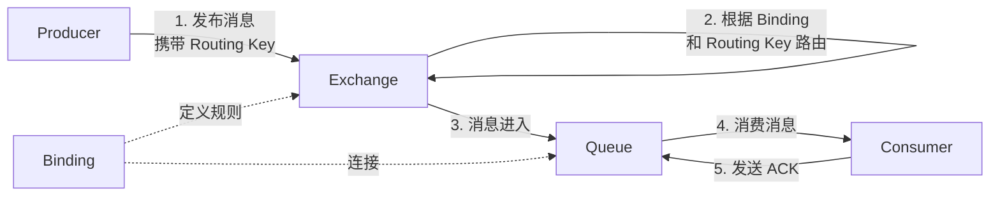

# 分布式与主流消息中间件总览

消息中间件是分布式系统的“通信枢纽”，负责在服务之间异步传递数据，实现**解耦、削峰、异步处理**三大核心价值

## 主流消息中间件对比 (Kafka vs. RabbitMQ vs. RocketMQ)

| 特性维度        | **Apache Kafka**                       | **RabbitMQ**                             | **Apache RocketMQ**                      |
| :-------------- | :------------------------------------- | :--------------------------------------- | :--------------------------------------- |
| **核心定位**    | 分布式流平台                           | 企业级消息代理                           | 金融级分布式消息队列                     |
| **吞吐量**      | **极高 (百万级TPS)**                   | 中等 (万-十万级)                         | 高 (十万级TPS)                           |
| **延迟**        | 较高 (毫秒级，为吞吐量优化批处理)      | **低 (微秒/毫秒级)**                     | **低 (毫秒级)**                          |
| **消息模型**    | 发布-订阅 (Pull)                       | 点对点/发布订阅 (Push/Pull)              | 点对点/发布订阅 (Pull)                   |
| **协议支持**    | 自定义协议 (Kafka RPC)                 | **AMQP** (主流), MQTT, STOMP             | 自定义协议 (兼容MQTT)                    |
| **顺序消息**    | 分区内严格有序                         | 队列内严格有序                           | 分区内严格有序                           |
| **事务/可靠性** | 高 (副本+幂等), 但存在丢失风险         | **极高 (Confirm模式)**                   | **极高 (天生支持事务消息)**              |
| **运维复杂度**  | **高** (依赖ZooKeeper，新版本逐步去ZK) | 中 (Erlang技术栈，但界面友好)            | 中 (Java技术栈，阿里云生态成熟)          |
| **典型场景**    | 日志采集、大数据管道、实时流计算、ETL  | 业务解耦、异步任务、复杂路由、微服务通信 | 电商交易、金融支付、库存扣减、分布式事务 |

## 选型决策

#### Kafka：如果你是“数据湖”或“流处理”场景

*   需求特征：每日数据量以TB/PB计，需要处理用户行为日志、系统监控指标，或者作为数据仓库的实时管道（ETL）。
*   决策理由：Kafka利用顺序写磁盘和零拷贝技术，在机械硬盘上也能跑出SSD的速度，是大数据生态（Spark/Flink）的标准组件。

#### RabbitMQ：如果你是“业务系统”且追求“低延迟与灵活性”

*   需求特征：微服务间的接口调用、异步发短信、复杂的分发路由（如：A类消息去队列1，B类消息去队列2）。
*   决策理由：它的Exchange（交换机） 机制极其灵活，上手简单，且有丰富的管理界面。如果你的并发量不是特别夸张（每秒万级），它能提供最低的延迟和极高的可靠性

#### RocketMQ：如果你是“金融/电商”且必须保证“数据一致”

*   需求特征：涉及钱的交易（下单、支付回调）、需要严格的顺序保证（如同一个订单的创建、支付、发货消息必须按顺序处理）。
*   决策理由：RocketMQ借鉴了Kafka的设计，但弥补了Kafka在“事务消息”和“精准一次消费”上的短板。它专为可靠性优化，支持大规模消息堆积而不降级性能

## 核心概念与设计思想

### 核心组件：

*   Broker：MQ服务器，负责存储和转发数据。
*   Producer/Consumer：生产者和消费者。
*   Topic/Queue：Topic是逻辑分类（逻辑概念），Queue是实际存储数据的物理队列

### 两种模式：

*   点对点 (P2P)：一条消息只能被一个消费者消费（适用于任务分发）。
*   发布/订阅 (Pub/Sub)：一条消息可以被多个消费者同时消费（适用于广播通知）

### 痛点解决：

*   重复消费：消息队列默认通常是“至少一次”投递，幂等性（通过唯一ID和业务逻辑）是你的最后一道防线。
*   顺序性：全局顺序难做，通常只保证分区（Partition）内有序

# AMQP协议

AMQP（Advanced Message Queuing Protocol，高级消息队列协议） 是一个开放、跨平台、语言无关的 wire-level 协议（网络线缆协议），专门为消息中间件设计，旨在解决不同厂商、不同语言的消息系统之间的互操作性问题。

简单说，它就像是消息中间件世界的 HTTP 协议，定义了消息在网络上传输的标准格式和交互流程。但是实际上现在主流的消息队列kafka是rpc协议, rocketMQ是gRpc协议, 都是不支持相互切换的。

AMQP 是一个定义了消息中间件通信规范的标准协议，RabbitMQ 是其 0-9-1 版本的经典实现，它通过 Exchange、Queue、Binding 等组件实现了灵活、可靠的消息路由和分发。

## 为什么需要 AMQP

在没有统一标准前，每个消息中间件（如老版本的 RabbitMQ、ActiveMQ、IBM MQ 等）都有自己的私有协议，导致：

*   异构系统集成困难：用 Java 写的生产者和用 Python 写的消费者，如果要通信，双方必须使用同一个厂商的产品。
*   厂商锁定：一旦选型某个产品，很难迁移到另一个。
*   客户端重复开发：每种语言/平台都需要为每个 MQ 产品单独写客户端库。

AMQP 的出现就是为了解决这些问题：只要你的消息系统实现了 AMQP 协议，任何支持 AMQP 的客户端都可以与之通信。

## AMQP 的核心架构模型

| 组件             | 角色       | 说明                                                         |
| :--------------- | :--------- | :----------------------------------------------------------- |
| **Producer**     | 消息生产者 | 发布消息到 Exchange。                                        |
| **Exchange**     | 交换机     | 接收消息，根据 **Routing Key** 和绑定规则，将消息路由到一个或多个 **Queue**。 |
| **Queue**        | 队列       | 实际存储消息的容器，直到被 Consumer 消费并确认。             |
| **Binding**      | 绑定       | Exchange 和 Queue 之间的连接规则，定义了 Routing Key 的匹配逻辑。 |
| **Consumer**     | 消息消费者 | 从 Queue 中拉取或接收推送的消息。                            |
| **Virtual Host** | 虚拟主机   | 隔离环境，类似命名空间，内部包含独立的 Exchanges、Queues、Bindings。 |



这个模型的核心思想是：消息的发送方（Producer）和接收方（Consumer）完全解耦，中间通过 Exchange 和 Queue 进行灵活路由。

## 两个重要版本：0-9-1 vs 1.0

AMQP 有两个主要且不兼容的版本，需要区分清楚：

| 对比维度     | **AMQP 0-9-1**                             | **AMQP 1.0**                                                 |
| :----------- | :----------------------------------------- | :----------------------------------------------------------- |
| **架构模型** | 定义了 Exchange、Queue、Binding 等高层组件 | 更底层、更精简，只定义消息传输和节点通信                     |
| **代理角色** | Broker 承担路由、存储、转发等复杂逻辑      | Broker 可以很简单，甚至可以只是一个转发代理                  |
| **灵活性**   | 高，内置多种路由策略                       | 更高，但需要应用层自己实现路由逻辑                           |
| **采用情况** | **RabbitMQ** 主要实现此版本                | **ActiveMQ Artemis**、**Azure Service Bus**、**Apache Qpid** 等采用 |
| **互操作性** | 0-9-1 客户端与 1.0 Broker **无法直接通信** | 设计目标是更好的跨厂商互操作                                 |

> RabbitMQ = AMQP 0-9-1 的典型实现；而 AMQP 1.0 更像是一个更底层、更通用的消息传输标准。

## AMQP 与其他协议的关系

| 协议      | 定位                             | 与 AMQP 的关系                                   |
| :-------- | :------------------------------- | :----------------------------------------------- |
| **AMQP**  | 面向**消息中间件**的开放标准协议 | -                                                |
| **MQTT**  | 轻量、发布/订阅，适合物联网      | RabbitMQ 通过插件支持，但场景不同                |
| **STOMP** | 简单文本协议，类似 HTTP          | RabbitMQ 通过插件支持，更易实现 WebSocket 客户端 |
| **JMS**   | Java 平台的 API 标准（不是协议） | 可以基于 AMQP 实现 JMS 适配器                    |

# RabbitMQ

RabbitMQ 是一个开源的**AMQP实现**, 服务端用Erlang语言编写, 支持多种客户端.

用于在分布式系统中存储转发消息, 在易用性/扩展性/高可用性等方面表现不俗 可以实现单机10万级并发量

在微服务或分布式系统中，引入 RabbitMQ 主要是为了解决三大核心问题：

1.  解耦：发送消息的服务（生产者）不需要知道接收消息的服务（消费者）是谁、在哪里。它只需将消息发给 RabbitMQ，由 RabbitMQ 负责转发。这使得服务之间不再直接依赖，可以独立开发、部署和扩展。
2.  削峰填谷：面对突发的流量高峰（如秒杀），如果所有请求直接打到后端服务，很可能将其压垮。RabbitMQ 可以作为一道缓冲“大坝”，先将所有请求消息暂存起来，后端服务再根据自己的处理能力，慢慢地从队列中取出消息进行处理，从而保护系统不被冲垮。
3.  异步处理：对于一些不需要立即得到结果的耗时操作（如发送邮件、生成报表），主流程可以触发消息后立即返回响应给用户，而不需要同步等待这些操作完成。这大大提升了系统的响应速度和吞吐量

## 核心架构

| 概念                        | 解释                                                         | 通俗类比           |
| :-------------------------- | :----------------------------------------------------------- | :----------------- |
| **生产者 (Producer)**       | 发送消息的应用程序。                                         | 寄件人             |
| **消费者 (Consumer)**       | 接收并处理消息的应用程序。                                   | 收件人             |
| **队列 (Queue)**            | 存储消息的“邮箱”。消息最终存放在这里，等待消费者来取。它本质上是一个大的消息缓冲区。 | 快递柜或信箱       |
| **交换机 (Exchange)**       | **消息路由的核心**。生产者只把消息发给交换机，由交换机根据预设的规则，决定将消息投递到哪个（或哪些）队列。 | 快递分拣中心       |
| **绑定 (Binding)**          | 连接**交换机**和**队列**的规则。它告诉交换机，哪些消息应该被路由到哪个队列。 | 分拣规则           |
| **虚拟主机 (Virtual Host)** | 一套独立的、隔离的交换机和队列的集合。类似于一个“**命名空间**”，用于实现多租户或环境隔离。 | 一个独立的邮局分局 |


> 关于交换机: 它不存储消息。如果找不到任何符合规则的队列，消息就会被丢弃。它的类型（如 direct, topic, fanout）决定了不同的路由策略，这也是 RabbitMQ 高度灵活的原因。

*   生产者 (Producer)：消息的发起者，负责创建消息并将其发送到 RabbitMQ 的 交换机。
*   交换机 (Exchange)：消息路由的 核心。生产者只将消息发送给交换机，交换机根据自身类型和路由键 (Routing Key)，决定将消息投递给哪些队列。

    *   重要特性：交换机不存储消息。如果消息无法路由到任何队列，它会被直接丢弃或返回给生产者。
*   队列 (Queue)：消息的最终存储容器。它以先进先出 (FIFO) 的方式暂存消息，直到消费者将其消费并确认。队列可以持久化到磁盘，以防 RabbitMQ 重启后数据丢失。
*   绑定 (Binding)：连接交换机和队列的规则。每个绑定都可以指定一个 绑定键 (Binding Key)。交换机通过将消息的 路由键 (Routing Key) 与绑定键进行匹配，来决定消息的去向。
*   消费者 (Consumer)：消息的最终处理者。它订阅一个或多个队列，并从队列中拉取或等待消息被推送过来。
*   虚拟主机 (Virtual Host)：资源隔离的“命名空间”。一个虚拟主机内独立地包含自己的交换机、队列和绑定关系，不同虚拟主机之间完全隔离，常用于区分不同的环境（如开发、测试、生产）或多租户场景。
*   连接 (Connection) 与信道 (Channel)：

    *   Connection：生产者/消费者与 RabbitMQ Broker 之间的物理 TCP 连接。
    *   Channel：建立在 Connection 之上的轻量级虚拟连接。由于创建和销毁 TCP 连接开销很大，一个应用可以复用同一个 Connection，创建多个 Channel 进行消息收发，极大地提高了性能

## 消息分发机制

RabbitMQ 的核心消息分发机制建立在 交换机 和 队列 的灵活绑定之上，它通过 路由键 匹配规则来决定消息去往哪个队列，而不是直接发送到队列。


整个分发过程由 交换机类型 决定，主要有以下四种模式：

| 类型        | 路由策略                                                     | 场景举例                                                     |
| :---------- | :----------------------------------------------------------- | :----------------------------------------------------------- |
| **Direct**  | **精确匹配**：消息的路由键必须与队列的绑定键**完全一致**，才能路由到该队列。 | 日志级别处理：将 `error` 级别的日志路由到错误队列，`info` 路由到信息队列。 |
| **Topic**   | **模式匹配**：支持通配符进行模糊匹配。`*` 匹配一个单词，`#` 匹配零个或多个单词。 | 多维度分类：比如，一条关于“杭州亚运会”的新闻，可以设置路由键为 `sports.news.hangzhou`，那么订阅了 `sports.#` 或 `*.news.*` 的队列都能收到。 |
| **Fanout**  | **广播**：无视路由键，将消息**发送给所有**与它绑定的队列。   | 全局通知：当系统需要发布一个所有模块都关心的公告（如“服务器即将维护”）时。 |
| **Headers** | **多属性匹配**：不依赖路由键，而是根据消息头 (Headers) 中的多个键值对进行匹配，灵活性更高。 | 复杂路由：需要根据消息的多个元数据（如 `format=pdf`, `type=report`）来决定去向的场景。 |

> 除了以上四种标准类型，RabbitMQ 还提供了如 x-delayed-message (延迟消息)、x-consistent-hash (一致性哈希) 等高级交换器类型，以满足更复杂的分发需求。

### 消费者侧的分发模式

交换机决定消息进入哪个队列，而队列将消息分发给消费者时有两种模式：

1.  工作队列模式 (Work Queue)：

    *   模式：多个消费者监听同一个队列。
    *   分发：默认采用轮询分发，消息平均分配给各个消费者。
    *   能者多劳：为了解决轮询机制中因消费者性能不同导致的整体效率低下问题，可以通过设置 `prefetch_count=1` 开启“能者多劳”模式。该设置会限制每个消费者未确认消息的数量，从而让处理快的消费者可以处理更多消息，实现负载均衡。
2.  发布/订阅模式 (Publish/Subscribe)：

    *   模式：通过交换机将消息路由到多个不同的队列，每个队列有自己的消费者。
    *   分发：这是 Fanout、Topic 等交换机的典型用法，用于将一份消息广播给多个独立的业务模块处理。

## 持久化和内存管理

### 持久化机制：如何保证消息不丢

RabbitMQ 的持久化分为三个层次，需要同时开启才能保证重启后数据不丢失：

| 持久化层级       | 配置方式                                                     | 效果                                          |
| :--------------- | :----------------------------------------------------------- | :-------------------------------------------- |
| **交换机持久化** | 创建时设置 `durable=true`                                    | 交换机重启后仍存在                            |
| **队列持久化**   | 创建时设置 `durable=true`                                    | 队列重启后仍存在，管理界面会显示 **"D"** 标识 |
| **消息持久化**   | 发送时设置 `deliveryMode=2` 或 `MessageProperties.PERSISTENT_TEXT_PLAIN` | 消息写入磁盘，重启不丢失                      |

```java
channel.basicPublish("", "my_queue", 
    MessageProperties.PERSISTENT_TEXT_PLAIN,  // 关键：持久化标识
    message.getBytes());
```

### 持久化底层存储结构

RabbitMQ 的持久化层由两个组件构成

1.  队列索引 (rabbit\_queue\_index)：每个队列独享，维护消息在队列中的位置、是否已交付、是否已 ACK 等元数据。
2.  消息存储 (rabbit\_msg\_store)：所有队列共享的键值存储，实际存放消息体。分为两个：

    *   `msg_store_persistent`：持久化消息
    *   `msg_store_transient`：非持久化消息（重启丢失）

> 存储优化：小于 4096 字节（默认）的消息会直接嵌入队列索引，避免两次写入，提升性能。但要注意，队列索引在内存中至少维护一个段文件（含 16384 条记录），调大阈值可能显著增加内存占

### 消息删除机制（垃圾回收）

消息删除并非立即从磁盘移除，而是标记为垃圾数据。当某个文件中的垃圾数据占比超过 50%（默认），且至少有 3 个文件存在时，才会触发合并回收。

### 内存管理：如何防止 OOM

RabbitMQ 的内存管理核心是水位线机制和分页（Page Out）。

#### 内存水位线

当节点内存使用超过配置阈值（默认 0.4，即 40% 的可用 RAM）时，RabbitMQ 会阻塞所有生产者连接，停止接收新消息，防止服务崩溃。可通过以下命令调整：

```bash
rabbitmqctl set_vm_memory_high_watermark 0.6  # 设为 60%
```

#### 分页（Page Out）

当内存紧张时，RabbitMQ 会将内存中的消息换页到磁盘。这是一个昂贵的操作，会阻塞队列进程，导致生产速率骤降。

#### 磁盘告警

当磁盘剩余空间低于阈值（默认 50MB）时，RabbitMQ 同样会阻塞生产者，防止磁盘写满

## 可靠性投递

1.  消息的投递从生产者到broker  可能出问题&#x20;
2.  从交换机到队列发送可能出问题&#x20;
3.  队列的消息可能保存丢失&#x20;
4.  消费者消费消息可能失败

RabbitMQ 保证消息可靠性投递的模式，核心是围绕一条消息从生产者到消费者的三段旅程建立的三道防线：

*   生产端确认：确保消息 100% 到达 RabbitMQ 服务器。
*   消息端存储：确保服务器 重启不丢 消息。
*   消费端确认：确保消息被 成功处理 后才删除。

### 🚀 第一段旅程：生产者 → RabbitMQ 服务器

这段旅程的核心是确保消息成功到达服务器，RabbitMQ 提供了三种模式，其效率与可靠性呈反比：

| 模式                       | 工作方式                 | 性能              | 可靠性                   | 推荐度 |
| :------------------------- | :----------------------- | :---------------- | :----------------------- | :----- |
| **事务模式 (Transaction)** | 同步阻塞，提交失败则回滚 | **极低 (不推荐)** | 高                       | ❌      |
| **单条确认模式 (Single)**  | 同步等待，发一条等一条   | 低                | 高                       | ⭐⭐     |
| **批量确认模式 (Batch)**   | 同步等待，发一批等一次   | 高                | 中（批量失败需重发全部） | ⭐⭐⭐    |
| **异步确认模式 (Async)**   | 异步回调，发送与确认分离 | **最高**          | 高                       | ⭐⭐⭐⭐⭐  |

#### 事务模式 (Transaction)

这是最原始但性能开销最大的方式。通过 txSelect 开启事务，txCommit 提交，如果失败则 txRollback 回滚。它会严重“吸干”RabbitMQ 的性能，生产环境强烈不建议使用。

#### Confirm 确认模式

这是现代生产环境的标准模式，通过 confirmSelect 开启。它有三种实现方式，性能和可靠性依次提升

*   单条确认 (串行)：发一条消息，阻塞调用 `waitForConfirms()` 等一条回应，性能较差。
*   批量确认 (串行)：发一批消息，阻塞调用一次 `waitForConfirmsOrDie()`。性能好，但一旦失败，整批消息都需要重发，有重复风险。
*   异步确认 (推荐)：性能最好的方式。通过 `addConfirmListener` 注册回调，消息发送后立即返回，成功或失败的反馈通过 `handleAck` 和 `handleNack` 方法异步通知。

#### 保障路由成功：Return 与备份交换机

即使消息被服务器接收，也可能因为路由键错误导致无法进入队列而丢失。这需要额外的保障：

*   Return 机制：开启 `publisher-returns=true`，并设置 `Mandatory=true`。当消息无法路由时，RabbitMQ 会通过 `ReturnCallback` 将消息退回给生产者。
*   备份交换机 (AE)：为交换机指定一个“备胎”。当消息无法路由时，它会被发送到这个备份交换机上，而不是退回给生产者，通常用于记录无法路由的错误日志。

### 💾 第二段旅程：消息在 RabbitMQ 服务器中

消息到达服务器后，默认是存储在内存中的，一旦服务器宕机重启，所有消息会灰飞烟灭。持久化是防止这一点的关键。

可靠性存储要求 “三位一体” 都必须持久化

1.  交换机持久化：`durable = true`，服务器重启后交换机还在。
2.  队列持久化：`durable = true`，服务器重启后队列还在。
3.  消息持久化：发送时设置 `deliveryMode = 2` (或 `MessageDeliveryMode.PERSISTENT`)，消息内容会写入磁盘。

### 🙋 第三段旅程：RabbitMQ 服务器 → 消费者

这是最后也是最关键的一环。如果消费者拿到消息还没处理完就宕机，自动确认模式下消息就会丢失。

消费者确认机制通过 `acknowledge-mode` 控制

*   自动确认 (none)：不安全。服务器发出消息就认为成功，容易丢消息。
*   手动确认 (manual)：最安全，但代码有入侵。业务处理成功后，必须手动调用 `channel.basicAck` 通知服务器删除；失败时调用 `basicNack` 并设置 `requeue=true` 让消息重试。
*   自动异常确认 (auto)：推荐，兼顾安全与便捷。利用 Spring 的 AOP，业务代码无异常则自动 `ack`；抛出指定异常则自动 `nack` 重试。

### 总结：全链路可靠投递清单

要确保消息绝对不丢，你需要按以下清单组合出击：

1.  生产端：开启 异步 Confirm 模式，并实现 Return 回调（或配置备份交换机）处理路由失败场景。
2.  服务端：交换机、队列、消息三者均开启持久化。
3.  消费端：开启 手动确认 (manual) 或 自动异常确认 (auto) 模式，确保处理完才确认。

# 面试总结

## 消息队列的作用和使用场景&#x20;

1.  解耦：发送消息的服务（生产者）不需要知道接收消息的服务（消费者）是谁、在哪里。它只需将消息发给 RabbitMQ，由 RabbitMQ 负责转发。这使得服务之间不再直接依赖，可以独立开发、部署和扩展。
2.  削峰填谷：面对突发的流量高峰（如秒杀），如果所有请求直接打到后端服务，很可能将其压垮。RabbitMQ 可以作为一道缓冲“大坝”，先将所有请求消息暂存起来，后端服务再根据自己的处理能力，慢慢地从队列中取出消息进行处理，从而保护系统不被冲垮。
3.  异步处理：对于一些不需要立即得到结果的耗时操作（如发送邮件、生成报表），主流程可以触发消息后立即返回响应给用户，而不需要同步等待这些操作完成。这大大提升了系统的响应速度和吞吐量

## RabbitMQ有哪些路由方式&#x20;

direct (直连交换机 默认): 通过bindKey来分发到指定的队列 fanout (扇型交换机): 广播到所有的消息队列 topic(主题交换机): 模糊匹配 *表示匹配一层 #表示匹配所有  com.# 可匹配 com.xxx.xxx  com.* 只能匹配com.xxx headers (头交换机): 通过消息中的header信息来路由到对应的队列中

## 无法被路由的去了哪里&#x20;

直接被丢弃掉

## 消息在什么时候会变成死信&#x20;

在队列或者消息的TTL时间到了的时候 会变成死信 进入死信队列

## 如何发送延迟消息

1.  可以对于死信队列进行监听
2.  可以使用插件rabbitmq\_delayed\_message\_exchange, 在消息头部加入延迟时间即可

## 一个队列可以存放多少条消息&#x20;

队列有max-length以及max-bytes来控制队列的大小和容量

## AMQPTemplate和RabbitTemplate区别&#x20;

AMQPTemplate是Spring对于AMQP协议的封装, 而RabbitTemplate是实现

## 如何保证消息的顺序性 无法保证 &#x20;

RabbitMQ 保证单个队列内的顺序性。要保证全局顺序，需要让顺序相关的消息进入同一个队列，并使用单活消费者避免并发消费导致的乱序。

*   优先用一致性哈希路由将同一业务ID的消息打入同一队列
*   队列层面开启 单活消费者
*   消费者做好幂等性，防止重试导致重复处理
*   极端顺序敏感场景（如金融交易流水），考虑在业务层做序列号校验 + 暂存排序

## RabbitMQ集群的节点类型 区别是什么&#x20;

内存节点和磁盘节点 用内存节点来读写数据 用磁盘节点来持久化数据 如果设置了数据持久化那么内存节点也会持久化到磁盘

## 如何保证MQ的高可用&#x20;

搭建集群

## 大量消息堆积怎么办

一般情况下是因为队列的一条消息没有收到ACK确认请求 这里检查代码然后重启保证消息能正常消费即可 否则就是消息太多消费者消费不过来 增加消费者即可