# ACID 模型

ACID 是关系型数据库的核心特性，保证了数据的可靠性和一致性。MySQL 的 InnoDB 存储引擎完整实现了 ACID 模型。

## ACID是什么

| 特性  | 全称               | 含义                                   | 一句话             |
| :---- | :----------------- | :------------------------------------- | :----------------- |
| **A** | Atomicity 原子性   | 事务中的操作要么全部成功，要么全部失败 | 全有或全无         |
| **C** | Consistency 一致性 | 事务前后，数据完整性约束不被破坏       | 数据始终合法       |
| **I** | Isolation 隔离性   | 多个事务并发执行时，互不干扰           | 你干你的，我干我的 |
| **D** | Durability 持久性  | 事务一旦提交，修改永久保存             | 落子无悔           |

## A - 原子性（Atomicity）

事务是一个不可分割的工作单元，其中的操作要么全部执行成功，要么全部不执行。如果执行过程中发生错误，会回滚到事务开始前的状态。

### 示例

```sql
-- 转账：A 转 100 元给 B
BEGIN;
UPDATE account SET balance = balance - 100 WHERE user_id = 'A';
UPDATE account SET balance = balance + 100 WHERE user_id = 'B';
COMMIT;
```

如果第二条 UPDATE 失败，第一条会自动回滚，A 的钱不会少。

### 实现机制

*   Undo Log  记录修改前的旧值，用于回滚
*   Redo Log  记录修改后的新值，用于崩溃恢复

```text
原子性实现流程：
事务开始 → 写入 Undo Log → 执行修改 → 写入 Redo Log → 事务提交
                ↑                              ↑
          回滚时恢复                   崩溃时重放
```

### 总结

*   单条SQL语句默认开启事务并自动提交 可通过设置"SET autocommit=0"关闭
*   事务是工作的原子单位，Mysql是关系型数据库，所以工作就是sql语句。任何增删改查都是一个事务。
*   数据都是基于sql语句操作的，每行数据都会有个隐藏的事务字段trx\_id，代表操作这个数据的最后事务ID。
*   每个非只读事务，都会有一个自增的事务ID，并且我能查看到当前有哪些事务没有提交

## C - 一致性（Consistency）

事务执行前后，数据库必须从一个一致的状态转换到另一个一致的状态。所有约束（主键、外键、唯一索引、触发器等）都必须满足。A、I、D都是为了满足C

## I - 隔离性（Isolation）

多个事务并发执行时，每个事务都感觉不到其他事务的存在，仿佛自己在独立运行。

### 并发问题

| 问题           | 说明                       | 示例                               |
| :------------- | :------------------------- | :--------------------------------- |
| **脏读**       | 读到其他事务未提交的数据   | A 改余额为 200 未提交，B 读到 200  |
| **不可重复读** | 同一事务内两次读取结果不同 | 第一次读到 100，第二次读到 200     |
| **幻读**       | 同一事务内两次查询行数不同 | 第一次查到 10 行，第二次查到 11 行 |

#### 脏读

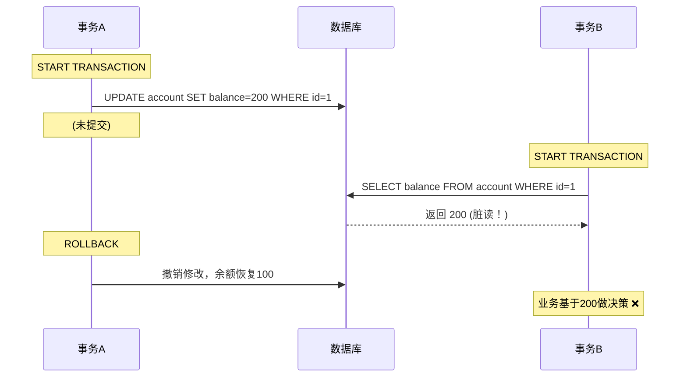

问题：事务B读到了事务A最终不存在的数据。

#### 不可重复读 (Non-Repeatable Read)

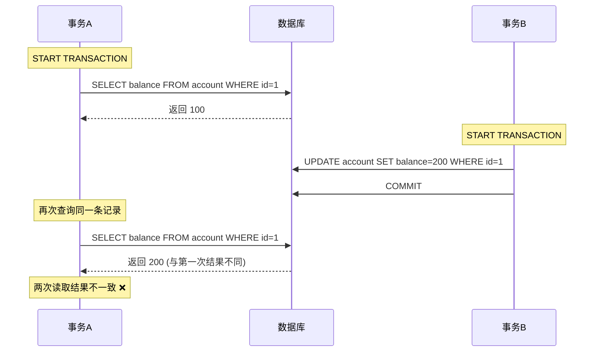

问题：事务A内两次读取同一条记录，结果被事务B的提交修改了。

#### 幻读 (Phantom Read)

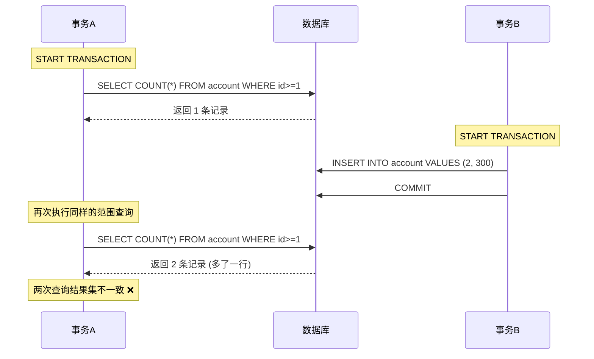

问题：事务A内两次范围查询，结果集的行数发生了变化。

### 隔离级别

| 级别                       | 脏读   | 不可重复读 | 幻读       | 并发性能 |
| :------------------------- | :----- | :--------- | :--------- | :------- |
| **READ UNCOMMITTED**       | ✅ 可能 | ✅ 可能     | ✅ 可能     | 最高     |
| **READ COMMITTED**         | ❌ 不会 | ✅ 可能     | ✅ 可能     | 高       |
| **REPEATABLE READ** (默认) | ❌ 不会 | ❌ 不会     | ⚠️ 部分可能 | 中       |
| **SERIALIZABLE**           | ❌ 不会 | ❌ 不会     | ❌ 不会     | 最低     |

> MySQL InnoDB 的 REPEATABLE READ 通过间隙锁 (Gap Lock) 解决了幻读问题，但标准SQL定义中幻读仍可能发生。

### InnoDB 怎么解决的脏读和不可重复读

> 策略：生成 Read View，强制只读“已提交”的版本

脏读的本质是读到了未提交事务的修改, 不可重复度的本质是同一事务内，两次读取同一条记录，结果不一致（被其他已提交事务修改） &#x20;

InnoDB 利用 MVCC 规避了这2个问题。在 READ COMMITTED 及以上隔离级别解决脏读, 在 REPEATABLE READ 及以上级别解决了不可重复度和快照读的幻读。

*   Read View（读视图）：执行查询时，系统会生成一个快照，记录下当前所有“活跃事务”（未提交）的 ID 列表。
*   可见性判断：读取数据时，沿着 Undo Log 版本链寻找。如果某个数据版本的事务 ID 属于活跃事务（未提交），InnoDB 就会跳过这个版本，继续找上一个已提交事务的版本。
*   效果：因为读取操作永远不会看到未提交事务修改的数据，所以脏读被解决。

### MVCC Multi-Version Concurrency Control（多版本并发控制）

简单来说，它的核心思想是：“读时不加锁，读写不互斥”。InnoDB 通过保存数据在某个时间点的快照，让一个事务在执行过程中，看到的是一个“静态”的数据版本，从而极大地提升了数据库的并发性能。

它的具体实现，主要依赖于三个核心隐藏字段、Undo Log 版本链，以及我们之前提到的 Read View（读视图）。

#### 核心实现原理

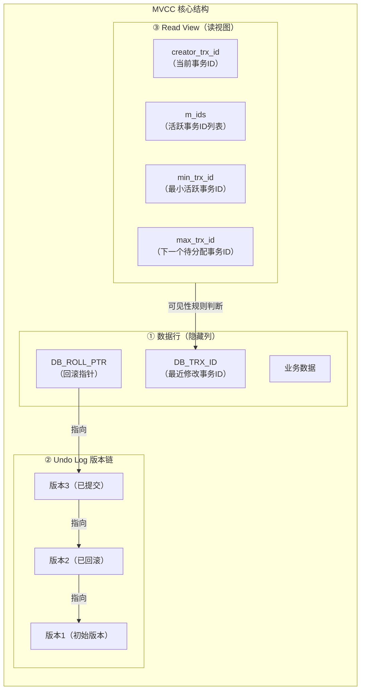

#### 三个隐藏字段

数据库的每一行记录（除了显式定义的列）都有三个隐藏字段：

*   `DB_TRX_ID` (6字节)：记录最近一次修改（更新、删除、插入）这条记录的事务ID。
*   `DB_ROLL_PTR` (7字节)：回滚指针，指向该记录在 Undo Log 中的旧版本记录。通过它，可以把多个版本的记录串成一个链表。
*   `DB_ROW_ID` (6字节)：单调递增的行ID。如果表没有定义主键，InnoDB 会用它来生成聚簇索引。

#### Undo Log 版本链

*   当对一条记录执行 `UPDATE` 操作时，InnoDB 不会原地覆盖数据。
*   它会先把旧数据写入 Undo Log 中，然后更新当前行，并将 `DB_ROLL_PTR` 指向这个 Undo Log 中的旧版本。
*   如果多次更新，就会通过 `DB_ROLL_PTR` 形成一个版本链：`当前记录 ← Undo版本1 ← Undo版本2 ← ...`。

#### Read View (读视图)

Read View 可以理解为一个快照，在 SELECT 语句执行时生成（不同隔离级别生成时机不同）。它包含四个关键信息：

*   `creator_trx_id`：当前事务的ID。
*   `m_ids`：在生成Read View时，系统中所有活跃（未提交） 的事务ID列表。
*   `min_trx_id`：`m_ids` 中的最小值。
*   `max_trx_id`：下一个将要被分配的事务ID（即生成Read View时，系统已经分配过的最大事务ID + 1）。

#### 场景：初始账户余额为 100，事务A和事务B并发执行。

```sql
CREATE TABLE account (
    id INT PRIMARY KEY,
    balance INT
);
INSERT INTO account VALUES (1, 100), (5, 500);

-- 行内容如下: 
| id | balance | DB_TRX_ID | DB_ROLL_PTR |
|----|---------|-----------|-------------|
| 1  | 100     | 1         | NULL        |
|----|---------|-----------|-------------|
| 5  | 500     | 2         | NULL        |


```

#### 脏读和不可重复度解决的时序图

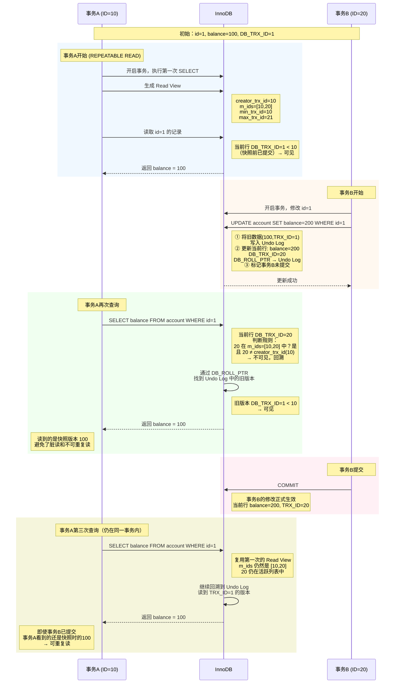

*   事务A自始至终读到的是 100
*   这就是 **REPEATABLE READ** 隔离级别下 MVCC 的效果  \*\*不会有脏读和不可重复读  \*\*也会解决绝大部分幻读
*   如果事务A是 **READ COMMITTED** 级别，第三次查询会读到 200（因为每条 SELECT 都会重新生成 Read View，此时事务B已提交，不在新的 `m_ids` 中） **不会有脏读  会有不可重复读的现象**

### InnoDB是怎么解决幻读的

InnoDB 对不同读取方式采用不同的防幻读策略：

| 读取方式   | SQL示例                                                      | 防幻读机制            | 是否发生幻读 |
| :--------- | :----------------------------------------------------------- | :-------------------- | :----------- |
| **快照读** | `SELECT ...`（不加锁）                                       | MVCC + Read View 复用 | ❌ 不会       |
| **当前读** | `SELECT ... FOR UPDATE` `SELECT ... LOCK IN SHARE MODE` `UPDATE/DELETE` | **Next-Key Lock**     | ❌ 不会       |

#### 当前读 vs 快照读

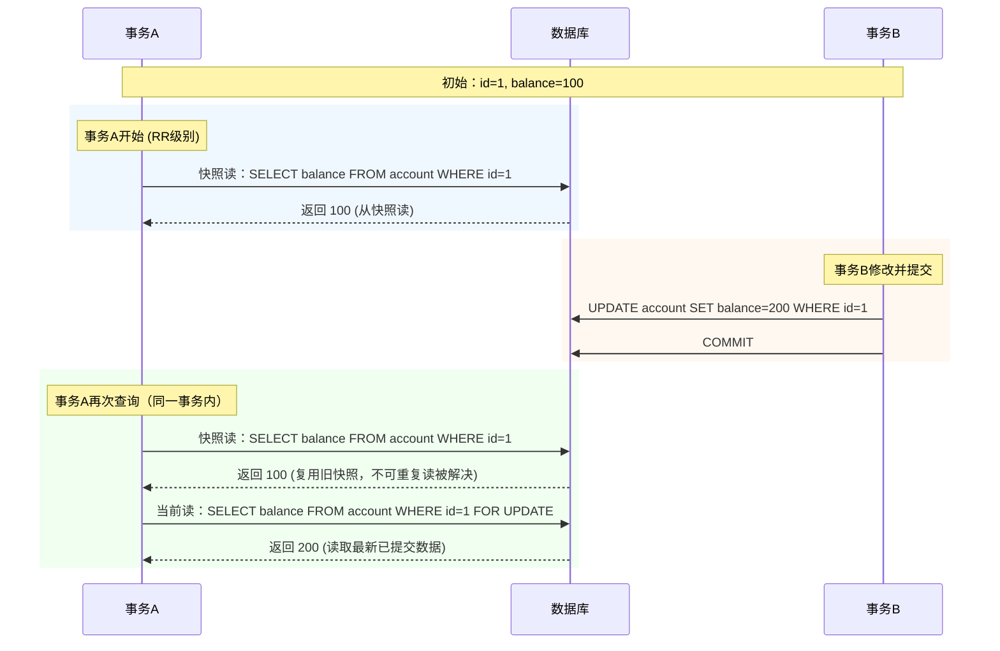

> 快照读通过复用 Read View，让事务始终看到第一次查询时的快照，自然不会有幻读。

#### 当前读是怎么解决幻读的

当前读，顾名思义，就是读取数据当前最新的已提交版本，而不是历史快照版本。凡是会对数据进行修改，或者明确要求锁定读取的 SQL，都是当前读。

| 操作类型           | SQL 示例                        | 加的锁                     |
| :----------------- | :------------------------------ | :------------------------- |
| **显式加锁的查询** | `SELECT ... FOR UPDATE`         | 排他锁 (X锁)               |
| **显式加锁的查询** | `SELECT ... LOCK IN SHARE MODE` | 共享锁 (S锁)               |
| **数据更新**       | `UPDATE ... SET ...`            | 排他锁 (X锁)               |
| **数据删除**       | `DELETE FROM ...`               | 排他锁 (X锁)               |
| **数据插入**       | `INSERT INTO ...`               | 排他锁 (X锁，加插入意向锁) |

InnoDB 的解决方案：Next-Key Lock (临键锁)

Next-Key Lock = Record Lock（行锁） + Gap Lock（间隙锁）

对于查询范围 id BETWEEN 1 AND 10，InnoDB 会锁定：

```code
索引值：  1              5              10（边界）
        ──┬──────────────┬──────────────┬──
          │              │              │
锁定范围： [1]  +  (1,5)  +  [5]  +  (5,10]
         ↑                ↑              ↑
       记录锁           间隙锁          间隙锁
```

*   记录锁(行锁)：锁定 `id=1` 和 `id=5` 这两条已存在的记录
*   间隙锁：锁定 `(1,5)` 和 `(5,10)` 这两个范围，禁止插入新记录

时序如下:

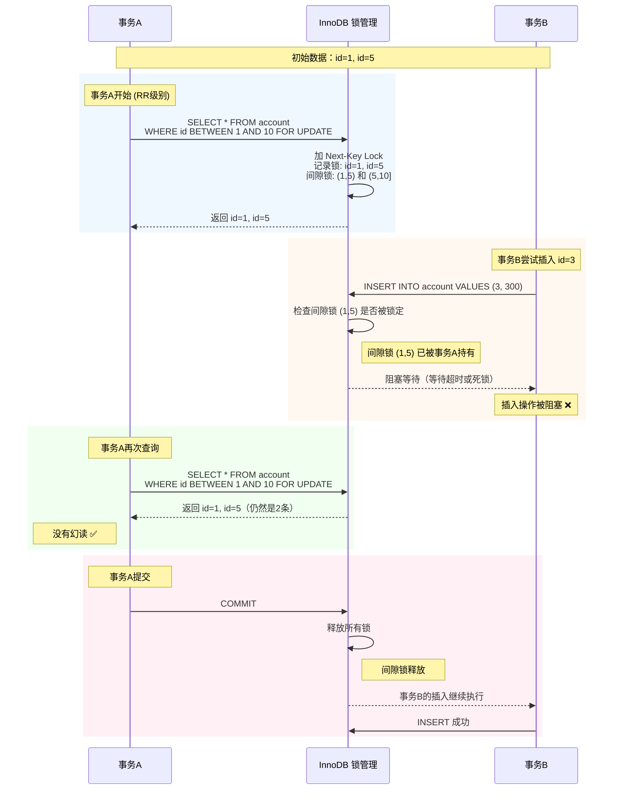

### 可重复读的隔离级别 什么情况下会发生幻读

场景：快照读与当前读混合使用

当一个事务中先进行快照读，然后进行当前读，再基于当前读的结果进行数据修改时，可能出现语义上的幻读。

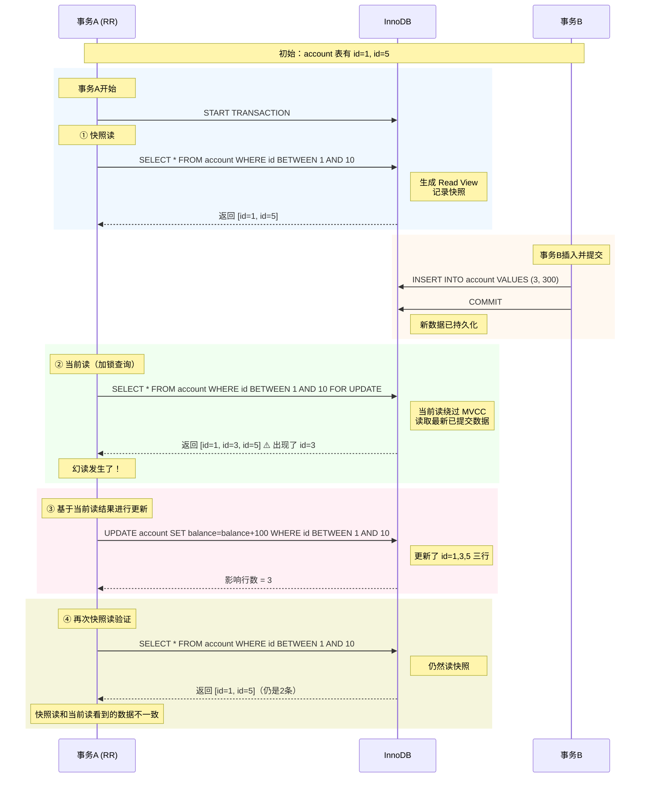

根本原因：

*   快照读看到的是事务开始时的历史快照
*   当前读看到的是最新已提交数据
*   两者在同一个事务中混用时，看到的数据视图不一致，就产生了幻读

## D 持久性 (Durability)

事务一旦提交，对数据库的修改就是永久性的。即使发生宕机、断电等故障，已提交的数据也不会丢失。

> 类比：转账成功后，银行系统即使立即断电，重启后 A 扣款、B 到账的结果依然存在。

InnoDB 实现：通过 Redo Log。

*   事务提交时，先写 Redo Log（预写日志，WAL 技术）
*   即使数据页还没来得及写入磁盘，宕机重启后，MySQL 会读取 Redo Log 重新执行，恢复已提交的事务修改

# LBCC Lock-Based Concurrency Control（基于锁的并发控制）

InnoDB 的锁机制是其实现高并发和高性能的核心。它的锁设计精细，种类丰富，大致可以分为**锁的类型**（按用途分）和**锁的粒度**（按作用范围分）两个维度来理解。

## 使用场景

| 场景                      | 说明                    | 锁机制                   |
| :------------------------ | :---------------------- | :----------------------- |
| **当前读**                | `SELECT ... FOR UPDATE` | 必须加锁读取最新数据     |
| **UPDATE/DELETE**         | 修改操作                | 加排他锁防止并发冲突     |
| **SERIALIZABLE 隔离级别** | 最高隔离级别            | 普通 `SELECT` 也会加读锁 |
| **手动 LOCK TABLES**      | 显式表锁                | 完全基于锁控制           |

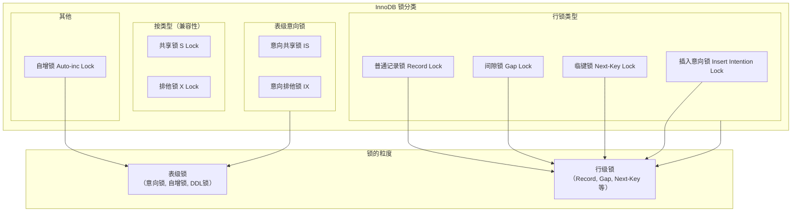

## 基础类型：共享锁与排他锁

这是所有锁的基础，无论是表级还是行级，都遵循这套兼容性规则

| 锁类型     | 英文               | 作用                                   | 兼容性                     |
| :--------- | :----------------- | :------------------------------------- | :------------------------- |
| **共享锁** | Shared Lock (S)    | 允许持有锁的事务**读取**一行数据       | 与共享锁兼容，与排他锁冲突 |
| **排他锁** | Exclusive Lock (X) | 允许持有锁的事务**更新或删除**一行数据 | 与任何锁都冲突             |

简单来说，读读可以并行，读写、写写都会阻塞。

## 表级锁：意向锁

意向锁是表级别的锁，它标志着事务即将或正在对表中的某些行加锁。意向锁的设计目的是为了快速判断表级锁的冲突，避免逐行检查

*   意向共享锁 (IS)：表示事务想要对表中的某些行加共享锁。例如 `SELECT ... LOCK IN SHARE MODE` 会先加 IS 锁。
*   意向排他锁 (IX)：表示事务想要对表中的某些行加排他锁。例如 `SELECT ... FOR UPDATE` 会先加 IX 锁。

意向锁的兼容性矩阵（横向为已持有锁，纵向为请求锁，✅兼容 ❌冲突）：

|        | X    | IX   | S    | IS   |
| :----- | :--- | :--- | :--- | :--- |
| **X**  | ❌    | ❌    | ❌    | ❌    |
| **IX** | ❌    | ✅    | ❌    | ✅    |
| **S**  | ❌    | ❌    | ✅    | ✅    |
| **IS** | ❌    | ✅    | ✅    | ✅    |

从矩阵可以看出，意向锁之间是相互兼容的，它们只与全表级别的 LOCK TABLES ... WRITE (X锁) 或 ... READ (S锁) 冲突。一般只有执行DDL语句事务隔离级别 `SERIALIZABLE` 的时候, 才会产生锁表的情况。

## 行级锁详解

InnoDB 的**行锁是加在索引上的**，这也是它性能的关键。它主要包含以下几种

### 普通记录锁 (Record Lock)&#x20;

*   作用：仅锁定索引记录本身，不锁定记录之间的间隙。
*   场景：在 `REPEATABLE READ` 级别下，使用唯一索引进行等值查询时，会使用记录锁。例如，`SELECT * FROM user WHERE id = 10 FOR UPDATE;` 只会锁住 `id=10` 这一行，不会影响在 `id=9` 和 `id=11` 之间插入新数据。

### 间隙锁 (Gap Lock)

*   作用：锁定一个范围，但不包括记录本身。它的存在是为了防止幻读，禁止其他事务在这个“间隙”中插入新数据。
*   场景：在 `REPEATABLE READ` 级别下，对非唯一索引进行查询或范围查询时会使用。
*   特性：间隙锁之间是不互斥的。多个事务可以同时对同一个间隙加锁，因为它们的目标都是“禁止插入”，这个目标是一致的。

### 临键锁 (Next-Key Lock)

*   作用：这是 InnoDB 在 `REPEATABLE READ` 级别下默认的行锁，它是 `记录锁 + 间隙锁` 的组合。它既锁定记录本身，也锁定记录前面的间隙。
*   范围表示：假设一个索引列有值 `10, 20, 30`，其临键锁的范围是 `(-∞, 10]`, `(10, 20]`, `(20, 30]`, `(30, +∞)`。
*   实战：执行 `SELECT * FROM user WHERE age = 20 FOR UPDATE;`，如果 `age` 列不是唯一索引，InnoDB 就会使用临键锁，锁定 `age=20` 这一行，同时锁定 `(10,20]` 和 `(20,30]` 这两个范围，阻止其他事务插入 `age` 为 15 或 25 的新记录，从而彻底解决了幻读问题。

### 插入意向锁 (Insert Intention Lock)

*   作用：一种特殊的间隙锁，由 `INSERT` 操作在插入前设置。它表示一个事务准备在某个间隙中插入新记录。
*   设计意图：提升并发插入性能。
*   运作机制：如果两个事务要在同一个间隙的不同位置插入数据（例如，索引间隙为 10-20，一个插12，一个插18），它们并不需要互相等待，因为插入意向锁之间是兼容的。只有当它们试图插入同一个位置（如都插15）或触发了唯一键冲突时，才会互相阻塞。

## 自增锁 (Auto-inc Lock)

*   自增锁 (Auto-inc Lock)：一种特殊的表级锁，用于保证自增字段（`AUTO_INCREMENT`）值分配的连续性。当向有自增列的表插入数据时，事务会获取这个锁，并在SQL语句执行结束后立即释放，而不是等事务结束。

## 总结与对比

| 锁类型          | 粒度    | 主要作用               | 是否互斥                 | 典型场景                    |
| :-------------- | :------ | :--------------------- | :----------------------- | :-------------------------- |
| **共享/排他锁** | 行/表   | 控制读写并发           | S兼容，X冲突             | 所有DML操作的基础           |
| **意向锁**      | 表      | 快速判断表锁冲突       | IS/IX互相兼容            | 任何加行锁前自动添加        |
| **记录锁**      | 行      | 锁定单个记录           | 遵循S/X规则              | 唯一索引等值查询            |
| **间隙锁**      | 间隙    | 防止幻读，锁定范围     | **不互斥**               | 范围查询，非唯一索引查询    |
| **临键锁**      | 行+间隙 | 防止幻读，RR级别默认锁 | 遵循S/X规则              | RR隔离级别下的普通查询/修改 |
| **插入意向锁**  | 间隙    | 提升并发插入性能       | **不互斥**（位置不同时） | `INSERT` 操作前             |
| **自增锁**      | 表      | 保证自增值连续         | 互斥                     | `INSERT` 操作时             |

## 死锁是怎么产生的

死锁是指两个或多个事务互相持有对方需要的锁，导致彼此永远等待下去。

| 条件           | 说明                               |
| :------------- | :--------------------------------- |
| **互斥**       | 资源只能同时被一个事务占用         |
| **持有并等待** | 事务已持有一部分锁，同时等待其他锁 |
| **不可剥夺**   | 已持有的锁不能被强制剥夺           |
| **循环等待**   | 事务之间形成等待环路               |

### 示例: 两个事务互相更新对方持有的行

```sql
-- 事务A
BEGIN;
UPDATE account SET balance=200 WHERE id=1;
UPDATE account SET balance=300 WHERE id=2;  -- 等待事务B释放id=2
COMMIT;

-- 事务B
BEGIN;
UPDATE account SET balance=500 WHERE id=2;
UPDATE account SET balance=400 WHERE id=1;  -- 等待事务A释放id=1
COMMIT;
```

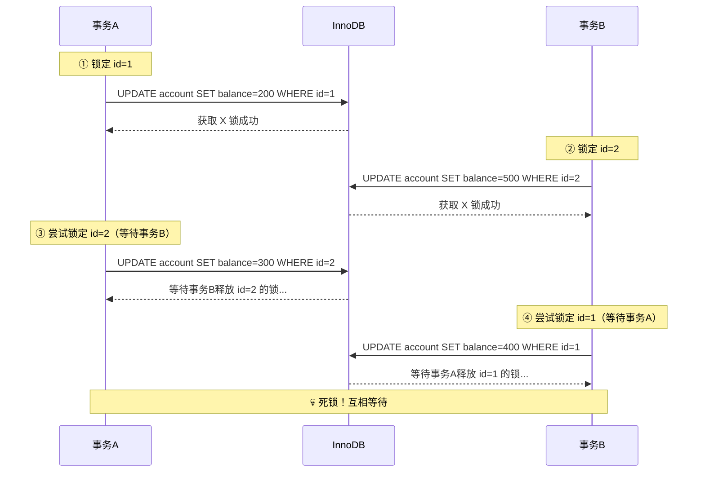

## 如何发现死锁

### 查看最近一次死锁信息

```sql
SHOW ENGINE INNODB STATUS\G
```

在输出中搜索 LATEST DETECTED DEADLOCK 部分。

### 查看当前锁等待

```sql
-- 查看正在等待锁的事务
SELECT * FROM information_schema.INNODB_LOCK_WAITS;

-- 查看当前持有的锁
SELECT * FROM information_schema.INNODB_LOCKS;

-- 更简单的查询（MySQL 8.0）
SELECT * FROM performance_schema.data_locks;
```

### 开启死锁日志

```sql
-- 设置死锁日志级别（MySQL 8.0）
SET GLOBAL innodb_print_all_deadlocks = ON;
-- 所有死锁会记录到错误日志
```

### 如何修复死锁

InnoDB 会自动检测死锁，并回滚其中一个事务（通常是更新行数较少的事务）。

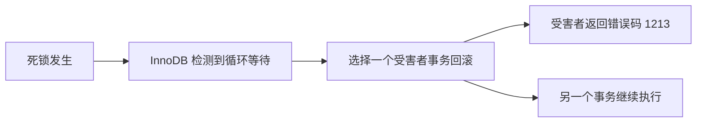

### 死锁排查流程图

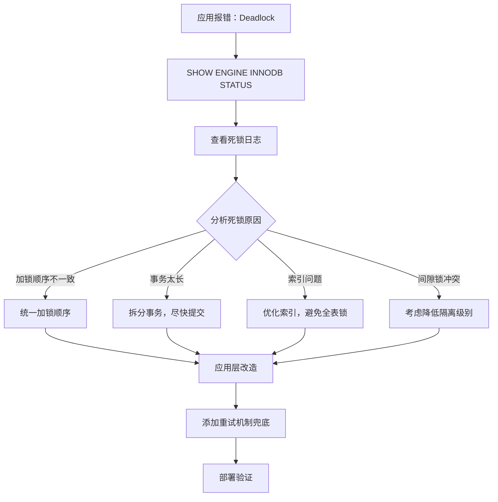

## 总结

| 方面           | 关键点                                         |
| :------------- | :--------------------------------------------- |
| **产生原因**   | 循环等待、加锁顺序不一致、间隙锁冲突           |
| **如何发现**   | `SHOW ENGINE INNODB STATUS`、错误日志          |
| **MySQL 处理** | 自动检测并回滚其中一个事务（返回1213错误）     |
| **应用层修复** | 死锁重试机制（重新执行事务）                   |
| **如何避免**   | 统一加锁顺序、缩短事务、使用索引、降低隔离级别 |

一句话总结：死锁无法完全避免，但可以通过统一加锁顺序和添加重试机制来最大限度减少影响。