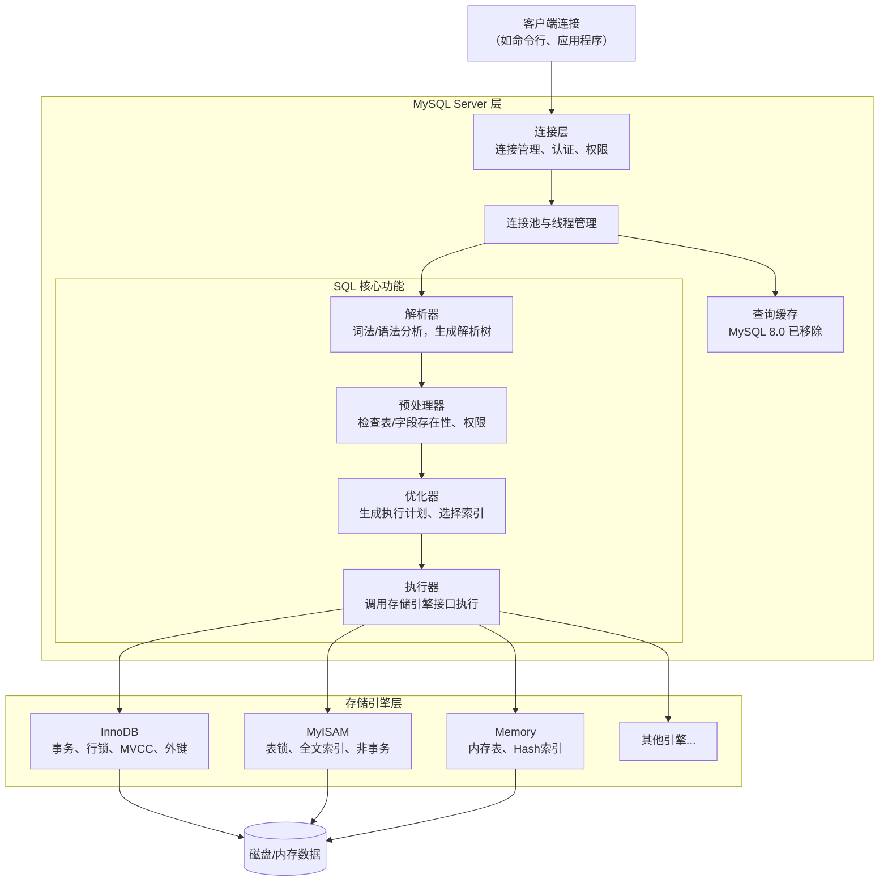
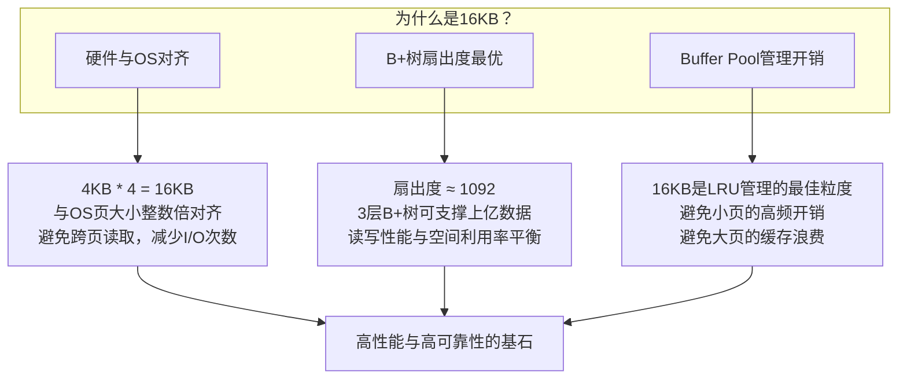
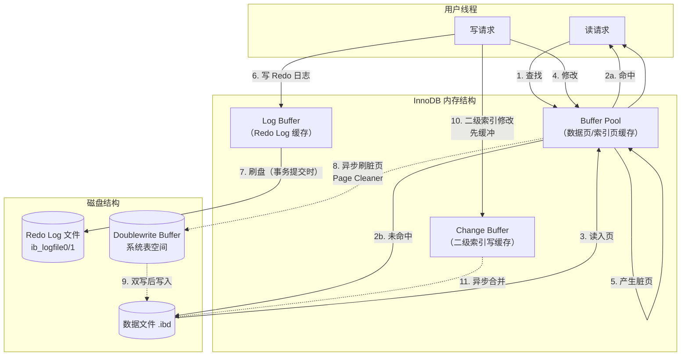
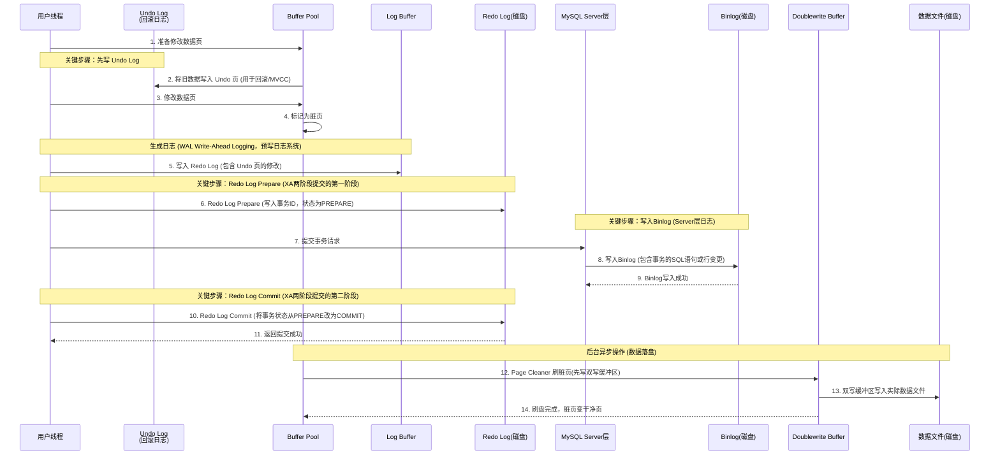
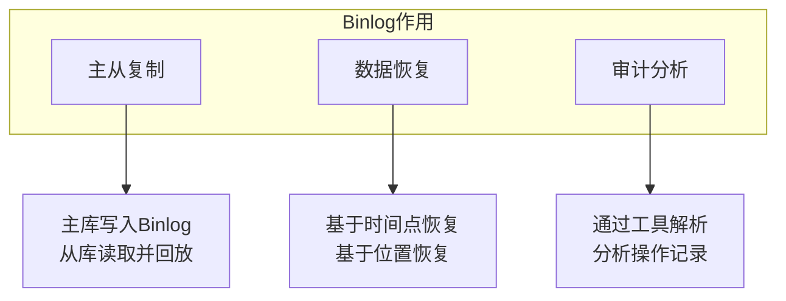
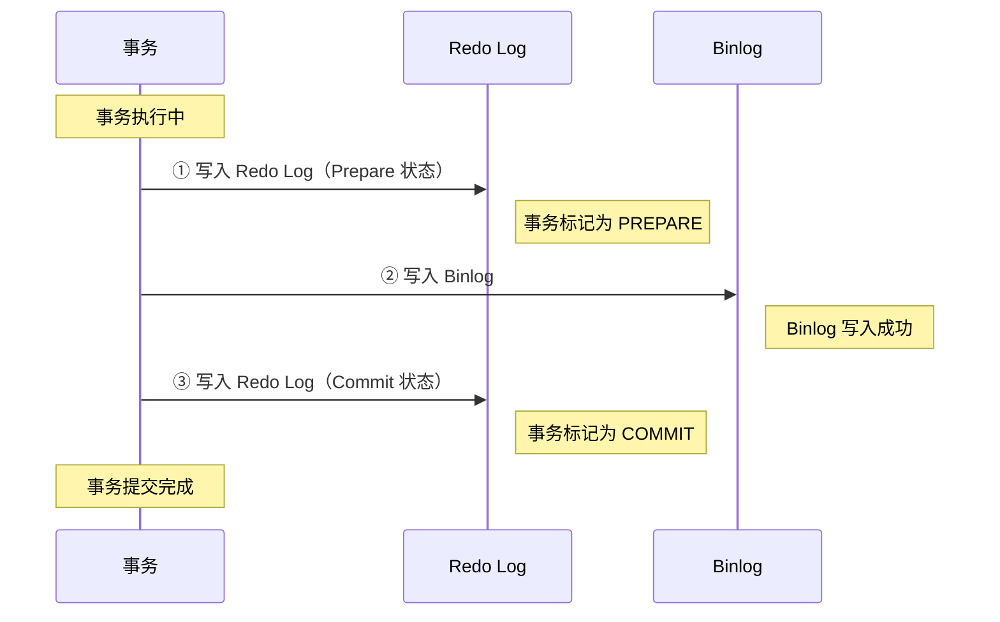
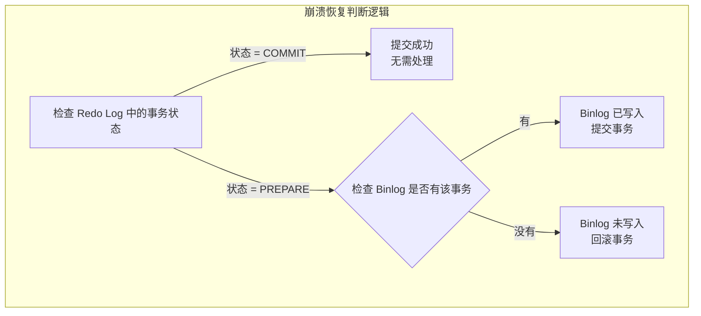
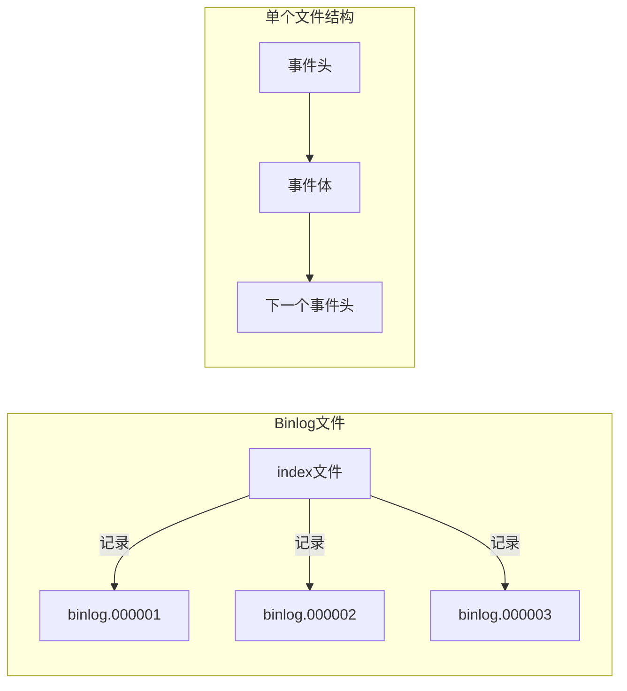
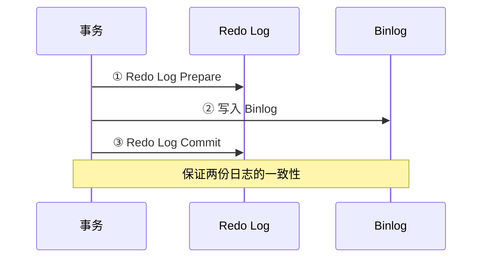
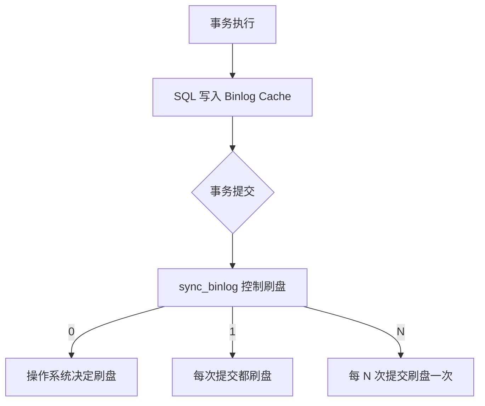

# 基本架构

官方文档: <https://dev.mysql.com/doc/refman/8.0/en/>

MySQL 是一个开源的关系型数据库管理系统, 是一个用来持久化存储数据、并能高效查询的系统软件

MySQL 的基本架构从客户端到存储引擎主要分为三层，整体设计采用插件式存储引擎架构。

MySQL是一个单进程多线程的模型, 客户端每多一个连接, 服务端就会多一个线程, 默认的链接超时时间是28800(8个小时, 交互式链接和非交互式都一样) 

最大的连接数默认是151, 通过max\_connections设置 

查询超时时间默认是0 就是不超时, 可以通过设置 max\_execution\_time设置




## 连接层

*   职责：管理客户端连接、认证用户身份、分配线程（1 连接 1 线程）。
*   核心参数：`max_connections`（最大连接数）、`wait_timeout`（空闲超时）。

## SQL 处理层（Server 层）

这一层与存储引擎无关，负责 SQL 的解析、优化和执行。

*   解析器：检查 SQL 语法，生成解析树。流程图如下：


*   预处理器：检查解析树中的表和字段是否存在、解析权限。同时可以预防SQL注入。
*   优化器：决定使用哪个索引、表的连接顺序、生成执行计划。
*   执行器：根据执行计划，逐条调用存储引擎提供的接口来读写数据。与存储引擎交互返回结果。

> 注意：查询缓存已在 MySQL 8.0 中移除，因为高并发下弊大于利。因为如果SQL语句进行了变化 哪怕是大小写或者多了一个空格 都会直接失效 同时数据库变动也会删除缓存

## 存储引擎层

存储引擎负责数据的存储、提取、事务管理。MySQL 采用插件式架构，常用引擎包括：

| 引擎           | 关键特性                         | 锁粒度 | 事务 | 适用场景         |
| :------------- | :------------------------------- | :----- | :--- | :--------------- |
| InnoDB（默认） | 支持 ACID 事务、行锁、MVCC、外键 | 行级   | ✅    | 大多数 OLTP 系统 |
| MyISAM         | 不支持事务，适合只读或大量查询   | 表级   | ❌    | 日志、分析表     |
| Memory         | 数据存储在内存，重启丢失         | 表级   | ❌    | 临时表、缓存     |

## 数据物理存储

*   InnoDB：数据存储在表空间（`.ibd` 文件），默认每表一个表空间（`innodb_file_per_table=ON`）。
*   MyISAM：每张表对应三个文件（`.frm` 表结构，`.MYD` 数据，`.MYI` 索引）。
*   Redo Log：InnoDB 特有的崩溃恢复机制，记录数据变更。
*   Undo Log：用于事务回滚和 MVCC（多版本并发控制）。

# InnoDB存储引擎

InnoDB 是一个面向事务、支持高并发、具备崩溃恢复能力的存储引擎架构。它与 MySQL Server 层通过句柄（handler）接口交互，内部划分为内存结构和磁盘结构两大部分。


## 数据存储架构

### 逻辑层级

| 层次                    | 说明                                                         |
| :---------------------- | :----------------------------------------------------------- |
| **Database**            | 一个库包含多张表                                             |
| **Table（索引组织表）** | 表必须有一个**显式主键**；若未定义，InnoDB 会自动选择/生成一个隐藏主键（6字节的 row\_id） |
| **Row（记录）**         | 每行包含事务 ID、回滚指针等隐藏字段                          |

### 物理存储层级

#### ① 表空间（Tablespace）

*   对应磁盘文件：`.ibd`（默认每表一个独立表空间，`innodb_file_per_table=ON`）
*   包含：数据、索引、插入缓冲、回滚信息等

#### ②段（Segment）

*   数据段（B+ 树的叶子节点）
*   索引段（B+ 树的非叶子节点）
*   回滚段（存储 undo log）

> 一个表空间可以有多个段，一个段属于一个表。用于更好的管理区。

#### ③ 区（Extent）

*   大小：1MB = 64 个连续页（16KB × 64）
*   为什么需要区：避免随机 I/O，连续分配可提升顺序读写性能
*   注意：小表可能不会立即分配完整区（使用碎片页）

> 区相当于是页的一个分组, 一个区最少有4个页

#### ④ 页（Page，默认 16KB）

*   InnoDB 的最小 I/O 单位（每次磁盘读写至少一个页）
*   页大小可通过 `innodb_page_size` 设置（4KB / 8KB / 16KB / 32KB / 64KB）


### 页的内部结构

每个 16KB 的页包含以下部分：

| 区域                   | 大小     | 说明                                                         |
| :--------------------- | :------- | :----------------------------------------------------------- |
| **File Header**        | 38 字节  | 页类型、页号、上一页/下一页指针（用于双向链表）、校验和、LSN |
| **Page Header**        | 56 字节  | 槽数量、页内记录数、最大事务 ID 等                           |
| **Infimum + Supremum** | 26 字节  | 虚拟记录：最小记录和最大记录（用于页内范围判断）             |
| **User Records**       | 动态增长 | 实际存储的行数据（按主键顺序排列）                           |
| **Free Space**         | 动态     | 空闲空间（用于插入新记录）                                   |
| **Page Directory**     | 动态     | 槽（每个槽指向一组记录的指针），用于二分查找定位记录         |
| **File Trailer**       | 8 字节   | 校验和 + LSN（用于检查页是否完整写入）                       |

> 关键点：Page Directory 使页内查找复杂度为 O(log n)，而不是全页扫描。

#### innodb为什么最小单位页是16KB



#### 硬件与操作系统的“对齐”效应

这是最底层的考量，目的是为了获得最佳的I/O性能。

*   与操作系统页大小对齐：主流操作系统（如 Linux）的默认页大小是 4KB。InnoDB 的 16KB 正好是其 4 倍。这意味着，InnoDB 读取一个数据页，在操作系统层面就是一个连续的、顺序的 4 次I/O操作。这种整数倍对齐能有效减少磁盘寻道时间，避免跨页读取带来的额外开销。
*   适配文件系统和硬件：16KB 也正好是传统机械硬盘 512 字节扇区的 32 倍，同时与现代 SSD 的页大小（通常在 4KB 到 16KB 之间）完美契合，有助于减少“写放大”效应，延长 SSD 的使用寿命。

#### B+树索引的“扇出度”计算

InnoDB 使用 B+ 树作为索引结构，而页大小直接决定了 B+ 树中每个节点能存储多少个“键值+指针”，即扇出度（Fan-out）。扇出度越高，树的层级就越少，查询所需的磁盘 I/O 次数也就越少。

| 页大小   | 扇出度（估算） | 三层B+树可存储数据量 |
| :------- | :------------- | :------------------- |
| 4KB      | 约 270         | 约 200 万条          |
| **16KB** | **约 1092**    | **约 1.3 亿条**      |
| 64KB     | 约 4368        | 约 10 亿条           |

扇出度 = 每个索引页能存储的（键值 + 子页指针）的数量。

| 参数          | 值                    | 说明                                           |
| :------------ | :-------------------- | :--------------------------------------------- |
| 页大小        | 16KB = **16384 字节** | InnoDB 默认                                    |
| 主键类型      | BIGINT（8 字节）      | 最常见的选择                                   |
| 子页指针      | 6 字节                | InnoDB 内部页号（32位）+ 偏移量                |
| 页头/页尾开销 | 约 128 字节           | 包含 File Header、Page Header、File Trailer 等 |

如果页大小是16KB, 那么扇出度就是 (16384 - 128) / (8+6) = 1161, 考虑了更多内部碎片、槽目录等开销, MySQL一般认为这个值为1092

#### B+ 树的容量计算

B+ 树的结构：

*   根节点：1 个页
*   第二层（内部节点）：等于根节点的扇出度（每个根节点条目指向一个子页）
*   第三层（叶子节点）：等于第二层总页数 × 每个叶子节点的扇出度

叶子节点的特殊之处：叶子节点存储的是完整行数据（聚簇索引），而不是“键+指针”。所以叶子节点的扇出度 = 每个数据页能存储的行数。

假设每行数据约 200 字节（常见行大小，包含隐藏列）：16384 - 128 / 200 = 81, 也就是一个叶子结点可以存200行数据

#### 三层 B+ 树的总容量

| 层级           | 页数   | 每个页的条目数             | 总条目数                         |
| :------------- | :----- | :------------------------- | :------------------------------- |
| 根节点         | 1      | 1092（指向第二层的指针）   | 1092                             |
| 第二层         | 1092   | 1092（指向叶子节点的指针） | 1092 × 1092 ≈ 119 万             |
| 第三层（叶子） | 119 万 | 81（每页存储的行数）       | 119 万 × 81 ≈ **9640 万 ≈ 1 亿** |

如果每行数据更小（比如 100 字节），每页可存约 162 行，总容量可达 1.9 亿。所以一般单表在1亿以内的数据不需要考虑分表操作。

#### Buffer Pool 的管理开销

Buffer Pool 是 InnoDB 的内存缓存区，它使用 LRU（最近最少使用）算法来管理这些 16KB 的数据页。

*   页太小（如 4KB）：为了缓存同样多的数据，需要管理的页数量会增加 4 倍。这会直接导致 LRU 链表变长，增加内存管理的开销和锁竞争。
*   页太大（如 64KB）：管理开销小了，但缓存粒度太粗。例如，你可能只需要读取一行数据（几百字节），却不得不加载整个 64KB 的页，这会大大降低 Buffer Pool 的命中率

16KB 的页大小，被证明是一个能有效控制 LRU 管理成本，同时保持良好缓存粒度的理想值

#### 大字段超过了16KB是怎么存储的

假设有一个1GB大小的LONGTEXT, InnoDB 的数据页默认只有 16KB，显然放不下 1G 的数据。它的处理策略取决于行格式（Row Format）。

InnoDB 存储引擎处理大字段的核心机制——溢出页（Off-Page） 存储, 1G 的大字段数据并不会被直接塞进那个 16KB 的数据页里，而是被拆分成多个 16KB 的片段，存储在独立的“溢出页”中，原本的数据页里只留下一个指向这些溢出页的指针（20字节）

存储规则（以 MySQL 5.7+ 默认的 DYNAMIC 格式为例）, 当你的 LONGBLOB 或 LONGTEXT 字段超过数据页大小时：

*   聚簇索引页：原本用于存储整行数据的 16KB 页里，不再存储大字段的实际内容。取而代之，InnoDB 会在该行中保留一个 20 字节的指针。
*   溢出页：这个大字段的真实数据会被分割成若干个 16KB 的数据块。
*   存储位置：这些 16KB 的数据块被存放在独立的溢出页中。这些溢出页通过指针构成一个单向链表，方便顺序读取。他们不在原来的B+树中存储, 而是一块磁盘的单独空间。

```code
[ 聚簇索引页 (16KB) ]
+-------------------------------+      +-------------------+
| 其他列 (id, name, age...)     |      | 溢出页 (16KB)      |
| +---------------------------+ |      | +---------------+ |
| | LONGBLOB 列:              | |      | | BLOB 数据块 1 | |
| | [20字节指针] ------------- | |-----> | | (16KB)        | |
| | (指向第一个溢出页)         | |      | +---------------+ |
| +---------------------------+ |      +-------------------+
+-------------------------------+                 |
                                                  | (链表指针)
                                                  v
                                           +-------------------+
                                           | 溢出页 (16KB)      |
                                           | +---------------+ |
                                           | | BLOB 数据块 2 | |
                                           | | (16KB)        | |
                                           | +---------------+ |
                                           +-------------------+
                                                  |
                                                 ...
                                                  |
                                                  v
                                           +-------------------+
                                           | 最后一个溢出页     |
                                           | (剩余数据)        |
                                           +-------------------+
```

#### 优化建议：

*   物理分离：将大字段单独存放到一张扩展表中，与主表高频查询的字段物理隔离。
*   避免 `SELECT *`：永远不要在需要查询其他字段的语句中附带返回这个大字段。
*   考虑对象存储：对于超过 1MB 的文件（如图片、视频），更推荐的做法是只在数据库中存储文件路径，文件本身放在对象存储（如 OSS）或文件系统中。

### 行记录格式

InnoDB 支持 4 种行格式，通过 ROW\_FORMAT 指定：

| 格式                | 特点                                 | 是否支持 BLOB 页外存储 | 默认版本        |
| :------------------ | :----------------------------------- | :--------------------- | :-------------- |
| **Redundant**       | 古老格式，占用空间大                 | 否                     | MySQL 5.0 之前  |
| **Compact**         | 变长字段列表 + NULL 标志位，节省空间 | 是                     | MySQL 5.0/5.1   |
| **Dynamic**（常用） | Compact 升级版，长字段完全页外存储   | 是（BLOB 单独页）      | MySQL 5.7+ 默认 |
| **Compressed**      | 类似 Dynamic，但支持压缩（zlib）     | 是                     | 用于节省存储    |

行记录头部（以 Dynamic 为例）

*   变长字段长度列表（如 VARCHAR(10) 实际长度）
*   NULL 标志位
*   记录头信息（5 字节）：包含删除标志、下一记录指针、记录类型等
*   隐藏列：

    *   `DB_ROW_ID`（6 字节，无主键时自动生成）
    *   `DB_TRX_ID`（6 字节，最近修改的事务 ID）
    *   `DB_ROLL_PTR`（7 字节，指向 undo log）

### B+ 树索引与数据存储的关系

#### InnoDB 的主键索引就是聚簇索引：

*   叶子节点：存储完整的行记录（包含所有字段）
*   非叶子节点：仅存储主键值 + 指向子页的指针

#### 二级索引（普通索引）：

*   叶子节点存储：索引列 + 主键值
*   需要通过主键回表查询完整行

> 在 InnoDB 中，先通过二级索引（非主键索引）找到主键值，再根据这个主键值去聚簇索引中查找完整行记录的过程。这个需要两次 B+ 树查找的过程，称为“回表”。

## 内存架构

### ①Buffer Pool（缓冲池，核心组件）

*   作用：缓存磁盘上的数据页和索引页，减少磁盘 I/O。
*   结构：以 16KB 的页为单位，通过LRU 算法管理（Midpoint Insertion Strategy，防止全表扫描污染缓存）。
*   大小：默认 128MB，通常建议设置为物理内存的 50%\~80%（`innodb_buffer_pool_size`）。
*   特性：支持多个 Buffer Pool Instance（`innodb_buffer_pool_instances `将 Buffer Pool（缓冲池）这个大内存区域划分成几个独立的小实例）减少锁竞争。用于异步刷脏，默认是 8, 最大值64。`innodb_buffer_pool_size` > 1GB生效， 如果size不设置默认就是1。8.0版本之后自动计算。

innoDB的缓存区(Buffer Pool) 是基于HashMap的双向链表 链表中存放的是指向数据页的指针， 缓存淘汰策略是使用了冷热分离的LRU策略 (最近最少使用淘汰)

#### Buffer Pool 内存管理

假设我们要获取数据, 有这样一条SQL数据

```sql
select * from user where id = 2;
```

这个时候mysql因为最小的跟磁盘交互单位是页, 16kb, 因为mysql有数据预读的概念, 会将整个数据页的内容都加载到内存中. 这个时候可能会同时加载id 1, 2, 3, 4, 5, 6, 7, 8条数据, 这些数据有些可能用到, 有些可能用不到, 所以就需要一个缓存淘汰机制来处理

区别于传统的LRU策略, Mysql使用了冷热分离的LRU策略 (最近最少使用淘汰)


##### 数据结构

Buffer Pool 的 LRU 链表被分成两部分：

| 部分                 | 比例（默认）  | 说明                         |
| :------------------- | :------------ | :--------------------------- |
| **Young 区（热区）** | 5/8（约 63%） | 存储频繁访问的热点数据页     |
| **Old 区（冷区）**   | 3/8（约 37%） | 存储新加载或访问较少的数据页 |

> 默认分界点：3/8 处（由 `innodb_old_blocks_pct` 控制，默认 37）

##### 访问规则

1.  页首次被读入：插入到 Old 区头部
2.  Old 区中的页被再次访问：如果距离上次访问超过一定时间，晋升到 Young 区头部
3.  Young 区中的页被访问：移动到 Young 区头部
4.  淘汰：从 Old 区尾部淘汰（最冷的数据）

还可以通过设置 `innodb_old_blocks_time` 参数进行优化\:Old (冷) 区中的页必须存活超过这个时间，再次访问才能晋升到 Young 区, 默认值1000ms

    时间轴：
    t0: 页被读入 Old 区头部
    t1: 再次访问该页（如果 t1 - t0 < 1000ms）→ 不晋升，留在 Old 区
    t2: 再次访问（如果 t2 - t0 >= 1000ms）→ 晋升到 Young 区头部

好处：

*   防止一次性的预读或扫描操作把缓存污染
*   只有持续被访问的页才会成为热数据

### ② Log Buffer（日志缓冲区）

*   作用：缓存事务产生的 redo log 记录，定期写入磁盘的 redo log 文件。
*   刷盘策略（`innodb_flush_log_at_trx_commit`）：

    *   `0`：每秒刷一次，事务提交不保证持久性（最快）
    *   `1`：每次事务提交都刷盘（最安全，默认）
    *   `2`：每次事务提交写入 OS cache，每秒刷盘（折中）


### ③ Adaptive Hash Index（自适应哈希索引）

*   作用：InnoDB 自动判断哪些热点索引页适合用哈希索引加速（等值查询）。
*   特点：只存在于内存，由 InnoDB 自动维护，不可人为控制。

### ④ Change Buffer（写缓冲）

*   作用：**缓存对二级索引页的修改操作**（INSERT/UPDATE/DELETE），当该索引页被读入 Buffer Pool 时再合并（Merge）。
*   好处：减少随机 I/O，提升写性能。
*   适用场景：非唯一二级索引的写操作。
*   大小控制：`innodb_change_buffer_max_size`（默认占 Buffer Pool 的 **25**%）。

## 磁盘架构

### ① 表空间（Tablespace）

| 类型            | 文件                  | 说明                                                       |
| :-------------- | :-------------------- | :--------------------------------------------------------- |
| **系统表空间**  | `ibdata1`             | 存储数据字典、Undo log、Change Buffer、双写缓冲区          |
| **独立表空间**  | `表名.ibd`            | 每张表的数据和索引，默认开启（`innodb_file_per_table=ON`） |
| **通用表空间**  | 自定义                | 多张表共享，可放在不同磁盘路径                             |
| **临时表空间**  | `ibtmp1`              | 存储临时表数据                                             |
| **Undo 表空间** | `undo_001`/`undo_002` | MySQL 5.7+ 可将 Undo 独立出来（`innodb_undo_tablespaces`） |

### ② Redo Log（重做日志，保证持久性 D）

简单来说就是记录做了什么

*   作用：记录数据页的物理变更（如“将页 100 偏移量 200 处的值改为 5”）。
*   文件：默认两个文件循环写入 `ib_logfile0` / `ib_logfile1`。
*   写入流程：事务提交 → Log Buffer → OS cache → 磁盘 Redo Log。
*   Crash Recovery：重启时重放 Redo Log 中未刷盘的数据变更。
*   在旧版本中，Redo Log 的大小由文件个数乘以单个文件大小决定。
    *   默认配置：2 个文件，每个 48MB，总容量约 96MB。
    *   推荐范围：建议将总容量调整到 1GB \~ 4GB。
    *   修改限制：必须重启数据库才能生效，无法在线修改, 默认值非常小，是为了兼容老旧机械硬盘和低端设备而设的保守值。在现代服务器（SSD 固态硬盘）上，这会导致严重的性能问题：
    *   在 my.cnf 配置文件中调整以下参数：

```ini
innodb_log_file_size = 2G    # 每个文件大小
innodb_log_files_in_group = 2 # 文件个数，总容量 = 2G * 2 = 4GB
```

### ③ Undo Log（回滚日志，保证原子性 A 和 MVCC）

简单来说就是记录之前是什么

*   作用：

    *   事务回滚时恢复旧数据
    *   提供 MVCC 快照读（读取旧版本数据）
*   存储位置：默认在系统表空间，MySQL 5.7+ 可独立表空间。
*   清理：Purge Thread 异步删除不再需要的 Undo 记录。

### ④ Doublewrite Buffer（双写缓冲区，解决页断裂问题）

*   问题场景：写一个 16KB 页时，操作系统只写了 4KB 就崩溃（页断裂）。
*   解决方案：

    1.  先将页写入 Doublewrite Buffer（2MB 连续空间）
    2.  再写入实际数据文件
    3.  崩溃恢复时，先从 Doublewrite Buffer 检查页完整性
*   存储位置：系统表空间（`ibdata1`）中的 128 个页（2 个区）。
*   通过 innodb\_doublewrite\_files 设置

> MySQL 版本	存储位置	文件数量 (默认)	关键参数 8.0.20 及以后	独立文件 (如 #ib\_16384\_0.dblwr)	2 个 (通常情况)	innodb\_doublewrite\_files 8.0.20 之前 (如 5.7)	共享表空间 (ibdata1 文件内部)	0 个 (无独立文件)	innodb\_doublewrite

## 后台线程

| 线程                    | 职责                                                         |
| :---------------------- | :----------------------------------------------------------- |
| **Master Thread**       | 核心线程，异步执行刷脏页、合并 Change Buffer、Purge Undo 等操作 |
| **IO Thread**           | `read_thread` / `write_thread`（处理异步 I/O）               |
| **Purge Thread**        | 清理不再需要的 Undo 记录（减轻 Master Thread 负担）          |
| **Page Cleaner Thread** | 专门负责刷脏页（MySQL 5.6+，替代 Master Thread 部分职责）    |

## innodb内存和磁盘的交互逻辑

InnoDB 内存和磁盘的交互逻辑，核心是：以页为单位，通过 Buffer Pool 缓冲，用 Checkpoint 机制 + Redo Log 保证数据一致性，并结合后台线程异步完成数据落盘。



### 读操作流程（内存 → 磁盘）

```sql
// 用户执行：
SELECT * FROM user WHERE id = 100;
```

1.  页映射：InnoDB 将请求的行 `id=5`，定位到其所在的磁盘页号。
2.  内存查找：在 Buffer Pool 的哈希表中快速查找该页是否已存在。
3.  缓存命中：若存在，直接读取内存中的数据页，速度极快（纳秒级）。
4.  缓存未命中：

    *   在 Buffer Pool 中申请一个空闲页。

    *   发起一次随机磁盘 I/O，读取包含 `id=5` 的整个 16KB 页到该内存页。

    *   之后查询直接从内存返回。

    > 关键点：InnoDB 的 I/O 单位是页（默认 16KB），即使只查 1 行记录，也会把整页加载到内存。

### 写操作流程（内存 → 磁盘）

```sql
-- 用户执行：
UPDATE user SET balance = 100 WHERE id = 100;
```

#### 阶段一：内存中的操作

1.  将数据页读入 Buffer Pool（如果不在）, 如果仅修改二级索引, 那么会在**change buffer**中修改, 这里不进行读取。
2.  内存修改：在 Buffer Pool 中修改对应的数据页（**标记为脏页**）。
3.  记录 Redo Log：同时将此次修改操作追加写入 Redo Log Buffer。这是物理日志，仅记录“在某个页的某个偏移量做了什么修改”，体积很小。操作位置在 Log Buffer
4.  生成 Undo Log:  记录回滚日志
5.  提交事务：`commit` 时，通常只需将 Redo Log Buffer 刷新到磁盘的 Redo Log 文件。这一步是关键，它保证了事务的持久性，即使数据库崩溃，也能通过 Redo Log 恢复。
6.  后台刷盘：修改后的脏页并不会立即写回。InnoDB 的后台线程会择机将多个脏页批量写入磁盘，主要时机包括：

    *   Redo Log 文件空间快写满时（强制刷盘）。
    *   Buffer Pool 空间不足，需要淘汰旧页时。
    *   系统较空闲或定期 `checkpoint` 时。
    *   正常关闭时。

#### 阶段二：事务提交时的持久化

*   `innodb_flush_log_at_trx_commit = 1`（默认） 每次事务提交，Log Buffer 中的 Redo Log 立即刷盘
*   `innodb_flush_log_at_trx_commit = 0` 每秒刷一次，事务提交不等待（可能丢失 1 秒数据）
*   `innodb_flush_log_at_trx_commit = 2` 写入 OS cache，每秒刷盘（OS 崩溃可能丢失）

> 事务提交 → 强制 Log Buffer → Redo Log 文件（磁盘）→ 返回"提交成功", **此时数据页可能还是脏页**，仍在 Buffer Pool 中，并未写入数据文件。

#### 阶段三：异步刷脏页到磁盘

后台线程（Page Cleaner Thread）在以下时机刷脏页：

| 触发条件                                                     | 说明                   |
| :----------------------------------------------------------- | :--------------------- |
| 脏页比例在buffer pool中超过 `innodb_max_dirty_pages_pct`（默认 90%, 5.7之前是75%） | 加速刷盘               |
| Redo Log 文件写满                                            | 强制刷盘（会阻塞写入） |
| 空闲页不足（LRU 淘汰）                                       | 淘汰脏页前必须先刷盘   |
| 后台定期刷盘                                                 | 每秒/每10秒周期性执行  |

刷脏页的路径（Doublewrite 机制）：

防止页断裂（写一半断电），保证页完整性。

    Buffer Pool（脏页）
        ↓
    Doublewrite Buffer（2MB 连续空间，系统表空间）
        ↓
    实际数据文件（.ibd）

### Change Buffer：优化二级索引写入

```sql
UPDATE user SET city = '北京' WHERE age = 25;
```

如果 `age` 是二级索引，修改这个索引页时，该页可能不在 Buffer Pool 中。

#### Change Buffer 的优化

1.  目标二级索引页不在 Buffer Pool
2.  不立即从磁盘读取该页，而是把修改记录到 Change Buffer
3.  后续当该索引页被读入 Buffer Pool 时，再合并 Change Buffer 中的修改

好处：减少随机 I/O，批量合并。

限制：仅适用于非唯一二级索引（唯一索引需要检查唯一性，必须读页）。

### 完整写入时序图



> 当修改 Undo Log 页时，InnoDB 不会直接把这个页写回磁盘，而是先把“修改 Undo Log 页”这个操作记录到 Redo Log 中。Redo Log 落盘后，即使崩溃，也能通过重放 Redo Log 来重建刚才对 Undo Log 页的修改。

### WAL (Write-Ahead Logging，预写日志系统)

WAL（Write-Ahead Logging，预写日志） 是数据库系统中保证数据持久性和性能的核心技术。

它的核心思想非常简单：先写日志，再写数据。在修改磁盘上的实际数据文件之前，先将这次修改的详细记录（日志）写入磁盘上的日志文件中。

在innoDB中, 他的实现就是redoLog

几乎所有关系型数据库都使用 WAL（或类似机制）：

| 数据库             | 对应实现                       |
| :----------------- | :----------------------------- |
| **MySQL (InnoDB)** | Redo Log                       |
| **PostgreSQL**     | WAL（同名）                    |
| **SQL Server**     | Transaction Log（`.ldf` 文件） |
| **Oracle**         | Redo Log（在线重做日志）       |
| **SQLite**         | WAL 模式（可开启）             |

# BinLog

Binlog（Binary Log，二进制日志） 是 MySQL Server 层的日志，以二进制形式记录所有对数据产生变更的操作（如 INSERT、UPDATE、DELETE、DDL 等），主要用于主从复制和数据恢复。

## Binlog 的核心作用



*   主从复制  主库将 Binlog 发送给从库，从库回放实现数据同步
*   数据恢复  通过 `mysqlbinlog` 工具恢复误删除或误修改的数据
*   审计 解析 Binlog 分析历史操作记录

## Binlog在SQL中的执行位置



> Binlog 的写入发生在 Redo Log 的 Prepare 和 Commit 之间。通过对于Redo Log 的2次提交, 保证 Redo Log 和 Binlog 的逻辑一致性，确保崩溃恢复时数据不错不乱。

在服务崩溃时, 判断事务是否要提交条件如下:



1.  binlog无记录, redolog无记录 说明这是在写redolog之前就挂了 回滚操作即可
2.  binlog无记录 redolog有记录 状态为prepare 说明这是还没到binlog就挂了  回滚事务
3.  binlog有记录, redolog状态是prepare , 说明binlog已经写完了 事务可以提交了 这时提交记录
4.  2个日志都有记录 redolog状态为commit 说明这是正常完成的事务  不需要恢复

## Binlog 的三种格式

| 格式          | 英文   | 记录内容                  | 优点         | 缺点                                     |
| :------------ | :----- | :------------------------ | :----------- | :--------------------------------------- |
| **STATEMENT** | 语句级 | 记录执行的 SQL 语句       | 日志量小     | 部分函数（如 `NOW()`）可能导致主从不一致 |
| **ROW**       | 行级   | 记录每行数据的变更前后值  | 主从一致性好 | 日志量大                                 |
| **MIXED**     | 混合   | 自动选择 STATEMENT 或 ROW | 兼顾两者优点 | 较复杂                                   |

## Binlog 的文件结构



*   **binlog.index**  索引文件，记录所有 Binlog 文件列表
*   **binlog.000001** 具体的日志文件（编号递增）
*   **binlog.000002** 写满后自动切换

### 查看当前 Binlog 文件

```sql
-- 查看所有 Binlog 文件
SHOW BINARY LOGS;

-- 查看当前正在写入的文件
SHOW MASTER STATUS;
```

## Binlog 与 Redo Log 的区别

| 对比维度         | Binlog                       | Redo Log                 |
| :--------------- | :--------------------------- | :----------------------- |
| **所属层级**     | Server 层                    | InnoDB 引擎层            |
| **记录内容**     | 逻辑日志（SQL 语句或行变更） | 物理日志（页级别的修改） |
| **写入时机**     | 事务提交时写入               | 事务执行过程中持续写入   |
| **主要作用**     | 主从复制、数据恢复           | 崩溃恢复（保证持久性）   |
| **日志格式**     | STATEMENT / ROW / MIXED      | 物理重做日志             |
| **空间管理**     | 追加写，可配置过期时间       | 循环写，固定大小         |
| **是否区分引擎** | 所有引擎都支持               | 仅 InnoDB 支持           |

### 两者的协作（两阶段提交）



## Binlog 的写入机制



### sync\_binlog 参数详解

| 参数值 | 行为                   | 性能 | 安全性                  |
| :----- | :--------------------- | :--- | :---------------------- |
| **0**  | 由操作系统决定刷盘时机 | 最高 | 最低（宕机会丢日志）    |
| **1**  | 每次事务提交都刷盘     | 最低 | 最高（双1配置）         |
| **N**  | 每 N 次提交刷盘一次    | 中等 | 中等（可能丢 N 个事务） |

生产环境推荐：

```sql
-- 双1配置（数据最安全）
SET GLOBAL sync_binlog = 1;
SET GLOBAL innodb_flush_log_at_trx_commit = 1;
```

## Binlog 与主从复制


### 主从复制三种模式

| 模式           | 说明                   | 特点                 |
| :------------- | :--------------------- | :------------------- |
| **异步复制**   | 主库不等待从库确认     | 性能最好，可能丢数据 |
| **半同步复制** | 至少一个从库确认后提交 | 性能中等，数据更安全 |
| **全同步复制** | 所有从库确认后提交     | 性能最差，数据最安全 |

## Binlog 的配置参数

```ini
# my.cnf 配置示例

# 开启 Binlog
log_bin = /var/log/mysql/binlog.log

# Binlog 格式（建议 ROW）
binlog_format = ROW

# 过期天数（0 表示永不过期）
expire_logs_days = 7

# 单个文件最大大小
max_binlog_size = 1G

# 刷盘策略
sync_binlog = 1

# Binlog 缓存大小
binlog_cache_size = 32K

# 是否记录行镜像
binlog_row_image = FULL

# 开启组提交优化 MySQL 5.6+ 引入了 Binlog Group Commit（组提交），多个事务可以一起刷 Binlog，提升性能。
binlog_group_commit_sync_delay = 0
binlog_group_commit_sync_no_delay_count = 0
```

## Binlog 文件的清理机制

### 自动清理（按时间过期）

```sql
-- 设置 Binlog 保留天数（默认 0 表示不过期，但通常生产环境会设置）
SET GLOBAL expire_logs_days = 7;        -- MySQL 5.7
SET GLOBAL binlog_expire_logs_seconds = 604800;  -- MySQL 8.0（秒）
```

```ini
# my.cnf 配置
expire_logs_days = 7           # 保留 7 天
# 或
binlog_expire_logs_seconds = 604800   # 保留 7 天（秒）
```

清理逻辑：MySQL 在启动和每次刷新日志时，会删除超过过期时间的 Binlog 文件。

### 手动删除

```sql
-- 删除所有 Binlog（重置，谨慎使用）
RESET MASTER;

-- 删除到指定文件之前（保留 binlog.000005 及之后）
PURGE BINARY LOGS TO 'binlog.000005';

-- 按时间删除
PURGE BINARY LOGS BEFORE '2024-01-01 00:00:00';
```