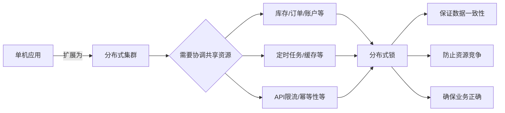

# 分布式锁

分布式锁是从单机走向分布式架构后，为解决跨进程并发问题而产生的必要机制，没有它就无法保证分布式系统的数据一致性和业务正确性。



```java
// 单机环境 - 没有问题
public class OrderService {
    private int stock = 100;  // 共享资源
    
    public synchronized void deductStock() {  // JVM层锁
        if (stock > 0) {
            stock--;
        }
    }
}

// 或者使用ReentrantLock
private final Lock lock = new ReentrantLock();
public void deductStock() {
    lock.lock();
    try {
        if (stock > 0) stock--;
    } finally {
        lock.unlock();
    }
}
```

当应用从单机扩展到分布式集群时，情况彻底改变

```java
// 错误示例 - 单机锁在分布式下失效
public class StockService {
    private int stock = 100;  // 数据库中的库存
    
    // 在每台服务器上都运行这个方法
    public synchronized void deductStock() {  // ❌ 只能锁住本机
        if (stock > 0) {
            stock--;  // 多台服务器同时执行，导致超卖
            updateDatabase(stock);
        }
    }
}
```

## 典型需要分布式锁的场景

### 库存扣减（电商秒杀）

```java
public class StockService {
    
    public void deductStock(Long productId, int quantity) {
        // 分布式锁 - 所有服务器竞争同一把锁
        RLock lock = redisson.getLock("stock:product:" + productId);
        
        if (lock.tryLock(3, 10, TimeUnit.SECONDS)) {
            try {
                // 只有获得锁的服务器才能执行
                int stock = getStockFromDB(productId);
                if (stock >= quantity) {
                    updateStockInDB(productId, stock - quantity);
                    log.info("扣减成功，剩余库存：{}", stock - quantity);
                }
            } finally {
                lock.unlock();
            }
        } else {
            log.error("获取锁失败，请重试");
        }
    }
}
```

### 重复请求处理（幂等性）

用户点击支付按钮，网络延迟导致重复提交

```java
// 问题：同一个订单被支付两次
用户请求1 → 服务器A → 扣款100元 ✅
用户请求2 → 服务器B → 再次扣款100元 ❌ 重复扣款！

// 使用分布式锁防止重复
public class PaymentService {
    
    public void pay(Long orderId, BigDecimal amount) {
        String lockKey = "payment:order:" + orderId;
        RLock lock = redisson.getLock(lockKey);
        
        // 同一订单同时只能有一个支付请求处理
        if (lock.tryLock(0, 30, TimeUnit.SECONDS)) {
            try {
                // 检查订单是否已支付
                if (order.getStatus() == OrderStatus.PAID) {
                    return;
                }
                // 执行支付
                doPay(orderId, amount);
            } finally {
                lock.unlock();
            }
        } else {
            throw new RuntimeException("订单正在处理中");
        }
    }
}
```

### 定时任务重复执行 

凌晨统计报表，只希望集群中有一台服务器执行

```java
// 错误：三台服务器都会执行定时任务
@Component
public class ReportJob {
    
    @Scheduled(cron = "0 0 2 * * ?")  // 每天凌晨2点
    public void generateDailyReport() {
        // ❌ 三台服务器同时执行，生成三份重复报表
        // 浪费资源，数据重复
        reportService.generateReport();
    }
}

// 正确：使用分布式锁保证只执行一次
@Component
public class ReportJob {
    
    @Autowired
    private RedissonClient redisson;
    
    @Scheduled(cron = "0 0 2 * * ?")
    public void generateDailyReport() {
        RLock lock = redisson.getLock("job:daily:report");
        
        // 尝试获取锁，最多等待0秒，锁有效期10分钟
        if (lock.tryLock(0, 600, TimeUnit.SECONDS)) {
            try {
                log.info("获取到锁，开始生成报表");
                reportService.generateReport();
            } finally {
                lock.unlock();
                log.info("报表生成完成，释放锁");
            }
        } else {
            log.info("未获取到锁，跳过执行");
        }
    }
}
```

### 分布式事务协调 

跨服务的数据一致性操作 用户下单流程：扣库存 + 创建订单 + 扣余额

```java
// 用户下单流程：扣库存 + 创建订单 + 扣余额
public class OrderService {
    
    public void createOrder(OrderRequest request) {
        // 全局分布式锁，锁住整个下单流程
        RLock lock = redisson.getLock("global:order:" + request.getUserId());
        
        if (lock.tryLock(5, 30, TimeUnit.SECONDS)) {
            try {
                // 1. 扣减库存（调用库存服务）
                stockService.deductStock(request.getProductId(), 1);
                
                // 2. 创建订单（本地操作）
                orderDao.insert(order);
                
                // 3. 扣减余额（调用账户服务）
                accountService.deductBalance(request.getUserId(), order.getAmount());
                
                // 4. 发送消息（MQ）
                mqService.sendOrderMessage(order);
                
            } catch (Exception e) {
                // 异常处理，可能需要补偿
                transactionCompensation();
            } finally {
                lock.unlock();
            }
        }
    }
}
```

### 资源限流与保护

保护下游脆弱系统，限制最大并发数

```java
// 限制同时调用第三方API的并发数不超过10
@Service
public class ThirdPartyService {
    
    @Autowired
    private RedissonClient redisson;
    
    @Autowired
    private RestTemplate restTemplate;
    
    // 信号量名称（在Redis中作为key）
    private static final String SEMAPHORE_KEY = "api:concurrent:limit";
    
    public String callApi(String param) {
        // 获取信号量对象
        RSemaphore semaphore = redisson.getSemaphore(SEMAPHORE_KEY);
        
        // 初始化信号量（只在第一次调用时需要，设置最大并发数为10）
        // 注意：这个操作应该在应用启动时执行一次
        semaphore.trySetPermits(10);
        
        try {
            // 尝试获取1个许可，最多等待5秒
            if (semaphore.tryAcquire(1, 5, TimeUnit.SECONDS)) {
                // 获取到许可，调用第三方API
                log.info("获取到许可，当前可用许可数：{}", semaphore.availablePermits());
                return restTemplate.postForObject("https://api.example.com", param, String.class);
            } else {
                // 超时未获取到许可
                log.warn("获取许可超时，系统繁忙");
                throw new RuntimeException("系统繁忙，请稍后重试");
            }
        } catch (InterruptedException e) {
            Thread.currentThread().interrupt();
            throw new RuntimeException("被中断", e);
        } finally {
            // 释放许可（一定要在finally中释放）
            semaphore.release();
            log.info("释放许可，当前可用许可数：{}", semaphore.availablePermits());
        }
    }
}
```

### 缓存击穿保护

热点数据缓存失效，大量请求同时打到DB

```java
// 缓存击穿问题
public class ProductService {
    
    public Product getProduct(Long id) {
        // 1. 从缓存获取
        Product product = redis.get("product:" + id);
        if (product != null) {
            return product;
        }
        
        // 2. 缓存失效，多个请求同时到达这里
        // 使用分布式锁，只让一个请求去查DB
        RLock lock = redisson.getLock("cache:product:" + id);
        
        if (lock.tryLock(0, 10, TimeUnit.SECONDS)) {
            try {
                // Double Check
                product = redis.get("product:" + id);
                if (product != null) {
                    return product;
                }
                
                // 查询数据库
                product = productDao.selectById(id);
                // 更新缓存
                redis.set("product:" + id, product, 3600, TimeUnit.SECONDS);
                
            } finally {
                lock.unlock();
            }
        } else {
            // 等待锁的线程稍后重试
            Thread.sleep(100);
            return getProduct(id);
        }
        return product;
    }
}
```

# Redis实现分布式锁

Redis分布式锁的核心思想是：利用Redis的原子操作，让多个客户端竞争同一个key，只有成功设置key的客户端才能获得锁。

## 基本流程

    ┌─────────────┐      SET NX PX      ┌─────────────┐
    │   客户端A    │ ──────────────────> │             │
    └─────────────┘      成功获取锁       │    Redis    │
                                          │             │
    ┌─────────────┐      SET NX PX      │   (Key存在)  │
    │   客户端B    │ ──────────────────> │             │
    └─────────────┘      失败，等待       └─────────────┘

## 标准实现方案

### 加锁：SET命令原子操作

使用SET key value NX PX milliseconds命令，一条指令完成三个动作：判断key不存在、设置值、设置过期时间。

```bash
# 加锁命令
SET lock:order:001 550e8400-e29b-41d4-a716-446655440000 NX PX 30000
```

参数说明：

*   `NX`：只有当key不存在时才设置（Not eXists），保证互斥性
*   `PX`：设置过期时间（毫秒），防止死锁
*   `value`：必须全局唯一，用于安全释放锁

### 解锁：Lua脚本保证原子性

释放锁需要三步操作：获取值 → 校验身份 → 删除key。这三步必须原子执行，否则可能误删其他客户端的锁。

```lua
-- unlock.lua
-- 第1行：判断锁的值是否匹配
if redis.call("get", KEYS[1]) == ARGV[1] then
    -- 第2行：匹配成功，删除锁
    return redis.call("del", KEYS[1])
else
    -- 第3行：匹配失败，返回0（表示未删除任何键）
    return 0
end

# Redis命令行调用
redis-cli --eval unlock.lua lock:order:001 , 550e8400-e29b-41d4-a716-446655440000
#                脚本文件    KEYS[1]      分隔符  ARGV[1]

# 注意：KEYS和ARGV之间用逗号+空格分隔
```

## SET NX分布式锁的缺点

### 主从切换导致锁失效（最严重）

    时间线（T表示毫秒级时间点）：
    
    T0: Redis主节点(Master)正常运行
    T1: 客户端A向Master请求锁，成功获取
         Master: SET lock:order:001 uuid-A NX PX 30000 ✅
         
    T2: Master异步同步锁数据到Slave（存在延迟窗口）
         此时Slave上还没有锁数据
         
    T3: Master突然宕机 ❌
         
    T4: 哨兵检测到Master下线，将Slave提升为新Master
         Slave（新Master）: 仍然没有锁数据
         
    T5: 客户端B向新Master请求同一把锁
         新Master: SET lock:order:001 uuid-B NX PX 30000 ✅
         客户端B成功获得锁！
         
    T6: 客户端A和客户端B同时持有锁 → 互斥性被破坏！

*   两个客户端同时获得锁，同时操作共享资源
*   可能导致数据不一致、重复扣款、库存超卖等严重问题
*   这是CAP理论中AP系统（Redis）的固有问题

### 锁过期误删正在执行的业务

    // 业务执行时间超过锁过期时间
    客户端A: 获取锁成功（过期时间30秒）
    客户端A: 开始执行业务（预计耗时25秒，实际因GC、网络等原因耗时40秒）
    
    时间线：
    0秒:  客户端A获得锁
    30秒: 锁自动过期，Redis删除锁
    35秒: 客户端B获得锁（此时A还在执行）
    40秒: 客户端A执行完毕，调用unlock()
          由于Lua脚本校验了value，发现锁值不匹配（锁已被B的value覆盖）
          unlock失败 ✅（这里其实是安全的）
    
    但问题在于：如果客户端A没有用Lua脚本，直接DEL会误删B的锁 ❌

*   锁过期时间难以精确设置（业务执行时间不确定）
*   GC停顿、网络延迟等不可控因素

### 不可重入

同一个线程无法重复获取同一把锁，导致自死锁。

```java
public class ServiceA {
    private RedisDistributedLock lock = new RedisDistributedLock("resource");
    
    public void methodA() {
        if (lock.tryLock()) {  // 第一次获取锁
            try {
                methodB();      // 调用methodB
            } finally {
                lock.unlock();
            }
        }
    }
    
    public void methodB() {
        if (lock.tryLock()) {  // 第二次获取同一把锁
            try {
                // 业务逻辑
            } finally {
                lock.unlock();
            }
        }
    }
}

// 结果：methodB永远获取不到锁，线程死锁！
```

*   递归调用无法使用
*   同一线程内多个方法需要同一把锁时，必须重新设计
*   代码可维护性差

### 不支持阻塞等待

单机SET NX只能非阻塞获取锁，获取失败立即返回false。

```java
// 场景：需要等待锁的场景
while(true) {
    if(lock.tryLock()) {
        // 成功
        break;
    }
    // 失败，需要自旋等待
    Thread.sleep(100); // 问题：空转消耗CPU，等待时间难控制
}
```

*   无法设置超时等待时间
*   自旋等待浪费CPU资源
*   可能造成"惊群效应"（多个线程同时醒来争抢锁）

### 无自动续期机制

锁过期时间固定，无法根据业务执行时间动态调整

```java
// 业务执行时间不确定的场景
lock.tryLock(); // 设置30秒过期

// 场景1：业务快速执行（10毫秒）
// 锁很快释放，没问题

// 场景2：业务慢速执行（3秒）
// 也没问题

// 场景3：业务执行时间不确定（可能30秒，也可能60秒）
if (someCondition) {
    Thread.sleep(40000); // 超过30秒，锁提前过期
}
// 问题：锁提前释放，但业务还在执行
```

*   锁过期时间设置太短：业务未完成锁就释放
*   锁过期时间设置太长：宕机时锁长时间不释放

## SET NX的核心问题：

*   主从切换锁失效（最致命）
*   锁过期误删（实现不规范时）
*   不可重入（导致自死锁）
*   无自动续期（过期时间难设置）
*   不支持阻塞（需要自旋等待）

一句话总结：单机SET NX只适合低并发、可容忍错误、业务幂等的场景，绝不能用于金融交易、库存扣减等强一致性业务。生产环境推荐使用Redisson或ZooKeeper

# Redisson 实现原理深度剖析

Redisson的可重入分布式锁是其最核心的功能之一，它通过Redis Hash数据结构 + Lua脚本原子操作 + WatchDog自动续期 + PubSub阻塞唤醒四大技术，完美实现了与JUC ReentrantLock 类似的语义

## 核心数据结构：Redis Hash

Redisson在Redis中存储锁时，使用了Hash数据结构，这是实现可重入的基础

```bash
# Redis中的存储结构
key: "myLock"
field: "uuid:threadId"   # 例如: "e0f5b2a0-3c4e-4d8a-9b2c-1d3e5f7g8h9i:45"
value: 3                  # 重入次数
```

字段说明：

*   锁的Key：由用户指定的锁名称（如"myLock"）
*   Field：`客户端ID(UUID) + 线程ID`的组合，唯一标识一个持有锁的线程
*   Value：该线程的重入次数（每次重入+1，释放时-1）

这种设计使得：

*   不同客户端/线程通过不同的field区分
*   同一个线程重复加锁时只需增加value
*   可以精确判断当前锁被谁持有

## 加锁流程与Lua脚本

Redisson加锁的核心是执行一段Lua脚本，保证多个操作的原子性

```lua
-- KEYS[1]: 锁的名称
-- ARGV[1]: 锁的过期时间（默认30秒）
-- ARGV[2]: 客户端标识（UUID + ":" + 线程ID）

-- 分支1：锁不存在，直接获取
if (redis.call('exists', KEYS[1]) == 0) then 
    redis.call('hincrby', KEYS[1], ARGV[2], 1);  -- 初始化hash，重入次数=1
    redis.call('pexpire', KEYS[1], ARGV[1]);      -- 设置过期时间
    return nil;                                    -- nil表示获取成功
end;

-- 分支2：锁存在且是当前线程，重入
if (redis.call('hexists', KEYS[1], ARGV[2]) == 1) then 
    redis.call('hincrby', KEYS[1], ARGV[2], 1);    -- 重入次数+1
    redis.call('pexpire', KEYS[1], ARGV[1]);       -- 刷新过期时间
    return nil;                                    -- nil表示获取成功
end;

-- 分支3：其他线程持有锁，返回锁的剩余过期时间
return redis.call('pttl', KEYS[1]);
```

## 加锁流程时序图

    ┌─────────────┐          ┌─────────┐          ┌─────────────────┐
    │   客户端A    │          │  Redis  │          │   客户端B        │
    └──────┬──────┘          └────┬────┘          └────────┬────────┘
           │                      │                        │
           │ 执行Lua脚本：exists=0 │                        │
           │ hset myLock uuidA:1 1│                        │
           │ pexpire myLock 30000 │                        │
           ├─────────────────────>│                        │
           │    返回 nil(成功)     │                        │
           │<─────────────────────┤                        │
           │                      │                        │
           │                      │  执行Lua脚本：exists=1  │
           │                      │  hexists? false        │
           │                      │<───────────────────────┤
           │                      │    返回pttl=25000       │
           │                      ├────────────────────────>│
           │                      │                        │
           │                      │  订阅 redisson_lock__channel:myLock
           │                      │<───────────────────────┤
           │                      │                        │
           │ 业务执行中...         │                        │
           │                      │                        │
           │ 释放锁               │                        │
           │ 发送解锁消息         │                        │
           ├─────────────────────>│                        │
           │                      │  收到通知，再次尝试获取锁│
           │                      ├────────────────────────>│

## WatchDog自动续期机制

如果业务执行时间超过锁的过期时间（默认30秒），锁会自动释放，导致其他线程获取锁，造成并发问题。WatchDog通过定期续期解决这个问题。

```java
// 使用无参lock()方法，leaseTime = -1，才会启动WatchDog
lock.lock();  // ✅ 启动WatchDog

// 指定leaseTime，不会启动WatchDog
lock.lock(10, TimeUnit.SECONDS);  // ❌ 不启动WatchDog

// 续期任务调度
private void renewExpiration() {
    // 通过时间轮添加延时任务，延迟 = internalLockLeaseTime / 3（默认约10秒）
    Timeout task = commandExecutor.getConnectionManager().newTimeout(new TimerTask() {
        @Override
        public void run(Timeout timeout) throws Exception {
            // 异步执行续期Lua脚本
            RFuture<Boolean> future = renewExpirationAsync(threadId);
            future.onComplete((res, e) -> {
                if (res) {
                    // 续期成功，递归调用，实现循环续期
                    renewExpiration();
                }
            });
        }
    }, internalLockLeaseTime / 3, TimeUnit.MILLISECONDS);  // 每10秒执行一次
}
```

核心lua脚本

```lua
// 续期核心Lua脚本
if (redis.call('hexists', KEYS[1], ARGV[2]) == 1) then 
    redis.call('pexpire', KEYS[1], ARGV[1]);  // 重置过期时间为30秒
    return 1; 
end;
return 0;
```

WatchDog工作机制：

*   默认过期时间：30秒（可通过`Config.lockWatchdogTimeout`配置）
*   续期间隔：`internalLockLeaseTime / 3` = 10秒
*   续期逻辑：每10秒检查一次，如果锁仍被当前线程持有，将过期时间重置为30秒
*   停止条件：锁释放时，自动取消续期任务

### WatchDog 底层机制 HashedWheelTimer (时间轮)

Redisson 的 WatchDog（看门狗）机制底层依赖于 Netty 的 HashedWheelTimer（时间轮算法）来实现定时任务调度。当业务未指定锁超时时间时，WatchDog 会每隔 internalLockLeaseTime / 3（默认约10秒）执行一次续期操作，而这个定时任务正是通过时间轮来管理和触发的

在 Redisson 的启动过程中，会创建一个单例的 `HashedWheelTimer` 实例，由它负责调度所有的后台定时任务，包括：

*   所有分布式锁的续期任务
*   发布订阅的超时重试
*   其他各种异步超时控制

#### Redisson 初始化时间轮实例 MasterSlaveConnectionManager

```java
protected void initTimer(MasterSlaveServersConfig config) {
    int[] timeouts = new int[]{config.getRetryInterval(), config.getTimeout()};
    Arrays.sort(timeouts);
    int minTimeout = timeouts[0];
    if (minTimeout % 100 != 0) {
        minTimeout = (minTimeout % 100) / 2;
    } else if (minTimeout == 100) {
        minTimeout = 50;
    } else {
        minTimeout = 100;
    }

    // 创建时间轮：tickDuration=minTimeout(ms)，ticksPerWheel=1024
    timer = new HashedWheelTimer(
        new DefaultThreadFactory("redisson-timer"), 
        minTimeout,           // 每个 tick 的时间跨度
        TimeUnit.MILLISECONDS, 
        1024,                 // 时间轮槽位数（必须是2的幂）
        false                 // 是否开启内存泄漏检测
    );
}
```

#### HashedWheelTimer 构造函数核心逻辑

```java
public HashedWheelTimer(
    ThreadFactory threadFactory,
    long tickDuration, TimeUnit unit, 
    int ticksPerWheel, boolean leakDetection,
    long maxPendingTimeouts, Executor taskExecutor) {

    // 1. 创建时间轮数组（长度必须是2的幂）
    wheel = createWheel(ticksPerWheel);
    
    // 2. 计算掩码，用于快速取模（tick & mask 替代 tick % wheel.length）
    mask = wheel.length - 1;
    
    // 3. 将 tickDuration 转换为纳秒
    this.tickDuration = unit.toNanos(tickDuration);
    
    // 4. 创建工作线程
    workerThread = threadFactory.newThread(worker);
}
```

#### 创建时间轮数组

```java
private static HashedWheelBucket[] createWheel(int ticksPerWheel) {
    // 将 ticksPerWheel 规范化为大于等于它的最小2的幂
    ticksPerWheel = normalizeTicksPerWheel(ticksPerWheel);
    
    // 创建 Bucket 数组，每个 Bucket 是一个双向链表
    HashedWheelBucket[] wheel = new HashedWheelBucket[ticksPerWheel];
    for (int i = 0; i < wheel.length; i++) {
        wheel[i] = new HashedWheelBucket();
    }
    return wheel;
}

// 规范化：将数字转换为2的幂 使用 tick & mask 替代 tick % wheel.length，位运算性能更高, 与hashMap类似
private static int normalizeTicksPerWheel(int ticksPerWheel) {
    int normalizedTicksPerWheel = 1;
    while (normalizedTicksPerWheel < ticksPerWheel) {
        normalizedTicksPerWheel <<= 1;  // 左移一位，即乘以2
    }
    return normalizedTicksPerWheel;
}
```

### 时间轮的核心工作流程

#### 数据结构

| 类名                   | 作用                        | 类比                 |
| :--------------------- | :-------------------------- | :------------------- |
| **HashedWheelTimer**   | 时间轮整体，管理所有 Bucket | 整个表盘             |
| **HashedWheelBucket**  | 单个槽位，维护双向链表      | 表盘上的一个刻度格子 |
| **HashedWheelTimeout** | 单个定时任务节点            | 链表中的一个任务节点 |

#### 架构图

```java
                    ┌─────────────────────────────────────────────────┐
                    │                  时间轮 (HashedWheelTimer)        │
                    │  ┌─────┐ ┌─────┐ ┌─────┐         ┌─────┐         │
                    │  │Bucket│ │Bucket│ │Bucket│  ...  │Bucket│         │
                    │  │  0  │ │  1  │ │  2  │         │1023 │         │
                    │  └──┬──┘ └──┬──┘ └──┬──┘         └──┬──┘         │
            tick →   │    │       │       │               │            │
                    │    ▼       ▼       ▼               ▼            │
                    │ 双向链表  双向链表  双向链表         双向链表       │
                    │  │        │        │               │            │
                    │  ▼        ▼        ▼               ▼            │
                    │ Task    Task     Task             Task          │
                    └─────────────────────────────────────────────────┘
                                       │
                                       │ Worker 线程
                                       ▼
                              ┌─────────────────────┐
                              │   任务执行线程池      │
                              │  (异步执行到期任务)   │
                              └─────────────────────┘
```

#### 添加任务到时间轮

```java
@Override
public Timeout newTimeout(TimerTask task, long delay, TimeUnit unit) {
    // 1. 计算任务的绝对截止时间（纳秒）
    long deadline = System.nanoTime() + unit.toNanos(delay) - startTime;
    
    // 2. 创建 Timeout 对象
    HashedWheelTimeout timeout = new HashedWheelTimeout(this, task, deadline);
    
    // 3. 先放入阻塞队列（非阻塞，避免锁竞争）
    timeouts.add(timeout);
    
    return timeout;
}
```

任务不会立即放入时间轮的 Bucket，而是先放入 timeouts 队列，等待 Worker 线程在每次 tick 时批量处理。

#### Worker 线程的核心循环

```java
private final class Worker implements Runnable {
    @Override
    public void run() {
        // 初始化开始时间
        startTime = System.nanoTime();
        startTimeInitialized.countDown();  // 唤醒等待的线程
        
        do {
            // 1. 等待到下一个 tick 的时间点 通过下个步骤会详细分析
            final long deadline = waitForNextTick();
            if (deadline > 0) {
                // 2. 计算当前 tick 对应的 Bucket 索引
                int idx = (int) (tick & mask);
                
                // 3. 处理已取消的任务
                processCancelledTasks();
                
                // 4. 将队列中的任务分配到对应的 Bucket
                transferTimeoutsToBuckets();
                
                // 5. 执行该 Bucket 中到期的任务
                HashedWheelBucket bucket = wheel[idx];
                bucket.expireTimeouts(deadline);
                
                // 6. tick 指针前进
                tick++;
            }
        } while (WORKER_STATE_UPDATER.get(HashedWheelTimer.this) == WORKER_STATE_STARTED);
    }
}
```

#### 等待下一个 Tick（精准时间控制）

```java
private long waitForNextTick() {
    // 下一个 tick 的截止时间 = tickDuration * (tick + 1)
	// tickDuration：每个 tick 的时间跨度（如 100ms）
    // tick：当前已执行的 tick 次数（从 0 开始）
    // deadline：第 tick+1 次 tick 应该发生的绝对时间（相对于 startTime）
    long deadline = tickDuration * (tick + 1);
    
    for (;;) {
        final long currentTime = System.nanoTime() - startTime;

        // 假设 deadline - currentTime = 500000 纳秒（0.5 毫秒）
        // 不加 999999：(500000) / 1000000 = 0 → 不睡眠，但实际时间未到！
        // 加 999999：(500000 + 999999) / 1000000 = 1499999 / 1000000 = 1 → 睡眠 1ms ✅	
        long sleepTimeMs = (deadline - currentTime + 999999) / 1000000;
        
        if (sleepTimeMs <= 0) {
            return currentTime;  // 已到达或超过，直接返回
        }
        
        // Windows 系统需要特殊处理（精度问题） Windows 系统的线程调度时间片通常是 10ms 或 15ms，无法做到精确的毫秒级睡眠。
        if (PlatformDependent.isWindows()) {
            sleepTimeMs = sleepTimeMs / 10 * 10;
        }
        
        Thread.sleep(sleepTimeMs);
    }
}
```

#### 任务分配到 Bucket（计算圈数和槽位）

```java
private void transferTimeoutsToBuckets() {
    // 每次 tick 最多处理 10 万个任务，防止 Worker 线程被阻塞
    for (int i = 0; i < 100000; i++) {
        HashedWheelTimeout timeout = timeouts.poll();
        if (timeout == null) break;
        
        // 计算需要经过多少个 tick 才能执行
        long calculated = timeout.deadline / tickDuration;
        
        // 计算需要转动的圈数（剩余轮数）
        // remainingRounds = (calculated - tick) / wheel.length
        timeout.remainingRounds = (calculated - tick) / wheel.length;
        
        // 计算目标 Bucket 索引（位运算替代取模）
        final long ticks = Math.max(calculated, tick);
        int stopIndex = (int) (ticks & mask);
        
        // 放入对应的 Bucket
        HashedWheelBucket bucket = wheel[stopIndex];
        bucket.addTimeout(timeout);
    }
}
```

####  执行到期任务

```java
public void expireTimeouts(long deadline) {
    HashedWheelTimeout timeout = head;
    
    while (timeout != null) {
        HashedWheelTimeout next = timeout.next;
        
        // 剩余圈数为0，表示本轮需要执行
        if (timeout.remainingRounds <= 0) {
            next = remove(timeout);
            if (timeout.deadline <= deadline) {
                timeout.expire();  // 执行任务
            }
        } 
        // 圈数 > 0，减少剩余圈数
        else if (timeout.isCancelled()) {
            next = remove(timeout);
        } else {
            timeout.remainingRounds--;
        }
        
        timeout = next;
    }
}
```