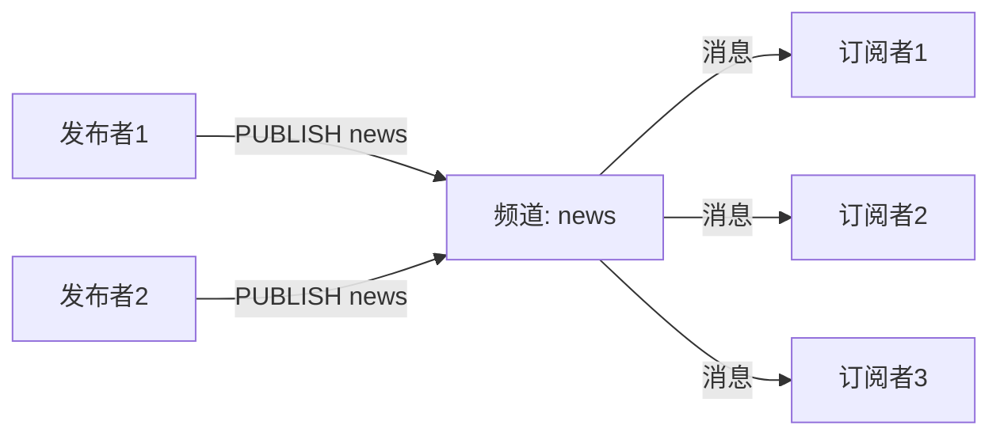
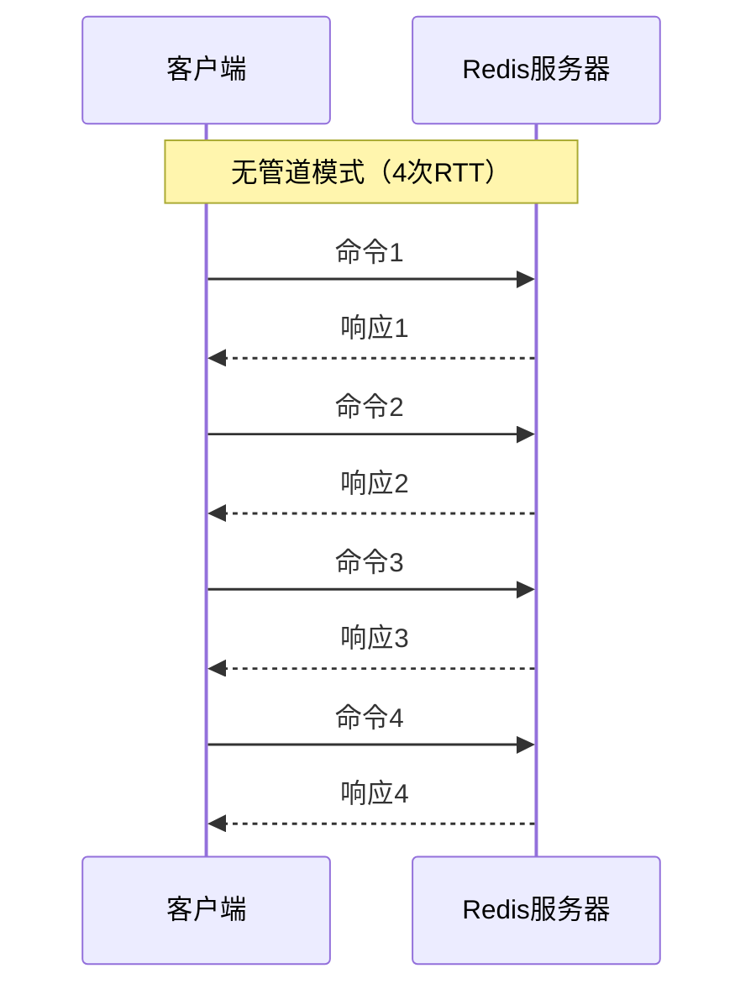
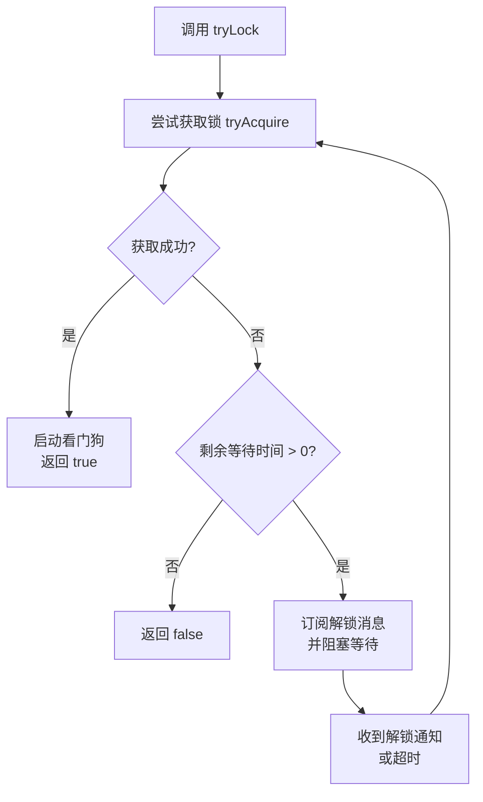
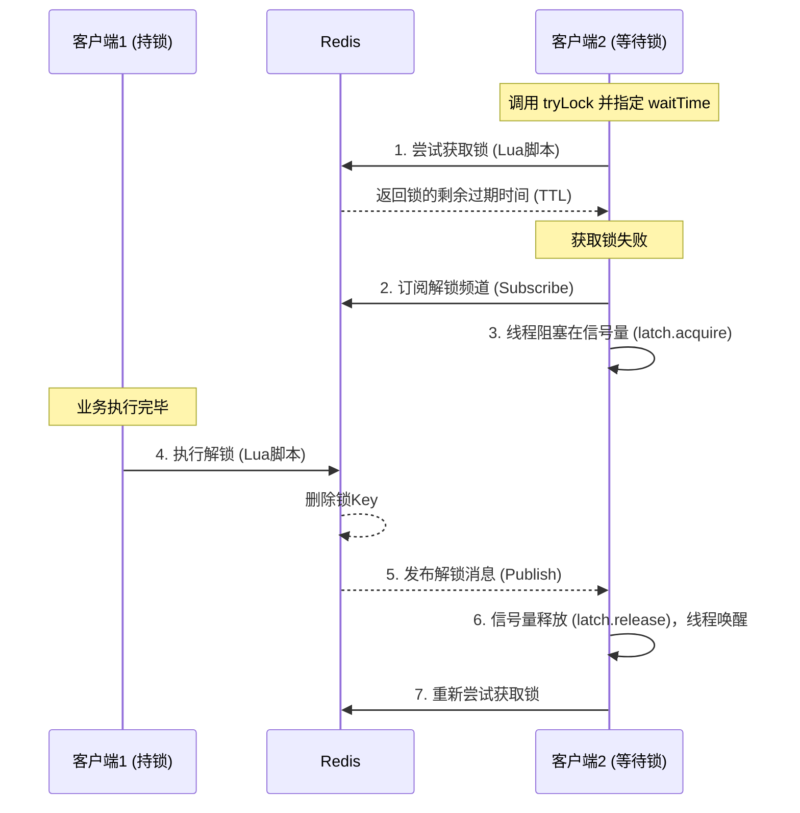

# Redis支持哪些数据类型？简单描述每种类型的使用场景

| 场景                   | 推荐类型             | 原因                                     |
| :--------------------- | :------------------- | :--------------------------------------- |
| **缓存用户对象**       | Hash                 | 可单独修改某个字段，无需整个对象序列化   |
| **点赞/取消点赞**      | Set                  | 保证用户唯一性，支持快速计数和交集运算   |
| **商品详情页浏览次数** | String (INCR)        | 简单计数，原子操作                       |
| **最新评论列表**       | List (LPUSH + LTRIM) | 保持固定长度，支持分页                   |
| **热搜榜/周榜**        | Sorted Set           | 自动按分数排序，更新实时                 |
| **每日签到**           | Bitmap               | 一个 bit 代表一天，内存占用极小          |
| **网站 UV 统计**       | HyperLogLog          | 12KB 内存即可统计百万级 UV，误差约 0.81% |
| **附近的门店**         | GEO                  | 内置地理位置计算，支持范围查询           |
| **消息队列（可靠）**   | Stream               | 支持消费者组、消息确认、消息回溯         |

*   简单值用 `String`
*   对象用 `Hash`
*   集合去重用 `Set`
*   集合排序用 `Sorted Set`
*   队列用 `List`
*   统计用 `HyperLogLog`
*   地理位置用 `GEO`
*   可靠消息用 `Stream`
*   签到/标记用 `Bitmap`

# Redis的数据丢失问题

Redis本身是AP模型, 因为缓存"自然"淘汰：过期与内存逐出, 或者持久化的配置导致数据的丢失. 正常的AOF配置可能会在系统宕机时丢失1秒的数据, 淘汰策略和主从切换以及哨兵模式的脑裂也会造成数据丢失.

## 缓存"自然"淘汰：过期与内存逐出

这是最常见、最符合预期的"丢失"。Redis作为缓存，为了提高内存利用率，会主动清理不需要的数据。

*   Key过期（Expiration）：程序为Key设置了过期时间（`EXPIRE`），时间到达后，Redis会自动删除Key。

    *   排查：通过 `INFO stats` 命令查看 `expired_keys` 指标，如果该数字在数据丢失的时间点有大幅增长，则说明是正常的过期淘汰。
*   内存逐出（Eviction）：Redis内存使用达到`maxmemory`上限，根据配置的`maxmemory-policy`策略（如`allkeys-lru`, `volatile-lru`）主动淘汰部分Key来腾出空间。

    *   排查：通过 `INFO stats` 查看 `evicted_keys` 指标。如果该数字很高，说明内存压力过大，需要扩容或优化数据。

## 系统"致命"故障：进程宕机与主从切换

*   持久化配置不当：这是最根本的原因。如果未启用持久化，Redis进程一旦因宕机、断电或`OOM`（Out of Memory，内存溢出）被系统Kill，内存中的所有数据都会丢失。

    *   注意：AOF的`appendfsync`策略决定了数据安全性。`everysec`最多丢1秒数据，`no`可能丢大量数据，`always`最安全但性能最差。
*   主从异步复制导致的数据丢失：Redis主从复制是异步的。当主库宕机时，如果尚有部分写命令未同步到从库，哨兵切换后，这部分未同步的数据就会永久丢失。

    *   场景：客户端写入主库成功，但在数据复制到从库前主库宕机。

> 除非设置key永远不过期, 同时aof写入的时候配置每次写都刷盘, 但是这样就违背了使用缓存提高性能的理念. Redis尽量不要参与业务逻辑, 数据是不可靠的

# Redis是如何实现持久化的？请比较下redis持久化方式的优缺点

RDB:  在指定时间间隔内，将内存中的数据集的快照以二进制文件（dump.rdb）写入磁盘。恢复速度快,文件紧凑, 通过 fork 子进程完成，主进程继续处理命令, 性能影响小.  缺点: 数据丢失风险, 两次快照之间的数据可能丢失（如 15 分钟内的数据）, 大内存 fork 慢

AOF:记录每个写操作命令，追加到 appendonly.aof 文件，重启时重放命令恢复数据。数据安全性高, 可读性强, 自动压缩.  缺点: 文件体积大, 恢复速度慢, 性能开销高

| 对比维度       | RDB                | AOF             | 混合持久化      |
| :------------- | :----------------- | :-------------- | :-------------- |
| **文件格式**   | 二进制             | 文本协议        | RDB + AOF       |
| **数据完整性** | 可能丢失分钟级数据 | 最多丢 1 秒数据 | 最多丢 1 秒数据 |
| **恢复速度**   | **快**             | 慢              | **快**          |
| **文件大小**   | 小                 | 大              | 中等            |
| **写入性能**   | 高                 | 一般            | 一般            |
| **可读性**     | 不可读             | **可读**        | 不可读          |
| **适用场景**   | 冷备份、快速重启   | 数据安全要求高  | **生产推荐**    |

生产环境强烈推荐开启混合持久化（appendonly yes + aof-use-rdb-preamble yes），既保证了数据安全，又获得了较快的恢复速度。

# Redis 发布/订阅模型

Redis 的发布/订阅（Pub/Sub）是一种消息通信模式，发送者（Publisher）发送消息到频道（Channel），订阅者（Subscriber）接收消息。发布者和订阅者之间没有直接耦合。



    1. 订阅者执行 SUBSCRIBE news
       ↓
    2. Redis Server 记录：频道 "news" → [订阅者A, 订阅者B]
       ↓
    3. 发布者执行 PUBLISH news "Hello World"
       ↓
    4. Redis Server 查找 "news" 的订阅者列表
       ↓
    5. Redis Server 将消息推送给所有订阅者
       ↓
    6. 订阅者收到消息（格式：["message", "news", "Hello World"]）

| 维度           | 评价                                           |
| :------------- | :--------------------------------------------- |
| **优点**       | 极低延迟、简单易用、解耦发布者和订阅者         |
| **缺点**       | 消息不持久、无确认机制、无回溯能力             |
| **适用场景**   | 实时通知、在线状态推送、配置刷新、简单事件驱动 |
| **不适用场景** | 可靠消息传递、消息持久化、消息回溯、复杂路由   |

一句话总结：Redis Pub/Sub 是一个轻量级、实时、内存级的消息通信模型，适合对可靠性要求不高但追求低延迟的场景。如果需要消息持久化、确认机制或回溯能力，应考虑 Redis Streams 或专业的消息队列（如 Kafka、RabbitMQ）。

注意事项

| 问题             | 说明                         | 解决方案                          |
| :--------------- | :--------------------------- | :-------------------------------- |
| **消息丢失**     | 订阅者离线期间的消息无法接收 | 改用 Stream 或专业消息队列        |
| **背压问题**     | 慢消费者会阻塞 Redis         | 使用 `CLIENT PAUSE` 或分离订阅者  |
| **消息积压**     | 输出缓冲区限制可能导致断连   | 配置 `client-output-buffer-limit` |
| **无消息确认**   | 无法保证消息被处理           | 业务层自行实现 ACK 机制           |
| **模式订阅开销** | `PSUBSCRIBE` 匹配消耗 CPU    | 避免过多、过复杂的模式            |

# Redis的事务是如何工作的？Redis事务与传统数据库事务有何不同？

Redis 事务本质是**命令的批量执行队列**，提供的是"隔离的、原子性排队"，而非传统数据库的 ACID 事务。它通过 WATCH 实现乐观锁，但不支持回滚。如果需要严格的事务特性，应该使用 Lua 脚本或专业的关系型数据库。

## 工作原理

```c
# 开启事务
127.0.0.1:6379> MULTI
OK

# 命令入队（不执行，只排队）
127.0.0.1:6379(TX)> SET user:1 "Alice"
QUEUED
127.0.0.1:6379(TX)> INCR counter
QUEUED
127.0.0.1:6379(TX)> LPUSH list "a"
QUEUED

# 执行事务（批量执行所有命令）
127.0.0.1:6379(TX)> EXEC
1) OK
2) (integer) 1
3) (integer) 1
```

## WATCH 实现乐观锁

```bash
# 客户端 A
WATCH balance           # 监视 balance
balance = GET balance   # 读取值
MULTI
SET balance 100
EXEC                    # 如果期间 balance 未被修改，执行成功

# 客户端 B（同时执行）
SET balance 50          # 修改了 balance
# 客户端 A 的 EXEC 会返回 (nil)，事务失败
```

## Redis 事务 vs 传统数据库事务

| 维度         | 传统数据库事务 (MySQL)           | Redis 事务                                       |
| :----------- | :------------------------------- | :----------------------------------------------- |
| **原子性**   | ✅ 严格保证（全部成功或全部失败） | ❌ **不支持**（遇到错误命令，其他仍执行）         |
| **一致性**   | ✅ 通过约束、外键等保证           | ⚠️ 部分支持（依赖业务逻辑）                       |
| **隔离性**   | ✅ MVCC/锁，多种隔离级别          | ❌ **无隔离性**（命令执行时可能被其他客户端插入） |
| **持久性**   | ✅ 持久化到磁盘                   | ⚠️ 依赖持久化配置                                 |
| **回滚**     | ✅ 支持 `ROLLBACK`                | ❌ **不支持**                                     |
| **语法检查** | 执行前完整检查                   | ⚠️ **仅检查语法**，不检查逻辑错误                 |
| **实现方式** | 执行时实时执行                   | **批量队列**，EXEC 时批量执行                    |
| **锁机制**   | 行锁、表锁、间隙锁               | **乐观锁**（WATCH）                              |

### 原子性：Redis 不支持回滚

MySQL：要么全成功，要么全失败，失败可回滚。

```sql
BEGIN;
UPDATE account SET balance = balance - 100 WHERE id = 1;
UPDATE account SET balance = balance + 100 WHERE id = 2;
-- 任何一步失败，整个事务回滚
COMMIT;
```

Redis：即使队列中某条命令执行失败，其他命令仍会执行。

```bash
127.0.0.1:6379> MULTI
OK
127.0.0.1:6379(TX)> SET name "Alice"
QUEUED
127.0.0.1:6379(TX)> INCR name        # 错误：对字符串执行 INCR
QUEUED
127.0.0.1:6379(TX)> SET age 20
QUEUED
127.0.0.1:6379(TX)> EXEC
1) OK
2) (error) ERR value is not an integer or out of range   # 这条失败
3) OK                                                    # 但这条成功执行了！
```

Redis 为什么不支持回滚

*   作者认为 Redis 命令失败是编程错误（如类型不匹配），应在开发时避免
*   回滚机制复杂且影响性能，与 Redis 的简单高效理念不符

### 隔离性：Redis 无隔离级别

MySQL：支持读未提交、读已提交、可重复读、串行化四种隔离级别。

Redis：事务中的命令在 EXEC 时才执行，但执行过程中可能被其他客户端的命令插入。

```bash
# 时间线：客户端 A 执行事务
A: MULTI
A: SET count 10
A: EXEC    # 开始执行

# 就在 A 执行 SET 和 GET 之间，客户端 B 插入了命令
B: SET count 5

# 结果：A 的 GET 可能读到 B 修改后的值
```

注意：单条 Redis 命令是原子的，但事务不保证命令之间的隔离。

### Redis 事务的局限性

| 问题               | 说明                      | 解决方案                     |
| :----------------- | :------------------------ | :--------------------------- |
| **不支持回滚**     | 命令失败无法撤销          | 开发时充分测试，避免类型错误 |
| **无隔离性**       | 事务执行时可能被插入命令  | 使用 `WATCH` 乐观锁          |
| **批量执行阻塞**   | 事务执行期间阻塞其他请求  | 保持事务短小精悍             |
| **无法在事务中读** | 队列中的读命令返回 QUEUED | 使用 `WATCH` 提前读取        |

### 适合场景

| 场景           | 示例                             |
| :------------- | :------------------------------- |
| **批量操作**   | 一次性执行多条命令，减少网络往返 |
| **原子性更新** | 更新多个 key 需要保持数据一致性  |
| **乐观锁控制** | 秒杀、库存扣减等并发控制场景     |

# Redis和DB的一致性问题

Redis和DB（通常是MySQL/PostgreSQL）的一致性问题，本质上是分布式数据一致性问题。在同时使用缓存和数据库的系统中，绝对强一致性几乎不可能达到，只能通过特定方案来追求最终一致性或尽量强的一致性。

## 核心矛盾

*   写入：更新DB和更新Redis是两个独立操作，无法保证原子性。
*   读取：读请求先读Redis，未命中再读DB。当DB已更新而Redis未更新时，就会出现脏数据。

## 常见更新策略及其问题

### 先更新DB，再更新Redis

流程：写请求 → 更新MySQL → 更新Redis。 

问题：更新MySQL成功后，更新Redis前程序崩溃，导致Redis中是旧数据。多线程情况下Redis更新值不一致.  

适用：极少使用，因为更新Redis的代价通常较高。

### 先更新DB，再删除Redis（Cache-Aside Pattern，最推荐）

流程：写请求 → 更新MySQL → 删除Redis缓存。

读请求：读Redis → 未命中 → 读MySQL → 写回Redis。

问题：存在并发读写导致的脏数据问题。

#### 脏数据场景：

1.  线程A读请求，Redis未命中，读MySQL（读到旧值1）。
2.  线程B写请求，更新MySQL（新值2）。
3.  线程B删除Redis（此时Redis为空）。
4.  线程A将之前读到的旧值1写回Redis。\
    结果：Redis中是旧值1，MySQL中是新值2，缓存脏数据。

## 主流方案总结

| 方案                          | 流程                                        | 脏数据风险              | 性能                | 实现复杂度 | 推荐场景                 |
| :---------------------------- | :------------------------------------------ | :---------------------- | :------------------ | :--------- | :----------------------- |
| **Cache-Aside + 延迟双删**    | 更新DB → 删除缓存 → 延迟再删                | **极低**                | 高（异步/短时阻塞） | 中         | **首选，通用性强**       |
| **订阅Binlog**                | 通过Canal等监听MySQL变更，异步删除/更新缓存 | **极低**                | 高（异步）          | 高         | **强一致性、低耦合场景** |
| **先删缓存，再更新DB + 重试** | 删缓存 → 更新DB → (失败重试)                | 高                      | 高                  | 中         | 几乎不用，风险高         |
| **更新DB，同步更新Redis**     | 更新DB → 更新Redis                          | **高（更新Redis失败）** | 低（同步阻塞）      | 低         | 不推荐，除非可接受不一致 |

### 方案一：延迟双删（最通用）

```java
public void updateUser(User user) {
    // 1. 更新数据库
    userDao.update(user);
    // 2. 第一次删除缓存
    redisTemplate.delete("user:" + user.getId());
    // 3. 延迟一段时间（通常几百毫秒）
    Thread.sleep(500);
    // 4. 第二次删除缓存
    redisTemplate.delete("user:" + user.getId());
}
```

延迟时间：通常设置为\[读请求的平均耗时] + \[缓存重建的耗时]，保证其他线程可能写回的脏缓存能被二次删除。

### 方案二：订阅Binlog（最强一致性）

使用阿里巴巴开源的Canal组件，伪装成MySQL从库，解析Binlog日志。

1.  业务直接更新MySQL，不做任何缓存操作。
2.  Canal监听Binlog变更。
3.  Canal将变更消息发送给消费者（Java应用/MQ）。
4.  消费者负责删除或更新Redis缓存。

优点:

*   彻底解决并发脏数据问题。
*   解耦：业务代码不再关心缓存逻辑。
*   可回溯：Binlog可以重放，修复缓存数据。

缺点：引入Canal和MQ，系统架构变复杂。

### 总结

1.  没有完美的强一致方案，只能在性能、一致性、复杂度之间权衡。
2.  延迟双删是兼顾一致性与性能的首选方案，适用于大多数业务。
3.  订阅Binlog是实现最终一致性的工业级方案，适合对一致性要求极高且系统复杂度可控的场景。
4.  核心原则：更新数据库后，必须让缓存失效。读请求时再按需重建缓存，而不是主动更新缓存。
5.  兜底策略：为缓存设置一个合理的过期时间（如30分钟）。即使上述所有方案因极端情况失效，最终也会因过期而达到一致。
6.  真正可靠的只有DB, 当遇见金额操作之类的直接查询DB进行校验, 不要依赖缓存

# Redis的缓存雪崩/穿透/击穿问题

| 问题         | 关键词           | 问题核心                              | 发生时机                            |
| :----------- | :--------------- | :------------------------------------ | :---------------------------------- |
| **缓存雪崩** | 大量Key同时失效  | 缓存层**整体**或**大规模**失效        | 大量Key在同一时间点过期 / Redis宕机 |
| **缓存穿透** | 查询不存在的数据 | 请求的数据在**缓存和数据库都不存在**  | 每次请求都绕过缓存直达DB            |
| **缓存击穿** | 热点Key失效      | 一个**热点Key**在失效瞬间被高并发请求 | 某个热门数据的Key突然过期           |

## 缓存雪崩

### 定义与场景

定义：由于大量热点Key同时过期或Redis服务宕机，导致大量请求直接打到数据库，引发数据库压力骤增甚至崩溃。

典型场景：

*   凌晨系统活动开始，批量加载的商品数据设置了相同的过期时间（比如都设为凌晨0点）。
*   Redis服务宕机或网络抖动，导致所有缓存不可用。

### 解决方案

| 解决方向            | 具体方案         | 说明                                                         |
| :------------------ | :--------------- | :----------------------------------------------------------- |
| **避免Key同时失效** | 设置随机过期时间 | 在固定过期时间上增加一个随机偏移量（如 `expire = 3600 + random(0, 600)`），避免同时失效。 |
| **提高缓存可用性**  | Redis集群高可用  | 使用主从+哨兵或Cluster集群，避免单点故障。                   |
| **请求降级与限流**  | 熔断、限流       | 当检测到DB压力过大时，直接拒绝部分请求或返回默认值。         |
| **提前预热**        | 手动加载         | 在系统低峰期（如凌晨）提前将热点数据加载到缓存中。           |

## 缓存穿透

### 定义与场景

定义：请求的数据既不在缓存中，也不在数据库中（例如查询一个不存在的用户ID），导致每次请求都会穿透缓存，直接查询数据库。

典型场景：

*   恶意攻击者利用不存在的ID（如 `-1`， `999999999`）发起大量请求。
*   业务查询条件本身就不存在有效结果。

### 解决方案

| 解决方向         | 具体方案                 | 说明                                                         |
| :--------------- | :----------------------- | :----------------------------------------------------------- |
| **缓存空对象**   | `SET null_value`         | 查询DB返回空时，也将空结果缓存起来（如 `key: "null"`），设置较短的过期时间（如5分钟）。 |
| **布隆过滤器**   | Bloom Filter             | 将所有可能存在的数据哈希到一个足够大的二进制向量中，请求前先经过布隆过滤器过滤，**一定不存在的数据直接拦截**。 |
| **请求参数校验** | 基础校验                 | 在接口层校验请求参数（如ID不能为负数、长度限制等），过滤明显无效的请求。 |
| **封禁IP**       | 让运维给攻击者的IP封禁掉 | 直接在云服务器厂商进行IP拦截                                 |

> 布隆过滤器：它会说“这个数据一定不存在”或“这个数据可能存在”。因此，它能有效拦截大多数不存在的数据查询，推荐使用。Redission已经实现了BloomFilter, 可以直接使用. 需要redis安装bloom模块

## 缓存击穿

### 定义与场景

定义：一个热点Key（如爆款商品、大V信息）在失效的瞬间，被超高并发的请求同时打到数据库上，导致数据库压力瞬间飙升。

典型场景：

*   双11秒杀活动中，某个爆款商品的缓存突然过期。
*   微博某个大V的粉丝数缓存失效。

### 解决方案

| 解决方向            | 具体方案       | 说明                                                         |
| :------------------ | :------------- | :----------------------------------------------------------- |
| **互斥锁（Mutex）** | 分布式锁       | 当缓存失效时，只允许一个线程去查询DB并重建缓存，其他线程等待或重试。 |
| **逻辑过期**        | 不设置物理过期 | 缓存Key永不过期，但在Value中存储一个逻辑过期时间。当发现逻辑过期时，异步去更新缓存。 |
| **热点Key永不过期** | 手动更新       | 对极端热点的Key，不设置过期时间，而是通过后台任务定时或手动更新。 |

# 在高并发环境下，如何避免Redis的热点问题

在高并发下，Redis热点问题本质上是某一个小范围的数据（例如一个Key、一个Slot）承载了远超系统均摊能力的流量，导致单个节点CPU、带宽或连接数成为瓶颈。

解决这个问题，核心思路是：不让热点流量打在同一个点上，或者对流量进行分层消化。下面是几种常用的解决方案。本质与缓存击穿类似。

## 副本扩散法：使用读写分离

如果热点数据是读多写少的，可以通过增加从节点来分摊读流量。客户端配置`readMode=SLAVE`，将高并发的读请求分散到多个从节点上。

*   优点：实现简单，对代码几乎无侵入。
*   缺点：可能读到少量主从延迟的旧数据；如果写操作也很频繁，从节点同步压力大，效果会打折。

## 本地缓存法：JVM缓存 + Redis

这是解决极端热点（如秒杀商品、微博热搜）最有效的方法。将Redis中的热点数据，在业务系统的JVM内存中再存一份。

*   流程：请求先查本地缓存（如Caffeine、Guava），命中则直接返回；未命中再查询Redis，并将结果回写本地缓存。
*   关键：需要解决数据一致性问题。通常使用Redis的`Pub/Sub`功能，当数据变更时，发布一条消息，各服务实例监听后主动失效/更新自己的本地缓存。
*   优点：性能极高（微秒级），彻底卸掉Redis的压力。
*   缺点：增加JVM内存消耗，需要处理数据一致性问题。

## 分片打散法：逻辑Key分拆

如果热点是一个高频写入的热Key（如某个爆款商品的库存`stock:1001`），可以将一个Key拆成多个逻辑Key，把压力分散到不同的Redis节点（或同一个节点的不同slot）上。

*   做法：例如，将库存`stock`拆成`stock_1001_1`到`stock_1001_10`共10个Key。扣减库存时，随机选择一个Key进行操作。统计总量时，则把这10个Key的值相加。
*   优点：能将热点写入压力分散。
*   缺点：业务逻辑变复杂，全局精确扣减困难。适合最终一致性或允许少量误差的场景（如非交易核心的计数）。

## 客户端/代理端限流

当以上手段都无法消除热点时，最后的防线是限流。

*   针对热点Key限流：在客户端或代理层（如Redis Cluster的smart client、Codis、Twemproxy）识别出热点Key，对该Key的访问进行限制（如每秒最多1000次）。
*   作用：牺牲一小部分请求，确保Redis服务本身不会因热点而崩溃，影响其他正常Key的访问。

# Redis的热点问题和缓存击穿有区别

| 维度         | 热点问题 (Hotspot)                                           | 缓存击穿 (Cache Breakdown)                                   |
| :----------- | :----------------------------------------------------------- | :----------------------------------------------------------- |
| **本质**     | 指一个Key的访问量**极高**，超出了单个Redis节点的处理能力。   | 指一个热点Key**过期失效**的瞬间，大量并发请求穿透缓存打到数据库。 |
| **根本原因** | 流量分布不均，某个Key的QPS过高（如10万+）。                  | 热点Key的**过期时间到了** + **高并发**同时访问。             |
| **影响范围** | 主要影响**Redis本身**（CPU飙高、网络带宽打满），也可能引发击穿。 | 主要影响**后端数据库**（DB瞬间压力过大）。                   |
| **发生阶段** | 缓存**有效**期间也可能发生。                                 | **缓存失效**的瞬间发生。                                     |
| **核心问题** | “Redis扛不住这么大的读请求”。                                | “DB扛不住瞬间涌入的请求”。                                   |

热点问题指的是某个Key（比如爆款商品、热搜词）的访问量异常集中，远远超过其他Key。

典型场景：

*   双11秒杀时，`product:1001` 这个商品的访问量占整个集群的90%。
*   微博某个大V发布了一条爆款微博，`post:8888` 被千万用户同时读取。

后果：

*   Redis单节点瓶颈：无论集群有多少节点，这个Key始终落在一个节点上，导致该节点CPU爆满、带宽打满，甚至拖垮整个集群。
*   可能引发击穿：如果这个热点Key恰好又设置了过期时间，那它过期时就会必然引发缓存击穿。

## 总结

*   热点问题关注的是Redis本身的压力，即使缓存没失效也可能发生。
*   缓存击穿关注的是数据库的压力，特指热点Key失效的那一刻。
*   一个热点Key可能同时带来这两个问题：平时让Redis压力大，失效瞬间让数据库压力大。
*   解决顺序：先解决击穿（保护DB），再优化热点（保护Redis）。

# 请描述一种使用Redis实现分布式锁的方法

最常用的方法：SET NX EX（单节点锁), 但是有下面的问题

*   主从切换锁失效（最致命）
*   锁过期误删（实现不规范时）
*   不可重入（导致自死锁）
*   无自动续期（过期时间难设置）
*   不支持阻塞（需要自旋等待）

一句话总结：单机SET NX只适合低并发、可容忍错误、业务幂等的场景，绝不能用于金融交易、库存扣减等强一致性业务。生产环境推荐使用Redisson或ZooKeeper

# Redisson锁有哪些优点

1.  自动续期的“看门狗”（Watchdog）：这是Redisson最著名的特性。当你用`lock()`方法获取锁时，锁的默认过期时间是30秒。但如果业务没执行完，Redisson的后台线程会每隔10秒自动检查一次，并为锁“续命”到30秒。这彻底解决了手动实现时，因业务执行时间过长导致锁提前自动释放，进而引发并发问题的风险。
2.  可重入锁（Reentrant Lock）：Redisson的锁是支持可重入的，即同一个线程可以多次获取同一把锁，内部通过一个计数器来记录重入次数。这对于需要在一个线程内递归调用或调用多个需要同一把锁的方法至关重要，而手动实现这一点会非常复杂。
3.  安全的锁释放：Redisson的`unlock()`方法内部通过Lua脚本校验了锁的持有者。只有当你和当初加锁的是同一个线程时，才能释放锁，从根本上避免了因误操作（如代码超时）而释放掉其他线程锁的问题。
4.  提供tryLock(), 支持阻塞，公平锁、读写锁、红锁等可以自旋等待。
5.  提供 `RSemaphore` 进行整体并发量控制。

# 如何使用Redis构建一个高效的排行榜系统

使用 Redis 构建排行榜，核心是利用它的 有序集合（Sorted Set） 数据结构。一个设计良好的排行榜不仅能支持高并发的实时更新，还能灵活应对不同时间维度的需求（如日榜、周榜、总榜）。

## 核心数据结构：Sorted Set

Sorted Set 中的每个元素（如 `user_id`）都会关联一个浮点数分数（`score`）。Redis 会自动根据这个分数对集合进行排序。

*   自动排序：分数相同时，会按字典序排列，但我们可以通过设计规避。
*   高性能：基于跳表实现，插入、更新和查询的时间复杂度都是 O(log N)。

## 基础操作实现

假设我们有一个游戏积分榜，Key 名为 rank\:game\:total。

*   添加/更新用户分数：使用 ZADD 命令。如果用户已存在，会更新其分数并重新排序。

```bash
ZADD rank:game:total 1000 user:1001
ZADD rank:game:total 1500 user:1002
```

*   查询排名：

    *   正向排名（从低到高）：`ZRANK rank:game:total user:1001` (返回 0 表示第1名)
    *   反向排名（从高到低）：`ZREVRANK rank:game:total user:1001` (返回 0 表示第1名)
*   获取排行榜列表：

    *   获取前三名（高分到低分）：`ZREVRANGE rank:game:total 0 2 WITHSCORES`
    *   分页获取 11-20 名：`ZREVRANGE rank:game:total 10 19 WITHSCORES`
*   获取用户分数和排名：

```bash
ZSCORE rank:game:total user:1001
ZREVRANK rank:game:total user:1001
```

## 高并发与性能优化

*   批量操作：使用 Pipeline 将多个命令打包发送，减少网络往返时间。
*   异步更新：如果允许短暂不一致，可以将分数变化写入消息队列，由后台任务批量处理。例如，游戏服务器将积分变更事件发送到Kafka，由独立的消费者服务异步更新Redis，能有效削峰填谷。
*   数据分片：对于千万级用户的大榜单，可以采用多级榜单或分片策略。例如，按用户ID哈希分片到多个Sorted Set，维护各自的分片排名，再在内存中合并。不过这会增加复杂度，通常单个有序集合支撑千万级数据（约200-300MB内存）性能依然很好。

## 与关系型数据库的协同

Redis适合存储实时、热数据，关系型数据库（如MySQL）适合存储历史、冷数据。

*   写入路径：用户积分变更时，先写MySQL做持久化，然后更新Redis中的Sorted Set。
*   读取路径：前端请求排行榜时，直接从Redis读取，毫秒级响应。
*   冷热分离：超过一定时间的旧榜单（如上月月榜）可以从Redis中移除，查询时走MySQL。

## 总结

*   核心：用好 Sorted Set，用 `ZADD` 更新，用 `ZREVRANGE` 查询。
*   时间维度：通过不同的Key名（如包含日期）来区分榜单，并利用TTL自动清理。
*   性能：用 Pipeline 批量操作，用异步方式更新。
*   同分排序：通过“分数+时间戳”的组合得分策略实现精细排序。

基于这套方法，实现一个支持千万级用户、高并发实时更新的排行榜系统是完全可以的。

# 什么是Redis管道(pipelining)？如何通过管道提高性能

Redis管道（Pipelining）是一种批量请求技术，它允许客户端将多个命令一次性发送给Redis服务器，而无需等待每个命令的响应。服务器在处理完所有命令后，再将所有结果一次性返回给客户端。

如果你的业务涉及批量写入或批量读取，管道是最简单、最有效的性能优化手段，几乎没有副作用。

## 为什么要用管道

在不使用管道的情况下，执行N个命令需要N次网络往返（RTT）。假设每次RTT为1毫秒，执行1000个命令就需要1秒的网络等待时间，而实际命令执行时间可能只需要几微秒。网络延迟占据了绝大部分时间。



## 性能提升效果

| 场景                     | 无管道                | 使用管道        | 性能提升   |
| :----------------------- | :-------------------- | :-------------- | :--------- |
| **本地网络，1000条命令** | \~1000ms（1000次RTT） | \~1ms（1次RTT） | **1000倍** |
| **跨机房，100条命令**    | \~500ms（100×5ms）    | \~5ms（1×5ms）  | **100倍**  |
| **批量写入10万条数据**   | 约10秒                | 约0.5秒         | **20倍**   |

实际测试数据（Redis官方基准）：

*   无管道：约 10万 QPS（受限于网络RTT）
*   使用管道：约 100万+ QPS（受限于Redis处理能力）

## 代码示例

```java
import redis.clients.jedis.Jedis;
import redis.clients.jedis.Pipeline;
import redis.clients.jedis.Response;

public class PipelineExample {
    public static void main(String[] args) {
        Jedis jedis = new Jedis("localhost", 6379);
        
        // 开启管道
        Pipeline pipeline = jedis.pipelined();
        
        // 批量发送命令（不等待响应）
        for (int i = 0; i < 10000; i++) {
            pipeline.set("key:" + i, "value:" + i);
            pipeline.incr("counter");
        }
        
        // 执行并获取所有响应
        List<Object> responses = pipeline.syncAndReturnAll();
        
        System.out.println("执行完成，共 " + responses.size() + " 条命令");
        jedis.close();
    }

	// 批量获取数据
	public Map<String, String> batchGet(List<String> keys) {
    	Jedis jedis = new Jedis("localhost", 6379);
    	Pipeline pipeline = jedis.pipelined();
    	
    	// 批量发送 GET 命令
    	List<Response<String>> responses = new ArrayList<>();
    	for (String key : keys) {
      	  responses.add(pipeline.get(key));
    	}
    
    	// 执行并获取结果
    	pipeline.sync();
    
    	// 组装结果
    	Map<String, String> result = new HashMap<>();
    	for (int i = 0; i < keys.size(); i++) {
    	    result.put(keys.get(i), responses.get(i).get());
    	}
    
    	jedis.close();
    	return result;
	}
}


```

# Redis的内存管理机制是什么？介绍几种常用的内存淘汰策略

Redis 的内存管理机制，核心可以概括为过期删除和内存淘汰这两个策略。

*   过期删除：删除那些已过期（TTL 到了）的数据，属于常规清理。
*   内存淘汰：当内存使用达到 `maxmemory` 上限时，启动淘汰规则（`maxmemory-policy`），强制删除一些数据以容纳新数据。

## 过期删除策略：三种方式结合

当一个 Key 被设置了过期时间，Redis 不会立刻删除它，而是采用三种策略配合，以平衡 CPU 和内存。

1.  惰性删除：当客户端访问一个 Key 时，Redis 先检查它是否过期。如果过期，就立即删除并返回空。

    *   优点：CPU 开销小，只在访问时检查。
    *   缺点：如果过期 Key 一直不被访问，会长期占用内存，形成“内存泄漏”。
2.  定期删除：Redis 每隔一段时间（默认 100ms），在后台随机抽查一批设置了过期时间的 Key，删除其中已过期的。

    *   优点：主动清理，避免内存持续被无用数据占用。
    *   缺点：扫描频率和耗时需谨慎设置，否则会影响主线程处理命令。
3.  内存淘汰：当内存使用量达到 `maxmemory` 上限时，Redis 会触发强制“驱逐”机制，根据配置的策略来删除数据。

总结：惰性删除和定期删除是日常的兜底措施，而内存淘汰是内存濒临耗尽时的“最终防线”。

## 内存淘汰策略：8种方式可选

当 Redis 内存占用达到 maxmemory 限制时，从以下 8 种策略中选择一种执行。

淘汰策略一共有8种, 主要是分为lru,lfu,random的过期时间或者全部 以及 不淘汰和根据有过期时间的ttl淘汰

| 策略名称            | 作用范围         | 淘汰算法            | 适用场景                 |
| :------------------ | :--------------- | :------------------ | :----------------------- |
| **noeviction**      | 无淘汰           | 不淘汰，写入报错    | 不允许丢失数据的场景     |
| **allkeys-lru**     | 所有 key         | LRU（最近最少使用） | 通用，有冷热数据分布     |
| **volatile-lru**    | 有过期时间的 key | LRU                 | 只淘汰临时数据           |
| **allkeys-lfu**     | 所有 key         | LFU（最不经常使用） | 访问频率差异明显         |
| **volatile-lfu**    | 有过期时间的 key | LFU                 | 淘汰访问频率低的临时数据 |
| **allkeys-random**  | 所有 key         | 随机                | 数据访问无明显热点       |
| **volatile-random** | 有过期时间的 key | 随机                | 临时数据，无访问规律     |
| **volatile-ttl**    | 有过期时间的 key | TTL 最短优先        | 希望优先淘汰快过期的数据 |

#### 1.不淘汰数据（默认策略）

*   `noeviction`：默认行为。内存达到上限后，所有写命令（如 `SET`, `LPUSH`）都会返回错误，但读命令（如 `GET`）仍可正常执行。这可以防止数据被意外删除，但也可能导致服务不可写入。

#### 2. 在设置了过期时间的 Key 中淘汰（Volatile）

这 4 种策略只针对设置了过期时间的 Key。

*   `volatile-lru`：从设置了过期时间的 Key 中，淘汰最近最少使用（LRU，Least Recently Used）的 Key。
*   `volatile-lfu` (Redis 4.0+)：淘汰使用频率最低（LFU，Least Frequently Used）的 Key。比 LRU 更精确，适合热点数据场景。
*   `volatile-random`：随机淘汰。
*   `volatile-ttl`：优先淘汰剩余生存时间（TTL）最短的 Key。

#### 3. 在所有 Key 中淘汰（Allkeys）

这 3 种策略作用于所有 Key，无论是否设置了过期时间。

*   `allkeys-lru`：在所有 Key 中淘汰最近最少使用的 Key。
*   `allkeys-lfu` (Redis 4.0+)：在所有 Key 中淘汰使用频率最低的 Key。
*   `allkeys-random`：在所有 Key 中随机淘汰。

## 总结

*   作为缓存：首选 `allkeys-lru` 或 `allkeys-lfu`。
*   作为数据库：首选 `noeviction`，防止数据丢失。
*   有冷热数据区分：首选 `volatile-lru`，并对热数据不设过期时间。
*   访问非常均匀：可选用 `allkeys-random`，性能更高。
*   必须设置 `maxmemory`：在 64 位系统上，默认值为 0，表示不限制。为防止内存耗尽导致系统崩溃，务必设置，通常设为系统总内存的 50%-80%。
*   采样数量 (`maxmemory-samples`)：LRU 和 TTL 算法是“近似”的，通过采样决定淘汰哪个 Key。默认 5，调高到 10 能更接近真实 LRU，但会增加 CPU 消耗。
*   监控命中率：通过 `INFO stats` 命令观察 `keyspace_hits` 和 `keyspace_misses`，判断淘汰策略是否合理。命中率过低可能意味着内存不足或策略不合适。

# Redis的服务器端是单线程还是多线程？为什么

## Redis 的线程模型演进史

| 版本阶段        | 网络 I/O   | 命令执行   | 后台异步任务             |
| :-------------- | :--------- | :--------- | :----------------------- |
| **Redis < 4.0** | 单线程     | **单线程** | 无（或仅有极少量）       |
| **Redis 4.0**   | 单线程     | **单线程** | **多线程**（异步删除等） |
| **Redis 6.0**   | **多线程** | **单线程** | **多线程**               |

## 核心：命令执行永远是单线程

无论哪个版本，Redis 执行核心读写命令（如 `SET`、`GET`、`LPUSH`）的部分，始终是单线程的。

这也是 Redis 设计中最核心、最经典的理念。选择单线程执行命令，主要是基于以下考量：

*   CPU 不是瓶颈：Redis 官方早已明确，Redis 的性能瓶颈通常在于内存和网络，而不是 CPU。在一台普通服务器上，单线程 Redis 就能达到每秒 10w+ 的 QPS。
*   避免并发复杂度：使用单线程，可以完全避免多线程带来的锁开销、上下文切换和死锁问题。这极大地简化了 Redis 的数据结构和核心代码，使其更稳定、更易于维护。
*   保证数据一致性：单线程天然保证了所有命令的原子性，无需像传统数据库那样考虑事务的隔离性，执行顺序清晰明了。

## 演进：在非核心路径引入多线程

尽管核心命令执行是单线程，但 Redis 在发展过程中，为了进一步提升整体性能，开始在其他“非核心”路径上引入多线程。

Redis 4.0：引入异步线程删除

Redis 4.0 引入多线程，主要为了解决 “删除大 Key” 时的阻塞问题。

*   背景：执行 `DEL` 命令删除一个包含数百万个元素的 Hash 或 List 时，释放内存会耗时较长（可达秒级），从而阻塞后续其他命令。
*   解决方案：Redis 4.0 提供了 `UNLINK` 命令。该命令会立刻返回，而真正的内存释放工作会交给一个后台线程（BIO，Background I/O） 异步执行，从而避免了主线程的阻塞。

#### Redis 6.0：引入 I/O 多线程

Redis 6.0 引入多线程，主要为了解决 “网络 I/O” 瓶颈。

*   背景：随着硬件发展，千兆、万兆网卡越来越普及，单线程处理网络数据包的读写（从网卡到内核，再到用户态 Redis 进程）可能成为新的瓶颈。
*   解决方案：Redis 6.0 引入了多个 I/O 线程，专门用于并行处理网络数据的读取和解析，以及结果数据的回写。
*   你可以通过以下配置开启并设置 I/O 线程数（通常建议少于 CPU 核心数

```conf
# 开启 I/O 多线程
io-threads-do-reads yes
# 设置 I/O 线程数量，官方建议 4 核机器设为 2-3，8 核设为 6
io-threads 4
```

# Redission tryLock 底层实现

Redisson 的 tryLock 是一个非阻塞的分布式锁获取方法，与 lock 方法最大的区别在于：它不会无限等待，而是可以在指定时间内尝试获取锁，超时则直接返回失败。

## 核心方法签名

```java
// 最常用的 tryLock 方法签名
boolean tryLock(long waitTime, long leaseTime, TimeUnit unit) throws InterruptedException;
```

## 等待流程图



## 核心源码解析

### 入口：tryLock 主流程

```java
public boolean tryLock(long waitTime, long leaseTime, TimeUnit unit) throws InterruptedException {
    long time = unit.toMillis(waitTime);
    long current = System.currentTimeMillis();
    long threadId = Thread.currentThread().getId();

    // 1. 首次尝试获取锁
    Long ttl = tryAcquire(leaseTime, unit, threadId);
    
    // 2. ttl == null 表示获取成功
    if (ttl == null) {
        return true;
    }

    // 3. 获取失败，计算剩余等待时间
    time -= System.currentTimeMillis() - current;
    if (time <= 0) {
        return false;  // 超时，直接返回失败
    }

    // 4. 订阅解锁消息（用于被唤醒）
    current = System.currentTimeMillis();
    RFuture<RedissonLockEntry> subscribeFuture = subscribe(threadId);
    
    // 等待订阅完成（有超时限制）
    if (!subscribeFuture.await(time, TimeUnit.MILLISECONDS)) {
        return false;
    }

    // 5. 循环尝试获取锁
    try {
        time -= System.currentTimeMillis() - current;
        if (time <= 0) {
            return false;
        }
        
        while (true) {
            long currentTime = System.currentTimeMillis();
            ttl = tryAcquire(leaseTime, unit, threadId);
            
            // 获取成功
            if (ttl == null) {
                return true;
            }
            
            // 超时判断
            time -= System.currentTimeMillis() - currentTime;
            if (time <= 0) {
                return false;
            }
            
            // 等待锁释放信号（使用信号量阻塞）
            currentTime = System.currentTimeMillis();
            RedissonLockEntry entry = getEntry(threadId);
            // 在 ttl 和剩余等待时间中取较小值进行等待
            entry.getLatch().tryAcquire(ttl, TimeUnit.MILLISECONDS);
            
            time -= System.currentTimeMillis() - currentTime;
            if (time <= 0) {
                return false;
            }
        }
    } finally {
        // 6. 取消订阅
        unsubscribe(subscribeFuture, threadId);
    }
}
```

### 核心加锁 Lua 脚本

tryAcquire 最终调用的是 tryLockInnerAsync，通过 Lua 脚本实现原子性加锁：

```lua
-- KEYS[1]: 锁的 key
-- ARGV[1]: 锁过期时间(leaseTime)
-- ARGV[2]: 线程标识(UUID:threadId)

-- 情况1: 锁不存在
if (redis.call('exists', KEYS[1]) == 0) then
    redis.call('hincrby', KEYS[1], ARGV[2], 1);
    redis.call('pexpire', KEYS[1], ARGV[1]);
    return nil;  -- nil 表示加锁成功
end;

-- 情况2: 锁已存在且是当前线程持有（可重入）
if (redis.call('hexists', KEYS[1], ARGV[2]) == 1) then
    redis.call('hincrby', KEYS[1], ARGV[2], 1);
    redis.call('pexpire', KEYS[1], ARGV[1]);
    return nil;  -- nil 表示加锁成功
end;

-- 情况3: 其他线程持有，返回锁的剩余过期时间
return redis.call('pttl', KEYS[1]);
```

返回值含义：

*   nil	加锁成功（无论是首次还是重入）
*   数字	锁被其他线程持有，返回剩余过期时间（毫秒）

### 等待队列机制

当 tryLock 获取锁失败时，Redisson 通过 Redis 的发布/订阅（Pub/Sub） 实现等待唤醒：



实现要点：

1.  获取锁失败后，客户端会 订阅 该锁对应的频道（`redisson_lock_channel:{lockName}`）
2.  使用 Semaphore 阻塞当前线程
3.  锁释放时，发布者会向该频道发送消息
4.  订阅者收到消息后，释放 Semaphore，唤醒等待线程重新竞争

# Sorted Set 的数据结构是什么

Redis Sorted Set 的内部数据结构并非一成不变，它会根据存储元素的数量和大小，选择最高效的底层实现。

Sorted Set 的底层实现有两种：

*   压缩数据结构 (Listpack/ZipList)：在元素少且体积小时使用，以节省内存。
*   跳表 + 哈希表 (SkipList + Dict)：在数据量大时使用，以保证高性能。

## 🧱 两种底层结构对比

| 特性         | 压缩列表模式 (Listpack / ZipList)                            | 跳表 + 哈希表模式 (SkipList + Dict)                          |
| :----------- | :----------------------------------------------------------- | :----------------------------------------------------------- |
| **触发条件** | 元素个数 < `zset-max-listpack-entries` (默认 **128**) 且 member 长度 < `zset-max-listpack-value` (默认 **64** 字节) | 不满足上述任一条件时自动切换                                 |
| **数据结构** | 一块连续的内存空间，所有 member 和 score 紧凑排列            | 一个复合结构：**`跳表`** 用于排序和范围查询，**`哈希表`** 用于单元素快速查找 |
| **核心优势** | **内存占用极低**，非常适合存储少量数据                       | **性能卓越**，兼顾高效的范围查询和单点查询                   |
| **主要局限** | 查找和插入操作是 **O(N)** 时间复杂度，数据量大时性能会下降   | 内存占用相对较高，是典型的“以空间换时间”策略                 |

> 版本说明：在 Redis 7.0 版本之前，压缩数据结构的实现是 ZipList，之后被更完善的 Listpack 所取代 。

## 模式详解

### 压缩列表模式 (Listpack / ZipList)

当 Sorted Set 的元素数量不多且每个元素都很短时，Redis 会选择使用 Listpack (或 ZipList) 作为底层实现。它是一种非常紧凑的、顺序存储的数据结构，所有数据都存放在一块连续的内存块中。

这种方式最大的优点就是省内存，因为几乎没有额外的指针开销。但当集合变大时，每次插入或删除操作都可能触发昂贵的内存重分配和数据复制，性能会显著下降 。

### 跳表 + 哈希表模式 (SkipList + Dict) 底层数据结构叫ZSet

当 Sorted Set 超过预设的阈值，变成一个大型集合时，Redis 会将其底层结构升级为 SkipList + Dict 的组合。这是一个非常巧妙的设计，它通过两个数据结构分工合作，同时解决了排序和快速查找两大难题

*   跳表 (SkipList)：负责排序和范围查询。

    *   它通过多层索引，让你能以 O(log N) 的时间复杂度高效地进行范围查找（如 `ZRANGE`）、排名计算（如 `ZRANK`）等操作 。
    *   可以把它想象成一条多层的高速公路，上层车道能帮你快速定位，下层车道则连接了所有节点，便于精细遍历 。
*   哈希表 (Dict / Hash Table)：负责单点查询。

    *   它以 member 为键，score 为值，实现了 O(1) 时间复杂度的精准查询（如 `ZSCORE` 命令）。
    *   如果没有它，想查一个元素的分数，就得在跳表里进行一次 O(log N) 的查找。
*   一个典型的 zset 结构 在源码中的定义清晰地展示了这一点

```c
typedef struct zset {
    dict *dict;      // 哈希表，用于 O(1) 查找 member -> score
    zskiplist *zsl;  // 跳表，用于排序和范围操作
} zset;
```

# Redis 中的跳表 (Skip List)

跳表是一种有序的数据结构，它通过维护多级索引来实现快速查找。在 Redis 中，跳表是 Sorted Set (有序集合) 的核心底层实现之一。

## 什么是跳表

视频详解: <https://www.bilibili.com/video/BV1tK4y1X7de>

跳表（Skip List）是一种概率平衡的多层有序链表，它通过为节点建立多层"快速通道"，让查找、插入、删除的平均时间复杂度达到 O(log n)，同时实现比平衡树（如红黑树）简单得多。Redis本身节点实现了双向有序链表。

## Redis 为什么选择跳表实现 ZSet

Redis 的 ZSet 在数据量较大时使用 跳表 + 哈希表 的组合。选择跳表而非平衡树，

对于这个问题，Redis 的作者 Salvatore Sanfilippo (@antirez) 曾给出过解释，主要可以归纳为以下几点：

### 内存效率与灵活性

跳表并非特别消耗内存。其内存占用可以通过调整节点提升的概率 p 来控制。通过选择合适的 p 值，可以使得跳表的平均内存占用低于某些平衡树。Redis默认是0.25, 就是1/4的概率晋升层高. 跳表存放1.33个指针, 红黑树有2个

### 高效的范围查询与缓存局部性 

Zset 经常需要执行 ZRANGE (按排名范围查询) 或 ZREVRANGE (按排名反向范围查询) 操作，这本质上是在有序结构上进行一段连续元素的遍历。 跳表的最底层 (Level 0) 是一个有序链表。执行范围查询时，只需定位到范围的起始点，然后沿着 Level 0 的链表顺序遍历即可。这种顺序访问模式具有良好的缓存局部性 (cache locality)，与平衡树的中序遍历相比，至少同样好，甚至可能更好。 

### 实现的简单性与易扩展性

跳表的实现、调试相比平衡树（尤其是红黑树）要简单得多。平衡树复杂的旋转和重新平衡逻辑很容易出错。 跳表的简单性也带来了更好的可扩展性。@antirez 提到，得益于跳表的简洁，他很容易地集成了一个社区贡献的补丁，通过对跳表进行少量修改，就在 O(log N) 时间内实现了 ZRANK (获取成员排名) 的功能。

*   跳表：核心逻辑约 400 行 C 代码，随机决定层高，无复杂旋转操作
*   红黑树：需要处理 6 种插入/删除旋转场景，边界条件多，容易出 bug

## 跳表和红黑树的区别

在查找添加删除本质上与红黑树性能上并没有差异, 但是代码复杂度比红黑树要低. 单线程 Redis 虽无并发问题，但跳表的无锁化实现比红黑树更容易. 

Redis 选择跳表的本质原因：在 O(log n) 性能前提下，用更简单的代码实现平衡树的核心能力。跳表用"随机化"代替"严格平衡"，降低了维护成本，同时天然支持顺序遍历，完美契合 ZSet 的范围查询需求。

### 性能对比表

| 操作       | 跳表（平均） | 红黑树       | 备注                 |
| :--------- | :----------- | :----------- | :------------------- |
| 查找       | O(log n)     | O(log n)     | 相当                 |
| 插入       | O(log n)     | O(log n)     | 跳表常数更小         |
| 删除       | O(log n)     | O(log n)     | 跳表更简单           |
| 范围遍历   | O(k + log n) | O(k + log n) | 跳表实现更直接       |
| 代码复杂度 | 低           | 高           | Redis 胜出           |
| 最坏情况   | O(n)         | O(log n)     | 跳表概率保证，可忽略 |