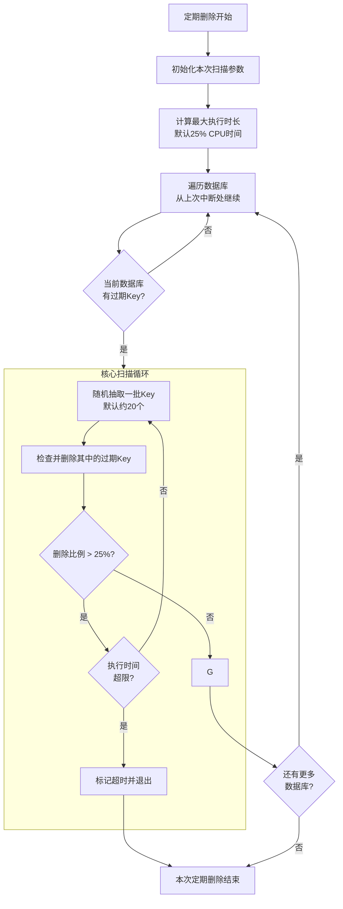
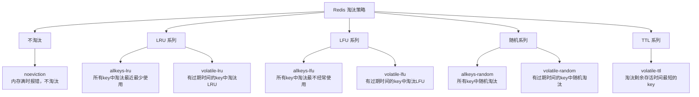
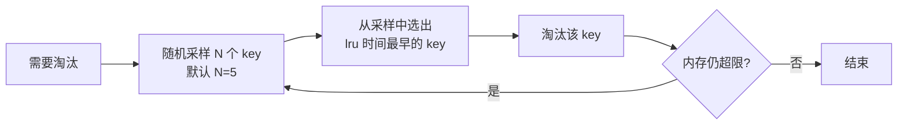
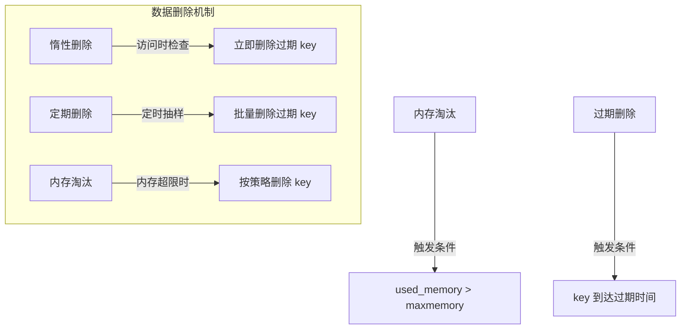

# 过期策略

Redis的过期策略指的是：当一个key到达设定的过期时间后，Redis如何将其从内存中删除。

为了在内存和CPU之间取得平衡，Redis并没有采用单一策略，而是结合了惰性删除和定期删除两种方式

## 🐌惰性删除 (Lazy Expiry)

*   核心逻辑：当客户端访问一个key时，Redis会先检查它是否过期。如果过期，则立即删除该key并返回空值。
*   优点：对CPU非常友好，因为它只在必要时才工作，无需浪费CPU资源去检查其他未访问的key。
*   缺点：对内存不友好。如果一个key过期后再也没有被访问，它将一直占用内存，造成"内存垃圾"

## 🔄 定期删除 (Periodic Expiry)

为了解决惰性删除可能导致的"垃圾"key堆积问题，Redis会主动执行定期删除。

*   核心逻辑：Redis会定期（默认每秒10次，由`hz`参数控制, 用1000/hz, hz默认为100）从设置了过期时间的key集合中，随机抽取一批进行过期检查。
*   检查规则：

    1.  随机抽取20个key。
    2.  删除其中所有已过期的key。
    3.  如果本次被删除的key数量 > 5个（即超过总数的25%），则重复步骤1，继续清理。
*   执行保护：为了防止长时间占用CPU，定期删除的循环执行有一个最大执行时间限制（g默认25ms），时间到了就会退出，避免影响Redis的正常服务。
*   优点：是CPU和内存之间一个较好的平衡方案。
*   缺点：这是一种"近似"清理，并非实时，某些过期key可能暂时未被扫描到

### 删除流程



#### 🎯1. 自适应扫描策略：从“随机取样”到“智能迭代”

Redis 6.0 并没有采用全量扫描，而是使用一种高效的概率性抽样策略，这在保留定期删除优点的同时，避免了性能开销。

    db->expires 字典（存储所有设置了过期时间的 Key）
    ┌─────────────────────────────────────────────────┐
    │  Hash 桶 0  │  Hash 桶 1  │  Hash 桶 2  │  ...   │
    │  ┌───────┐  │  ┌───────┐  │  ┌───────┐  │        │
    │  │ Key A │  │  │ Key D │  │  │ Key G │  │        │
    │  │ Key B │  │  │ Key E │  │  │ Key H │  │        │
    │  │ Key C │  │  └───────┘  │  │ Key I │  │        │
    │  └───────┘  │             │  └───────┘  │        │
    │             │             │             │        │
    │             │             │             │        │
    │             │             │             │        │
    └─────────────────────────────────────────────────┘

*   扫描基础单位：Hash桶：Redis 的过期Key存储在 `expires` 字典中。扫描时，它不再单纯地随机取N个Key，而是以Hash桶为维度进行扫描。

    *   抽样规则：每次迭代会从一个Hash桶中取出该桶内所有的Key进行检查。这样做效率更高，一次内存访问可以检查多个Key。
    *   自适应迭代：核心循环会持续进行，直到在一次迭代中，被删除的过期Key数量占本次抽样总数比例 ≤ 25%，才会停止对当前数据库的扫描，转而处理下一个数据库。这意味着，如果过期的Key很多，Redis会主动加强清理力度。
    *   每次迭代最多检查 20 个 Key,  但是每个桶的数据也都会扫完. 比如第一个桶15个 < 20, 那么第二个桶有50个数据也会扫描完, 一共65个数据
    *   每次迭代最多扫描 400 个桶

#### ⏱️ 2. 严格的CPU使用控制

Redis 6.0 通过精确的时间控制，确保定期删除任务不会喧宾夺主，影响正常的服务响应。

*   运行频率：由 `hz` 配置项决定，默认为 `10`，即每秒执行10次。调高 `hz` 可以让过期Key清理得更及时，但也会略微增加CPU开销。
*   执行时长上限：为了防止卡顿，每次 `activeExpireCycle` 函数有一个执行时间预算。在 `SLOW` 模式（常规模式）下，这个预算默认是CPU处理时间的25%。例如，在 `hz = 10` 的情况下，每次任务的时长预算约为25毫秒。如果扫描超时，会立即退出，并在下一个周期从上次中断的地方继续( 会有 `expires_cursor` 记录Hash桶的位置, expires\_cursor 本质：一个指向哈希桶数组的索引（数字）) , 避免对单次请求造成延迟影响。

#### 🚀 3. 两种工作模式：SLOW 与 FAST

为了进一步优化体验，`activeExpireCycle` 会在两种模式下工作：

*   `ACTIVE_EXPIRE_CYCLE_SLOW`：常规模式。由 `serverCron` 周期性触发（每秒10次），执行时间预算为CPU时间的25%，是清理过期Key的主力。
*   `ACTIVE_EXPIRE_CYCLE_FAST`：快速模式。在Redis进入 `beforeSleep()`（即处理完一批命令，即将进入下一轮事件循环前）时触发。它的执行时间预算很短，固定为1毫秒，目的是利用请求间隙“见缝插针”地清理一小部分过期Key，缓解内存压力。

# 淘汰策略

当 Redis 的内存使用达到配置的上限（maxmemory）时，就需要通过淘汰策略来腾出空间给新数据。这与过期删除策略（惰性删除+定期删除）是两个不同的机制。

## 为什么需要淘汰策略

| 场景                 | 说明                                                     |
| :------------------- | :------------------------------------------------------- |
| **内存有限**         | Redis 是内存数据库，物理内存总有上限                     |
| **过期删除不彻底**   | 惰性删除依赖访问，定期删除是抽样扫描，都可能残留过期 key |
| **无过期时间的 key** | 有些 key 根本没设过期时间，永远不会被主动删除            |
| **写入压力大**       | 新写入速度超过删除速度，内存持续增长                     |

当 `used_memory > maxmemory` 时，Redis 会根据配置的淘汰策略，从现有 key 中选择一部分删除，直到内存降到限制以下。

## 淘汰策略总览（Redis 6.0）



### 策略分类详解

| 策略名称            | 作用范围         | 淘汰算法            | 适用场景                 |
| :------------------ | :--------------- | :------------------ | :----------------------- |
| **noeviction**      | 无淘汰           | 不淘汰，写入报错    | 不允许丢失数据的场景     |
| **allkeys-lru**     | 所有 key         | LRU（最近最少使用） | 通用，有冷热数据分布     |
| **volatile-lru**    | 有过期时间的 key | LRU                 | 只淘汰临时数据           |
| **allkeys-lfu**     | 所有 key         | LFU（最不经常使用） | 访问频率差异明显         |
| **volatile-lfu**    | 有过期时间的 key | LFU                 | 淘汰访问频率低的临时数据 |
| **allkeys-random**  | 所有 key         | 随机                | 数据访问无明显热点       |
| **volatile-random** | 有过期时间的 key | 随机                | 临时数据，无访问规律     |
| **volatile-ttl**    | 有过期时间的 key | TTL 最短优先        | 希望优先淘汰快过期的数据 |

### 策略名称解读

*   allkeys：作用于所有 key（无论是否设置过期时间）
*   volatile：只作用于设置了过期时间的 key
*   LRU：Least Recently Used，最近最少使用
*   LFU：Least Frequently Used，最不经常使用（Redis 4.0 新增）
*   TTL：Time To Live，剩余存活时间

## 核心淘汰算法详解

### LRU（Least Recently Used）

核心思想：最近被访问过的 key，将来被访问的概率更高；长期未被访问的 key，优先被淘汰。



采样数 `maxmemory-samples`：

*   默认值：5
*   值越大，淘汰越精确，但 CPU 消耗越高
*   设置为 10 时，效果接近精确 LRU

LRU 的问题：

*   只记录“最近一次访问”，不记录访问频率
*   一个 key 被大量访问后很久没碰，可能被误淘汰（冷数据问题）

### LFU（Least Frequently Used）

核心思想：访问频率越高的 key，将来被访问的概率更高；访问次数最少的 key 优先被淘汰。

Redis 的 LFU 实现（Redis 4.0 引入）：

复用 `lru` 字段（24 bits）：

*   高 16 bits：`ldt`（last decrement time），上次衰减时间
*   低 8 bits：`logc`（logistic counter），对数计数器的值（0-255）

LFU 的优势：

*   解决 LRU 的冷数据问题
*   能识别“长期高频访问”的热点数据

### TTL 淘汰

核心思想：从设置了过期时间的 key 中，挑选剩余存活时间最短的淘汰。

```c
// 采样 N 个 volatile key，选出 ttl 最小的淘汰
best = sample[0];
for (i = 1; i < N; i++) {
    if (sample[i].ttl < best.ttl) {
        best = sample[i];
    }
}
evict(best);
```

## 配置与调优

### 基础配置

```conf
# 最大内存限制（必须设置）
maxmemory 4gb

# 淘汰策略（默认 noeviction）
maxmemory-policy allkeys-lru

# 采样数（影响 LRU/LFU/TTL 的精度）
maxmemory-samples 5

# 淘汰清理的"努力程度"（Redis 5.0+）
maxmemory-eviction-tenacity 10
```

### 策略选择指南

| 业务场景                   | 推荐策略         | 原因                                       |
| :------------------------- | :--------------- | :----------------------------------------- |
| **通用缓存**               | `allkeys-lru`    | 利用时间局部性，保留热点数据               |
| **热点数据有明显频率差异** | `allkeys-lfu`    | 识别高频访问，保留真正热门的数据           |
| **只淘汰临时数据**         | `volatile-lru`   | 永久数据不淘汰，只淘汰设置了过期时间的 key |
| **数据访问无规律**         | `allkeys-random` | LRU/LFU 没有意义，随机淘汰成本最低         |
| **希望优先淘汰快过期的**   | `volatile-ttl`   | 基于时间维度的淘汰                         |
| **不允许丢失任何数据**     | `noeviction`     | 内存满时写入报错（适合数据库场景）         |

## 淘汰与过期删除的关系



| 维度           | 过期删除         | 内存淘汰                 |
| :------------- | :--------------- | :----------------------- |
| **触发条件**   | key 到达过期时间 | 内存使用超过 `maxmemory` |
| **目标对象**   | 已过期的 key     | 任意 key（根据策略）     |
| **执行时机**   | 访问时 + 定期    | 每次写入命令后           |
| **是否可配置** | 否（自动执行）   | 是（`maxmemory-policy`） |

# 常见问题

### Q1：设置了过期时间的 key 会被 allkeys-\* 策略淘汰吗？

会。`allkeys-*` 策略作用于所有 key，无论是否设置过期时间。

### Q2：volatile-\* 策略下，没有过期时间的 key 会被淘汰吗？

不会。`volatile-*` 只从设置了过期时间的 key 中选择淘汰对象，永久 key 不会被淘汰。

### Q3：maxmemory 应该设置多少？

一般设置为总内存的 50%-80%：

*   留出空间给操作系统和其他进程
*   考虑 Redis 的碎片和 COW（写时复制）开销

### Q4：淘汰会导致数据丢失吗？

取决于策略：

*   `noeviction`：不淘汰，写入失败，不丢数据
*   其他策略：会主动删除 key，造成数据丢失

Redis 内存淘汰是内存不足时的“最后防线”，通过配置合理的 maxmemory-policy，在内存和数据之间找到平衡。