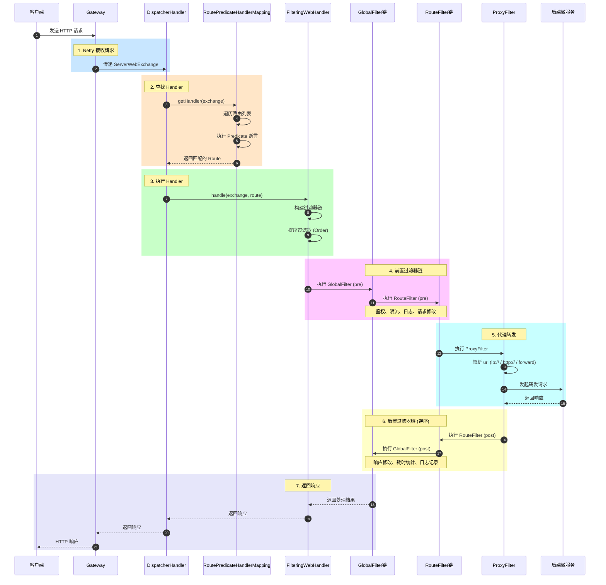

# Spring Cloud Gateway 简介

Spring Cloud Gateway 是一个基于 Spring Framework 5、Project Reactor 和 Spring Boot 2.x 构建的**API 网关**解决方案，旨在为微服务架构提供简单、高效、统一的**路由转发和过滤处理**能力。

使用的是WebFlux  使用的Netty服务器

> 官网地址: <https://spring.io/projects/spring-cloud-gateway>

## 核心特点

*   异步非阻塞：基于 Spring WebFlux（Reactor），底层使用 Netty，相比传统 Servlet 网关（如 Zuul 1.x）性能更高、资源占用更少
*   路由转发：将客户端请求转发到对应的后端微服务
*   过滤器链：支持在请求前、请求后、请求前后添加自定义逻辑
*   断言工厂：内置丰富的路由匹配条件（路径、请求头、参数、时间等）
*   集成服务发现：可无缝集成 Eureka、Consul、Nacos 等注册中心
*   限流熔断：支持与 Sentinel、Resilience4j 等集成

## 核心概念

| 概念                  | 说明                                                         |
| :-------------------- | :----------------------------------------------------------- |
| **Route（路由）**     | 网关的基本构建块，包含 ID、目标 URI、断言集合和过滤器集合    |
| **Predicate（断言）** | Java 8 Function 条件，用于匹配 HTTP 请求（如路径、方法、Header 等） |
| **Filter（过滤器）**  | 在请求被路由前后修改请求或响应（如添加 Header、鉴权、日志）  |

## 核心流程




| 组件                             | 职责                                    | 关键方法                    |
| :------------------------------- | :-------------------------------------- | :-------------------------- |
| **Netty Web Server**             | 接收 HTTP 请求，异步非阻塞 I/O          | `HttpServer.handle()`       |
| **DispatcherHandler**            | WebFlux 核心分发器，协调 HandlerMapping | `handle(ServerWebExchange)` |
| **RoutePredicateHandlerMapping** | 遍历路由，匹配 Predicate 断言           | `getHandlerInternal()`      |
| **FilteringWebHandler**          | 构建并执行过滤器链                      | `handle(ServerWebExchange)` |
| **GlobalFilter**                 | 全局过滤器（作用于所有路由）            | `filter(exchange, chain)`   |
| **GatewayFilter**                | 路由级过滤器（特定路由）                | `filter(exchange, chain)`   |
| **Proxy Filter**                 | 转发请求到后端服务                      | `filter(exchange, chain)`   |

## 适用场景

*   微服务统一入口，隐藏内部服务结构
*   跨服务通用逻辑（鉴权、日志、限流、熔断）
*   请求转发、重试、路径重写
*   跨域处理、响应聚合

## 与 Zuul 对比

| 对比项   | Spring Cloud Gateway | Zuul 1.x     |
| :------- | :------------------- | :----------- |
| 底层     | Netty + WebFlux      | Servlet      |
| 模型     | 异步非阻塞           | 同步阻塞     |
| 性能     | 高                   | 一般         |
| 维护状态 | 积极维护             | 已进入维护期 |

> 注：Netflix 已开源 Zuul 2.x 也支持异步，但目前 Spring Cloud 生态中 Gateway 是官方推荐的网关方案。

# 创建网关项目

通过 Spring Initializr

*   搜索并勾选：Gateway（Spring Cloud Gateway）
*   搜索并勾选：Spring Boot Actuator（可选，用于监控）
*   按需选择：Nacos 以及 Loadbalancer , 用于服务发现路由 (Gateway本身没有负载均衡的能力, 如果开启了服务发现路由不继承loadbalancer会报错)

> 不要选择 Web 依赖（Gateway 基于 WebFlux，与 Spring MVC 冲突）

```yaml
# bootstrap.yml - 引导配置（最先加载）

spring:
  application:
    name: gateway-server           # 应用名称，用于服务注册和配置中心
  
  cloud:
    # Nacos 配置中心（用于动态获取配置）
    nacos:
      config:
        server-addr: 127.0.0.1:8848
        namespace: public           # 命名空间
        group: DEFAULT_GROUP        # 分组
        file-extension: yaml        # 配置文件格式
        # 共享配置（多个服务共用）
        shared-configs:
          - data-id: common-config.yaml
            group: DEFAULT_GROUP
            refresh: true
        # 扩展配置（当前服务特定）
        extension-configs:
          - data-id: gateway-routes.yaml
            group: DEFAULT_GROUP
            refresh: true
    
    # Nacos 服务发现（这里只配置 config，discovery 可以放 application.yml）
    # 或者两个都放这里也可以

# 配置中心开关（默认开启）
spring.cloud.nacos.config.enabled: true

# 是否启用配置自动刷新
spring.cloud.nacos.config.refresh-enabled: true
```

```yaml
# application.yml - 应用配置（后加载，会覆盖 bootstrap.yml 中的同名配置）

server:
  port: 8080

spring:
  application:
    name: gateway-server           # 可与 bootstrap 重复，application 优先级更高
  
  cloud:
    # Nacos 服务发现
    nacos:
      discovery:
        server-addr: 127.0.0.1:8848
        namespace: public
        group: DEFAULT_GROUP
        # 注册自己的 IP（多网卡时指定）
        # ip: 127.0.0.1
        # 是否注册到 Nacos
        register-enabled: true
        # 是否从 Nacos 获取服务列表
        fetch-enabled: true
    
    # Gateway 路由配置
    gateway:
      # 服务发现路由（自动根据服务名转发）
      discovery:
        locator:
          enabled: true
          lower-case-service-id: true
      
      # 静态路由（与动态路由并存）
      routes:
        - id: user-service-route
          uri: lb://user-service        # 负载均衡到 Nacos 中的 user-service
          predicates:
            - Path=/api/users/**
          filters:
            - StripPrefix=1
            - name: Retry
              args:
                retries: 3
                statuses: BAD_GATEWAY
        
        - id: order-service-route
          uri: lb://order-service
          predicates:
            - Path=/api/orders/**
          filters:
            - StripPrefix=1
            - name: RequestRateLimiter
              args:
                key-resolver: "#{@ipKeyResolver}"
                redis-rate-limiter.replenishRate: 10
                redis-rate-limiter.burstCapacity: 20

# 数据库配置（示例）
  datasource:
    url: jdbc:mysql://localhost:3306/gateway_db?useSSL=false
    username: root
    password: 123456
    driver-class-name: com.mysql.cj.jdbc.Driver

# Redis 配置（用于限流、Session等）
  redis:
    host: localhost
    port: 6379
    database: 0
    timeout: 5000ms

# 日志配置
logging:
  level:
    com.example.gateway: DEBUG
    org.springframework.cloud.gateway: INFO
  pattern:
    console: "%d{yyyy-MM-dd HH:mm:ss} - %msg%n"

# Actuator 监控端点
management:
  endpoints:
    web:
      exposure:
        include: "*"
      base-path: /actuator
  endpoint:
    gateway:
      enabled: true
    health:
      show-details: always
  metrics:
    export:
      prometheus:
        enabled: true

# 业务自定义配置
app:
  gateway:
    allowed-origins:
      - "http://localhost:3000"
      - "http://localhost:4200"
    rate-limit:
      enabled: true
      default-limit: 100
```

# 路由规则核心组成

```yaml
spring:
  cloud:
    gateway:
      routes:
        - id: route_id                    # 路由唯一标识
          uri: http://example.org         # 转发目标地址
          predicates:                     # 断言规则（匹配条件）
            - Path=/api/**
            - Method=GET
          filters:                        # 过滤器（可选）
            - AddRequestHeader=X-Token, abc
          order: 0                        # 路由优先级（数字越小优先级越高）
```

# 断言 Predicate

断言（Predicate）是 Spring Cloud Gateway 中用于匹配 HTTP 请求条件的规则，只有满足所有断言条件的请求才会被转发到对应的目标服务。

## 内置断言工厂（Built-in Predicate Factories）

Gateway内置了11个断言工厂: Gateway默认提供了11个路由 可以在[https://docs.spring.io/spring-cloud-gateway/docs/2.2.5.RELEASE/reference/html/#the-path-route-predicate-factory](https://docs.spring.io/spring-cloud-gateway/docs/2.2.5.RELEASE/reference/html/#the-path-route-predicate-factory看到) 看到

## Path - 路径匹配断言（最常用）

```yaml
spring:
  cloud:
    gateway:
      routes:
        - id: path-route
          uri: http://example.com
          predicates:
            # 单路径匹配
            - Path=/api/users/**
            
            # 多路径匹配（OR 关系）
            - Path=/api/users/**, /api/orders/**
            
            # 带路径变量
            - Path=/api/users/{userId}
            - Path=/api/users/{userId}/orders/{orderId}
```

| 表达式 | 说明         | 示例匹配                       |
| :----- | :----------- | :----------------------------- |
| `?`    | 匹配单个字符 | `/api/user?` → `/api/users` ✅  |
| `*`    | 匹配任意字符 | `/api/*` → `/api/users` ✅      |
| `**`   | 匹配任意路径 | `/api/**` → `/api/users/123` ✅ |

## Method - 请求方法断言

```yaml
predicates:
  # 单个方法
  - Method=GET
  
  # 多个方法
  - Method=GET, POST, PUT, DELETE
  
  # 所有常用方法
  - Method=GET, POST, PUT, DELETE, PATCH, OPTIONS, HEAD
```

## Header - 请求头断言

```yaml
predicates:
  # 只要存在该 Header 即可
  - Header=X-Request-Id
  
  # Header 值正则匹配
  - Header=X-Request-Id, \d+
  
  # Header 值精确匹配
  - Header=Content-Type, application/json
  
  # Header 值包含
  - Header=User-Agent, .*Chrome.*
  
  # 不区分大小写
  - Header=X-Token, (?i)admin
```

## Query - 请求参数断言

```yaml
predicates:
  # 只要存在该参数即可
  - Query=page
  
  # 参数值正则匹配
  - Query=page, \d+
  
  # 参数值精确匹配
  - Query=status, active
  
  # 参数值包含
  - Query=q, .*keyword.*
  
  # 多参数（多个 Query 条件）
  - Query=page, \d+
  - Query=size, [1-9][0-9]?
```

示例:

```text
GET /api/users?page=1&size=10&status=active  ✅
GET /api/users?page=abc                      ❌ (不是数字)
GET /api/users?size=10                       ❌ (缺少 page)
```

## Cookie - Cookie 断言

```yaml
predicates:
  # 只要存在该 Cookie
  - Cookie=sessionId
  
  # Cookie 值正则匹配
  - Cookie=sessionId, \w+
  
  # Cookie 值精确匹配
  - Cookie=user, admin
  
  # 多个 Cookie
  - Cookie=sessionId, \w+
  - Cookie=user, .+
```

## 其他断言

```yaml
spring:
  cloud:
    gateway:
      routes:
        # ==================== 1. Host 断言示例 ====================
        - id: host-assertion-route
          uri: lb://user-service
          predicates:
            - Host=**.example.com, **.api.com
            - Path=/api/**
          filters:
            - StripPrefix=1
            - AddResponseHeader=X-Route-Type, host-assertion

        # ==================== 2. RemoteAddr 断言示例 ====================
        - id: remoteaddr-assertion-route
          uri: lb://admin-service
          predicates:
            - RemoteAddr=192.168.1.0/24, 10.0.0.0/8
            - Path=/admin/**
          filters:
            - StripPrefix=1
            - AddResponseHeader=X-Route-Type, remoteaddr-assertion

        # ==================== 3. After/Before/Between 时间断言示例 ====================
        # 3.1 After - 在指定时间之后生效
        - id: after-time-route
          uri: lb://promotion-service
          predicates:
            - After=2025-01-01T00:00:00+08:00
            - Path=/api/promotion/**
          filters:
            - StripPrefix=1
            - AddResponseHeader=X-Route-Type, after-time

        # 3.2 Before - 在指定时间之前生效
        - id: before-time-route
          uri: lb://beta-service
          predicates:
            - Before=2025-12-31T23:59:59+08:00
            - Path=/api/beta/**
          filters:
            - StripPrefix=1
            - AddResponseHeader=X-Route-Type, before-time

        # 3.3 Between - 在时间段内生效
        - id: between-time-route
          uri: lb://activity-service
          predicates:
            - Between=2025-06-01T00:00:00+08:00, 2025-06-30T23:59:59+08:00
            - Path=/api/activity/**
          filters:
            - StripPrefix=1
            - AddResponseHeader=X-Route-Type, between-time

        # ==================== 4. Weight 权重断言示例（灰度发布）====================
        # 4.1 稳定版 - 80% 流量
        - id: weight-stable-route
          uri: lb://app-service-v1
          predicates:
            - Path=/api/**
            - Weight=app-group, 80
          filters:
            - StripPrefix=1
            - AddResponseHeader=X-App-Version, v1

        # 4.2 灰度版 - 20% 流量
        - id: weight-canary-route
          uri: lb://app-service-v2
          predicates:
            - Path=/api/**
            - Weight=app-group, 20
          filters:
            - StripPrefix=1
            - AddResponseHeader=X-App-Version, v2
            - AddResponseHeader,X-Canary, true

        # ==================== 5. CloudFoundryRouteService 断言示例 ====================
        # 注意：需要部署在 Cloud Foundry 环境中才能使用
        - id: cloudfoundry-route
          uri: lb://cf-service
          predicates:
            - CloudFoundryRouteService=cf-application-id
            - Path=/api/cf/**
          filters:
            - StripPrefix=1
            - AddResponseHeader,X-CloudFoundry, true

        # ==================== 6. XForwardedRemoteAddr 断言示例 ====================
        # 用于反向代理场景，获取真实的客户端 IP
        - id: xforwarded-route
          uri: lb://internal-service
          predicates:
            - XForwardedRemoteAddr=192.168.1.0/24, 172.16.0.0/12
            - Path=/api/internal/**
          filters:
            - StripPrefix=1
            - AddResponseHeader,X-Real-IP, true
            # 可选：保留原始 X-Forwarded-For 头
            - PreserveHostHeader=true

        # ==================== 组合断言示例（多个断言同时使用）====================
        - id: combined-assertion-route
          uri: lb://premium-service
          predicates:
            # 主机名必须是 api.example.com
            - Host=api.example.com
            # IP 必须来自内网
            - RemoteAddr=10.0.0.0/8, 172.16.0.0/12, 192.168.0.0/16
            # 必须在活动期间内
            - Between=2025-01-01T00:00:00+08:00, 2025-12-31T23:59:59+08:00
            # 路径必须是 /premium/**
            - Path=/premium/**
            # 灰度权重 10%
            - Weight=premium-group, 10
            # 来自反向代理的真实 IP
            - XForwardedRemoteAddr=10.0.0.0/8
          filters:
            - StripPrefix=1
            - AddRequestHeader=X-Premium, true
            - AddResponseHeader,X-Route-Type, combined

        # ==================== 7. 兜底路由（404 处理）====================
        - id: fallback-route
          uri: forward:/fallback/not-found
          predicates:
            - Path=/**
          order: 999
```

## 断言组合

### AND 组合（默认）

```yaml
predicates:
  - Path=/api/users/**
  - Method=GET
  - Header=X-Token, \w+
  - Query=page, \d+
# 所有条件必须同时满足
```

### OR 组合（需要自定义）

```java
@Bean
public RouteLocator customRouteLocator(RouteLocatorBuilder builder) {
    return builder.routes()
        .route("or-route", r -> r
            .predicate(exchange -> 
                exchange.getRequest().getPath().toString().startsWith("/api") ||
                exchange.getRequest().getHeaders().containsKey("X-Custom")
            )
            .uri("http://example.com"))
        .build();
}
```

### 否定断言（Not）

```java
@Bean
public RouteLocator customRouteLocator(RouteLocatorBuilder builder) {
    return builder.routes()
        .route("not-route", r -> r
            .not(exchange -> 
                exchange.getRequest().getPath().toString().startsWith("/admin"))
            .uri("http://example.com"))
        .build();
}
```

> 也可以继承 `AbstractRoutePredicateFactory` 实现自定义断言

# 动态路由实现方案

动态路由是指**不重启网关服务**，即可动态增删改路由规则。下面介绍几种主流方案。

## Nacos 配置中心（推荐）

```xml
<!-- Nacos 配置中心 -->
<dependency>
    <groupId>com.alibaba.cloud</groupId>
    <artifactId>spring-cloud-starter-alibaba-nacos-config</artifactId>
</dependency>

<!-- 支持动态刷新 -->
<dependency>
    <groupId>org.springframework.boot</groupId>
    <artifactId>spring-boot-starter-actuator</artifactId>
</dependency>

<!-- Spring Cloud Bootstrap（Spring Boot 2.4+ 需要） -->
<dependency>
    <groupId>org.springframework.cloud</groupId>
    <artifactId>spring-cloud-starter-bootstrap</artifactId>
</dependency>
```

### bootstrap.yml

```yaml
spring:
  application:
    name: gateway-server
  
  cloud:
    nacos:
      config:
        server-addr: 127.0.0.1:8848
        namespace: public
        group: DEFAULT_GROUP
        file-extension: yaml
        # 监听配置变化
        refresh-enabled: true
        # 共享配置（可选）
        shared-configs:
          - data-id: gateway-routes.yaml
            group: DEFAULT_GROUP
            refresh: true

# 开启动态刷新端点
management:
  endpoints:
    web:
      exposure:
        include: refresh,health
```

### application.yml

```yaml
server:
  port: 8080

spring:
  cloud:
    gateway:
      discovery:
        locator:
          enabled: true
          lower-case-service-id: true
      # 初始路由（可选，会被 Nacos 覆盖）
      routes: []

# 开启所有 Gateway 端点
management:
  endpoints:
    web:
      exposure:
        include: "*"
  endpoint:
    gateway:
      enabled: true
```

### 在 Nacos 创建配置

*   Data ID: gateway-server.yaml（与 spring.application.name 一致）
*   Group: DEFAULT\_GROUP&#x20;
*   配置格式: YAML

```yaml
# Nacos 中的路由配置
spring:
  cloud:
    gateway:
      routes:
        - id: user-service-route
          uri: lb://user-service
          predicates:
            - Path=/api/users/**
            - Method=GET,POST,PUT,DELETE
          filters:
            - StripPrefix=1
            - AddRequestHeader=X-From-Nacos, true
          order: 0
        
        - id: order-service-route
          uri: lb://order-service
          predicates:
            - Path=/api/orders/**
            - Header=X-Auth-Token, .+
          filters:
            - StripPrefix=1
            - name: Retry
              args:
                retries: 3
        
        - id: httpbin-route
          uri: https://httpbin.org
          predicates:
            - Path=/httpbin/**
          filters:
            - StripPrefix=1
          order: 10
```

### 配置动态刷新（使用 @RefreshScope）

```java
package com.example.gateway.config;

import org.springframework.beans.factory.annotation.Autowired;
import org.springframework.cloud.context.config.annotation.RefreshScope;
import org.springframework.cloud.gateway.route.RouteDefinition;
import org.springframework.cloud.gateway.route.RouteDefinitionLocator;
import org.springframework.cloud.gateway.route.RouteDefinitionWriter;
import org.springframework.stereotype.Component;
import reactor.core.publisher.Mono;

import javax.annotation.PostConstruct;
import java.util.List;

@Component
@RefreshScope
public class DynamicRouteLoader {
    
    @Autowired
    private RouteDefinitionWriter routeDefinitionWriter;
    
    @Autowired
    private RouteDefinitionLocator routeDefinitionLocator;
    
    @Autowired
    private GatewayRouteProperties gatewayRouteProperties; // 配置属性类
    
    @PostConstruct
    public void loadRoutes() {
        // 从配置属性中获取路由
        List<RouteDefinition> routes = gatewayRouteProperties.getRoutes();
        updateRoutes(routes);
    }
    
    @RefreshScope
    @Component
    @ConfigurationProperties(prefix = "spring.cloud.gateway")
    public static class GatewayRouteProperties {
        private List<RouteDefinition> routes;
        // getter/setter
    }
    
    private void updateRoutes(List<RouteDefinition> newRoutes) {
        // 清空旧路由
        routeDefinitionLocator.getRouteDefinitions()
            .flatMap(route -> routeDefinitionWriter.delete(Mono.just(route.getId())))
            .subscribe();
        
        // 添加新路由
        newRoutes.forEach(route -> 
            routeDefinitionWriter.save(Mono.just(route)).subscribe()
        );
    }
}
```

## Actuator API（手动刷新）

> API地址: <https://docs.spring.io/spring-cloud-gateway/docs/2.2.5.RELEASE/reference/html/#actuator-api>

### 开启端点

```yaml
management:
  endpoints:
    web:
      exposure:
        include: gateway
  endpoint:
    gateway:
      enabled: true
```

### 手动操作

```bash
# 查看所有路由
curl http://localhost:8080/actuator/gateway/routes

# 添加路由
curl -X POST http://localhost:8080/actuator/gateway/routes/user-route \
  -H "Content-Type: application/json" \
  -d '{
    "id": "user-route",
    "uri": "lb://user-service",
    "predicates": [
      {"name": "Path", "args": {"pattern": "/api/users/**"}}
    ],
    "filters": [
      {"name": "StripPrefix", "args": {"parts": "1"}}
    ]
  }'

# 删除路由
curl -X DELETE http://localhost:8080/actuator/gateway/routes/user-route

# 刷新路由
curl -X POST http://localhost:8080/actuator/gateway/refresh
```

# Filter 过滤器

Filter（过滤器）是 Gateway 中用于在请求转发前后执行自定义逻辑的组件，可以对请求和响应进行**拦截、修改和处理**。

| 类型              | 说明       | 作用范围 | 配置方式                     |
| :---------------- | :--------- | :------- | :--------------------------- |
| **GatewayFilter** | 路由过滤器 | 单个路由 | `filters` 下配置             |
| **GlobalFilter**  | 全局过滤器 | 所有路由 | 代码实现 `GlobalFilter` 接口 |
| **DefaultFilter** | 默认过滤器 | 所有路由 | `default-filters` 下配置     |

## 内置 GatewayFilter（30+ 种）

### 请求头修改类

```yaml
filters:
  # 添加请求头
  - AddRequestHeader=X-Request-Id, 123456
  - AddRequestHeader=X-User-Id, ${userId}
  
  # 移除请求头
  - RemoveRequestHeader=X-Insecure-Token
  
  # 修改请求头
  - SetRequestHeader=X-Original, new-value
  
  # 添加请求参数
  - AddRequestParameter=source, gateway
  
  # 添加响应头
  - AddResponseHeader=X-Response-Time, ${now}
  
  # 移除响应头
  - RemoveResponseHeader=X-Powered-By
  
  # 修改响应头
  - SetResponseHeader=X-Custom, custom-value
  
  # 如果响应头不存在则添加
  - SetResponseHeaderIfAbsent=X-Default, default
```

### 路径修改类

```yaml
filters:
  # 去除路径前缀（最常用）
  - StripPrefix=1        # /api/users/123 → /users/123
  - StripPrefix=2        # /api/v1/users/123 → /users/123
  
  # 添加路径前缀
  - PrefixPath=/api      # /users/123 → /api/users/123
  
  # 重写路径（正则）
  - RewritePath=/api/users/(?<segment>.*), /users/$\{segment}
  # /api/users/123 → /users/123
  
  - RewritePath=/v2/(?<segment>.*), /api/$\{segment}
  # /v2/users/123 → /api/users/123
  
  # 设置路径（直接替换）
  - SetPath=/new-path
```

### 重定向类

```yaml
filters:
  # 301 永久重定向
  - RedirectTo=301, https://new-domain.com/api
  
  # 302 临时重定向
  - RedirectTo=302, https://new-domain.com/api
  
  # 303 See Other
  - RedirectTo=303, https://new-domain.com/api
```

### 重试机制

```yaml
filters:
  - name: Retry
    args:
      retries: 3                        # 重试次数
      statuses: INTERNAL_SERVER_ERROR, BAD_GATEWAY  # 重试的 HTTP 状态码
      methods: GET, POST                # 重试的方法
      series: SERVER_ERROR              # 重试的状态码系列
      exceptions: java.io.IOException   # 重试的异常类型
      backoff:
        firstBackoff: 10ms              # 首次重试间隔
        maxBackoff: 50ms                # 最大重试间隔
        factor: 2                       # 退避因子
        basedOnPreviousValue: false
```

## 自定义全局认证过滤器

```java
@Component
@Order(0)
public class AuthGlobalFilter implements GlobalFilter {
    
    @Override
    public Mono<Void> filter(ServerWebExchange exchange, GatewayFilterChain chain) {
        ServerHttpRequest request = exchange.getRequest();
        
        // 跳过认证的路径
        List<String> skipPaths = Arrays.asList("/auth/login", "/auth/register", "/public/");
        String path = request.getPath().toString();
        if (skipPaths.stream().anyMatch(path::startsWith)) {
            return chain.filter(exchange);
        }
        
        // 获取 Token
        String token = request.getHeaders().getFirst("Authorization");
        if (token == null || !token.startsWith("Bearer ")) {
            exchange.getResponse().setStatusCode(HttpStatus.UNAUTHORIZED);
            return exchange.getResponse().setComplete();
        }
        
        // 验证 Token（伪代码）
        String jwt = token.substring(7);
        if (!validateToken(jwt)) {
            exchange.getResponse().setStatusCode(HttpStatus.UNAUTHORIZED);
            return exchange.getResponse().setComplete();
        }
        
        // 将用户信息添加到请求头
        ServerHttpRequest mutatedRequest = request.mutate()
            .header("X-User-Id", getUserIdFromToken(jwt))
            .header("X-User-Role", getUserRoleFromToken(jwt))
            .build();
        
        return chain.filter(exchange.mutate().request(mutatedRequest).build());
    }
    
    private boolean validateToken(String token) {
        // JWT 验证逻辑
        return true;
    }
    
    private String getUserIdFromToken(String token) {
        return "12345";
    }
    
    private String getUserRoleFromToken(String token) {
        return "USER";
    }
}
```

## 自定义路由过滤器

```java
@Component
public class CustomGatewayFilterFactory 
    extends AbstractGatewayFilterFactory<CustomGatewayFilterFactory.Config> {
    
    public CustomGatewayFilterFactory() {
        super(Config.class);
    }
    
    @Override
    public GatewayFilter apply(Config config) {
        return (exchange, chain) -> {
            // Pre-filter
            // xxx
            
            return chain.filter(exchange).then(Mono.fromRunnable(() -> {
                // Post-filter
                // xxxx
            }));
        };
    }
    
    @Override
    public List<String> shortcutFieldOrder() {
        return Arrays.asList("enabled", "headerValue");
    }
    
    @Data
    @NoArgsConstructor
    public static class Config {
        private boolean enabled = true;
        private String headerValue = "default";
    }
}
```

使用自定义过滤器：

```yaml
filters:
  - name: CustomGatewayFilter
    args:
      enabled: true
      headerValue: my-custom-value
```

## 限流过滤器实现 (基于 Redis 的令牌桶限流)

限流是网关的核心功能之一，用于控制单位时间内的请求数量，防止系统被突发流量冲垮。

```xml
<!-- Spring Cloud Gateway 限流需要 Redis -->
<dependency>
    <groupId>org.springframework.boot</groupId>
    <artifactId>spring-boot-starter-data-redis-reactive</artifactId>
</dependency>
```

### 配置限流 KeyResolver

```java
package com.example.gateway.config;

import org.springframework.cloud.gateway.filter.ratelimit.KeyResolver;
import org.springframework.context.annotation.Bean;
import org.springframework.context.annotation.Configuration;
import reactor.core.publisher.Mono;

@Configuration
public class RateLimiterConfig {
    
    /**
     * 基于请求 IP 限流
     */
    @Bean
    public KeyResolver ipKeyResolver() {
        return exchange -> {
            String ip = exchange.getRequest().getRemoteAddress().getAddress().getHostAddress();
            return Mono.just(ip);
        };
    }
    
    /**
     * 基于用户 ID 限流（需要从请求头获取）
     */
    @Bean
    public KeyResolver userKeyResolver() {
        return exchange -> {
            String userId = exchange.getRequest().getHeaders().getFirst("X-User-Id");
            if (userId == null) {
                userId = "anonymous";
            }
            return Mono.just(userId);
        };
    }
    
    /**
     * 基于请求路径限流
     */
    @Bean
    public KeyResolver pathKeyResolver() {
        return exchange -> {
            String path = exchange.getRequest().getPath().toString();
            return Mono.just(path);
        };
    }
    
    /**
     * 组合限流：IP + 路径
     */
    @Bean
    public KeyResolver combinedKeyResolver() {
        return exchange -> {
            String ip = exchange.getRequest().getRemoteAddress().getAddress().getHostAddress();
            String path = exchange.getRequest().getPath().toString();
            return Mono.just(ip + ":" + path);
        };
    }
}
```

### 配置限流过滤器

```java
spring:
  cloud:
    gateway:
      routes:
        - id: user-service
          uri: lb://user-service
          predicates:
            - Path=/api/users/**
          filters:
            - StripPrefix=1
            # 限流过滤器配置
            - name: RequestRateLimiter
              args:
                # 使用的 KeyResolver Bean 名称
                key-resolver: "#{@ipKeyResolver}"
                # 令牌桶每秒填充速率
                redis-rate-limiter.replenishRate: 10
                # 令牌桶最大容量（允许的突发流量）
                redis-rate-limiter.burstCapacity: 20
                # 每次请求消耗的令牌数（默认1）
                redis-rate-limiter.requestedTokens: 1
        
        - id: order-service
          uri: lb://order-service
          predicates:
            - Path=/api/orders/**
          filters:
            - StripPrefix=1
            - name: RequestRateLimiter
              args:
                key-resolver: "#{@userKeyResolver}"
                redis-rate-limiter.replenishRate: 50
                redis-rate-limiter.burstCapacity: 100
```