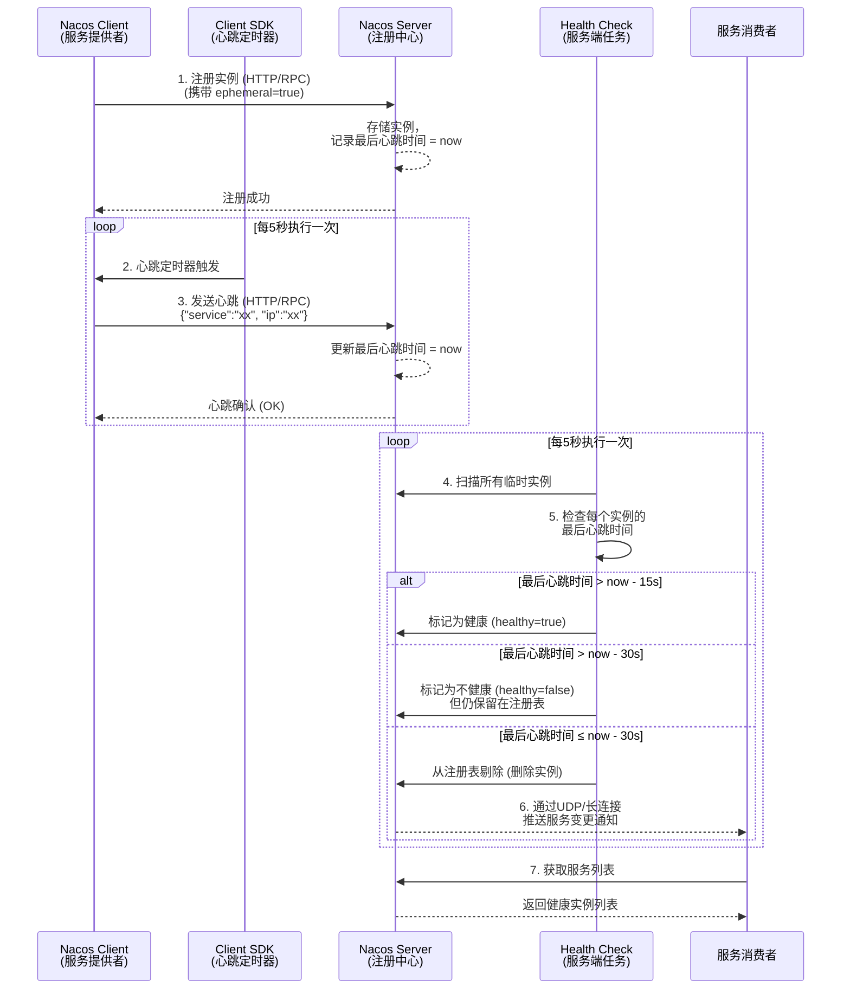
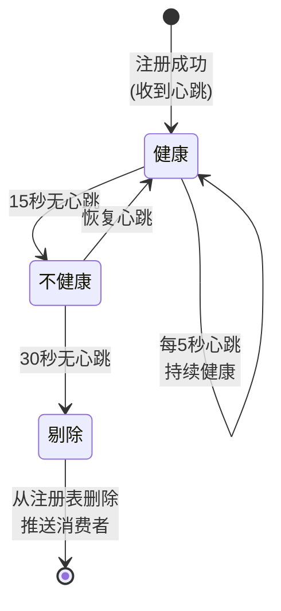
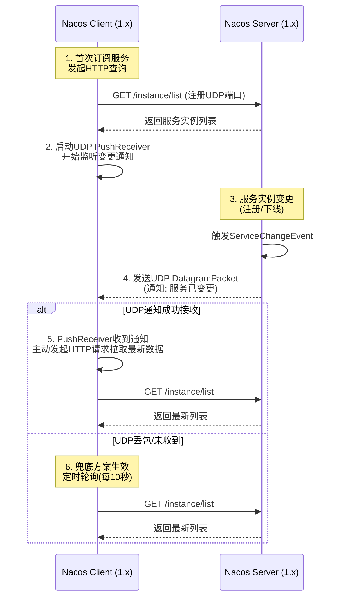
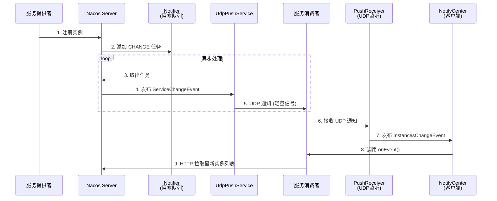
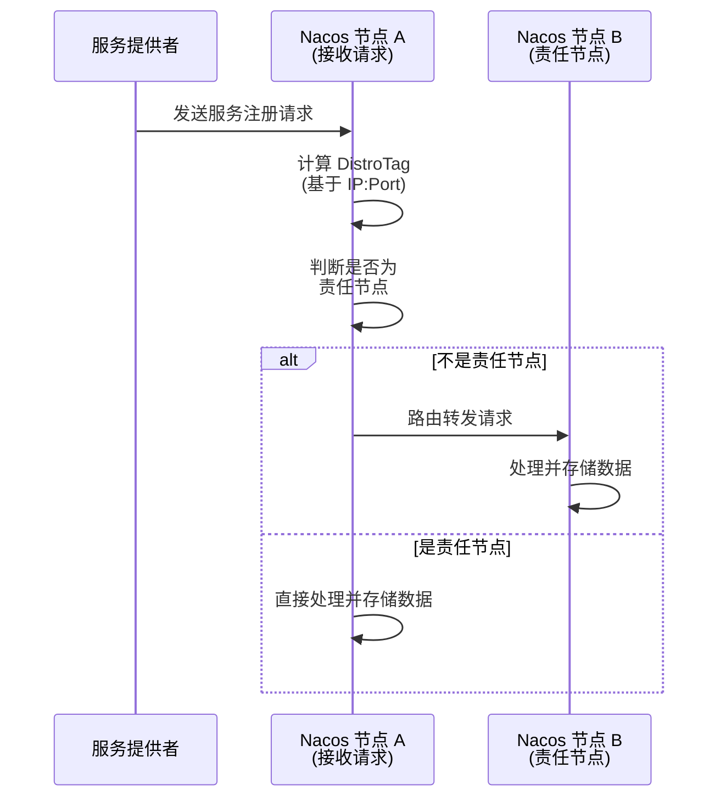
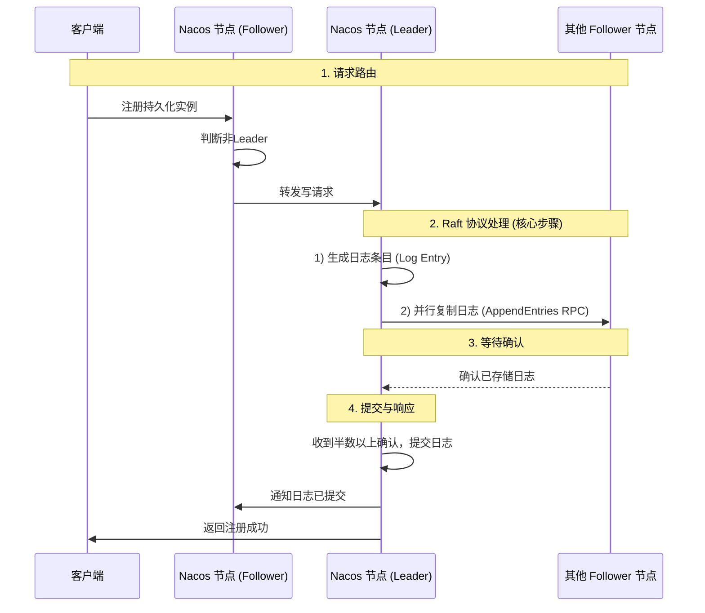
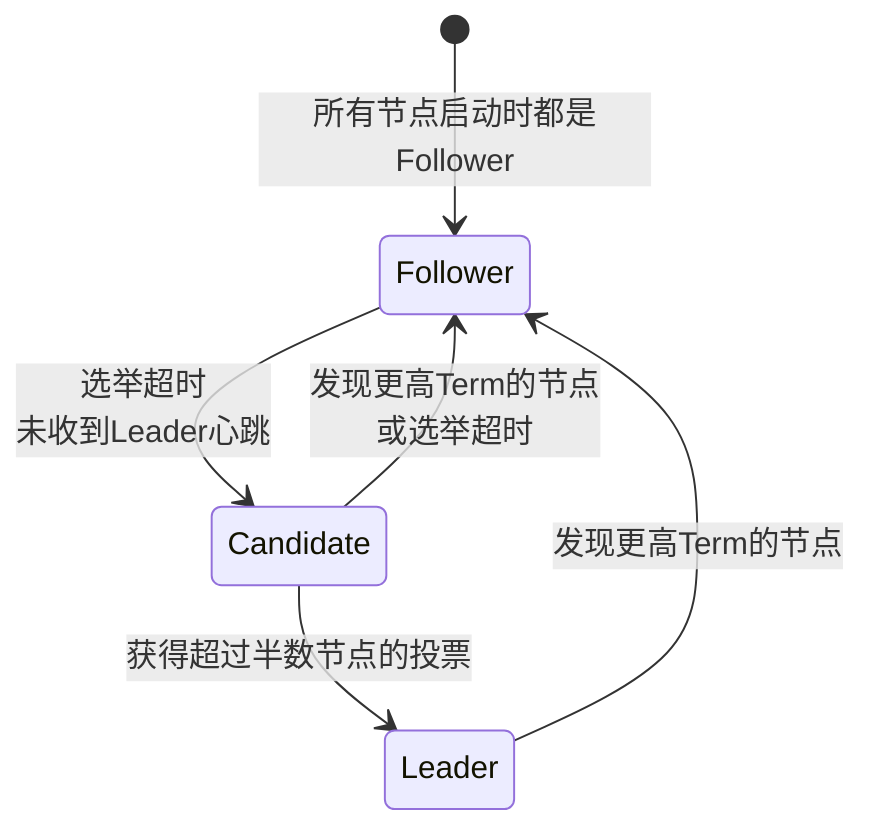
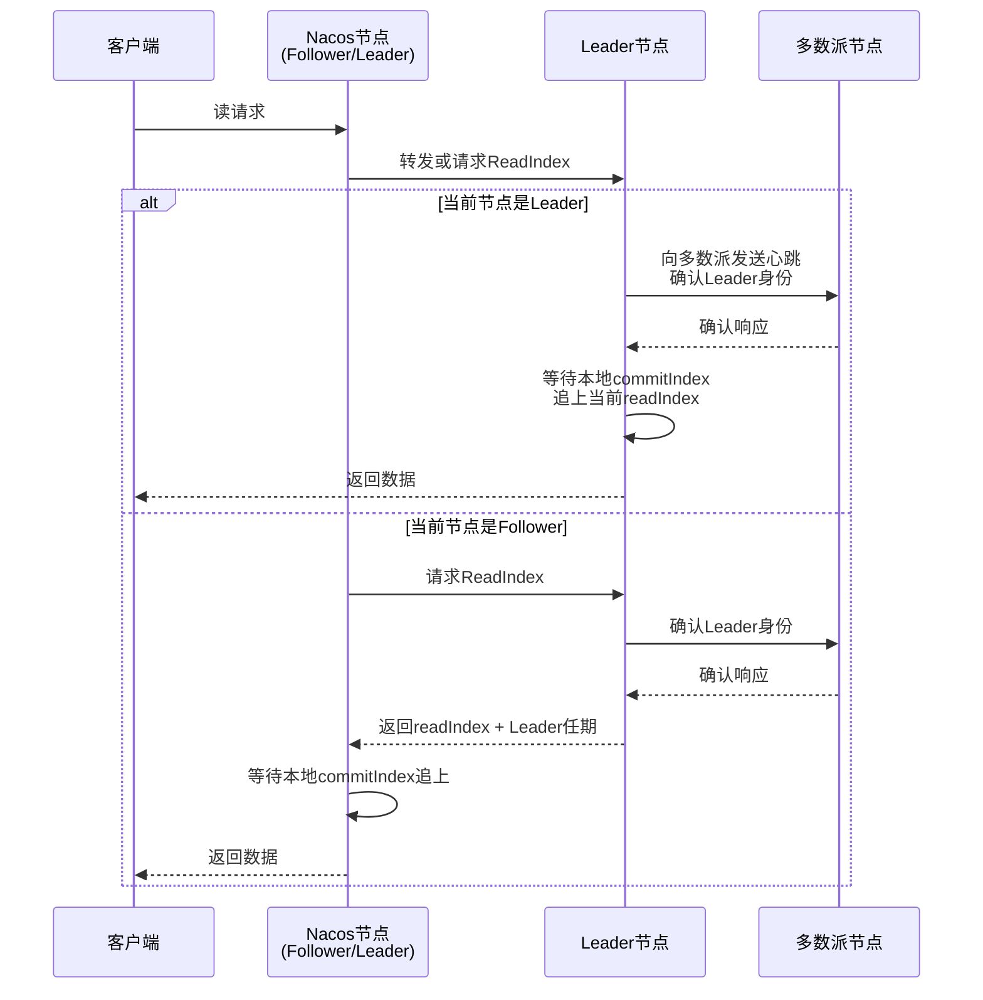

# 注册中心心跳机制

Nacos 的心跳机制是它作为服务注册中心实现服务健康检查和自动故障剔除的核心。简单来说，就是服务实例（Client）和注册中心（Server）之间一个定时的、确认彼此健康存活的“约定”。

## 核心工作原理

Nacos 的心跳机制分为客户端和服务端两部分协同工作。

### 客户端：定时发送心跳

当一个微服务（Nacos Client）启动并成功注册到 Nacos Server 后，如果它是一个临时实例，就会启动一个定时任务，默认每隔5秒向 Nacos Server 发送一个心跳包（HTTP/HTTPS 请求）。

### 服务端：接收心跳并更新状态

Nacos Server 会为每个服务实例维护一个“最后心跳时间”。它同时会运行一个定时检查任务，默认每隔5秒扫描所有服务实例。

它的判断逻辑是：

1.  健康 (Healthy)：如果实例的最后心跳时间在15秒以内，则被标记为健康状态。
2.  不健康 (Unhealthy)：如果超过15秒没有收到心跳，该实例会被标记为“不健康”。此时，它不会从注册表中被立即删除，但不会被路由给服务调用者。
3.  剔除 (Expired)：如果超过30秒（即连续两个健康检查周期）仍未收到心跳，Nacos Server 就会将这个实例从注册表中彻底剔除。

> 💡 特别说明：临时实例 vs 持久实例\
> 以上描述的心跳机制主要针对临时实例 (ephemeral=true)，这也是微服务架构中最常用的模式。
>
> *   临时实例：客户端心跳存活，服务端被动接收。适合API网关、业务微服务等动态扩缩容的场景。
> *   持久实例 (ephemeral=false)：服务端主动发起健康检查（如通过TCP、HTTP接口探测），客户端不发心跳。适合数据库、缓存等需要手动管理生命周期的稳定服务。

## 时序图



### 关键时间节点

| 时间点   | 动作         | 说明                                                         |
| :------- | :----------- | :----------------------------------------------------------- |
| **0s**   | 实例注册     | 客户端注册时带上 `ephemeral=true`，服务端记录 `lastHeartBeatTime = now` |
| **5s**   | 第1次心跳    | 客户端定时器触发，发送心跳包                                 |
| **10s**  | 第2次心跳    | 正常情况每5秒一次心跳                                        |
| **15s**  | 标记不健康   | 如果某实例 **超过15秒未收到心跳**，标记为 `healthy=false`，但实例还在注册表 |
| **30s**  | 彻底剔除     | 如果 **超过30秒未收到心跳**，实例从注册表删除，并通知消费者  |
| **持续** | 健康检查扫描 | 服务端**每5秒**执行一次扫描任务                              |

### 关键参数配置详解

心跳的行为可以通过调整参数来改变，主要分为客户端和服务端两部分。

| 角色       | 配置项                                             | 作用                                             | 默认值 | 重要性 |
| :--------- | :------------------------------------------------- | :----------------------------------------------- | :----- | :----- |
| **客户端** | `spring.cloud.nacos.discovery.heart-beat-interval` | 客户端向服务端发送心跳的**间隔时间**             | 5秒    | 核心   |
| **客户端** | `spring.cloud.nacos.discovery.heart-beat-timeout`  | 服务端将实例标记为**不健康**的超时时间（无心跳） | 15秒   | 核心   |
| **客户端** | `spring.cloud.nacos.discovery.ip-delete-timeout`   | 实例被**彻底删除**的超时时间（无心跳）           | 30秒   | 核心   |
| **服务端** | `nacos.naming.clean.interval`                      | 服务端检查并清理不健康实例的**任务执行间隔**     | 5秒    | 次要   |
| **客户端** | `nacos.remote.client.grpc.health.retry`            | (gRPC) 健康检查失败后的**最大重试次数**          | 3次    | 次要   |
| **客户端** | `nacos.remote.client.grpc.health.timeout`          | (gRPC) 单次健康检查的**超时时间**                | 3秒    | 次要   |

```yaml
# 客户端配置
spring:
  cloud:
    nacos:
      discovery:
        heart-beat-interval: 5000  # 心跳间隔5秒
        heart-beat-timeout: 15000 # 15秒超时，标记为不健康
        ip-delete-timeout: 30000  # 30秒后无心跳，彻底剔除实例

# 服务端配置 (nacos/conf/application.properties)
nacos.naming.clean.interval=5000     # 健康检查扫描间隔 (ms)
nacos.naming.empty.service.auto.clean=true  # 空服务自动清理
```

### 与Eureka的心跳机制对比

| 对比维度       | **Nacos**                                                    | **Eureka**                                        |
| :------------- | :----------------------------------------------------------- | :------------------------------------------------ |
| **核心功能**   | **服务发现 + 配置中心**（二合一）                            | **仅服务发现**，配置需搭配 Spring Cloud Config 等 |
| **一致性协议** | **AP/CP 切换**（默认 AP）                                    | **仅 AP**（牺牲一致性，保证高可用）               |
| **健康检查**   | **双向可配置**：客户端心跳（临时实例）+ 服务端主动探测（持久实例） | **单向心跳**：仅客户端定时（30秒）向服务端续约    |
| **实例剔除**   | **分阶段**：15秒未心跳标记不健康，30秒剔除                   | **一刀切**：90秒未心跳直接剔除                    |
| **服务更新**   | **准实时**：变更后主动推送给消费者                           | **定时拉取**：消费者每 30 秒拉取一次，有延迟      |

## 核心源码

### 客户端心跳发送 (Nacos Client)

```java
// Nacos Client 心跳定时器
public class BeatReactor {
    // 默认心跳间隔 5秒
    private static final long DEFAULT_HEART_BEAT_INTERVAL = 5000L;
    
    public void addBeatInfo(String serviceName, BeatInfo beatInfo) {
        // 启动定时任务
        executor.scheduleAtFixedRate(() -> {
            // 发送心跳请求
            clientProxy.sendBeat(beatInfo);
        }, 0, DEFAULT_HEART_BEAT_INTERVAL, TimeUnit.MILLISECONDS);
    }
}
```

### 服务端心跳处理 (Nacos Server)

```java
// 服务端接收心跳
@RestController
public class InstanceController {
    @PutMapping("/beat")
    public JsonNode beat(HttpServletRequest request) {
        // 更新实例的最后心跳时间
        service.processClientBeat(clientBeat);
        return true;
    }
}

// 服务端健康检查任务
public class ClientBeatCheckTask implements Runnable {
    @Override
    public void run() {
        for (Instance instance : instances) {
            long lastBeat = instance.getLastBeat();
            long now = System.currentTimeMillis();
            
            // 15秒没心跳 -> 标记不健康
            if (now - lastBeat > 15_000) {
                instance.setHealthy(false);
            }
            
            // 30秒没心跳 -> 剔除实例
            if (now - lastBeat > 30_000) {
                deleteInstance(instance);
                // 推送变更给消费者
                pushService.pushChange(serviceName);
            }
        }
    }
}
```

## 状态的变化过程



| 时间段    | 心跳状态   | 实例状态   | 服务端行为           | 消费者可见                    |
| :-------- | :--------- | :--------- | :------------------- | :---------------------------- |
| 0 - 15秒  | 正常       | **健康**   | 正常提供服务         | ✅ 可见                        |
| 15 - 30秒 | 无心跳     | **不健康** | 标记不健康，但不删除 | ❌ 默认不可见 (可通过配置开启) |
| 30秒后    | 持续无心跳 | **已剔除** | 从注册表删除         | ❌ 不可见                      |

1.  心跳是双向配合的：客户端主动推，服务端被动收并定期扫
2.  两级阈值设计：15秒标记不健康（软状态），30秒彻底剔除（硬删除）
3.  变更主动推送：实例剔除后，通过 UDP 长连接立即通知消费者
4.  默认配置合理：5秒心跳 + 15秒不健康 + 30秒剔除，适合大部分场景
5.  临时实例 ≠ 短暂存在：只要持续心跳，就可以长期存活

## 与持久实例的对比

| 对比项         | **临时实例 (默认)** | **持久实例**           |
| :------------- | :------------------ | :--------------------- |
| **心跳方向**   | 客户端 → 服务端     | 服务端 → 客户端        |
| **检查方式**   | 被动等待心跳        | 主动HTTP/TCP探测       |
| **心跳间隔**   | 5秒（客户端主动）   | 20秒（服务端主动）     |
| **不健康判定** | 15秒无心跳          | 连续3次探测失败        |
| **剔除时间**   | 30秒无心跳          | 永不剔除               |
| **适用场景**   | 动态微服务          | 数据库、缓存等固定节点 |

## 客户端优雅下线

```java
@PreDestroy
public void deregister() {
    // 主动注销，立即从注册表删除
    nacosService.deregisterInstance(serviceName, ip, port);
    // 不会等待30秒超时
}
```

# 事件发布监听机制

当服务实例（提供者）的状态发生变化时（如注册、下线、健康状态变更），会触发服务端的事件机制。

*   发布事件：`DistroConsistencyServiceImpl` 在服务实例数据变更后，会将一个变更事件放入 `Notifier` 任务的阻塞队列中。
*   处理事件：`UdpPushService` 这个订阅者监听到事件后，会通过 UDP 协议快速通知所有订阅了该服务的客户端（消费者），让它们更新本地服务列表。

在 1.x 版本中，Nacos 采用了 “UDP 推送 + 定期轮询” 的双重保障机制来通知客户端。

它的核心逻辑是：\*\*用 UDP 追求速度（快速通知），用 HTTP 定期轮询保证可靠性（防止丢包）, \*\*但因丢包问题最终在 2.x 版本全面升级为基于 gRPC 的可靠“通知+拉取”模式( 基于 gRPC  HTTP/2/TCP可靠连接)

## 版本通知机制工作流程

整个流程可以分为三个主要阶段，简单示意如下：



### Nacos 的事件驱动模型包含三个核心角色

| 角色                            | 核心类                                    | 职责                                 |
| :------------------------------ | :---------------------------------------- | :----------------------------------- |
| **事件 (Event)**                | `Event` 及其子类                          | 定义变更类型，携带变更数据           |
| **事件发布者 (EventPublisher)** | `DefaultPublisher`/`NamingEventPublisher` | 发布事件到阻塞队列，异步分发给订阅者 |
| **事件订阅者 (Subscriber)**     | `Subscriber` 抽象类                       | 注册监听，实现 `onEvent()` 处理逻辑  |
| **通知中心 (NotifyCenter)**     | `NotifyCenter`                            | 单例，管理事件与发布者的映射关系     |

    服务变更发生 → 创建Event对象 → NotifyCenter.publishEvent() 
    → EventPublisher放入阻塞队列 → 异步取出 → 遍历Subscriber → 调用onEvent()

## 核心实现源码分析

### UDP 推送：追求速度的通知机制

*   服务端侧：当服务实例发生变更时（如服务提供者上线、下线），服务端会发布 `ServiceChangeEvent` 事件。`UdpPushService` 监听到该事件后，会查找所有订阅了该服务的客户端，并向其注册的 UDP 端口发送一个数据包。
*   客户端侧：客户端在首次进行服务发现时，会启动一个 `PushReceiver` 线程，专门在指定的 UDP 端口上监听来自服务端的通知。为了确保有序性和稳定性，服务端用于处理 UDP 推送的线程池只有一个线程。
*   通知内容：UDP 包本身不包含完整的服务实例列表，而是一个轻量的变更信号。客户端收到信号后，仍需主动发起 HTTP 请求来拉取最新的全量数据。

### 服务端事件

当一个服务首次被注册时，Nacos Server 会创建 Service 对象，并为其添加两个监听器，分别监听临时实例和持久实例的变更

### 事件注册入口：Service 初始化时添加监听器

当一个服务首次被注册时，Nacos Server 会创建 `Service` 对象，并为其添加两个监听器，分别监听临时实例和持久实例的变更

```java
// ServiceManager#putServiceAndInit()
public void putServiceAndInit(Service service) throws NacosException {
    // 创建 Service 对象
    putService(service);
    
    // 为临时实例添加监听器
    consistencyService.listen(KeyBuilder.buildServiceKey(service), 
                              new ServiceChangeListener(service, true));
    // 为持久实例添加监听器
    consistencyService.listen(KeyBuilder.buildServiceKey(service), 
                              new ServiceChangeListener(service, false));
}
```

### 实例注册时触发变更事件

当服务提供者注册实例时，会调用 `DistroConsistencyServiceImpl#onPut()` 方法，将变更任务放入通知器的阻塞队列：

```java
// DistroConsistencyServiceImpl#onPut()
public void onPut(String key, Record value) {
    // 1. 存储数据到 DataStore
    dataStore.put(key, datum);
    
    // 2. 将 CHANGE 事件放入 Notifier 的阻塞队列
    notifier.addTask(key, NotifierTask.CHANGE);
}
```

`Notifier` 是 `DistroConsistencyServiceImpl` 的内部类，它继承自 `Thread`，在 `run()` 方法中循环从阻塞队列取任务：

```java
// DistroConsistencyServiceImpl.Notifier#run()
public void run() {
    while (true) {
        NotifierTask task = tasks.take();  // 阻塞获取
        handleChange(task);
    }
}

private void handleChange(NotifierTask task) {
    Service service = getService(task.key);
    // 触发 Service 的 onChange 方法
    service.onChange(task.key, task.value);
}
```

### Service 变更处理与 UDP 推送

`Service#onChange()` 最终调用 `updateIPs()` 方法，该方法做两件事

```java
// Service#updateIPs()
public void updateIPs(Instances instances, boolean isVIP) {
    // 1. 更新集群实例信息
    updateClusterIPs(instances);
    
    // 2. 通过 UDP 推送变更给订阅的客户端
    udpPushService.serviceChanged(this);
}
```

`UdpPushService#serviceChanged()` 利用 Spring 的 `ApplicationEvent` 机制发布 `ServiceChangeEvent`

```java
// UdpPushService
public void serviceChanged(Service service) {
    // 发布 Spring 事件
    applicationContext.publishEvent(new ServiceChangeEvent(this, service));
}

// UdpPushService 本身实现了 ApplicationListener
@Component
public class UdpPushService implements ApplicationListener<ServiceChangeEvent> {
    @Override
    public void onApplicationEvent(ServiceChangeEvent event) {
        // 获取所有订阅了该服务的客户端 PushClient
        for (PushClient client : subscriberService.getClientMap().values()) {
            // 发送 UDP 数据包
            udpPush(client, event.getService());
        }
    }
}
```

### 客户端信息如何被服务端记录

服务端如何知道该通知哪些客户端？关键在于服务发现时客户端会注册自己的 UDP 接收端口。

当客户端调用服务发现接口时，会传递自己的 IP 和 UDP 端口，服务端将其封装为 `PushClient` 存入 `clientMap`

```java
// NamingSubscriberServiceV1Impl#addClient()
public void addClient(String namespaceId, String serviceName, 
                      String clusters, String agent, String clientIp, int udpPort) {
    PushClient pushClient = new PushClient(namespaceId, serviceName, clusters, 
                                            agent, clientIp, udpPort);
    clientMap.put(pushClient.getKey(), pushClient);
}
```

## 客户端的订阅和接收

Nacos 客户端提供了两种订阅方式

### 显式调用 subscribe 方法 (业务方式)

```java
NamingService naming = NamingFactory.createNamingService("127.0.0.1:8848");
naming.subscribe("order-service", new EventListener() {
    @Override
    public void onEvent(Event event) {
        NamingEvent e = (NamingEvent) event;
        System.out.println("服务变更：" + e.getServiceName());
        System.out.println("最新实例列表：" + e.getInstances());
    }
});
```

这是客户端提供的一个“监听器注册”接口。你需要显式调用 `subscribe` 方法，并传入一个 `EventListener` 回调。

*   核心动作：注册回调。
*   触发时机：当服务实例列表发生变更（如服务上下线、健康状态变化）时，你的 `onEvent` 方法会被触发。
*   适用场景：当服务上下线需要触发自定义的业务逻辑时（例如：刷新本地内存路由表、断开特定长连接、发送告警日志）。

### 在 selectInstances 中设置 subscribe=true (框架行为, 默认方式)

```java
// subscribe=true 时会自动注册监听
List<Instance> instances = naming.selectInstances(serviceName, clusters, true, true);
```

此方式为Nacos默认配置方式, Nacos 客户端会在背后做三件事

*   查缓存：优先从本地缓存读取服务列表。
*   后台更新：启动一个定时任务，**每隔10秒从服务端拉取最新数据**，并更新本地缓存。
*   被动接收：同时保持长连接，接收服务端的变更推送（如UDP通知），实现动态感知。
*   适用场景：这是**99%的业务场景**（如使用 Feign、RestTemplate 进行服务调用）的默认行为，旨在保证本地缓存与服务端最终一致。

> `selectInstances` 是“获取数据”的**默认**方式，由框架自动调用；`subscribe` 是“监听事件”的显式方式，由开发者按需调用。

### 订阅的实现原理

客户端启动时，会初始化事件相关组件：

```java
// NacosNamingService 初始化
private void init(Properties properties) throws NacosException {
    // 1. 创建 InstancesChangeNotifier（订阅者）
    this.changeNotifier = new InstancesChangeNotifier(this.notifierEventScope);
    
    // 2. 向 NotifyCenter 注册事件发布者
    NotifyCenter.registerToPublisher(InstancesChangeEvent.class, 16384);
    
    // 3. 注册订阅者
    NotifyCenter.registerSubscriber(changeNotifier);
}
```

当调用 `subscribe`() 时，监听器被注册到 `InstancesChangeNotifier` 的 `listenerMap` 中

```java
// InstancesChangeNotifier#registerListener()
public void registerListener(String groupName, String serviceName, 
                             String clusters, EventListener listener) {
    String key = ServiceInfo.getKey(groupName + "@@" + serviceName, clusters);
    listenerMap.computeIfAbsent(key, k -> new ConcurrentHashSet<>()).add(listener);
}
```

### 客户端接收 UDP 通知

客户端启动时，会启动 `PushReceiver` 线程，在指定 UDP 端口上监听服务端推送

```java
// PushReceiver 线程
public void run() {
    DatagramSocket socket = new DatagramSocket(udpPort);
    while (true) {
        byte[] buffer = new byte[1024 * 64];
        DatagramPacket packet = new DatagramPacket(buffer, buffer.length);
        socket.receive(packet);  // 阻塞等待 UDP 包
        
        // 解析通知，更新本地缓存
        processReceive(packet);
    }
}

private void processReceive(DatagramPacket packet) {
    // 通知类型为 service 时，主动拉取最新数据
    if ("service".equals(type)) {
        serviceInfoHolder.processServiceInfo(serviceInfo);
    }
}
```

### NotifyCenter 事件分发机制

当 PushReceiver 收到 UDP 通知后，会触发客户端内部的 NotifyCenter 事件分发：

```java
// NamingEventPublisher（继承 Thread）
private void handleEvents() {
    while (!shutdown) {
        Event event = queue.take();  // 从阻塞队列取事件
        handleEvent(event);
    }
}

private void handleEvent(Event event) {
    // 根据事件类型找到订阅者
    Set<Subscriber> subscribers = subscribes.get(event.getClass());
    for (Subscriber subscriber : subscribers) {
        // 异步或同步调用 onEvent
        subscriber.onEvent(event);
    }
}
```

最终调用到用户注册的 `EventListener.onEvent()` 方法。

### 完整时序图



1.  服务端：实例变更 → 放入阻塞队列 → 异步处理 → UDP 推送轻量通知
2.  客户端：UDP 监听 → 收到通知 → 主动 HTTP 拉取最新数据 → 更新本地缓存
3.  事件驱动核心：`NotifyCenter` + `EventPublisher` + `Subscriber` 构成了完整的事件分发框架

### 服务列表拉取定时任务

在 Nacos 客户端中，每个被订阅的服务都会有一个独立的 UpdateTask，它默认每隔 10 秒从服务器拉取一次该服务的实例列表，以更新本地缓存。

#### 衰减重试的触发场景与核心源码

```java
// Nacos 客户端 UpdateTask 的 run 方法核心逻辑
public void run() {
    // 记录本次任务的失败次数
    long failCount = 0; 
    try {
        // ... 执行正常的服务拉取逻辑 ...
        // 如果一切顺利，将失败次数归零
        resetFailCount(); 
    } catch (Throwable e) {
        // 如果发生任何异常，失败次数 +1
        incFailCount(); 
    } finally {
        // 关键点：计算下一次任务的执行时间
        // DEFAULT_DELAY 默认为 1秒
        // delayTime 正常情况下为 10秒
        long nextDelay = Math.min(delayTime << failCount, DEFAULT_DELAY * 60);
        // 调度下一次任务，间隔时间为 nextDelay
        executor.schedule(this, nextDelay, TimeUnit.MILLISECONDS);
    }
}
```

核心实现：失败次数计数器与退避算法

#### 退避算法详解

从源码中可以清晰地看到指数退避的具体实现：

*   正常间隔：`delayTime` 的默认值是 10 秒 (**2.x版本是6秒**) 。当 `failCount` 为 0 时，重试间隔就是 10 秒。
*   指数增长：一旦发生异常，`failCount` 就会增加。下一次的执行时间 `nextDelay` 会通过 `delayTime << failCount` 来计算。

    *   `<<` 是左移运算符，在二进制层面等同于乘以 2 的 `failCount` 次方。
    *   第 1 次失败：`10秒 << 1 = 20秒`
    *   第 2 次失败：`10秒 << 2 = 40秒`
    *   第 3 次失败：`10秒 << 3 = 80秒`
    *   ...
*   上限保护：为了防止无限延长，`Math.min(delayTime << failCount, DEFAULT_DELAY * 60)` 确保了最大间隔不超过 60 秒。即使持续失败，客户端也不会无限期地等待，而是会每隔 1 分钟重试一次。

#### 为什么要这样设计

这种机制是为了在故障期间保护服务端。如果所有客户端都在网络抖动时以 10 秒的固定频率重试，服务端恢复瞬间会承受巨大的瞬时流量（惊群效应）。指数退避让重试频率随着失败次数急剧下降，给服务端留出了恢复的喘息时间。

# nacos server端的数据同步模式

Nacos 的设计原则是根据实例类型自动选择最适合的一致性协议，以保证特定场景下的核心需求

| 实例类型       | `ephemeral` 值       | 一致性协议        | 模式        | 核心目标                                |
| :------------- | :------------------- | :---------------- | :---------- | :-------------------------------------- |
| **临时实例**   | `true`（**默认值**） | Distro 协议       | **AP 模式** | 优先保证 **高可用** 和 **最终一致性**   |
| **持久化实例** | `false`              | Raft / JRaft 协议 | **CP 模式** | 优先保证 **强一致性** 和 **数据持久化** |

## AP模型实现 (默认)

Nacos Server 端的服务注册数据同步，核心是通过自研的 **Distro** 协议（针对临时实例的 AP 协议）来完成的。它的整体思路是：**每个节点都可以处理写请求，但最终由“责任人”节点负责存储，再异步同步给其他节点，从而保证数据的最终一致性**。

### 请求路由——找到“责任人”

当一个注册请求（例如服务 order-service 的实例 192.168.1.100:8080）到达 Nacos 集群中的任意一个节点（如节点 A）时，节点 A 不会马上处理，而是先通过 `Distro` 协议判断自己是不是这个实例的“责任人”。

判断方法是通过一个哈希算法：**根据服务实例的 IP 等信息计算哈希值，再对集群节点数取模**。结果等于当前节点编号，则由自己处理；否则，将请求转发给对应的“责任人”节点。



### 存储与同步——“记下来，再告诉大家”

一旦请求到达“责任人”节点，该节点就会执行真正的数据存储，并触发集群内的同步流程：

1.  写入内存：节点会立即将服务实例信息写入本地的内存缓存（一个 `ConcurrentHashMap`），让数据可以马上被读到。
2.  异步同步：写入成功后，该节点会启动一个延迟的异步任务，将这份新数据作为“变更通知”发送给集群内的其他所有节点。由于是异步操作，它不会阻塞主流程，确保了高性能。
3.  定期校验：除了实时同步，每个节点还会定时（例如每隔几秒）向其他节点发送自己负责的那部分数据的摘要信息（如 Checksum）。一旦发现与其他节点的数据不一致，就会触发一次全量拉取来修复数据。

### 读取数据——“查自己的就行”

得益于上述的全量同步机制，Nacos 集群中的**每一个节点都保存了全部的服务实例数据**（这是一个关键设计）。

因此，当客户端（服务消费者）请求获取服务列表时，它连接的**任意一个 Nacos 节点都可以直接从自己的内存缓存中返回数据**，无需将请求转发给“责任人”节点。这极大地提升了读性能。

### 核心设计总结

Distro 协议的这一套设计，本质上是为了在 **高可用** 和 **数据一致性** 之间找到一个平衡：

| 特性            | 设计                                                         | 好处                                                         |
| :-------------- | :----------------------------------------------------------- | :----------------------------------------------------------- |
| **高可用 (AP)** | 每个节点都有全量数据，任意节点可读。                         | 即使部分节点故障，服务发现仍可正常工作，保证了 **可用性**。  |
| **最终一致性**  | 采用“责任人”负责制 + 异步同步 + 定时校验。                   | 在网络分区或节点故障恢复后，数据也能自动达成一致，保证了 **最终一致性**。 |
| **水平扩展**    | 通过哈希算法将数据分片到不同节点，同时每个节点又有全量数据。 | 既能分摊写入压力，又能应对突发的大规模读取，实现了 **读写分离**。 |

## CP模型

Nacos 的 CP 模式（强一致性）是基于 Raft 共识算法 实现的，主要用于保证 **持久化服务实例** 和 **配置中心**（无数据库模式） 的数据一致性。

与 AP 模式下每个节点都能处理写请求不同，**CP 模式下 只有 Leader 节点能处理写请求**，并且需要集群中 **超过半数节点确认** 后，操作才算成功。

### CP 模式的核心：Raft 共识算法

Nacos 并没有直接使用原生的 Raft 算法，而是集成了阿里巴巴的 **JRaft** 框架，这是一个工业级的 **Raft** 实现，用于保证数据在多个节点间的 强一致性。

Raft 的核心目标是在分布式系统中确保数据不丢失、不冲突，其工作流程可以概括为以下三步：

### 集群角色划分

在一个采用 CP 模式的 Nacos 集群中，节点分为三种角色：

*   Leader（领导者）：唯一的 写入口，负责处理所有来自客户端的写请求（如注册持久化实例），并负责将数据变更同步给其他节点。
*   Follower（跟随者）：被动接收 Leader 的数据同步，不主动处理写请求。如果收到写请求，会转发给 Leader。在 Leader 故障时，Follower 可以参与竞选成为新 Leader。
*   Candidate（候选者）：这是选举过程中的一个临时角色，用于竞选 Leader。

### 数据写入流程

当你向 Nacos 注册一个 持久化服务 时，CP 模式的 Raft 协议会这样保证数据一致性



1.  请求转发：即使客户端请求发给了 Follower，它也会将请求转发给集群的 Leader。
2.  生成日志：Leader 接收到请求后，不会立刻更新数据，而是将这次操作封装成一个 日志条目，并分配一个唯一的、递增的 `index`（索引）。
3.  并行复制：Leader 会并行地向所有 Follower 发送这个日志条目，要求它们保存。
4.  等待确认：Leader 会等待 Follower 的回应。只有当 超过半数 的节点（包括 Leader 自己）确认保存了这条日志，才代表这次写入在集群中达成了共识。
5.  提交与响应：共识达成后，Leader 会“提交”这条日志，将变更应用到实际的状态机中（如更新内存中的服务列表），然后通知 Follower 节点这条日志已提交，并最终返回成功给客户端。

### Leader 选举与故障恢复

*   心跳保活：Leader 会定期向 Follower 发送心跳消息，以证明自己还在正常工作。
*   触发选举：如果一个 Follower 在一段时间内没有收到 Leader 的心跳，它就会认为 Leader 可能故障了，从而发起新一轮选举。
*   选举规则：候选节点会广播自己的信息，获得 超过半数 节点投票的节点将成为新的 Leader。这保证了在任何时刻，集群只有一个“大脑”。

## 模型对比

| 特性维度         | **CP 模式 (Raft 协议)**                 | **AP 模式 (Distro 协议)**                        |
| :--------------- | :-------------------------------------- | :----------------------------------------------- |
| **核心目标**     | **强一致性**                            | **高可用性**                                     |
| **适用场景**     | **持久化服务实例**、无数据库的配置中心  | **临时服务实例** (Spring Cloud/Dubbo 的默认模式) |
| **写请求处理**   | 必须由 **Leader** 节点处理              | 集群中 **任意节点** 都可以处理                   |
| **数据同步方式** | 同步复制，需 **超过半数节点** 确认      | 异步复制，最终一致性                             |
| **故障容忍度**   | 允许少数节点 (≤半数) 故障，集群仍可写   | 允许多数节点故障，只要有一个节点存活即可写       |
| **数据丢失风险** | **极低**，日志持久化，可恢复            | 临时数据仅内存存储，重启后丢失                   |
| **可用性影响**   | 半数以上节点不可用时，集群将 **不可写** | 只要有一个节点可用，就能提供服务                 |

# Raft算法

Raft 是一个用于管理复制日志的共识算法，它的核心目标就是让一个分布式集群在面对部分节点故障、网络延迟或丢包等问题时，依然能对某个值（比如谁是Leader、一条日志记录）达成一致。

Raft 的核心思路是：简化。它把复杂的共识问题拆解成了三个相对独立的子问题：

1.  领导者选举
2.  日志复制
3.  安全性



## 领导者选举

在 Raft 中，节点总是处于三种状态之一：领导者（Leader）、追随者（Follower） 或 候选者（Candidate）。

*   Follower (追随者)：这是所有节点的初始状态。它们是被动的，只响应来自 Leader 和 Candidate 的请求，从不主动发起任何请求。
*   Leader (领导者)：集群中唯一的“领导”，处理所有来自客户端的请求，并负责将日志复制给所有 Follower。
*   Candidate (候选者)：当 Follower 在一段时间内（称为选举超时时间）没有收到 Leader 的心跳，就会认为 Leader 可能挂了，于是切换为 Candidate，并发起选举。

选举过程如下：

1.  发起选举：一个 Follower 等待选举超时后，会递增自己的任期号（Term），并切换为 Candidate。然后，它会先给自己投一票，并向集群中所有其他节点并行发送 `RequestVote RPC` 请求，拉取选票。
2.  投票规则：每个节点在一个任期内只能投一票，并且遵循“先到先得”原则。收到投票请求的节点，会检查对方的日志是否至少和自己一样新，如果是，就投给它。
3.  胜出条件：一个 Candidate 如果收到了超过半数的投票，就会成为新的 Leader。
4.  心跳维持权威：成为 Leader 后，它会立即向所有 Follower 发送心跳消息（一个没有日志条目的 `AppendEntries RPC`），来阻止新的选举并巩固自己的领导地位。

### 拉取选票的详细流程

1.  候选人发起请求 (`RequestVote`)\
    当一个 Follower 等待超时后，它会认定当前很可能没有 Leader，于是自己宣布参选，成为 Candidate。它需要拉取选票来赢得选举，具体会做两件事：

    *   先给自己投一票。
    *   并行的（同时）向集群中所有其他节点发送 `RequestVote` RPC 请求，这个请求里包含了关键信息：自己的任期号、最后一条日志的索引和任期。
2.  接收者进行严格投票 (投票规则)\
    这是保证数据不丢的核心安全机制。收到请求的节点（选民）会非常谨慎，遵循 “先到先得” 和 “比自己新才投票” 的原则，依次检查：

    *   任期检查：如果请求中的任期小于自己当前的任期，说明候选人信息太旧，直接拒绝。
    *   任期更新：如果请求中的任期更大，说明自己才是老古董，更新自己的任期，并把自己变成 Follower。
    *   日志新鲜度检查（最关键）：这是为了防止日志不全的节点成为 Leader 导致数据丢失。选民会检查候选人的日志是否至少和自己一样新（即候选人的最后一条日志索引 ≥ 自己的，且候选人的最后一条日志任期 ≥ 自己的）。只有满足这个条件，才给它投票。因为日志最新的节点，才最有可能包含了所有已提交的数据。
3.  候选人计票与胜出\
    候选人每收到一个投票响应，就计一票。如果在一个选举超时时间内，它获得了超过半数集群节点的投票（包括自己投的那一票），它就成功当选为新的 Leader。当选后，它会立刻发送心跳来确立权威，防止新的选举。

### 流程如下:

假设有一个 3 个节点的 Raft 集群（S1, S2, S3）。

1.  网络分区：Leader S1 因为网络故障，S2 和 S3 收不到它的心跳。
2.  触发选举：S2 和 S3 的选举计时器先后到期。假设 S2 先到期，它变成 Candidate（任期 2），向 S1 和 S3 发送 `RequestVote`。

    *   S1 会检查 S2 的日志（假设 S1 的日志比 S2 新），于是拒绝投票。
    *   S3 检查后发现 S2 的日志和自己一样新，于是投票给 S2。
3.  赢得选举：S2 获得了两票（自己 + S3），超过半数，成为任期 2 的新 Leader。
4.  恢复并压制旧 Leader：此时网络恢复，旧的 Leader S1 收到 S2 的心跳。S1 发现 S2 的任期（2）大于自己的任期（1），于是主动降级为 Follower。集群恢复正常，数据保持一致。

## 日志复制

一旦选出 Leader，它就开始承担起处理客户端请求并同步日志的责任。

*   日志条目：当客户端发送一个请求（例如：`SET key = value`）给 Leader 时，Leader 会把它封装成一个日志条目。每个日志条目包含要执行的命令、索引号（一个递增的整数，代表它在日志中的位置）和任期号。
*   并行复制：Leader 会并行地向所有 Follower 发送 `AppendEntries RPC` 请求，将新的日志条目复制给它们。
*   提交（Commit）：Leader 会等待大多数（超过半数）Follower 响应说“我已成功写入日志”。当收到多数派的成功确认后，Leader 认为这个日志条目是已提交（Committed） 的，可以应用到状态机（执行 `SET key = value`）了。随后，Leader 会执行该命令，并将结果返回给客户端。
*   通知提交：在随后的心跳或下一次日志复制中，Leader 会告诉 Follower 最新的提交位置，Follower 也会将已提交的日志应用到自己的状态机上。

## 安全性

Raft 通过几个关键约束来保证系统的安全性（即数据不会出错）。

*   选举限制：这就是前面提到的投票规则。它确保了拥有最新、最全日志的节点才有资格成为 Leader。如果一个 Candidate 的日志没有 Follower 新，Follower 就不会给它投票。这能防止已经丢掉部分数据的节点成为 Leader，从而覆盖掉其他节点上的正确数据。
*   日志匹配特性：Raft 会维护一个 `nextIndex` 数组来保证 Follower 上的日志和 Leader 上的日志最终完全一致。当 Leader 和 Follower 日志不一致时，Leader 会通过多次重试，找到 Follower 上日志匹配的位置，然后强制覆盖 Follower 上后续所有不一致的日志。

### Nacos索引读流程

