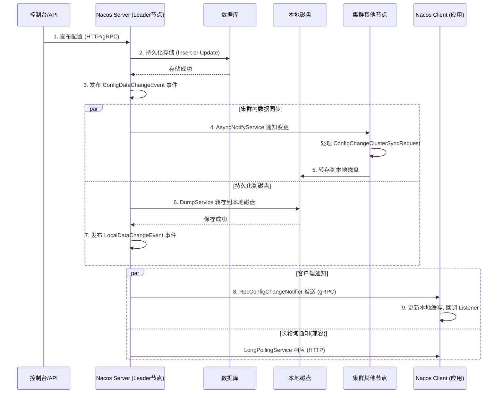
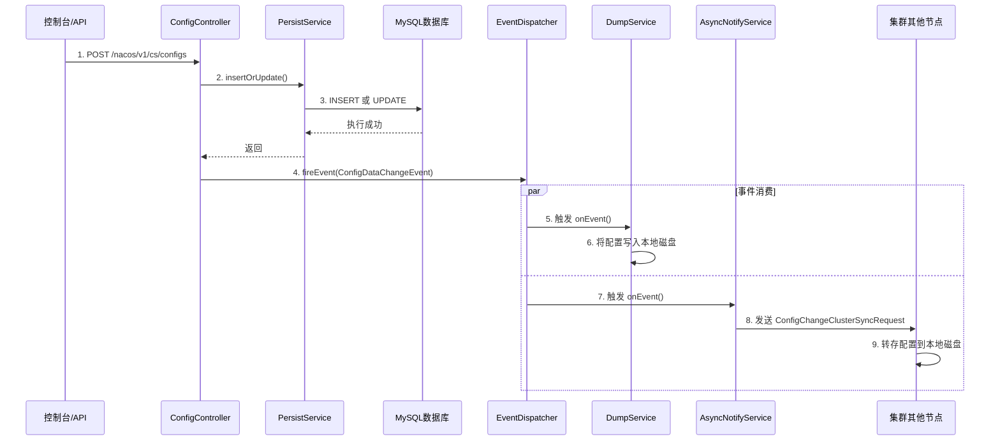
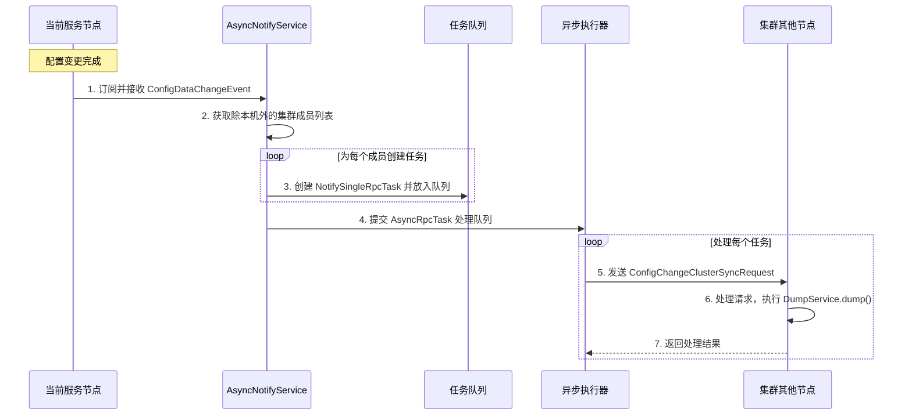
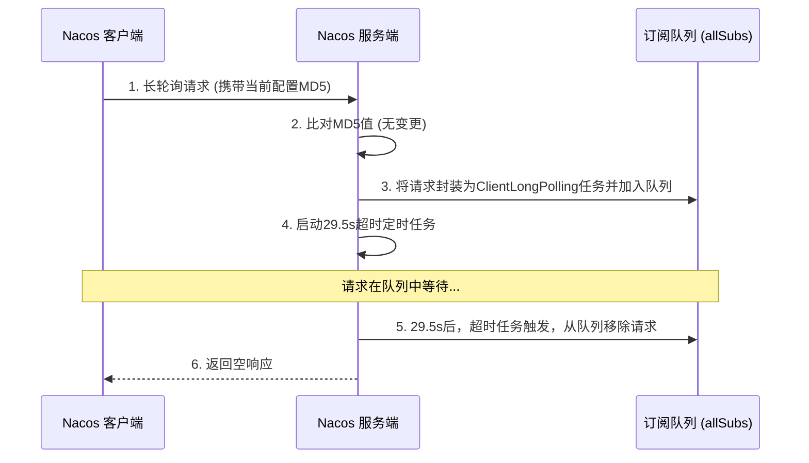
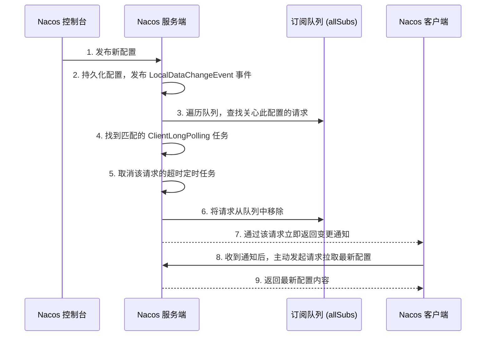
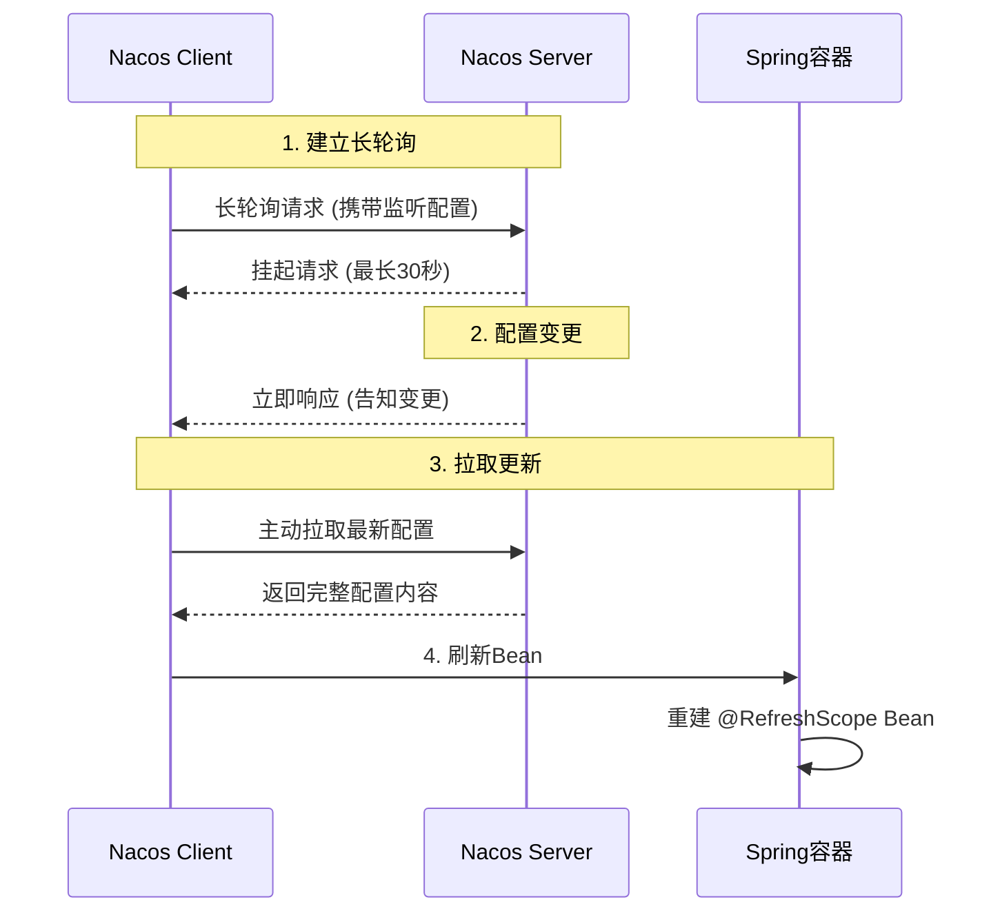

# Nacos配置发布流程

Nacos 配置中心的配置发布流程，可以概括为一个 “最终一致性”的数据同步链条：当你在控制台修改配置后，Nacos 会先保证数据安全落地（数据库 + 磁盘），再通过事件驱动模型，异步、可靠地将变更推送到所有订阅的客户端和集群节点。

整个流程的核心设计思想是异步解耦和最终一致性，主要由三个角色协同完成：**服务端接收并存储、集群内节点同步、客户端监听并刷新**。



## 第一步：服务端接收与持久化

当开发者在 Nacos 控制台或通过 API 发布配置时，请求会到达服务端的 `/v1/cs/configs` 接口

1.  接收入口：`ConfigController.publishConfig` 是唯一的 HTTP 入口。
2.  数据安全：优先将配置持久化到 MySQL 数据库，确保数据不丢失。
3.  事件解耦：通过 `EventDispatcher` 发布 `ConfigDataChangeEvent` 事件，将"存储"与"后续处理"解耦。
4.  后续触发：该事件会触发 `DumpService`（磁盘转储） 和 `AsyncNotifyService`（集群同步），为配置的高可用读取和集群数据一致性打下基础。

1.x 与 2.x 在这一阶段的主要区别在于事件发布中心的实现类不同（`EventDispatcher` vs `NotifyCenter`），以及后续通知客户端的方式（1.x 主要依赖长轮询，2.x 升级为 gRPC 主动推送）。

### 入口：ConfigController.publishConfig

```java
// 源码位置: nacos/config/src/main/java/com/alibaba/nacos/config/server/controller/ConfigController.java
@RequestMapping(method = RequestMethod.POST)
@ResponseBody
public Boolean publishConfig(HttpServletRequest request, HttpServletResponse response)
        throws NacosException {
    // 1. 从请求中解析出 dataId, group, tenant, content 等参数
    // ... 参数解析代码 ...
    
    // 2. 判断是否为灰度发布（Beta发布）
    if (StringUtils.isBlank(betaIps)) {
        // 普通发布
        // 调用持久化服务，插入或更新配置
        persistService.insertOrUpdate(srcIp, srcUser, configInfo, time, configAdvanceInfo, false);
        // 发布配置变更事件
        EventDispatcher.fireEvent(new ConfigDataChangeEvent(false, dataId, group, tenant, time.getTime()));
    } else {
        // Beta发布（灰度发布）
        persistService.insertOrUpdateBeta(configInfo, betaIps, srcIp, srcUser, time, false);
        EventDispatcher.fireEvent(new ConfigDataChangeEvent(true, dataId, group, tenant, time.getTime()));
    }
    return true;
}
```

`publishConfig` 方法做了两件核心的事：

1.  调用 `persistService.insertOrUpdate` 将配置信息存储到数据库中。
2.  通过 `EventDispatcher.fireEvent` 发布一个 `ConfigDataChangeEvent` 事件。

### 核心处理一：数据库持久化

`PersistService` 接口负责处理配置的持久化操作。当 Nacos 使用 MySQL 作为后端存储时，具体实现类为 `ExternalStoragePersistServiceImpl`。

`insertOrUpdate` 方法的逻辑非常清晰：

1.  检查存在性：首先根据 `dataId`、`group`、`tenant` 查询数据库，判断该配置是否已存在。
2.  执行 SQL：

    *   如果不存在，则执行 `INSERT` 语句，将新配置写入 `config_info` 表。
    *   如果已存在，则执行 `UPDATE` 语句，更新 `config_info` 表中的 `content`、`md5`、`last_modified` 等字段。
3.  记录历史：同时会将本次操作记录到 `his_config_info` 历史表中，为配置的版本管理和回滚提供基础。

> 注意：在 1.x 版本的源码中，SQL 语句是直接以字符串形式与 Java 代码耦合在一起的，这在实际项目中并不推荐，但在 Nacos 中为了追求极致的性能而这样设计。

### 核心处理二：发布配置变更事件

在数据库操作成功后，`EventDispatcher.fireEvent()` 负责发布 `ConfigDataChangeEvent` 事件。

与 2.x 版本使用 `NotifyCenter` 不同，1.x 版本使用的是 `EventDispatcher` 作为其事件通知中心。

这个事件的发布是后续所有操作的"发令枪"，主要有两个监听器（Subscriber）在关注这个事件：

| 监听器                    | 主要职责                                                                                         |
| :--------------------- | :------------------------------------------------------------------------------------------- |
| **DumpService**        | 将数据库中的配置内容"转储"到服务节点的**本地磁盘文件**中。这样做的好处是，即使数据库故障，Nacos 也能从磁盘快速读取配置，保证了高可用性。                   |
| **AsyncNotifyService** | **通知集群内其他节点**。它会遍历集群中的所有其他节点，发送一个配置变更请求，让它们也执行 `DumpService` 操作，将最新配置保存到各自的磁盘上，从而完成集群内的数据同步。 |



## 第二步：集群内数据同步

为了保证集群中每个节点都能提供一致的配置服务，`ConfigDataChangeEvent` 会被两个关键的监听器处理，用于数据同步。

*   `DumpService` (转储服务)：该服务会将数据库中的最新配置，转存到服务节点的本地磁盘文件中。这样做的好处是，即使数据库发生故障，Nacos 也能从磁盘快速恢复配置，保证了高可用性。
*   `AsyncNotifyService` (异步通知服务)：该服务会遍历集群中的所有其他节点，并发送一个 `ConfigChangeClusterSyncRequest` 请求，通知它们“配置变了，快来同步”。其他节点收到请求后，会执行类似的 `DumpService` 操作，将配置保存到自己的磁盘上，从而完成集群内的数据同步。

Nacos 集群内数据同步的核心机制根据实例类型（临时/持久）和配置变更分为两套独立的实现：Distro 协议（AP模式，用于临时实例和配置同步）和 JRaft 协议（CP模式，用于持久化实例）。对于配置中心，集群同步主要通过 AsyncNotifyService 实现。



### 配置变更的集群同步：AsyncNotifyService

在 Nacos 的配置中心模块，当一个配置发生变更并成功持久化到数据库后，服务端会立即发布一个 `ConfigDataChangeEvent` 事件。`AsyncNotifyService` 正是这个事件的监听器，它负责将变更通知到集群内的其他所有节点。

#### 核心处理流程 JRaft 协议 (CP模式)

当 `AsyncNotifyService` 接收到 `ConfigDataChangeEvent` 事件后，会执行以下核心步骤：

1.  获取目标节点列表：通过 `memberManager.allMembersWithoutSelf()` 获取当前集群中除自身以外的所有成员节点信息。
2.  构建异步任务：为每一个目标节点创建一个 `NotifySingleRpcTask` 任务对象。该任务封装了配置变更的关键信息，如 `dataId`（数据ID）、`group`（分组）、`tenant`（租户/命名空间）以及 `lastModified`（最后修改时间戳）等。
3.  提交任务执行：将这些任务放入一个 `LinkedList<NotifySingleRpcTask>` 队列中，并通过 `AsyncRpcTask` 提交给 `ConfigExecutor.executeAsyncNotify()` 线程池进行异步处理。
4.  发起RPC请求：`AsyncRpcTask` 会遍历队列中的任务，依次向每个目标节点发起RPC调用。它会首先检查目标节点的健康状态（`memberManager.stateCheck`），对于健康的节点，才会通过 `configClusterRpcClientProxy.syncConfigChange()` 发送 `ConfigChangeClusterSyncRequest` 请求。

#### 失败重试与任务补偿机制

为了保证集群间数据最终一致，`AsyncNotifyService` 内置了一套失败重试机制：

*   重试触发：当向某个节点发起同步请求失败，或者该节点处于不健康状态时，对应的 `NotifySingleRpcTask` 会被重新调度执行。
*   延迟退避算法：重试的延迟时间采用平方退避策略，具体公式为 `delay = MIN_RETRY_INTERVAL + failCount² × INCREASE_STEPS`。其中 `MIN_RETRY_INTERVAL` 为 500 毫秒，`INCREASE_STEPS` 为 1000 毫秒。

    *   这意味着，第1次重试的延迟为 1.5 秒，第2次为 4.5 秒，第3次为 9.5 秒……该算法在避免对故障节点产生持续压力的同时，也保证了在网络恢复后能够及时完成数据同步。
*   重试上限：为了避免无限的资源消耗，失败次数 `failCount` 的最大值会被限制为 6 次，对应的最大重试延迟为 36.5 秒。

#### 目标节点的处理流程

当集群中的另一个节点接收到 `ConfigChangeClusterSyncRequest` 请求后，会执行以下操作：

1.  请求处理：该请求由 `ConfigChangeClusterSyncRequestHandler` 负责接收和处理。
2.  触发本地存储：处理程序从请求中解析出 `dataId`、`group`、`tenant` 等关键信息，并调用本地的 `DumpService.dump()` 方法。
3.  完成数据同步：`dump()` 方法会从数据库中重新加载该配置的最新内容，并将其转储到本地磁盘和缓存中，从而完成该节点上数据的更新。

需要注意的是，为了避免无限循环，目标节点在处理集群同步请求时，不会再次发布 ConfigDataChangeEvent 事件去触发其他节点的同步，这确保了变更通知只在集群内传播一轮。

## 第三步：客户端变更推送

当 DumpService 完成本地磁盘存储后，会紧接着发布一个 `LocalDataChangeEvent` 事件，这是通知客户端的直接触发器。

Nacos 2.x 版本支持两种方式通知客户端：

1.  gRPC 主动推送 (2.x 核心特性)：`RpcConfigChangeNotifier` 监听到事件后，会通过已经建立的 gRPC 长连接，直接向订阅了该配置的所有客户端推送 `ConfigChangeNotifyRequest` 请求。这种方式是实时的，能做到秒级甚至毫秒级的配置生效。
2.  HTTP 长轮询 (Long Polling)：为了兼容 1.x 版本的客户端，`LongPollingService` 会处理那些通过 HTTP 长轮询等待配置更新的请求。当配置变更时，它会立即返回响应，告知客户端配置已更新

### 服务端：长轮询的处理与推送

#### ConfigController 入口

服务端处理长轮询的入口是 `ConfigController` 的 `/listener` 接口：

```java
@PostMapping("/listener")
public void listener(HttpServletRequest request, HttpServletResponse response)
    throws ServletException, IOException {
    
    // 获取客户端监听配置的 MD5 串
    String probeModify = request.getParameter("Listening-Configs");
    
    // 计算客户端发送的配置 MD5 与服务端当前 MD5 的差异
    String clientMd5Map = MD5Util.getClientMd5Map(probeModify);
    
    // 委托给 ConfigServletInner 处理
    ConfigServletInner.doPollingConfig(request, response, clientMd5Map, probeModify);
}
```

#### LongPollingService 的核心处理

`LongPollingService` 是服务端长轮询的核心组件

```java
public void addLongPollingClient(HttpServletRequest req, HttpServletResponse rsp, 
        Map<String, String> clientMd5Map, String probeRequestString, long timeout) {
    
    // 1. 检查是否有立即返回的变更
    List<String> changedGroups = MD5Util.compareMd5(req, rsp, clientMd5Map);
    
    if (changedGroups.size() > 0) {
        // 有变更，立即返回
        generateResponse(changedGroups, rsp);
        return;
    }
    
    // 2. 无变更，挂起请求
    // 客户端超时时间默认 30 秒，服务端提前 500ms 返回，避免客户端超时
    final long clientTimeout = timeout;
    final AsyncContext asyncContext = req.startAsync();
    asyncContext.setTimeout(0L);  // 禁用容器默认超时
    
    // 创建调度任务，29.5 秒后超时返回
    ConfigExecutor.scheduleLongPolling(new Runnable() {
        public void run() {
            try {
                // 检查是否有变更
                List<String> changedGroups = MD5Util.compareMd5(req, rsp, clientMd5Map);
                if (changedGroups.size() > 0) {
                    generateResponse(changedGroups, rsp);
                } else {
                    // 超时，返回空响应
                    rsp.getWriter().println("");
                }
            } catch (Exception e) {
                // 异常处理
            } finally {
                asyncContext.complete();
            }
        }
    }, timeout - 500, TimeUnit.MILLISECONDS);
    
    // 3. 将长轮询客户端加入订阅队列 每 30 秒一次 HTTP 请求
    allSubs.add(new ClientLongPolling(asyncContext, clientMd5Map, probeRequestString, timeout));
}
```

#### 配置变更时的通知

当配置发布时，会触发 `LocalDataChangeEvent` 事件，`LongPollingService` 的订阅者会收到通知

```java
// LongPollingService 内部类，监听配置变更事件
class DataChangeTask implements Runnable {
    
    public void run() {
        try {
            ConfigCacheService.getContentBetaMd5(groupKey);
            
            // 遍历所有长轮询客户端，找到匹配的变更
            for (ClientLongPolling clientLongPolling : allSubs) {
                if (clientLongPolling.getClientMd5Map().containsKey(groupKey)) {
                    // 将变更信息写入响应
                    clientLongPolling.sendResponse(Arrays.asList(groupKey));
                    // 从队列中移除已响应的客户端
                    allSubs.remove(clientLongPolling);
                }
            }
        } catch (Exception e) {
            // 异常处理
        }
    }
}
```

> 2.x版本 改为gRPC 双向流推送, 同时2.x的服务端保留长轮询兼容 1.x 客户端

## 第四步：客户端接收与回调

客户端的 `ClientWorker` 组件是处理所有配置相关逻辑的核心。

1.  接收推送：`ClientWorker` 会处理服务端发来的 `ConfigChangeNotifyRequest` 请求。
2.  主动拉取：收到通知后，客户端会主动向服务端发起一次 HTTP 请求，拉取最新的配置内容。这是一种“通知-拉取”模式，确保了数据的可靠性。
3.  回调监听器：获取到最新配置后，`ClientWorker` 会根据 `dataId` 和 `group` 找到所有注册在该配置上的 `Listener`，并逐个回调其 `receiveConfigInfo` 方法，完成业务逻辑的动态刷新。

Nacos 配置中心采用 "长轮询 + 主动拉取" 的模式实现配置变更的实时感知。这一机制通过客户端和服务端的紧密协作完成：

### ClientWorker 的初始化

`ClientWorker` 是客户端配置管理的核心组件，在 `NacosConfigService` 构造时被初始化：

```java
// NacosConfigService 构造方法
public NacosConfigService(Properties properties) throws NacosException {
    // 初始化 HttpAgent
    this.agent = new MetricsHttpAgent(new ServerHttpAgent(properties));
    this.agent.start();
    
    // 核心：初始化 ClientWorker
    this.worker = new ClientWorker(this.agent, this.configFilterChainManager, properties);
}
```

`ClientWorker` 的构造方法中，最关键的是启动两个定时线程池：

```java
public ClientWorker(HttpAgent agent, ConfigFilterChainManager configFilterChainManager, Properties properties) {
    this.agent = agent;
    this.configFilterChainManager = configFilterChainManager;
    
    // 线程池 1：执行长轮询任务
    this.executorService = Executors.newScheduledThreadPool(1, new ThreadFactory() {
        public Thread newThread(Runnable r) {
            Thread t = new Thread(r);
            t.setName("com.alibaba.nacos.client.Worker");
            t.setDaemon(true);
            return t;
        }
    });
    
    // 线程池 2：执行定时检查任务
    this.executor = Executors.newScheduledThreadPool(Runtime.getRuntime().availableProcessors(), 
        new ThreadFactory() {
            public Thread newThread(Runnable r) {
                Thread t = new Thread(r);
                t.setName("com.alibaba.nacos.client.Worker.longPolling");
                t.setDaemon(true);
                return t;
            }
        });
    
    // 启动定时检查，默认每 10ms 扫描一次是否需要启动新的长轮询任务
    this.executorService.scheduleWithFixedDelay(new Runnable() {
        public void run() {
            try {
                checkConfigInfo();
            } catch (Throwable e) {
                LOGGER.error("[" + agent.getName() + "] [sub-check] rotate check error", e);
            }
        }
    }, 1L, 10L, TimeUnit.MILLISECONDS);
}
```

### 长轮询任务的分片机制

`checkConfigInfo()` 方法实现了长轮询任务的分片机制：

```java
public void checkConfigInfo() {
    // 获取当前监听的配置总数
    int listenerSize = cacheMap.get().size();
    
    // 每个长轮询任务最多处理 3000 个配置
    int perTaskSize = 3000;
    int taskCount = (int) Math.ceil(listenerSize / (double) perTaskSize);
    
    // 为每个分片创建对应的 LongPollingRunnable
    for (int i = 0; i < taskCount; i++) {
        if (longPollingTasks.get(i) == null) {
            longPollingTasks.putIfAbsent(i, new LongPollingRunnable(i));
            // 提交到线程池执行
            executor.submit(longPollingTasks.get(i));
        }
    }
}
```

### LongPollingRunnable 的核心逻辑

LongPollingRunnable 是长轮询的核心执行单元：

```java
    class LongPollingRunnable implements Runnable {
        private final int taskId;
        
        public void run() {
            List<CacheData> cacheDatas = new ArrayList<>();
            
            try {
                // 1. 获取当前分片需要监听的配置
                for (CacheData cacheData : cacheMap.get().values()) {
                    if (cacheData.getTaskId() == taskId) {
                        cacheDatas.add(cacheData);
                        // 检查本地配置是否有变更
                        checkLocalConfig(cacheData);
                    }
                }
                
                // 2. 向服务端发起长轮询请求，获取变更的配置 Key
                List<String> changedGroupKeys = checkUpdateDataIds(cacheDatas, inInitializingCacheList);
                
                // 3. 处理变更的配置
                for (String groupKey : changedGroupKeys) {
                    String[] keys = GroupKey.parseKey(groupKey);
                    String dataId = keys[0];
                    String group = keys[1];
                    String tenant = keys.length == 3 ? keys[2] : null;
                    
                    try {
                        // 主动拉取最新配置内容
                        String content = getServerConfig(dataId, group, tenant, 3000L);
                        CacheData cache = cacheMap.get().get(GroupKey.getKeyTenant(dataId, group, tenant));
                        cache.setContent(content);
                        LOGGER.info("[{}] [data-received] dataId={}, group={}, tenant={}, md5={}", 
                            agent.getName(), dataId, group, tenant, cache.getMd5());
                    } catch (NacosException e) {
                        LOGGER.error("get changed config exception", e);
                    }
                }
                
                // 4. 触发监听器回调
                for (CacheData cacheData : cacheDatas) {
                    if (!cacheData.isInitializing() || inInitializingCacheList.contains(
                        GroupKey.getKeyTenant(cacheData.dataId, cacheData.group, cacheData.tenant))) {
                        cacheData.checkListenerMd5();  // 核心：检查并回调
                        cacheData.setInitializing(false);
                    }
                }
                
                // 5. 继续下一轮长轮询
                executor.execute(this);
                
            } catch (Throwable e) {
                LOGGER.error("longPolling error", e);
                // 发生异常时，延迟重试
                executor.schedule(this, taskPenaltyTime, TimeUnit.MILLISECONDS);
            }
        }
    }
```

### 长轮询请求的发起

`checkUpdateDataIds()` 方法负责向服务端发起长轮询请求

```java
List<String> checkUpdateConfigStr(String probeUpdateString, boolean isInitializingCacheList) throws IOException {
    List<String> params = Arrays.asList("Listening-Configs", probeUpdateString);
    List<String> headers = new ArrayList<>();
    headers.add("Long-Pulling-Timeout");
    headers.add("" + this.timeout);  // 默认 30 秒
    
    try {
        // 调用服务端的 /v1/cs/configs/listener 接口
        HttpResult result = this.agent.httpPost("/v1/cs/configs/listener", headers, params, 
            this.agent.getEncode(), this.timeout);
            
        if (200 == result.code) {
            this.setHealthServer(true);
            // 解析返回的变更配置列表
            return this.parseUpdateDataIdResponse(result.content);
        }
        // ...
    } catch (IOException e) {
        // ...
    }
}
```

关键设计：

*   请求超时时间默认为 30 秒
*   服务端会 hold 住请求，直到有配置变更或超时
*   返回内容格式：`dataId^2^group^1` 表示该配置有变更

## 服务端与客户端交互逻辑

### 场景一：没有配置变更（请求进入“等待室”）

1.  发起请求：客户端发起一个长轮询请求，告诉服务端它正在监听的配置和当前的MD5值。
2.  服务端检查：服务端收到请求后，会立即比对客户端上报的MD5和服务端本地配置的MD5。
3.  无变更，请求入队：如果MD5一致，说明没有变更，服务端不会立即返回结果。它会将这个客户端请求封装成一个 `ClientLongPolling` 任务，并添加到一个名为 `allSubs` 的并发队列中。
4.  设置超时：同时，服务端会启动一个29.5秒的定时任务。如果在29.5秒内没有等到配置变更，这个定时任务就会触发，将该请求从 `allSubs` 队列中移除，并返回一个无变更的空响应给客户端。



### 场景二：有配置变更（“等待室”内精准唤醒）

1.  配置变更：开发者在控制台修改并发布了一个配置，服务端将数据持久化后，会发布一个 `LocalDataChangeEvent` 事件。
2.  遍历队列，精准通知：`LongPollingService` 监听到该事件后，会立刻去遍历 `allSubs` 队列，寻找所有“在等待”这个特定配置的客户端请求。
3.  取消超时，立即响应：一旦找到匹配的请求，服务端会：

    *   取消之前为该请求设置的29.5秒超时任务。
    *   将该请求从 `allSubs` 队列中移除。
    *   通过该请求立即向客户端发送响应，告诉它配置已经变更。



### 为什么需要这个“等待室”

这个设计是Nacos在实时性和服务端压力之间找到的一个绝佳平衡点：

*   相比短轮询：避免了客户端频繁无效请求对服务端造成的巨大压力。
*   相比长连接：使用标准的HTTP协议，拥有更好的兼容性和穿透性，同时也避免了服务端维护海量TCP连接带来的资源开销。
*

## 高级特性：灰度发布

为了降低配置变更的风险，Nacos 还提供了灰度发布 (Beta Release) 功能。

*   原理：在发布配置时，你可以指定一个或多个客户端的 IP 地址（Beta IP）。配置发布后，只有这些指定的客户端会收到新的配置，其他客户端仍使用旧配置。
*   验证与全量发布：通过在 Beta 机器上验证无误后，你可以在控制台将此次变更正式发布，此时新配置才会推送到所有订阅的客户端。
*   回滚：如果验证发现问题，可以一键停止 Beta，配置会回滚到变更前的状态，整个过程对大部分客户端无感知。

## 总结

Nacos 的配置发布流程是一个典型的高可用、最终一致性设计：

*   数据安全：配置首先写入数据库，再转储到磁盘，保证不丢失。
*   事件驱动：通过 `ConfigDataChangeEvent` 和 `LocalDataChangeEvent` 将各个处理环节解耦。
*   实时推送：基于 gRPC 长连接，实现配置变更的准实时生效。
*   风险控制：提供灰度发布和版本管理，有效控制变更风险。

# Nacos配置中心和注册中心的数据同步区别

#### 1. 服务发现 (Naming)：基于 UDP 的“快与慢”

*   健康检查与维护：服务提供者通过心跳（Heartbeat） 向服务端证明自己“活着”，服务端则通过主动探活作为兜底，共同管理实例的健康状态。
*   变更通知：当实例状态变化时，服务端的 `UdpPushService` 会发布一个 `ServiceChangeEvent`，并通过UDP协议将变更信号“推”给所有订阅了该服务的消费者。
*   可靠性与兜底：由于UDP不可靠，客户端除了监听UDP通知外，还会有一个定时轮询任务，定期从服务端拉取全量数据，作为保证最终一致性的最后一道防线。

#### 2. 配置中心 (Config)：基于 HTTP 的“长连接”等待

*   变更监听：客户端通过 `ClientWorker` 发起一个 HTTP 长轮询（Long Polling） 请求到服务端的 `/v1/cs/configs/listener` 接口。这个请求会携带它当前所有监听配置的MD5值。
*   服务端等待：服务端的 `LongPollingService` 收到请求后，会挂起这个请求。它不断比对客户端上报的MD5值与服务端当前配置的MD5值。

    *   如果一致：服务端不会立即返回，而是Hold住这个请求最多30秒，等待配置变更。
    *   如果变更：服务端会立即返回响应，告知客户端哪些 `dataId` 发生了变化。
*   拉取更新：客户端收到响应后，再发起一个普通的HTTP请求去拉取这些 `dataId` 的最新内容，然后更新本地缓存并回调 `Listener`。

# nacos实现热更新

## 底层通信机制：长轮询 (Long Polling)

在 Nacos 1.x 版本中，配置变更的核心通信方式是 HTTP 长轮询。客户端会向服务端发起一个连接，服务端会“挂起”这个请求最长 30 秒，直到配置发生变更或连接超时。



## 代码实现方式 （3 种）

在 Spring Cloud 应用中，有以下几种常见的方式可以实现配置的热更新：

### 使用 @RefreshScope + @Value (最常用)

在需要动态刷新的 Bean 上标注 `@RefreshScope` 注解，并在字段上使用 `@Value` 注入配置。当配置变更时，Spring 会销毁该 Bean 的旧实例并重新创建，从而读取到最新的配置值

```java
@RestController
@RefreshScope  // 关键注解：标记此类需要支持热更新
public class ConfigController {

    @Value("${app.switch:false}")
    private String appSwitch;  // 配置变更时会自动刷新

    @GetMapping("/config")
    public String getConfig() {
        return "Current config: " + appSwitch;
    }
}
```

工作原理：

`@Scope("refresh")` 是 Spring Cloud 中为实现配置动态刷新而专门定义的一种 Bean 的作用域。它的核心是一个带有缓存和主动清理机制的 "单例Bean"。

`@RefreshScope` 本质是 @Scope("refresh")，它管理的 Bean 会被缓存。当配置变更时，Spring 会清空该缓存，下次调用时重新创建实例，此时 `@Value` 会从更新后的 Environment 中读取新值。

### 使用 @ConfigurationProperties (推荐用于批量配置)

如果有一组相关的配置项，推荐使用 `@ConfigurationProperties` 绑定一个配置类。这种方式不需要在每个字段上加 `@Value`，且支持复杂类型，配置类也会自动热更新

```java
// 1. 定义配置类
@Data
@Component
@ConfigurationProperties(prefix = "hm.cart")  // 指定配置前缀
public class CartProperties {
    private Integer maxItems;   // 对应配置 hm.cart.maxItems
    private Integer minStock;   // 对应配置 hm.cart.minStock
}

// 2. 在业务中使用
@Service
public class CartService {
    @Autowired
    private CartProperties cartProperties;

    public void checkCart() {
        // 直接使用配置属性，配置变更时自动更新
        if (count >= cartProperties.getMaxItems()) {
            throw new BizException("购物车数量不能超过" + cartProperties.getMaxItems());
        }
    }
}
```

### 使用 @NacosValue (原生注解)

在非 Spring Cloud 环境或使用 Nacos 原生 Spring Boot 集成时，可以使用 `@NacosValue` 注解。它的用法与 `@Value` 类似，但内置了自动刷新能力

```java
@Controller
public class ConfigController {

    @NacosValue(value = "${order.service.type}", autoRefreshed = true)  // autoRefreshed 开启自动刷新
    private String serviceType;

    @RequestMapping("/get")
    @ResponseBody
    public String get() {
        return "serviceType: " + serviceType;
    }
}
```

`@NacosValue` 的热更新原理，可以理解为在 Spring Bean 生命周期的两个关键节点埋下了“钩子”：初始化时注入并注册监听，配置变更时直接修改字段值。

和 `@RefreshScope` 通过“重建 Bean”来更新不同，`@NacosValue` 的实现更加“轻量”，它直接修改对象内部字段的值，性能开销更小。其核心工作流程主要分为以下三个阶段：

#### 启动阶段：解析与注册

在 Spring 容器启动，初始化每个 Bean 的时候，一个名为 `NacosValueAnnotationBeanPostProcessor` 的处理器会开始工作

*   扫描与解析：它会扫描每个 Bean 的字段和方法，找到所有标注了 `@NacosValue` 的目标。
*   初次注入：解析注解中的占位符（如 `${example.config}`），从 Nacos 服务端获取当前配置的初始值，并通过反射将该值设置到 Bean 的字段中。
*   注册“名单”：同时，它会将这些需要被热更新的字段（即 `autoRefreshed = true` 的字段）及其目标 Bean 实例的引用，封装成 `NacosValueTarget` 对象，存入一个名为 `placeholderNacosValueTargetMap` 的缓存 Map 中，相当于建立了一个“关注名单”。

#### 变更阶段：事件触发

当开发者在 Nacos 控制台修改配置并发布后，客户端的 长轮询机制 会感知到这个变化。

*   获取最新值：客户端从服务端拉取到最新的配置值。
*   发布事件：客户端内部会立即发布一个 `NacosConfigReceivedEvent` 事件，相当于发出一个“配置已更新”的广播。

#### 更新阶段：精准刷新

这是 `@NacosValue` 实现热更新的核心步骤。

`NacosValueAnnotationBeanPostProcessor` 同时也是这个事件的监听器（`ApplicationListener`）。

```java
public class NacosValueAnnotationBeanPostProcessor extends AnnotationInjectedBeanPostProcessor<NacosValue> implements BeanFactoryAware, EnvironmentAware, ApplicationListener<NacosConfigReceivedEvent> 
```

*   接收广播：它收到 `NacosConfigReceivedEvent` 事件后会被唤醒。
*   查找与对比：它会遍历第一步中建立的“关注名单” Map，找到受影响的配置项，并获取最新的配置值。
*   MD5 校验：对比新旧值的 MD5。如果确实发生了变化，则执行更新。
*   反射赋值：通过反射，直接将新的配置值设置到之前缓存的 `Field` 或 `Method` 上。

### 总结：@NacosValue vs @RefreshScope

| 对比维度     | **`@NacosValue` (Nacos原生)**      | **`@RefreshScope` + `@Value` (Spring Cloud)** |
| :------- | :------------------------------- | :-------------------------------------------- |
| **实现机制** | **直接修改**：通过反射直接更新 Bean 内部字段的值    | **重建 Bean**：销毁旧的 Bean 实例，Spring 容器重新创建一个新的实例  |
| **性能开销** | **极低**：仅涉及字段值的修改，不涉及 Bean 的创建和管理 | **较高**：涉及 Bean 的销毁、实例化、依赖注入等完整生命周期            |
| **适用场景** | **轻量级配置**：适合大多数只需要更新个别配置值的场景     | **重量级配置**：适合需要重新初始化整个 Bean 状态，或方法级别的配置刷新      |
| **副作用**  | 无，只改变特定字段的值                      | Bean 被重建，其内部任何未持久化的状态都会丢失                     |
| **框架依赖** | **仅限 Nacos**：必须配合 Nacos 配置中心使用   | **通用**：适配任何支持 Spring Cloud 刷新机制的配置中心          |

## Nacos 配置拉取时的数据比对

Nacos 配置拉取时的数据比对，采用的是 "元数据（MD5）先行，按需拉取" 的高效分阶段比对策略。简单来说，它不会每次都把整个配置文件内容搬过来比较，而是先对比一份极小的“摘要”（MD5值），发现变化后才去拉取真正的内容。

### 核心比对机制：两阶段拆分

为了避免大量配置数据在网络上传输，Nacos 客户端优化了比对流程，分为两个阶段：

#### 📝 第一阶段：MD5 比对

*   目的：用极小网络开销，快速定位出“哪些配置变了”。
*   实现：客户端将本地配置的 Key + MD5值 发给服务端，服务端逐一比对。
*   效果：服务端只返回 MD5 值不一致的配置 Key，而非整个配置内容。

#### 📦 第二阶段：按需拉取

*   目的：精准拉取真正变更的配置内容。
*   实现：客户端拿到变更的 Key 列表后，循环请求服务端获取对应的最新 Value 值。
*   效果：减少了不必要的网络传输。

#### 🧩 分片机制&#x20;

为了避免一次请求数据量过大，客户端将待比对配置按 3000 个为一组进行 分片（Sharding），每次只比对 3000 个配置项的 MD5 值，防止单个请求包过大。

### MD5 是如何生成的

*   生成时机：

    *   服务端：配置发布或修改时，计算内容 MD5 并存储。
    *   客户端：拉取配置后，计算内容 MD5 并与服务端下发的 MD5 比对，若一致则说明内容未变。
*   比较逻辑：

    *   服务端比对客户端上报的 MD5 和本地存储的 MD5。
    *   不一致 → 配置有变更，返回相应的 Key。
    *   一致 → 无变更，等待下次长轮询。

> Nacos 的数据比对机制通过 MD5 元数据比对 和 分片拆分，在低网络开销下快速定位变更配置，并通过 长轮询（或 gRPC 推送） 和 定期全量对账 双重保障配置的最终一致性。

