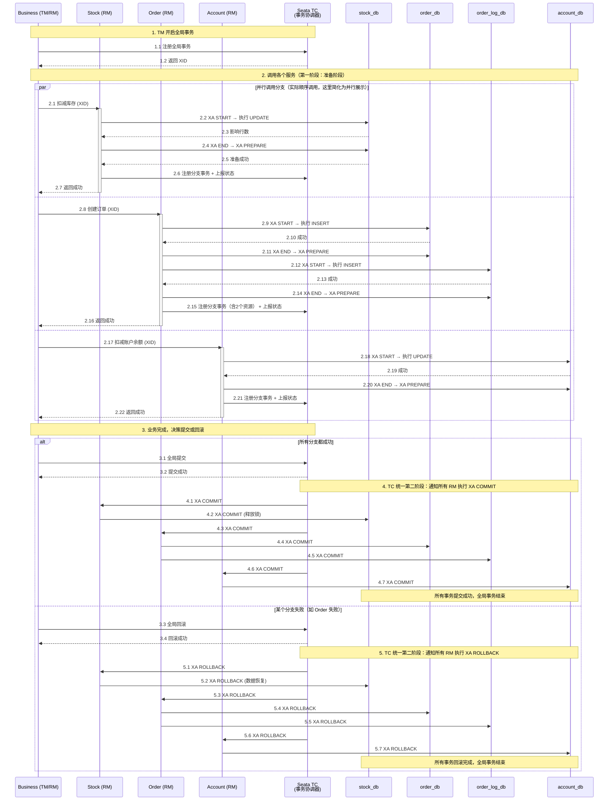
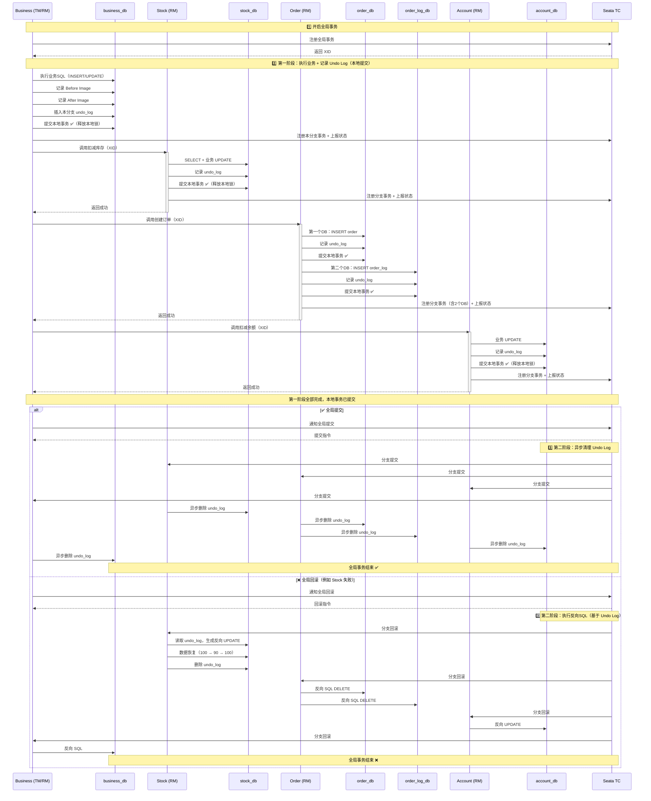

# 什么是分布式事务

分布式事务简单来说，就是一个操作，需要同时去修改多个独立数据库里的数据，要保证这些修改要么全部成功，要么全部失败。

**核心难点：数据一致性与高性能的矛盾**

传统的单库事务（比如你熟悉的MySQL事务）依赖数据库自身的ACID特性，非常简单可靠。但到了分布式环境（多个服务、多个数据库），问题就变得棘手了：

*   数据一致性：网络是不可靠的，服务可能宕机。如果订单创建成功了，但扣减库存的请求因为网络超时而失败，数据就不一致了。
*   高性能：为了保证多个数据库操作的一致性，最笨的办法是让所有参与者都先锁住资源，等所有人都准备好了再一起提交。但这会带来巨大的性能开销，系统并发能力会急剧下降。

所以，分布式事务的本质，就是在**数据一致性**和**系统性能与可用性**之间做权衡和选择。

*   **两阶段提交（2PC）：强一致性优先**

    *   你说“这个钱一定得转”，2PC 的意思就是先锁定转账金额，再真正扣款。听着好像不错，但问题是：耗时，且锁表很容易让其他操作堵死。
    *   形象点讲，这像是全家人等着用厕所，而你非要“占坑发呆到确认安全再出来”，这效率能高得了吗？
*   **最终一致性：让步换效率**

    *   不追求瞬时一致，只要最后对得上账。比如“下单时库存没同步，但30分钟后数据修正”。
    *   这就像在职场开会时，大家不同步理解，但会后都通过微信确认：你干A，我干B，确保目标不跑偏。
*   **无事务化（BASE 模型）：高并发优先**

    *   直接抛掉强一致性，追求“尽可能快地完成任务”，比如秒杀抢购。用户下单时不锁库存，顶多告诉你“缺货了”。
    *   这方案很“野”，就像某些公司用Excel表跑年度财务，操作快是快，但最后对账基本靠人肉补漏洞。

## 本地事务

大多数场景下，我们的应用都只需要操作单一的数据库，这种情况下的事务称之为本地事务(Local Transaction)。本地事务的ACID特性是数据库直接提供支持。本地事务应用架构如下所示：

```java
Connection conn = ... //获取数据库连接
conn.setAutoCommit(false); //开启事务
try{
   //...执行增删改查sql
   conn.commit(); //提交事务
}catch (Exception e) {
  conn.rollback();//事务回滚
}finally{
   conn.close();//关闭链接
}

```

## 分布式事务

用户购买商品的业务逻辑。整个业务逻辑由 3 个微服务提供支持：

*   库存服务：对给定的商品扣除仓储数量。
*   订单服务：根据采购需求创建订单。
*   帐户服务：从用户帐户中扣除余额。


```java
public class BusinessServiceImpl implements BusinessService {

    private StorageService storageService;

    private OrderService orderService;

    /**
     * 采购
     */
    public void purchase(String userId, String commodityCode, int orderCount) {

        storageService.deduct(commodityCode, orderCount);

        orderService.create(userId, commodityCode, orderCount);
    }
}
```

Business完成某个功能需要直接操作数据库，同时需要调用Stock 和 Order 。 而 Order 又同时操作了2个数据库，Account 也操作了一个库。 需要保证这些跨服务调用对多个数据库的操作要么都成功，要么都失败，实际上这可能是最典型的分布式事务场景。

# 主流方案对比

| 方案名称                     | 核心思想                                                     | 一致性                          | 性能                                          | 典型代表                     | 适用场景                                                     |
| :--------------------------- | :----------------------------------------------------------- | :------------------------------ | :-------------------------------------------- | :--------------------------- | :----------------------------------------------------------- |
| **XA 协议 (2PC)**            | **强一致，遵纪守法** 有一个“事务协调者”，分两步（准备、提交/回滚）让所有参与者投票。 | **强一致性** （保证ACID）       | **低** 资源锁定时间长，并发差，易成系统瓶颈。 | 传统的Java EE JTA (Atomikos) | 对一致性要求极高、并发量不高的金融、银行核心系统。           |
| **TCC (Try-Confirm-Cancel)** | **高绩效，业务入股** 不依赖数据库锁，而是由**业务代码**来实现预留、确认、取消这三个操作。 | **最终一致性**                  | **高** 资源锁定时间短，并发能力强。           | Seata TCC模式                | 核心交易场景，如支付、下单，对性能要求高，且业务方能接受改造成本。 |
| **Saga**                     | **长流程，连环补偿** 将一个大事务拆成一系列小事务，每个小事务都有对应的“补偿”操作。正向执行，失败则逆向补偿。 | **最终一致性**                  | **高**                                        | Apache ServiceComb           | 业务流程长、参与者多的事务，如旅行预订、订单全流程。         |
| **AT (Auto-Transaction)**    | **自动挡，无侵入** 基于本地事务，通过框架自动生成 `undo_log` 快照，业务代码几乎无感知。 | **最终一致性 （存在脏读风险）** | **中**                                        | Seata AT模式                 | 希望低成本接入分布式事务，能接受短暂数据不一致的快速开发项目。 |
| **本地消息表**               | **本地记录，可靠投递** 将消息和业务操作放在同一个本地事务中，再通过定时任务扫描、重试消息。 | **最终一致性**                  | **高**                                        | Rocke                        | 对消息可靠性要求极高、允许异步完成的场景。                   |
| **事务消息**                 | **消息驱动，自动回查** 是“本地消息表”的升级版，由消息中间件（如RocketMQ）提供自动回查和事务管理能力。 | **最终一致性**                  | **高**                                        | RocketMQ                     | 解耦生产者和消费者，对消息一致性要求高的异步场景。           |

如何选择合适的方案:

1.  能不用，就别用：任何分布式事务都会带来复杂度开销。首先应审视系统设计是否真的需要分布式事务。能否通过数据库拆分、避免跨服务调用或重新划分服务边界来从根源上避免？
2.  必须用时，按场景选择：

    *   要求强一致性（像转账，一分钱都不能错），且并发不高：选 XA。
    *   核心业务，高并发（如秒杀下单），并且有能力进行代码改造：选 TCC。
    *   长流程，无强一致性要求（如公司差旅报销流程）：选 Saga。
    *   希望代码改动最小，快速接入：选 Seata AT。
    *   异步解耦场景，要求消息必达：选 RocketMQ 事务消息。

# Seata

Seata 是一款开源的分布式事务解决方案，致力于提供高性能和简单易用的分布式事务服务。Seata 将为用户提供了 AT、TCC、SAGA 和 XA 事务模式，为用户打造一站式的分布式解决方案。

AT模式是阿里首推的模式，阿里云上有商用版本的GTS（Global Transaction Service 全局事务服务）

> 官网地址: <https://seata.apache.org/zh-cn/docs/overview/what-is-seata>

## Seata术语

*   TC (Transaction Coordinator) - 事务协调者 维护全局和分支事务的状态，驱动全局事务提交或回滚。
*   TM (Transaction Manager) - 事务管理器 定义全局事务的范围：开始全局事务、提交或回滚全局事务。
*   RM (Resource Manager) - 资源管理器 管理分支事务处理的资源，与TC交谈以注册分支事务和报告分支事务的状态，并驱动分支事务提交或回滚。

| 组件   | 全称                    | 角色                                   | 部署方式               |
| :----- | :---------------------- | :------------------------------------- | :--------------------- |
| **TC** | Transaction Coordinator | 全局事务的“大脑”，负责协调、管理全局锁 | 独立部署为Seata Server |
| **TM** | Transaction Manager     | 定义事务边界（`@GlobalTransactional`） | 嵌入在业务应用中       |
| **RM** | Resource Manager        | 管理分支事务、操作`undo_log`           | 嵌入在业务应用中       |

## XA模式

Seata XA 模式是基于 X/Open 组织定义的 XA 规范实现的一种分布式事务方案。简单来说，它依赖于底层数据库自身对 XA 协议的支持，通过两阶段提交（2PC，Two-Phase Commit） 机制来保证跨库事务的强一致性。

它的核心特点是：**代码无侵入，数据强一致，但性能相对较低。**

> 官网地址: <https://seata.apache.org/zh-cn/docs/user/mode/xa>


### 核心原理：遵循标准的 XA 两阶段提交

XA 模式严格遵循 XA 规范的两阶段提交协议，并由 Seata 的 TC 充当全局协调者的角色

*   第一阶段（准备阶段）

    *   事务发起方（TM）向 TC 注册全局事务，获取 XID。
    *   每个分支事务（RM）执行自己的业务 SQL，但数据库事务并不会提交，此时数据库会锁住被修改的资源行。
    *   分支执行成功后，RM 向 TC 报告执行状态。
*   第二阶段（提交或回滚阶段）

    *   TC 根据所有分支事务的执行状态做出最终决议。
    *   全局提交：如果所有分支都成功，TC 通知所有 RM 提交它们的数据库事务。锁被释放，数据变更生效。
    *   全局回滚：如果任一分支失败，TC 通知所有 RM 回滚事务。锁被释放，数据恢复到操作前状态。

### 执行流程

*   Business：事务发起方
*   Stock：操作 1 个数据库（`stock_db`）
*   Order：操作 2 个数据库（`order_db` 和 `order_log_db`）
*   Account：操作 1 个数据库（`account_db`）



### 核心优势

1.  强数据一致性：这是 XA 模式最突出的优点。它通过数据库自身的 XA 协议保证了全局事务的 ACID 特性，在任何视角下都不会读到中间状态数据。
2.  业务无侵入：与 AT 模式一样，开发者只需添加 `@GlobalTransactional` 注解并配置数据源代理，无需编写额外的一致性保证代码。
3.  数据库兼容性好：几乎所有主流的关系型数据库（如 MySQL, Oracle, PostgreSQL 等）都支持 XA 协议，接入成本低。

### 核心缺点

1.  性能较差：这是 XA 模式的主要弱点。由于数据库锁从第一阶段开始就要一直持有，直到整个全局事务结束（第二阶段完成）才会释放。这会：

    *   长时间锁定资源：在高并发或长事务场景下，数据库连接和行锁被长时间占用，极易成为系统瓶颈。
    *   降低系统吞吐量：与一阶段就提交并释放本地锁的 AT 模式相比，XA 模式的并发能力明显更低。
2.  存在死锁风险：如果事务协调者（TC）在第二阶段出现故障或通知失败，已经 prepare 的 XA 事务可能会被数据库长时间挂起，持续持有锁造成阻塞。

## AT 模式

Seata AT（Auto Transaction）模式是一种对业务代码无侵入的分布式事务解决方案，它通过自动生成逆向SQL的方式实现事务回滚，是目前Seata框架中使用最广泛的模式。

> AT模式 = 自动代理数据源 + 记录数据快照(Undo Log) + 全局锁 + 自动生成回滚SQL

你只需在方法上添加 `@GlobalTransactional` 注解，Seata会自动帮你完成分布式事务的协调工作，无需手写补偿逻辑

```java
@Service
public class OrderService {

    @GlobalTransactional(timeoutMills = 30000)  // 开启全局事务
    public void createOrder(Order order) {
        // 1. 扣减库存（调用库存服务）
        stockService.deduct(order.getProductId(), order.getQuantity());
        
        // 2. 创建订单（本地数据库操作）
        orderMapper.insert(order);
        
        // 3. 扣减余额（调用账户服务）
        accountService.decrease(order.getUserId(), order.getAmount());
        
        // 所有操作都成功，全局事务自动提交
        // 任何一步抛异常，自动回滚所有操作
    }
}
```

分支服务（如库存服务）的代码完全不需要改动，Seata会自动代理数据源

### 核心原理：两阶段提交的优化版

传统XA协议的痛点在于：二阶段提交前，数据库连接和锁一直被占用，导致性能差。

AT模式的改进是：一阶段就直接提交本地事务，释放数据库锁，通过undo\_log保存快照，二阶段异步清理即可。



### 第一阶段（一阶段：执行+提交）

TM（事务管理器） 向 TC（事务协调器） 注册全局事务，获取全局唯一的 XID（全局事务ID）。

RM（资源管理器） 处理分支事务的流程：

    1. 拦截业务SQL
       ↓
    2. 查询数据修改前的快照（Before Image）
       例如：SELECT * FROM account WHERE id = 1
       ↓
    3. 执行业务SQL
       ↓
    4. 查询数据修改后的快照（After Image）
       例如：SELECT * FROM account WHERE id = 1
       ↓
    5. 将快照信息插入 undo_log 表
       ↓
    6. 向TC申请全局锁（防止其他事务并发修改）
       ↓
    7. 提交本地事务（释放数据库锁！）
       ↓
    8. 向TC报告分支事务状态

> 关键点：本地事务提交后，数据库锁立刻释放，不会阻塞其他操作。这也是AT模式性能优于XA的原因

### 第二阶段（二阶段：异步协调）

事务发起方执行完所有业务逻辑后，TM通知TC决策。

#### ✅ 全局提交（所有分支都成功）

    TC → RM: 提交！
    RM: 检查本地事务状态（成功）
    RM: 异步删除 undo_log 记录
    RM: 释放全局锁

### ❌ 全局回滚（有分支失败）

    TC → RM: 回滚！
    RM: 根据 XID 查询 undo_log
    RM: 对比 After Image 和当前数据是否有脏写
         - 无脏写：根据 Before Image 生成反向SQL并执行
         - 有脏写：需要人工介入
    RM: 恢复数据后删除 undo_log
    RM: 释放全局锁

反向SQL示例：

*   原SQL：`UPDATE account SET money = money - 10 WHERE id = 1`
*   反向SQL：`UPDATE account SET money = money + 10 WHERE id = 1`

### 对比 XA 模式在这个场景下的差异

*   锁时机：AT 模式下，Stock 执行完 SQL 后立即提交本地事务（释放数据库锁），只持有 Seata 的全局锁。而 XA 模式从 `XA START` 到 `XA COMMIT/ROLLBACK` 之间会一直持有数据库锁。
*   性能差异：XA 模式的 TPS 通常比 AT 模式低 30%\~50%，锁持有时间越长，差异越明显。

### AT模式的脏写问题

#### 情况一：其他事务是另一个Seata全局事务（有@GlobalTransactional）

结论：会被阻塞，最终超时失败。

1.  你的全局事务（称它为事务A）执行`UPDATE account SET money = money - 100 WHERE id = 1`，一阶段本地提交，并持有了该行数据的全局锁。
2.  另一个全局事务（事务B）也想更新`id = 1`这行数据。
3.  事务B执行本地SQL，更新成功（因为事务A已经提交本地事务，数据库层面的锁已释放），所以事务B的本地操作能执行。
4.  关键点：当事务B的RM（Resource Manager）向Seata Server（TC）申请全局锁时，发现该行数据的全局锁正被事务A持有。
5.  事务B会开始重试等待`seata.client.lock.retry-times`次（默认30次，每次间隔10ms）。
6.  如果在超时时间内事务A完成并释放了全局锁，事务B才能继续。否则，事务B会收到`lock wait timeout`异常，其本地事务也会被回滚。

#### 情况二：其他事务是没有@GlobalTransactional的普通本地事务（最危险）

结论：会成功，并导致数据不一致。

1.  你的全局事务A更新了`account`表，本地提交，并持有全局锁。
2.  另一个本地事务C（没有全局注解，只是普通`@Transactional`）直接执行`UPDATE account SET money = money + 200 WHERE id = 1`。
3.  因为事务A已经本地提交，数据库的行锁已释放，所以事务C可以立即成功执行并提交。
4.  危险后果：假设后续全局事务A发生回滚，它会根据`undo_log`将`money`恢复成操作前的值，但这样就会覆盖掉事务C做的“+200”操作，导致金额不正确或被“丢失”。

这是AT模式最大的风险，所以在Seata官方文档中，这被称为“脏写”问题。因此，在Seata AT模式下有一条铁律：

> 所有可能被Seata全局事务修改的表，都必须通过Seata RM（即Seata代理的数据源）来访问。 也就是说，绝对不允许有任何其他程序或SQL直接绕过Seata去操作这些表。

如果account表是分布式事务的参与方，那么所有要操作它的服务，都必须接入Seata。哪怕这个服务本身不开启全局事务，也应该配置Seata数据源代理，并在查询时使用`@GlobalLock`+`select for update`来避免脏读。

### AT 模式的脏读问题

即使你用的是 MySQL 默认的 RR 隔离级别，Seata AT 模式下依然会产生“脏读”。

原因在于：这里的“脏读”和 MySQL 事务隔离级别里的“脏读”，指的不是同一个东西。

#### 两种“脏读”的本质区别

*   MySQL 的 RR 解决的脏读：读到一个未提交的本地事务的数据。\
    比如事务A修改了一行数据但还没commit，事务B就读到了。在RR级别下，这是被禁止的。
*   Seata AT 模式下的“脏读”：读到一个未提交的全局事务的数据。\
    一个全局事务由多个分支本地事务组成。虽然每个分支本地事务在RR级别下执行，并且会立即提交以释放数据库锁，但这只是全局事务的“一阶段”完成了，整个业务操作还没有最终确认（可能后续分支会失败导致全局回滚）。\
    此时，如果你去读这条数据，其实就读到了一个“全局事务未提交但本地已提交”的中间状态。这就是 Seata 所说的“脏读”。

Seata 官方文档明确说明：默认情况下，AT 模式工作在“读未提交”的全局隔离级别。这意味着它允许脏读，而 MySQL 自身的 RR 级别对此无能为力。

#### 脏读是如何发生的

| 时间线 | 全局事务A (修改账户余额)                                     | 其他查询业务 (查询账户余额)        | 数据状态                                                     |
| :----- | :----------------------------------------------------------- | :--------------------------------- | :----------------------------------------------------------- |
| **T1** | 开启全局事务，执行 `UPDATE account SET money = money - 100`  |                                    | 账户被扣100元，本地事务提交。你的MySQL眼里数据已经改了。     |
| **T2** | Seata 分支事务**已提交**，但全局事务**还未最终确认**。       |                                    | 此时数据处于“悬空”状态：扣款生效了，但最终可能因其他原因回滚。 |
| **T3** |                                                              | 执行普通的 `SELECT` 查询账户余额。 | **读到了扣款后的金额**。                                     |
| **T4** | 全局事务A 的另一个分支（例如扣库存）失败了，需要**全局回滚**。 |                                    | 余额需要通过`undo_log`恢复成扣款前的原值。                   |
| **T5** | 全局回滚完成，余额恢复。                                     |                                    | 查询业务刚才读到的数据是**错误**的，这就是一次“脏读”。       |

在这个例子中，查询业务在T3时使用的就是普通的 SELECT 语句，虽然没有加任何锁，但在数据库层面，这个查询是合法的，因为它读取的是已提交的数据。然而在 Seata 的全局视角下，它读取了未最终确认的数据。

#### 核心原因：AT 模式的“读写分离”设计

AT 模式默认的“读未提交”是为了性能做出的权衡。

*   对于写操作：Seata 用全局锁机制，严格执行“写隔离”，保证不会发生“脏写”。这也是你之前关心的“其他事务能否修改成功”问题的核心答案。
*   对于读操作：为了不阻塞高性能的读取请求，Seata 默认不干预普通的 `SELECT` 查询，任由它们读到未提交的全局事务数据。

所以，MySQL 的 RR 级别管的是本地事务的“写-写”和“读-写”冲突，而 Seata 的“脏读”是一个更高层级的“全局读-全局写”冲突。

#### 解决方案：如何避免脏读

如果业务要求必须读取全局已提交的数据，避免读到中间状态，Seata 提供了明确的解决方案：

方法：使用 `@GlobalLock + SELECT FOR UPDATE`

这会将一个普通的读操作，提升为一个“加锁读”，强制它去检查全局锁。

*   流程：当你的查询语句执行 `SELECT ... FOR UPDATE` 时，Seata 的代理数据源会先尝试获取这些数据的全局锁。
*   结果：

    *   如果全局锁可用（没有正在进行的全局事务修改这些数据），则查询成功，读到的是已提交的全局数据。
    *   如果全局锁被其他全局事务持有（即数据正处于“全局未提交”状态），则查询会被阻塞，直到该全局事务完成（提交或回滚），全局锁释放。

```java
// 在业务代码中，使用此注解配合 FOR UPDATE 查询
@GlobalLock
@Transactional
public Account getAccountForUpdate(Long id) {
    // 注意：这里的 SQL 必须是 SELECT ... FOR UPDATE
    return accountMapper.selectByIdForUpdate(id); 
}
```

注意：`@GlobalLock` 注解不会开启一个完整的Seata全局事务（不会向TC注册），只是告诉Seata要检查全局锁，是一种更轻量的操作。

## TCC 模式

TCC 模式是 Seata 支持的一种由业务方细粒度控制的侵入式分布式事务解决方案，是继 AT 模式后第二种支持的事务模式，最早由蚂蚁金服贡献。其分布式事务模型直接作用于服务层，不依赖底层数据库，可以灵活选择业务资源的锁定粒度，减少资源锁持有时间，可扩展性好，可以说是为独立部署的 SOA 服务而设计的。

优缺点：

*   优点：控制精细，能适应更复杂的业务逻辑。TCC 完全不依赖底层数据库，能够实现跨数据库、跨应用资源管理，可以提供给业务方更细粒度的控制。
*   缺点：TCC 是一种侵入式的分布式事务解决方案，需要业务系统自行实现 Try，Confirm，Cancel 三个操作，对业务系统有着非常大的入侵性，设计相对复杂。

### 基本使用

```java
public interface TccActionOne {
    @TwoPhaseBusinessAction(name = "DubboTccActionOne", commitMethod = "commit", rollbackMethod = "rollback")
    public boolean prepare(BusinessActionContext actionContext, @BusinessActionContextParameter(paramName = "a") String a);
    public boolean commit(BusinessActionContext actionContext);
    public boolean rollback(BusinessActionContext actionContext);
}
```

Seata 会把一个 TCC 接口当成一个 `Resource`，也叫 TCC Resource。在业务接口中核心的注解是 `@TwoPhaseBusinessAction`，表示当前方法使用 TCC 模式管理事务提交，并标明了 Try，Confirm，Cancel 三个阶段。name属性，给当前事务注册了一个全局唯一的的 TCC bean name。同时 TCC 模式的三个执行阶段分别是：

*   Try 阶段，预定操作资源（Prepare） 这一阶段所以执行的方法便是被 `@TwoPhaseBusinessAction` 所修饰的方法。如示例代码中的 `prepare` 方法。
*   Confirm 阶段，执行主要业务逻辑（Commit） 这一阶段使用 `commitMethod` 属性所指向的方法，来执行Confirm 的工作。
*   Cancel 阶段，事务回滚（Rollback） 这一阶段使用 `rollbackMethod` 属性所指向的方法，来执行 Cancel 的工作。

假设你要给一百个人发奖金，每个人分三步：确定奖金池、发放奖金、确认到账。TCC 模式就要求每一步都明确标记：钱从哪里扣？到账了没有？出了问题咋办？

*   Try 阶段：先预留资源，比如锁定账户余额，告诉大家“钱已经备好了”。
*   Confirm 阶段：完成操作，比如真的把钱转给员工。
*   Cancel 阶段：如果过程中失败了，就把预留的资源退回来。

#### BonusService&#x20;

```java
import io.seata.rm.tcc.api.BusinessActionContext;
import io.seata.rm.tcc.api.BusinessActionContextParameter;
import io.seata.rm.tcc.api.LocalTCC;
import io.seata.rm.tcc.api.TwoPhaseBusinessAction;

import java.util.List;

/**
 * 奖金发放 TCC 服务接口
 * @LocalTCC 注解标识这是一个 TCC 接口，必须加在接口上
 */
@LocalTCC
public interface BonusService {

    /**
     * Try 阶段方法（必须）
     * @TwoPhaseBusinessAction 标识这是一个 TCC 事务入口
     * 
     * @param businessActionContext Seata 上下文，用于在三个阶段传递参数（必须保留）
     * @param employeeIds  员工ID列表（业务参数）
     * @param amount       每人奖金金额（业务参数）
     * @return 是否预留成功
     */
    @TwoPhaseBusinessAction(
        name = "grantBonusTccAction",        // TCC 资源唯一标识
        commitMethod = "commit",              // Confirm 阶段方法名
        rollbackMethod = "rollback"          // Cancel 阶段方法名
    )
    boolean prepare(
        BusinessActionContext businessActionContext,
        @BusinessActionContextParameter(paramName = "employeeIds") List<String> employeeIds,
        @BusinessActionContextParameter(paramName = "amount") Integer amount
    );

    /**
     * Confirm 阶段方法（必须）
     * - 方法名必须与 commitMethod 一致
     * - 参数必须只有 BusinessActionContext
     * - 返回类型必须是 boolean
     */
    boolean commit(BusinessActionContext context);

    /**
     * Cancel 阶段方法（必须）
     * - 方法名必须与 rollbackMethod 一致
     * - 参数必须只有 BusinessActionContext
     * - 返回类型必须是 boolean
     */
    boolean rollback(BusinessActionContext context);
}
```

#### BonusServiceImpl 实现类

```java
import io.seata.rm.tcc.api.BusinessActionContext;
import lombok.extern.slf4j.Slf4j;
import org.springframework.beans.factory.annotation.Autowired;
import org.springframework.stereotype.Service;
import org.springframework.transaction.annotation.Transactional;

import java.util.List;
import java.util.Map;
import java.util.concurrent.ConcurrentHashMap;

@Slf4j
@Service
public class BonusServiceImpl implements BonusService {

    @Autowired
    private BonusAccountMapper bonusAccountMapper;  // 奖金池账户表 Mapper
    
    @Autowired
    private EmployeeBonusRecordMapper recordMapper;  // 员工奖金记录表 Mapper

    /**
     * 临时存储 Try 阶段锁定的资源信息
     * ⚠️ 生产环境建议用 Redis，这里用 Map 仅作示例
     */
    private final Map<String, PreBonusInfo> preBonusCache = new ConcurrentHashMap<>();

    // ========================= Try 阶段 =========================
    
    @Override
    @Transactional  // 数据库本地事务
    public boolean prepare(BusinessActionContext context, List<String> employeeIds, Integer amount) {
        String xid = context.getXid();  // 全局事务ID
        log.info("Try 阶段：锁定奖金池，xid={}, 员工数={}, 每人奖金={}", xid, employeeIds.size(), amount);
        
        // 1. 计算总奖金 = 人数 × 每人金额
        int totalAmount = employeeIds.size() * amount;
        
        // 2. 从奖金池账户表（account_db.bonus_account）扣减可用余额
        //    ⚠️ 关键：这里不是真正扣钱，而是做"冻结"操作
        //    常见做法：增加一个 frozen_amount 字段记录已冻结金额
        int updateCount = bonusAccountMapper.freezeBalance(totalAmount);
        
        if (updateCount == 0) {
            log.error("Try 失败：奖金池余额不足，需要={}", totalAmount);
            return false;  // 返回 false 会触发全局事务回滚
        }
        
        // 3. 保存 Try 阶段的状态，供 Confirm/Cancel 使用
        PreBonusInfo preInfo = new PreBonusInfo();
        preInfo.setXid(xid);
        preInfo.setEmployeeIds(employeeIds);
        preInfo.setAmount(amount);
        preInfo.setTotalAmount(totalAmount);
        preBonusCache.put(xid, preInfo);
        
        // 4. 可选：记录一条"发放中"的明细，状态为 0: 待确认
        for (String employeeId : employeeIds) {
            recordMapper.insertPending(employeeId, amount, xid);
        }
        
        log.info("Try 阶段成功，已锁定 {} 元", totalAmount);
        return true;
    }

    // ========================= Confirm 阶段 =========================

    @Override
    @Transactional
    public boolean commit(BusinessActionContext context) {
        String xid = context.getXid();
        log.info("Confirm 阶段：真正发放奖金，xid={}", xid);
        
        // 1. 从缓存或 Redis 中取出 Try 阶段保存的信息
        PreBonusInfo preInfo = preBonusCache.remove(xid);
        if (preInfo == null) {
            // 幂等性处理：可能出现重复调用 Confirm，已处理过则直接返回成功
            log.warn("Confirm 重复调用或找不到 Try 记录，xid={}", xid);
            return true;
        }
        
        // 2. 执行真正的奖金发放
        //    核心操作：将 bonus_account 中的 frozen_amount 转为实际支出
        //    同时更新员工奖金记录状态为"已发放"
        bonusAccountMapper.confirmFrozenToExpense(preInfo.getTotalAmount());
        
        for (String employeeId : preInfo.getEmployeeIds()) {
            recordMapper.updateToConfirmed(employeeId, preInfo.getAmount(), xid);
        }
        
        log.info("Confirm 阶段成功，已发放 {} 元给 {} 人", 
                 preInfo.getTotalAmount(), preInfo.getEmployeeIds().size());
        return true;
    }

    // ========================= Cancel 阶段 =========================

    @Override
    @Transactional
    public boolean rollback(BusinessActionContext context) {
        String xid = context.getXid();
        log.info("Cancel 阶段：释放锁定的奖金，xid={}", xid);
        
        // 1. 获取 Try 阶段保存的信息
        PreBonusInfo preInfo = preBonusCache.remove(xid);
        if (preInfo == null) {
            // 幂等性处理：可能已经回滚过
            log.warn("Cancel 重复调用或找不到 Try 记录，xid={}", xid);
            return true;
        }
        
        // 2. 释放被冻结的余额
        //    将 bonus_account 中的 frozen_amount 回退到 available_balance
        bonusAccountMapper.unfreezeBalance(preInfo.getTotalAmount());
        
        // 3. 将员工奖金记录状态改为"已取消"
        for (String employeeId : preInfo.getEmployeeIds()) {
            recordMapper.updateToCancelled(employeeId, preInfo.getAmount(), xid);
        }
        
        log.info("Cancel 阶段成功，已释放 {} 元", preInfo.getTotalAmount());
        return true;
    }
}
```

#### 业务调用

```java
import io.seata.spring.annotation.GlobalTransactional;
import org.springframework.beans.factory.annotation.Autowired;
import org.springframework.stereotype.Service;

import java.util.Arrays;
import java.util.List;

@Service
public class HRService {

    @Autowired
    private BonusService bonusService;  // 注入 TCC 服务

    /**
     * 给100名员工发奖金
     * 注意：TCC 模式也需要 @GlobalTransactional 来管理整个分布式事务
     */
    @GlobalTransactional  // ← 这个注解仍然需要，TM 负责协调 TCC 资源
    public void grantYearEndBonus() {
        
        // 1. 准备员工列表（100人）
        List<String> employeeIds = getEmployeeIds();  // 假设返回100个ID
        int amountPerPerson = 10000;  // 每人1万元
        
        // 2. 调用 TCC 接口的 Try 方法
        //    Seata 会自动管理 Confirm/Cancel 的调用时机
        boolean success = bonusService.prepare(null, employeeIds, amountPerPerson);
        
        if (!success) {
            throw new RuntimeException("奖金池余额不足，发放失败");
        }
        
        // 3. 如果还有其他分布式事务操作，可以继续调用其他 TCC 服务
        //    notificationService.sendBonusNotification(employeeIds);  // 发通知
        
        // 4. 方法正常结束 → Seata 自动调用所有参与者的 Commit（Confirm）
        //    方法抛异常 → Seata 自动调用所有参与者的 Rollback（Cancel）
    }
}
```

1.  幂等性要求：Confirm 和 Cancel 方法可能被调用多次（网络超时重试），你的代码必须能够处理重复调用而不产生副作用。上面示例中用 `preBonusCache.get(xid)` 来判断是否已处理过。
2.  空回滚问题：如果 Try 阶段没执行成功（比如网络问题导致根本没调用到），但 TC 却发起了 Cancel 请求，你的 Cancel 方法需要能正确响应。上面代码用 `preBonusCache.get(xid) == null` 来处理，直接返回 true。
3.  参数传递限制：Seata 的 `BusinessActionContext` 只会序列化带有 `@BusinessActionContextParameter` 注解的参数。示例中 `employeeIds` 和 `amount` 都被正确注解了。
4.  数据库事务边界：每个阶段（Try/Confirm/Cancel）都需要独立使用 `@Transactional`，因为它们是在完全不同的时间点被调用的，不能共享同一个本地事务。

# RocketMQ 事务消息方案与代码实现

RocketMQ 事务消息是解决分布式事务最终一致性的重要方案。与 Seata AT 模式不同，它基于消息中间件实现，通过两阶段提交 + 事务回查机制，保证本地事务与消息发送的原子性。


> 参考地址: <https://juejin.cn/post/7225975883617681469?searchId=20260424150203EAC2CDD371B6ED21EB6C>