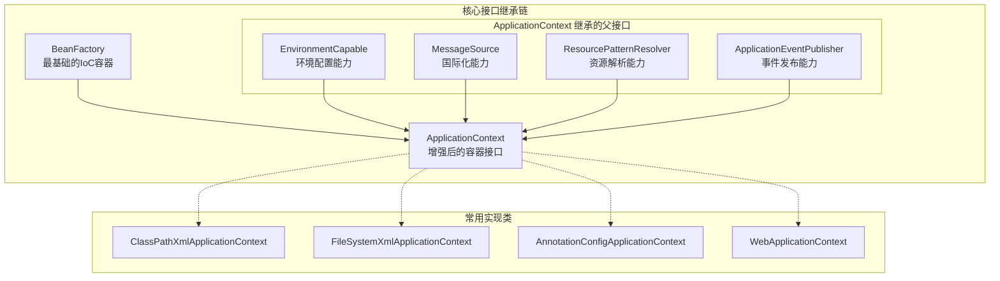
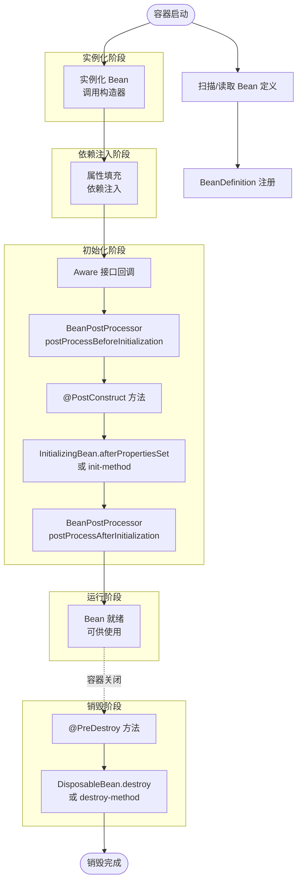

# Spring IoC 容器

## 简介

Spring 是一个轻量级的开源框架，作用就是简化 Java 开发。

### 简化开发的四个基本策略

- 基于 POJO 的轻量级最小侵入性编程
- 通过依赖注入（DI）和面向接口松耦合
- 基于切面和惯性进行声明式编程
- 通过切面和模版减少样版式代码

### 主要组件以及作用

Spring Framework 的核心组件主要围绕 IoC（控制反转）和 AOP（面向切面编程）构建。

```
┌─────────────────────────────────────────────────────────────┐
│                   Data Access / Integration                 │
│  ┌──────┐ ┌─────┐ ┌─────┐ ┌─────┐ ┌────────────┐           │
│  │ JDBC │ │ ORM │ │ OXM │ │ JMS │ │Transactions│           │
│  └──────┘ └─────┘ └─────┘ └─────┘ └────────────┘           │
├─────────────────────────────────────────────────────────────┤
│                        Web Layer                            │
│  ┌──────────┐ ┌────────┐ ┌──────┐ ┌────────┐               │
│  │WebSocket │ │ Servlet│ │ Web  │ │ Portlet│               │
│  └──────────┘ └────────┘ └──────┘ └────────┘               │
├─────────────────────────────────────────────────────────────┤
│            AOP / Aspects / Instrumentation                  │
│  ┌─────┐ ┌────────┐ ┌───────────────┐                      │
│  │ AOP │ │ Aspects│ │Instrumentation│                      │
│  └─────┘ └────────┘ └───────────────┘                      │
├─────────────────────────────────────────────────────────────┤
│                      Core Container                         │
│  ┌─────┐ ┌──────┐ ┌───────┐ ┌──────┐                       │
│  │Beans│ │ Core │ │Context│ │ SpEL │                       │
│  └─────┘ └──────┘ └───────┘ └──────┘                       │
└─────────────────────────────────────────────────────────────┘
```

| 组件 | 说明 |
| :--- | :--- |
| **Core Container** | spring-beans + spring-context，负责管理对象创建与依赖关系 |
| **AOP** | spring-aop + spring-tx，实现无侵入式事务和日志等横切逻辑 |
| **Web** | spring-webmvc 处理 HTTP 请求与响应 |

---

## IOC & DI

### 什么是 IoC

IoC（Inversion of Control，控制反转）是 Spring 框架的核心思想。简单来说，就是将对象的创建、组装和管理控制权从程序员手中反转给 Spring 容器，从而实现了层与层之间的解耦。

#### 传统方式（控制正转）

```java
// 你主动创建依赖的对象
public class UserService {
    private UserDao userDao = new UserDaoImpl();  // 硬编码依赖
    // 如果要换 UserDao 的实现，需要修改代码
}
```

> 问题：类之间强耦合，替换实现时需要改代码。

#### IoC 方式（控制反转）

```java
// 你只声明需要什么，不关心怎么创建
public class UserService {
    private UserDao userDao;  // 通过构造函数或 setter 注入

    public UserService(UserDao userDao) {
        this.userDao = userDao;  // 容器负责传入
    }
}
```

> Spring 容器负责：创建 UserDaoImpl → 创建 UserService → 把 UserDao 注入进去。

### IoC 的核心概念

| 概念 | 说明 |
| :--- | :--- |
| **控制反转** | 对象的创建控制权从"程序员自己 new"反转到"容器管理" |
| **依赖注入（DI）** | IoC 的实现方式：容器把依赖的对象"注入"进来 |
| **Spring 容器** | 管理所有 Bean 的大工厂（ApplicationContext） |
| **Bean** | 被 Spring 容器管理的 Java 对象 |

> IoC 是一种设计思想（目标），DI 是实现这种思想的具体方式（手段）。

### Spring IoC 容器的核心接口

| 接口 | 说明 |
| :--- | :--- |
| **BeanFactory** | 最基础的 IoC 容器，懒加载 |
| **ApplicationContext** | 继承 BeanFactory，增加了国际化、事件传播等功能，立即加载（推荐） |

---

## DI 注入方式

### 构造器注入（Constructor Injection）

```java
@Component
public class UserService {
    private final UserDao userDao;      // 可以声明为 final
    private final EmailService emailService;

    // Spring 4.3+ 可省略 @Autowired
    public UserService(UserDao userDao, EmailService emailService) {
        this.userDao = userDao;
        this.emailService = emailService;
    }
}
```

> 构造器注入的循环依赖会失败（启动报错 BeanCurrentlyInCreationException）

```java
@Component
public class A {
    private final B b;
    public A(B b) { this.b = b; }  // ❌ 循环依赖：A 需要 B，B 需要 A
}

@Component
public class B {
    private final A a;
    public B(A a) { this.a = a; }  // ❌ 启动报错
}
```

### Setter 注入（Setter Injection）

```java
@Component
public class UserService {
    private UserDao userDao;
    private EmailService emailService;

    @Autowired
    public void setUserDao(UserDao userDao) {
        this.userDao = userDao;
    }

    @Autowired(required = false)  // 可选依赖
    public void setEmailService(EmailService emailService) {
        this.emailService = emailService;
    }
}
```

> Setter/字段注入的循环依赖，Spring 可通过三级缓存解决。

### 字段注入（Field Injection）

```java
@Component
public class UserService {
    @Autowired
    private UserDao userDao;      // 不能是 final

    @Autowired
    private EmailService emailService;
}
```

### @Autowired 注入规则

```java
@Component
public class PaymentService {

    // 1. 按类型匹配（Type）
    @Autowired
    private UserDao userDao;  // 查找 UserDao 类型的 Bean

    // 2. 多个同类型时，按名称匹配（Name）
    @Autowired
    @Qualifier("mysqlUserDao")
    private UserDao userDao;  // 指定具体的 Bean 名称

    // 3. 可选依赖
    @Autowired(required = false)
    private NotExistService service;  // 不存在时不报错，为 null

    // 4. 构造器注入（可省略 @Autowired）
    public PaymentService(OrderDao orderDao) {
        // Spring 4.3+ 唯一构造器可省略 @Autowired
    }
}
```

---

## ApplicationContext

ApplicationContext 本身是一个接口，它继承了多个父接口，每个接口赋予它不同的能力。

### 继承关系



### 父接口及作用

| 父接口 | 作用 | 典型能力 |
| :--- | :--- | :--- |
| **BeanFactory** | IoC 容器的根接口 | 获取 Bean（getBean）、检查 Bean 是否存在 |
| **EnvironmentCapable** | 环境配置能力 | 获取系统属性、环境变量、配置文件中的配置 |
| **MessageSource** | 国际化能力 | 支持多语言消息（getMessage） |
| **ResourcePatternResolver** | 资源解析能力 | 加载类路径、文件系统、URL 等位置的资源 |
| **ApplicationEventPublisher** | 事件发布能力 | 发布应用事件，支持观察者模式 |

### 常用实现类

| 实现类 | 适用场景 |
| :--- | :--- |
| **ClassPathXmlApplicationContext** | 类路径下查找配置文件，需放在 src/main/resources 下 |
| **FileSystemXmlApplicationContext** | 文件系统绝对路径或相对路径，配置文件在项目外部 |
| **AnnotationConfigApplicationContext** | Java 配置类 + 注解，Spring Boot 项目 |
| **WebApplicationContext** | Web 应用，增加了对 ServletContext 的访问 |

```java
// Spring Boot 启动
SpringApplication.run(Application.class, args);
// 实际创建的是 AnnotationConfigApplicationContext
```

---

## Spring Bean 的生命周期

Spring Bean 的生命周期指的是 Bean 从创建到销毁的完整过程。

### 生命周期流程



### 各阶段详解

#### 1. 实例化（Instantiation）

调用构造器创建 Bean 实例（此时属性都还是 null）。

```java
@Component
public class UserService {

    public UserService() {
        System.out.println("1. 构造器执行");
    }
}
```

#### 2. 属性填充/依赖注入（Population）

Spring 注入 @Autowired 标记的属性。

```java
@Component
public class UserService {

    @Autowired
    private UserDao userDao;

    @Autowired
    public void setEmailService(EmailService emailService) {
        System.out.println("2. Setter 注入执行");
    }
}
```

#### 3. Aware 接口回调

| Aware 接口 | 回调方法 | 注入的资源 |
| :--- | :--- | :--- |
| **BeanNameAware** | setBeanName(String name) | Bean 在容器中的名称 |
| **BeanClassLoaderAware** | setBeanClassLoader(ClassLoader) | 类加载器 |
| **BeanFactoryAware** | setBeanFactory(BeanFactory) | BeanFactory 本身 |
| **EnvironmentAware** | setEnvironment(Environment) | 环境配置 |
| **ApplicationContextAware** | setApplicationContext(ApplicationContext) | ApplicationContext |

#### 4. BeanPostProcessor 前置处理

在所有初始化方法之前执行，可以对 Bean 进行包装或代理。

```java
@Component
public class CustomBeanPostProcessor implements BeanPostProcessor {

    @Override
    public Object postProcessBeforeInitialization(Object bean, String beanName) {
        System.out.println("5. postProcessBeforeInitialization: " + beanName);
        return bean;  // 可以返回代理对象
    }
}
```

#### 5. 自定义初始化方法

三种方式按顺序执行：@PostConstruct → afterPropertiesSet() → init-method

```java
@Component
public class UserService implements InitializingBean {

    // 方式1：@PostConstruct 注解
    @PostConstruct
    public void postConstruct() {
        System.out.println("6. @PostConstruct 执行");
    }

    // 方式2：实现 InitializingBean 接口
    @Override
    public void afterPropertiesSet() throws Exception {
        System.out.println("7. afterPropertiesSet 执行");
    }

    // 方式3：自定义 init-method
    public void customInit() {
        System.out.println("自定义 init-method 执行");
    }
}
```

#### 6. BeanPostProcessor 后置处理

```java
@Component
public class CustomBeanPostProcessor implements BeanPostProcessor {

    @Override
    public Object postProcessAfterInitialization(Object bean, String beanName) {
        System.out.println("8. postProcessAfterInitialization: " + beanName);
        return bean;
    }
}
```

#### 7. Bean 就绪

Bean 初始化完成，可以被应用程序使用。

#### 8. 销毁

容器关闭时执行销毁方法：@PreDestroy → destroy() → destroy-method

### 生命周期扩展点

| 阶段 | 扩展点 | 作用 |
| :--- | :--- | :--- |
| 实例化前 | InstantiationAwareBeanPostProcessor | 在 Bean 实例化前介入 |
| 属性填充 | InstantiationAwareBeanPostProcessor.postProcessAfterInstantiation | 属性填充前控制 |
| 依赖注入 | @Autowired / @Resource / @Value | 注入依赖 |
| Aware 回调 | BeanNameAware, ApplicationContextAware 等 | 获取容器资源 |
| 初始化前 | BeanPostProcessor.postProcessBeforeInitialization | 初始化前置处理 |
| 初始化 | @PostConstruct, InitializingBean, init-method | 自定义初始化逻辑 |
| 初始化后 | BeanPostProcessor.postProcessAfterInitialization | 初始化后置处理（AOP 代理） |
| 运行时 | 业务方法 | 正常使用 |
| 销毁前 | @PreDestroy, DisposableBean, destroy-method | 资源释放 |

### 不同作用域的 Bean 生命周期差异

| 作用域 | 创建时机 | 销毁时机 |
| :--- | :--- | :--- |
| **singleton**（默认） | 容器启动时（或首次请求时若 lazy-init） | 容器关闭时 |
| **prototype** | 每次获取时创建 | 容器不管理，需自行销毁 |
| **request** | 每次 HTTP 请求 | 请求结束 |
| **session** | 每次 HTTP 会话 | 会话过期或容器关闭 |
| **application** | ServletContext 创建时 | 容器关闭 |
